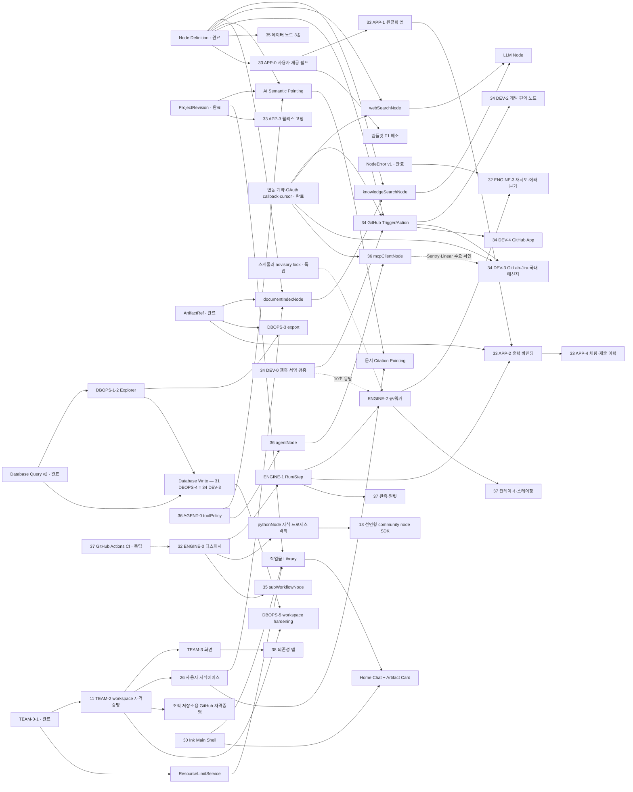

# 제품 로드맵 — 남은 작업

## 문서 정보

| 항목 | 내용 |
| --- | --- |
| 상태 | v3.0 — 재작성. 08-30~09-06 완료분 제거, 보고서 2건 편입(백로그 32·33), 개발 도구 노드 트랙 신설(34), 파생 항목 35~38 |
| 최초 작성 | 2026-08-26 |
| 재작성 | 2026-09-06 (직전 v2.3 은 2026-08-30) |
| 대상 | Workflow Automation 제품, App Builder, 생성/평가 시스템, 실행 엔진 |
| 전제 | 기간은 확정 일정이 아니라 1명의 숙련된 풀스택 개발자 기준의 상대 추정치다 |
| 완료 기록 | `archive/COMPLETED_WORK_2026-08.md`, `archive/COMPLETED_WORK_2026-09.md` (원본 v1.9 는 `archive/LONG_TERM_PRODUCT_ROADMAP_v1.9.md`) |
| 편입한 보고서 | `plans/기능갭_및_프로덕션_준비_보고서.md`(2026-09-01, n8n·Make 대비 갭과 프로덕션 전환), `plans/실행엔진_앱빌더_시연준비_종합보고서.md`(2026-09-02, 그 후속 상세화) |
| 관련 문서 | `UNIMPLEMENTED_BACKLOG.md`, `plans/DOCUMENT_FORMAT_STUDIO_PLAN.md`, `plans/DATA_FLOW_SEPARATION_PLAN.md`, `plans/노드_비가시화_시연플래그_계획.md`, `plans/DATABASE_OPERATIONS_EXPLORER_PLAN.md`, `plans/INCOMPLETE_NODE_STRUCTURE_REVIEW.md`, `plans/LLM_GENERATION_QUALITY_PLAN.md`, `design/MAIN_WORKSPACE_AND_HOME_CHAT_REDESIGN_PLAN.md`, `ADR.md`, `docs/reports/security_assessment.md` |

이 문서에는 **아직 하지 않은 일만** 있다. 2026-08-26~29 에 끝낸 백로그 1~10·12·15~25 번은
`archive/COMPLETED_WORK_2026-08.md` 에, 08-30~09-06 에 끝낸 것(29번, 결함 10건, POINT-0·1, 트러블슈팅,
문서 포맷 스튜디오, 데이터 흐름 분리, 시연 준비, PICKLE 전환)은 `archive/COMPLETED_WORK_2026-09.md` 에 있다.

> **무엇이 남았는지만 알고 싶으면 `UNIMPLEMENTED_BACKLOG.md` 를 본다.** 이 문서는 백로그 번호 단위라
> 문서 안쪽의 개별 항목이 안 보인다. 다만 그 색인은 08-30 기준이라, 그 뒤에 생긴 항목(32~38번)은 이
> 문서 §2 가 정본이다.

## 1. 현재 위치

38개 백로그 중 **23개가 끝났다**(1~10·12·15~25·29). v2.3(08-30) 이후 일주일은 로드맵 번호 밖의 일이
대부분이었고 그 기록은 `archive/COMPLETED_WORK_2026-09.md` 에 있다. 요지만 적으면:

- **트러블슈팅이 끝났다.** 감사 → 실행 계획 → 실측 재검증 → 0~5단계. 보안 8건과 배포 레일
  (`scripts/deploy.sh`·`/api/ready`·`AUTO_MIGRATE_ON_BOOT=0`)이 서버에 들어갔다. 실행 계획서의 "일부러 하지
  않는 것" 11항은 폐기가 아니라 조건부라 §3.6(37번) 으로 옮겼다. **2026-09-11**: 서버가 `release` 브랜치를 추적하고
  `deploy.sh` 가 다른 브랜치를 거부한다 — main 머지와 서버 반영을 분리(`scripts/server/README.md` 브랜치 규약).
- **문서 포맷 스튜디오가 Phase 0~5 까지 갔다.** FormatSpec·formatNode·프리셋 21종·파일→포맷 역변환·
  `/formats` 탭·디자인 캔버스·풀페이지 3-pane 스튜디오. 보류 항목만 §3.14 에 남는다.
- **시연회(부스) 준비가 코드로 들어갔다.** opt-in 플래그 5종, 콘텐츠 5종+앱 2종, 공개 실행 입력 상한,
  결과 이메일 전달. 시연은 종합보고서 기준 9/9(수)~9/11(금)이고 **이번 주는 새 구현 없이 안정화만 한다.**
- **LLM 호출이 PICKLE 게이트웨이로 갔다**(`PICKLE_LLM_GATEWAY.md`). 임베딩·이미지 생성은 여전히 OpenAI 직결이고,
  게이트웨이에 이미지 경로 개방을 요청해 둔 상태다.
- **보고서 2건을 편입했다.** 기능갭 보고서(09-01)가 n8n·Make 대비 갭과 프로덕션 전환 항목을 짚었고,
  종합보고서(09-02)가 그것을 실행 엔진 4단계·앱 빌더 5축으로 구체화했다. 각각 백로그 **32·33번**이 됐고,
  그 밖의 제안(흐름 제어·에이전트/MCP·운영·의존성 맵)은 **35~38번**으로 나눴다.
- **개발 도구 노드 트랙(34번)을 새로 열었다** — "실제 개발 업무에 쓰이는 사이트"로 가는 첫 항목이다.

**열려 있는 트랙은 열셋이다.**

| 트랙 | 상태 | 다음 한 걸음 |
| --- | --- | --- |
| 실행 엔진 v2 (32) | **ENGINE-0~2 dev 머지(2026-09-11, PR #95~#107) · ENGINE-3 착수** — 1단계 노드 재시도 `retries`/`backoffSec`(인터프리터, 오류 코드의 retryable·effectState 로 판정, ADR-0030). ENGINE-2 는 서버 리허설만 남음(`scripts/server/README.md` 큐 모드 켜기), ENGINE-0 은 운영 절차만 남음 | ENGINE-3 2단계 `error` 출력 핸들·에러 트리거 → 3단계 멱등성(웹훅 idempotency_key·부작용 노드) |
| 앱 빌더–캔버스 통합 (33) | 계획 완료(종합보고서 §2) | APP-0 사용자 제공 필드 스키마(T1 동시 해결) |
| 개발 도구 연동 노드 (34) | 계획 초안(이 문서 §3.3) | DEV-0 웹훅 서명 검증 → DEV-1 GitHub |
| 흐름 제어·데이터 조작 보완 (35) | 미착수 | 결정적 변환 노드 3종 |
| 실행형 AI 에이전트 노드·MCP (36) | 미착수 | 도구 정책 모듈(28번과 공유) |
| 운영 가시성·배포·CI (37) | 미착수 | GitHub Actions 테스트 |
| 거버넌스 의존성 맵 (38) | 미착수·후순위 | 11번 뒤 |
| Workspace/RBAC (11) | TEAM-0·1 완료 | TEAM-2 workspace 자격증명 |
| 사용자 지식베이스·검색 (26·27) | 미착수 | 지식베이스 권한·수명 주기 |
| AI 시맨틱 포인팅 (28) | 구현 완료, **UI 꺼 둠** | 파괴적 도구 제한 또는 diff preview — 36번과 해법 공유 |
| 메인 작업 공간·홈 채팅 리디자인 (30) | 계획 완료 | MAIN-0 사용량·분류·목록 계약 |
| 운영 Database Explorer (31) | 계획 완료 | DBOPS-0 권한 계약 |
| 커뮤니티 노드 (13·14) | 보류 | 수요 관측 후 |

### 1.1 시연 직전 남은 것 — 이번 주

종합보고서 §4.2 체크리스트 9개의 현재 상태다. 코드로 닫힌 것과 사람이 해야 하는 것을 나눴다.

| # | 항목 | 상태(2026-09-06) |
| ---: | --- | --- |
| 1 | 승인키 발급 | 도로명주소는 시연 제외(`HIDDEN_NODE_TYPES=jusoNode`). 콘텐츠 v2 는 네이버 검색·YouTube Data API·OpenAI(이미지)·SMTP 를 쓴다 — **관리자 계정 API 센터 등록과 `DEMO_SHARED_CREDENTIALS_PROVIDERS` 설정은 수동**(`plans/노드_비가시화_시연플래그_계획.md` "시연 전 수동 단계") |
| 2 | 검토 대기 템플릿 79건 승인 | **미결** — 승인 주체 미정 그대로 |
| 3 | 피닝 백업 | `pinned_outputs` 는 있으나 시연 콘텐츠에 고정값 백업을 준비한 기록이 없다 — **미확인** |
| 4 | 시연 인스턴스 분리 / cron 비우기 | 운영에 라이브 스케줄 0건(재검증 문서 기준) — 별도 조치 불필요로 본다 |
| 5 | 동시 실행 부하 리허설 | 09-06 부스 점검에서 게스트 5종 실물 실행은 확인(#88·#92). **동시 10대 부하는 미확인** |
| 6 | LLM 쿼터 | PICKLE 키는 **금액 한도** 하나(`credit_exhausted` 429). 게스트 토큰 상한은 `.env` 로 20만(#80 기준 게스트 1명 최대 약 $0.26). 한도 잔액은 지원처 대시보드에서 |
| 7 | 방문자 입력 방어 | **완료** — 공개 실행 입력 상한(#60), 게스트 토큰 상한·정원(#70) |
| 8 | 태블릿 리셋 | 게스트는 방문자마다 새 계정이라 리셋이 필요 없다. "기존 게스트 복사본 정리 스크립트"는 PR #88·#92 가 언급하나 **저장소에 없다** |
| 9 | 네트워크 백업 | 사람 몫 |

**사용자 결정(2026-09-06): 위 미결 항목은 별도로 진행하지 않는다.** 시연 중 필요한 것은 현장에서 대응하고,
이 표는 기록으로만 남긴다. 시연 뒤에 할 것은 아래 한 줄이다.

시연이 끝나면 **플래그를 제거하는 것이 원상 복구다**(`DEMO_*`·`HIDDEN_NODE_TYPES`). 게스트 체험을 상시
기능으로 남길지는 §7 의 새 질문이다.

### 1.2 보고서가 말한 것과 코드가 다른 곳

기능갭 보고서는 `node_definitions/` 의 파일 수(28)를 노드 수로 읽었고, 그래서 "루프·병합·스위치·범용
웹훅이 없다"고 적었다. **실행기 레지스트리에는 49종이 등록돼 있다**(`@node_registry.register`, 테스트 제외
직접 셈). 정의 파일로 이전된 것이 28종일 뿐이다. 실제로 있는 것과 없는 것을 다시 가른다.

| 보고서의 "없다" | 실제 |
| --- | --- |
| 루프 | `loopNode`+`breakNode` 있음 |
| 병합 | `mergeNode` 있음 — 재합류 1회 방출은 PR #40 에서 고쳤다 |
| 다중 분기(스위치) | `conditionNode` 가 규칙 N개 + "그 외" 출력을 가진다(PR #90 UI) |
| 병렬 분기 | `distributorNode` 있음 — 형제 오염은 PR #69 에서 고쳤다 |
| 범용 인바운드 웹훅 | `webhookNode` 있음(`/webhook/{endpoint_id}`, `is_live` 게이트). **없는 것은 서명 검증·replay 방지·사용자별 상한** — 34번 DEV-0 |
| 서브워크플로우 | **없다** — 35번 |
| 노드별 재시도·타임아웃·에러 분기 | **없다** — 32번 ENGINE-3 |
| 부분 실행·데이터 피닝 | `compile_workflow` 의 entry/stop/scope/`pinned_outputs` 로 **이미 있다**(종합보고서가 정정) |
| API 전반 rate limit | 커뮤니티 쓰기에만 `rate_limit.enforce` 가 있다. 실행·업로드·인증 경로에는 **없다** — 37번 |

보고서의 결론(디스패처 전환이 최우선이고 그 위에 재시도·상태·큐가 올라간다)은 이 정정과 무관하게 유효하다.

## 2. 남은 백로그

번호는 원래 로드맵의 것을 이어 매긴다 — ADR·커밋·아카이브가 이 번호를 참조한다. 32·33 은 종합보고서 §6 의
제안 번호를 그대로 썼다.

| 번호 | 작업 | 크기 | 상태 | 이유 |
| ---: | --- | --- | --- | --- |
| 32 | 실행 엔진 v2 — 디스패처 전환 · Run/Step 상태 · 큐/워커 · 재시도·에러 분기·멱등성 | XL | 계획 완료 | `exec()` 기반 코드 생성에는 노드 단위 개입 지점이 없다. `security_assessment.md` §1 의 유일한 미결이자 33·35·36 의 전제 |
| 33 | 앱 빌더–캔버스 통합 — 사용자 제공 필드 스키마 · 원클릭 앱 · 구조화 출력 바인딩 · 릴리스 · 채팅/제출 이력 | L | 계획 완료 | 접점이 `workflowNode.projectId` 한 줄, 결과가 문자열 하나. 템플릿 T1 도 같은 뿌리 |
| 34 | 개발 도구 연동 노드 — 웹훅 서명 검증, GitHub Trigger/Action, 개발 편의 노드, 2차 연동 | L | 신규 | 실제 개발 업무에 쓰이게 하는 첫 트랙. 공식 연동 계약(§4) 위에 올린다 |
| 35 | 흐름 제어·데이터 조작 보완 — 서브워크플로우, Set/Edit Fields·중복 제거·정렬/필터, 반복 항목 바인딩 | M | 신규 | 표현력 상한과, LLM 을 데이터 성형기로 쓰는 관행 제거(ADR-0026 의 연장) |
| 36 | 실행형 AI 에이전트 노드 · MCP 클라이언트 노드 | L | 신규 | 커넥터 수 격차를 우회하는 지렛대. 28번의 재개 조건(도구 제한·diff preview)과 해법 공유 |
| 37 | 운영 가시성 · 배포 체계 · API 상한 | M | 신규 | Langfuse 밖 관측이 없고 CI·컨테이너가 없다. 트러블슈팅 조건부 항목의 승격 트리거를 여기서 관리 |
| 38 | 거버넌스 의존성 맵 | M | 신규·후순위 | 자격증명·노드 정의 변경의 영향 범위. 11번이 끝나 조직 사용이 시작되면 필요가 급증 |
| 11 | Workspace/RBAC — TEAM-2·3 과 잔여 판정 이전 | L | 진행 중 | 자격증명이 소유자 개인 것에 묶여 있어 소유자가 나가면 멈춘다 |
| 26 | 사용자 지식베이스와 `documentIndexNode`·`knowledgeSearchNode` | L | 미착수 | 정적 PDF 반복 파싱 제거, tenant 격리·버전·페이지 인용이 있는 근거 조회 |
| 27 | `webSearchNode` vertical slice | M | 미착수 | 생성 에이전트 내부 검색을 캔버스 실행 기능으로 승격 |
| 28 | AI 시맨틱 포인팅과 대상 한정 수정 | M | 구현 완료, **꺼 둠** | 범위 안에서 모델이 파괴적으로 동작하는 것을 못 막았다. 재개 조건은 §3.10 |
| 30 | 메인 작업 공간·작업물 Library·홈 채팅 리디자인 | L | 계획 완료 | Blue 중심 Main Shell 을 Black/Neutral 로, 실제 한도·목록 정보·Artifact Card 정리 |
| 31 | 운영 Database Explorer·JSON/XLSX export·안전한 수정 | L | 계획 완료 | 외부 PostgreSQL 탐색·내보내기, 별도 write capability 뒤 제한적 수정 |
| 13 | 선언형 community node SDK | L~XL | 보류 | 수요 관측 후. **32번 ENGINE-0 의 pythonNode 격리(Task Runner 패턴)가 전제 인프라** |
| 14 | 실시간 공동 편집/실행형 노드 | XL 이상 | 보류 | 실제 수요와 격리 기반 확인 뒤 |

### 지시 없이 진행할 수 있는 것 — 다시 생겼다

v2.3 은 "근거가 문서에 있어 그대로 구현하면 되는 항목이 비었다"고 적었다. 보고서 2건이 들어오면서
다시 채워졌다. 전부 **작고 독립적**이며, 시연 뒤 첫 주에 손댈 순서로 적었다.

| 순서 | 항목 | 크기 | 왜 먼저인가 |
| ---: | --- | --- | --- |
| 1 | ~~스케줄러 중복 발화 방지 — DB advisory lock~~ **완료(2026-09-06, `execution.advisory_lock`)** | S | 다중 인스턴스 배포를 여는 가장 싼 안전장치였다. 같은 프로젝트 스케줄은 이제 한쪽만 돈다 |
| 2 | 웹훅 서명 검증(HMAC)·replay 방지·payload 상한 (34번 DEV-0) | S~M | `webhookNode` 문서가 "요청 검증을 흐름 안에서 하라"고 사용자에게 떠넘긴다. GitHub 웹훅이 첫 소비자 |
| 3 | GitHub Actions 에 테스트·빌드·`export_node_definitions.py --check` (37번) | S | 저장소에 CI 가 없다. 테스트 2,700여 건이 사람 손으로만 돈다 |
| 4 | 결정적 변환 노드 3종 — Set/Edit Fields·중복 제거·정렬/필터 (35번) | M | 근거는 ADR-0026. LLM 대신 결정적 변환 |
| 5 | APP-0 사용자 제공 필드 스키마 (33번, T1 동시 해결) | M | 설계는 종합보고서 §2.1. 32번과 독립 |

### 진행 순서

```text
[이번 주 — 시연회 안정화. 새 구현 없음]
        │
        ▼
32 ENGINE  (lock, 독립) ─▶ ENGINE-0 디스패처 ─▶ ENGINE-1 Run/Step ─▶ ENGINE-2 큐/워커 ─▶ ENGINE-3 재시도·멱등성
                                 │                    │
                                 │                    ├─▶ 33 APP-2 출력 바인딩·진행률 스트리밍
                                 │                    └─▶ 37 관측·얼럿 (실행 상태가 있어야 메트릭이 있다)
                                 └─▶ 35 서브워크플로우 · 13 커뮤니티 노드 SDK 전제(pythonNode 격리)

33 APP     APP-0 필드 스키마 ─▶ APP-1 원클릭 앱 ─▶ (APP-2) ─▶ APP-3 릴리스 ─▶ APP-4 채팅·제출 이력
           (32 와 독립 — 병행 가능)

34 DEV     DEV-0 웹훅 서명 ─▶ DEV-1 GitHub Trigger/Action ─▶ DEV-2 개발 편의 노드 ─▶ DEV-3 2차 연동
           (32 와 독립 — §4 연동 계약 위에)                                 └─▶ 36 MCP 클라이언트

35 흐름    데이터 노드 3종은 지금 · 서브워크플로우는 ENGINE-0 뒤 · 에러 분기는 ENGINE-3 의 몫
37 운영    CI 지금 · 헬스체크 확장 지금 · 관측·얼럿은 ENGINE-1 뒤 · 컨테이너/스테이징은 ENGINE-2 와 함께
36 에이전트 도구 정책 모듈 먼저(28 재개 조건과 공유) ─▶ 에이전트 노드 ─▶ MCP 클라이언트

11 TEAM-2 ─▶ TEAM-3 ─▶ 잔여 판정 이전                         (독립, 3~4주)
26 지식베이스 권한 ─▶ documentIndexNode ─▶ knowledgeSearchNode ─▶ 27 webSearchNode
28 POINT-2 (36 의 도구 정책 뒤) ─▶ POINT-3 (26 뒤)
30 MAIN-0 ─▶ Ink Shell ─▶ Workflow ─▶ Home Chat ─▶ App/Schedule   (독립, 4~6주)
31 DBOPS-0 ─▶ Explorer ─▶ Data Grid ─▶ export ─▶ 수정 beta          (독립, 4~6주)
38 의존성 맵 (11 뒤)
```

**32번이 먼저인 이유는 보안이 아니라 개입 지점이다.** `exec()` 자체는 AST 검사로 완화돼 있다. 문제는
노드 하나가 실행되는 순간에 엔진이 끼어들 자리가 없어서, 재시도·타임아웃·단계 저장·중간 스트리밍·
에러 분기가 **전부** 그 위에서 불가능하다는 것이다. 33 의 출력 바인딩과 진행률, 35 의 서브워크플로우,
37 의 실행 메트릭이 다 같은 문 앞에서 기다린다.

**32 와 33·34 는 서로를 막지 않는다.** APP-0(필드 스키마)과 APP-1(원클릭 앱)은 노드 정의와 프론트 일이고,
DEV-1(GitHub)은 §4 연동 계약 위에 올라가는 커넥터라 지금의 코드 생성기에도 붙는다. 다만 지금 만드는
커넥터 노드는 ENGINE-0 이관 때 executor 매핑 한 줄이 더 든다 — 하이브리드 이관 전략(§3.1)이 그 비용을
흡수한다.

**36 과 28 의 관계.** 28번이 막힌 지점은 "범위 안에서 모델이 `delete_node`+`add_node` 로 연결선을 다 지운
것"이고, 필요한 해법은 **도구 단위 제약**(포인팅 요청에서 파괴적 도구 제외)이다. 36번의 에이전트 노드도
"파괴적 도구는 승인 강제"가 핵심 계약이라, 도구 정책 모듈을 한 번 만들어 둘이 같이 쓴다. 28번은 그
모듈이 생긴 뒤 다시 연다.

**26 과 28 의 관계.** POINT-0~2 는 26·27 과 독립이지만 POINT-3 의 PDF citation 은 26 의 문서 정본·버전·
tenant 격리 계약을 그대로 쓰므로 반드시 26 뒤에 둔다.

**11 과 나머지의 관계.** 11 은 조직 **내부** 권한이고 26~38 은 기능·경험 확장이라 서로를 막지 않는다. 다만
26 의 지식베이스와 34 의 GitHub 자격증명(조직 저장소는 개인 토큰이 아니라 workspace 자격증명이어야
한다)은 workspace 단위 소유를 전제하므로, TEAM-2 가 먼저 있으면 소유 모델을 두 번 만들지 않는다.

**30 과 Workspace 의 관계.** 화면 개편은 독립이지만 ResourceUsage 와 Card `capabilities` 는 처음부터
`personal | workspace` scope 와 `project_access` 를 쓴다. 사용자 ID 를 UI 에 hard-code 하면 TEAM-3 에서
다시 만들게 된다.

**31 의 범위 경계.** Schema Explorer·read-only Data Grid·export 는 개인 credential 로 먼저 진행할 수 있다.
행 수정은 별도 Database Write binding 과 감사 계약 뒤에만 열며, Workspace 공유 연결은 TEAM-2 가 선행한다.

**26·27·34 가 물려받는 것.** 29번 Phase 0 의 OAuth 인가 코드 callback(`connectors/oauth_flow.py`)·cursor
저장소(`connectors/cursor.py:select_new`)·연동 계약(`connectors/contract.py`)을 그대로 쓴다. 외부 provider
연결을 두 번 만들지 않는다.

## 3. 작업별 상세

### 3.1 실행 엔진 v2 — 백로그 32번

정본은 `plans/실행엔진_앱빌더_시연준비_종합보고서.md` §1 이고, 그 뿌리는 `plans/기능갭_및_프로덕션_준비_보고서.md`
§3.1~3.3 이다. 여기에는 로드맵 차원의 판단과, 코드로 확인한 현재 위치를 둔다.

#### 한눈에 보기

**무엇을 만드나.** 워크플로우를 파이썬 소스로 만들어 `exec()` 하는 엔진을, 노드 타입 → 비동기 executor
매핑을 직접 `await` 하는 **그래프 인터프리터**로 바꾼다. 그 위에 Run/Step 실행 상태, 큐/워커, 노드별
재시도·에러 분기·멱등성을 순서대로 올린다.

**왜 지금인가.** 남은 과제들이 병렬 목록이 아니라 **하나의 줄기**라는 것이 종합보고서의 결론이다. 노드별
재시도(기능갭 §2.3), 진행률 스트리밍, 앱의 구조화 출력 바인딩(33번), 서브워크플로우(35번), 실행 메트릭
(37번), pythonNode 격리 → 커뮤니티 노드 SDK(13번)가 전부 "노드 경계에 엔진이 끼어들 수 있는가" 하나에
걸려 있다. `security_assessment.md` §1 이 유일하게 미해결로 남긴 항목이기도 하다.

**핵심 판단 넷:**

- **매핑은 `node_definition` 에서 파생시킨다.** 08-30 의 N1·N2 결함(하드코딩 NodeType 목록이 새 노드를
  빠뜨림)이 교훈이다. 손으로 적은 목록을 만들지 않는다.
- **빅뱅을 피한다.** 노드 단위로 생성기 → executor 를 이식하되, 미이식 노드는 기존 생성 코드를 감싼 임시
  executor 로 **하이브리드** 운영한다. 그래서 34번 같은 신규 커넥터를 지금 만들어도 이관 비용은 한 줄이다.
- **섀도 실행으로 등가성을 증명한 뒤에만 전환한다.** 코퍼스는 커뮤니티 템플릿 242종 + mock 시나리오 +
  `test_official_templates.py` 508건. 두 엔진을 mock 모드로 나란히 돌려 출력·로그·토큰 집계를 대조한다.
- **실행 순서 의미론을 바꾸는 최적화는 등가성 검증 전에 하지 않는다.** 병렬 분기 실행 등. 순서가 바뀌면
  242종 코퍼스가 대조 기준으로서 가치를 잃는다.

#### 현재 구조와 간극 — 코드로 확인한 것

| 영역 | 현재 | 문제 |
| --- | --- | --- |
| 실행 방식 | `graph.compile_workflow()` 가 소스를 만들고 `run_workflow()` 가 `exec(python_code, namespace)` 한다(`graph.py:1011`) | 노드 하나가 실행되는 순간에 엔진이 개입할 지점이 없다. 보안은 AST 검사로 완화됐지만 개입 지점 부재는 완화가 아니다 |
| 부분 실행·피닝 | `compile_workflow(entry_node_id, stop_node_id, scope_node_ids, pinned_outputs)` 가 **이미 있다.** 승인 스냅샷 재개(ADR-0015)도 이 위에 있다 | "순회할 간선을 잘라내는" 방식이라 인터프리터에서는 오히려 단순해진다. 파라미터는 엔진 인자로 그대로 승계 |
| 흐름 노드 의미론 | `conditionNode`(규칙 N개+그 외), `loopNode`+`breakNode`, `mergeNode`(재합류 1회 방출 — PR #40), `distributorNode`(형제 오염 수정 — PR #69), `delayNode`, `humanApprovalNode` | 인터프리터가 **정확히 같은** 순회 규칙(트리거 루트 판정, `targetHandle` 구분, tool 노드 제외, 첨부 간선 예외, 재합류 게이트, 갈래 진입 시 상류 결과 복원)을 재현해야 한다 → **2026-09-06 `graph_traversal.py` 로 분리해 두 엔진이 같은 함수·상태 기계(`JoinGate`)를 쓴다**(ADR-0027). `test_merge_rejoin.py`·PR #69 회귀 2건이 첫 대조 기준 |
| 호출 지점 | `run_workflow` 를 테스트 밖 **7개 모듈 11곳**이 직접 호출했다 — `main.py` 5곳, `scheduler.py`, `discord_bot.py`, `telegram_bot.py`, `approval_service.py`, `evaluator.py`, `mock_service.py`. (v3.0 초판의 "17파일" 은 `dry_run_workflow` 를 함께 센 오류 — 2026-09-06 정정) | **2026-09-06 부터 전부 `execution.start` 를 지난다.** 전부 동기 인라인 호출이지만 큐 전환(ENGINE-2)은 이제 그 함수 한 곳만 바꾸면 된다(TEAM-0 이 권한 판정에 한 것과 같은 수법) |
| 실행 상태 | 종료 후 `__execution_logs__` 일괄 수신. `FlowExecutionLog` 는 실행 단위 | 노드 단위 타임라인·재개 지점·진행률이 없다 |
| 스케줄러 | `AsyncIOScheduler` 인프로세스 하나(`scheduler.py:12`). **advisory lock 은 2026-09-06 추가** — `execution.advisory_lock`(PostgreSQL 세션 잠금을 전용 연결로, sqlite 는 프로세스 내 집합) | 인스턴스 2개여도 같은 프로젝트 스케줄은 한쪽만 돈다. 리더 선출·큐 폴링은 ENGINE-2 |
| 프로세스 | uvicorn 워커 1개가 API·실행·스케줄을 겸한다(`docs/reports/load_assessment.md`) | 재시작 = 실행 중 워크플로우 유실. LLM 대기가 이벤트 루프를 점유 |
| 재시도 | 커넥터 계층에는 `connectors/retry.py`·`RetryPolicy` 가 있다 | 노드 단위 설정(`retries`·`backoff`·`timeout`)과 에러 출력 핸들은 없다 |

#### 목표 계약

```text
workflow_runs
  id, project_id, trigger_source(manual|schedule|webhook|bot|app|approval),
  status(queued|running|paused|succeeded|failed|cancelled),
  idempotency_key(unique, nullable), executor_user_id, owner_user_id,
  started_at, finished_at, heartbeat_at, error_summary

run_steps
  run_id, node_id, node_type, attempt, status(pending|running|succeeded|failed|skipped|pinned),
  input_ref, output_ref, tokens, started_at, finished_at, error(NodeError v1)

node 설정 (모든 노드 공통, 정의에서 파생)
  retries: int (기본 0), backoff: none|fixed|exponential, timeoutSec: int
  출력 핸들 `error` (ENGINE-3 부터) — NodeError 가 나면 흐름이 이쪽으로 돈다
```

**구현(2026-09-09, 마이그레이션 0024·ADR-0028)** — 위 계약과 다른 점: `output_ref` 대신 `output_preview`(앞 2000자; 전체는
`NodeExecutionLog`·artifact 에 있다), `engine` 컬럼(legacy|interpreter) 추가, `status` 는 running|succeeded|failed|paused 만
(queued·cancelled 는 ENGINE-2 부터), `trigger_source` 는 `execution.TRIGGER_SOURCES` 9종 그대로. `idempotency_key`·`heartbeat_at`
은 자리만 잡아 두었다(ENGINE-2·3).

`error_catalog.json` 의 각 오류 코드에 **재시도 가능 여부**(`retryable`)를 필드로 추가한다 — 429·타임아웃·5xx 는
지수 백오프, 401·검증 오류는 즉시 실패. NodeError v1(ADR-0016)의 `retryable` 개념이 이미 있으므로 새
분류 체계를 만들지 않는다.

#### 단계별 구현

##### ENGINE-0. 그래프 인터프리터(디스패처) — 2~3주

1. ~~**진입점 모으기.**~~ **완료(2026-09-06)** — `backend/execution.py`. 직접 호출부 7개 모듈 11곳을 `execution.start(..., trigger_source=…)`
   로 모았다. 동작은 바뀌지 않았고(반환·예외 동일), `trigger_source` 9종은 닫힌 목록이라 ENGINE-1 의 `workflow_runs.trigger_source` 가
   그대로 쓴다. `EXECUTION_ENGINE` 모드 골격(legacy 만 실재, 나머지는 경고 후 legacy)도 여기 있다. `test_execution_entry.py` 가
   AST 로 직접 호출을 막는다 — 새 실행 경로는 반드시 이 함수를 지난다. 이것이 ENGINE-2 큐 전환의 자리다.
2. **executor 레지스트리 — 재료 완료(2026-09-06), 슬롯은 4단계에서.** `backend/node_bodies.render_node_body` 가 생성기를 부르되
   하류 재귀를 기록만 해서 **노드 하나의 본문 줄과 하류 배선(prev_res_var·active_llm_id)** 을 얻는다 — 미이식 노드를 감싸는
   래퍼 executor 의 재료다. 감쌀 수 없는 타입은 정확히 `NATIVE_FLOW_TYPES` 6종(condition·humanApproval·loop·distributor·
   break·output)이고 나머지 45종은 본문 그대로 exec 하면 옛 엔진과 같다(`test_node_bodies.py` 가 선형 그래프로 로그·결과·
   오류 모양의 등가를 확인). **슬롯은 필요 없어졌다(2026-09-08)** — 하이브리드에서 executor 는 두 종류뿐이다: 흐름 노드
   6종은 `engine_interpreter` 가 직접, 나머지는 래퍼(본문 exec). 노드를 네이티브 executor 로 이식할 일이 생기면(ENGINE-3 의
   노드별 재시도 등) 그때 타입별 슬롯을 만든다.
3. ~~**순회 엔진.**~~ **완료(2026-09-06)** — `backend/graph_traversal.py`: `prepare_graph`(memo·scope·stop·pinned·보안 검증) ·
   `classify_edges`(배선 간선 제외·첨부 전용 예외) · `select_roots` · `join_expectations`(back-edge 제외) · `JoinGate`(재합류 상태
   기계 — 도착·자리 판정·분기 닫힘 뒤 방출·미아 방출) · `sibling_restore_source`. `compile_workflow` 는 이 함수들을 호출만 하고
   프렐류드·헤더·llm 설정도 `emit_module_prelude`·`emit_run_header`·`emit_llm_setup` 으로 나뉘어 인터프리터가 같은 네임스페이스를
   만들 수 있다. 등가성: `backend/codegen_corpus_diff.py` 가 HEAD 의 graph.py 와 작업 트리를 나란히 올려 **835 그래프**(공식
   107×6 변형·큐레이션 142·스모크 51)의 생성 소스를 대조 — 차이 0(컴파일 시점 랜덤 파일명만 정규화).
4. ~~**섀도 실행.**~~ **구현(2026-09-08)** — `backend/engine_interpreter.py`: 정적 계획 빌더(`generate_block` 과 같은 순서,
   같은 `JoinGate`) + 실행기(`_Executor.run_item` 이 유일한 개입 지점). 흐름 노드 6종은 네이티브, 45종은 래퍼(본문 exec).
   `EXECUTION_ENGINE=interpreter` 로 실제 전환, `shadow` 는 legacy 실행 + 인터프리터 **계획 검사**(부작용 없음, 실패는
   `execution.shadow_plan_failures`·경고 로그). 실행 대조는 오프라인 도구 `backend/engine_shadow_diff.py`(mock 커넥터·mock LLM·
   소켓 차단·sleep 무시) — **코퍼스 300 그래프(공식 107·큐레이션 142·스모크 51) 결과·로그·토큰 차이 0**. 옛 엔진의 실행
   테스트 7파일 171건이 인터프리터에서 그대로 통과(`test_engine_interpreter.py` 가 서브프로세스로 재생). 운영에서 두 엔진을
   나란히 실행하지 않는 이유: 부작용(메일·게시)이 두 번 나가고 LLM 이 비결정적이라 대조가 성립하지 않는다.
   **남은 대조**: 커뮤니티 갤러리 242종·사용자 프로젝트는 DB 전용 — `backend/export_community_graphs.py`(비밀 가림: 접속 문자열은
   run_workflow 와 같은 sentinel, apiKey 류는 비움)로 내보내 `--projects-json` 으로 전환 전 한 번 돌린다. PG 가 켜져 있어야 한다.
5. ~~**pythonNode 격리.**~~ **완료** — rlimit·시간 제한은 ADR-0019 로 이미 있었고, **네트워크 차단은 2026-09-08 추가**
   (`python_sandbox._block_network`: 자식 프로세스 안에서 소켓 연결·이름 풀이 거부. 허용 목록이 import 를 막는 것이 첫 선,
   이것이 둘째 선). 인터프리터도 같은 본문을 쓰므로 같은 경로다. 13번(커뮤니티 노드 SDK)의 전제 인프라가 갖춰졌다.
6. ~~프로젝트별 feature flag~~ **구현(2026-09-08)** — `EXECUTION_ENGINE`(기본값) + `EXECUTION_ENGINE_PROJECT_OVERRIDES="12:interpreter,7:legacy"`
   (프로젝트별 예외, 재시작 없이 다음 실행부터). `graph.run_workflow` 가 `execution.engine_mode(project_id)` 로 판정하고 `/api/features`
   가 기본값과 예외 수를 알린다. DB 컬럼을 두지 않은 이유: 켜고 끄는 주체가 운영자 한 사람이고 값이 바뀌는 시점이 배포와 같다 —
   사용자 수만큼 늘어나면 그때 컬럼으로. **남은 운영 절차**: ① PG 켜고 `export_community_graphs.py out.json --include-projects` →
   `engine_shadow_diff.py --projects-json out.json` 차이 0 확인 ② 시연 뒤 스테이징 `EXECUTION_ENGINE=shadow` 로 실 그래프 계획 검사
   (`execution.shadow_plan_failures` 가 비어 있는지) ③ 몇 프로젝트를 `:interpreter` 로 ④ 기본값 interpreter, 문제 프로젝트만 `:legacy`.
   **①의 로컬 결과(2026-09-08)**: 로컬 DB 에는 게시 템플릿 0건·프로젝트 10건뿐 — 내장 300 + 10 = 310 그래프 차이 0. 갤러리 242종은
   **운영 DB** 에만 있으므로 서버에서 `export_community_graphs.py` 를 돌리거나 덤프를 받아 로컬에서 돌린다. 도구는 준비돼 있다.

**설계 메모(2026-09-06, ADR-0027).** ① 인터프리터는 실행 전에 **정적 계획**을 세운다 — 재합류 자리는 실행 시점 도착 수로
판정할 수 없다(배타 분기의 한 갈래만 실행돼도 merge 는 분기 뒤에서 한 번 실행돼야 한다). 옛 엔진과 같은 순서로 걷되 코드
대신 계획을 만들고 `JoinGate` 로 자리를 정한다. ② 노드 본문은 생성기 재사용 — 49종을 다시 쓰지 않는다. ③ 포스터·문서
노드는 **컴파일 시점**에 랜덤 파일명을 뽑아 생성 소스가 실행마다 다르다 — 섀도 대조에서도 정규화가 필요하고, 실행 시점으로
옮길 후보다. ④ 죽은 코드가 결함이었다: tool 노드가 보통 간선으로도 연결된 그래프는 `UnboundLocalError` 로 컴파일이 죽었다(제거·회귀 테스트).
⑤ (2026-09-08) `ast.parse` 는 통과하지만 `compile` 에서만 잡히는 오류(반복 밖 `break`)는 인터프리터도 생성 소스를 먼저 compile 해
옛 엔진과 같은 문구(Dynamic Execution Error)로 낸다. 실행 대조의 정규화 대상은 시각·오류 requestId(결과 JSON 문자열 안 포함)·
랜덤 파일명 셋이다. ⑥ 인터프리터는 노드 본문을 모듈 수준에서 exec 하므로 루트 사이 지역 변수가 격리되지 않는다(옛 엔진은
`run_root_N` 함수 지역) — 코퍼스 300 그래프에서 차이는 없었고, 드러나면 루트마다 네임스페이스를 나눈다.

##### ENGINE-1. Run/Step 실행 상태 영속화 — 1~2주

1. ~~`workflow_runs`·`run_steps` 마이그레이션. 노드 경계마다 step 을 기록한다.~~ **완료(2026-09-09)** — 마이그레이션 0024,
   `backend/run_records.py`. `execution.start` 가 db 를 받은 실행마다 run 을 만들고(begin) 끝나면 `__execution_logs__` 의 log_step
   기록 하나를 step 하나로 남긴다(finish) — 두 엔진이 같은 기록을 남기므로 엔진과 무관하게 같은 step. 엔진 예외는 failed 로 닫고
   예외는 그대로 올린다. **호출자 세션에 flush 만** 하고 커밋은 호출자가 FlowExecutionLog 를 남길 때 함께 한다. 기록 실패는
   경고만 남기고 실행에 영향을 주지 않는다(`RUN_RECORDS=0` 으로 끌 수 있다). 노드 경계 **실시간** 기록은 3단계(SSE)에서.
2. ~~승인 대기 전용이던 스냅샷 재개(ADR-0015)를 일반화~~ **완료(2026-09-10)** — 마이그레이션 0025: paused 인 run 이 재개 상태
   (`graph_snapshot`·`runtime_inputs`·`resume_node_id`·`resume_payload`·`paused_reason`·`approval_request_id`)를 갖고,
   `execution.resume(run_id, db=…, trigger_source=…, extra_inputs=…)` 하나가 재개한다 — `start(resume_run_id=…)` 가 새 run 을 만들지
   않고 **같은 run 행을 다시 열어** step(sequence 이어 붙임)·토큰(누적)·진행 이벤트(같은 runId)를 이어 간다. 승인 결정
   (`approval_service.decide_and_resume`)이 첫 소비자고, 대기 노드·워커 재시작(ENGINE-2)이 같은 함수를 쓴다. `approval_requests`
   는 알림·결정 UI 의 정본으로 그대로 두고 run 이 request_id 를 가리킨다; 기록이 없는 옛 요청은 예전 방식(새 실행)으로 재개된다.
3. ~~`/api/projects/{id}/runs` 를 노드 단위 타임라인으로. step 기록을 SSE 로 흘려 에디터 실시간 진행 표시~~ **백엔드 완료
   (2026-09-09)** — `GET /api/projects/{id}/workflow-runs`(목록, RUN 권한) · `GET /api/projects/{id}/workflow-runs/{run_id}`(step 포함) ·
   `GET /api/workflow-runs/stream`(SSE, 실행한 사용자 채널). 옛 `/api/projects/{id}/runs`(FlowExecutionLog 목록)에는 `run_id` 를 덧붙였다. `backend/run_events.py`: 프렐류드의 `log_step` 을 네임스페이스에서 감싸
   node_finished 를 내므로 **생성 소스는 그대로**이고 두 엔진이 같은 이벤트를 낸다; node_started 는 인터프리터만(`_Executor.run_item`
   이 노드 경계를 안다). `message_stream.py` 를 재사용하지 않은 이유: 그 모듈은 DB 를 정본으로 재전송(Last-Event-ID)하는데 실행
   기록은 트랜잭션 끝까지 보이지 않아 그 모델이 맞지 않다 — 진행 이벤트는 프로세스 안 큐로 즉시 흘리고 놓친 것은 타임라인으로
   메운다. 채널 키가 실행한 사용자라 익명 공개 앱은 아직 이벤트가 없다(33번 APP-2 가 익명 세션 키를 더할 자리). **프론트
   진행 표시는 미구현** — 에디터가 `/api/workflow-runs/stream` 을 구독해 노드 상태를 그리는 일은 33번 APP-2 와 함께.
4. ~~`FlowExecutionLog` 는 남기되 `run_id` 를 붙인다.~~ **완료(2026-09-09)** — `usage_tracking.record_usage` 가 직전 `execution.start` 의
   run id 를 contextvar 에서 **한 번만** 꺼내 붙인다(`execution.take_last_run_id`; 프로젝트가 다르면 붙이지 않는다). 호출부 11곳은
   고치지 않았다. 통계(`build_statistics`)는 건드리지 않았다.

##### ENGINE-2. 큐와 워커 분리 — 2주

1. ~~**PostgreSQL 큐**~~ **구현(2026-09-10, ADR-0029)** — 별도 표가 아니라 **`workflow_runs` 가 큐다**: status=queued 인 run 이 큐
   항목이고 워커가 `SELECT … FOR UPDATE SKIP LOCKED` 로 잡아 running 으로 바꾼다(마이그레이션 0026: queued_at·claimed_at·worker_id·
   run_options·attempts). `backend/run_queue.py`(enqueue·claim·heartbeat·reclaim_stale·execute_claimed), `backend/run_worker.py`
   (Worker.run_once/run_forever, heartbeat 스레드, 과금 기록, CLI `python run_worker.py --worker-id w1`). 실행은 `execution.start
   (existing_run_id=…)` 로 같은 행 위에서 돈다 — 타임라인·이벤트·FlowExecutionLog 연결이 그대로 통한다. Redis/Celery 를 먼저 권하지
   않는 이유는 그대로다. PostgreSQL SKIP LOCKED 동시 claim 테스트: 통과(2026-09-10, 로컬 PG 를 사용자 프로세스로 띄우고 개발 DB 안 임시 스키마 engine_test 에서 — 두 세션이 서로 다른 run 을 잡았다; 스키마는 지웠다).
2. **실행 경로 이원화 — 스케줄·웹훅 구현(2026-09-10).** `EXECUTION_QUEUE=1` 이면 스케줄러는 `run_queue.enqueue` 만 하고
   웹훅(`/webhook/{endpoint_id}`)은 큐에 넣고 **202 + run_id** 로 곧바로 답한다(GitHub 등 발신자의 10초 2xx 규칙, 34번 DEV-0 와
   맞물린다). 결과는 `/api/projects/{id}/workflow-runs/{run_id}`. 에디터 수동 실행·dry-run 은 인라인 유지. **앱·봇·`/api/call` 도
   아직 인라인** — 결과를 동기로 기다리는 경로라 큐로 보내면 클라이언트가 폴링·구독으로 바뀌어야 하고, 그건 33번 APP-2 의 몫이다.
   기본값은 꺼짐(`EXECUTION_QUEUE=0`) — 켰으면 워커가 있어야 한다(아래 인프로세스 워커 또는 `run_worker.py` 프로세스).
3. **스케줄러.** `schedules.next_fire_at` 을 워커가 같은 SKIP LOCKED 로 폴링하거나, APScheduler 를 워커 리더
   하나로. ~~중복 발화 방지 advisory lock 은 이 단계를 기다리지 않고 지금 넣는다~~ **넣었다(2026-09-06)** — `scheduler.execute_scheduled_project`
   가 `advisory_lock(SCHEDULE_LOCK_NAMESPACE, project_id)` 를 못 잡으면 실행 없이 끝낸다. `test_scheduler_lock.py`.
   **2026-09-10**: 큐 모드에서 APScheduler 는 enqueue 만 하고 워커가 실행한다 — advisory lock 은 misfire 재발화의 중복 enqueue 방지로
   남는다. 리더 선출·`next_fire_at` 폴링 전환은 인스턴스가 둘 이상이 될 때(3단계 스테이징).
   **2026-09-11 — 리더 선출 대신 슬롯 키.** 큐 모드에서 잠금은 enqueue 하는 몇 ms 만 쥐므로 인스턴스 둘이 몇 초 차로 발화하면 둘 다 잡는다.
   `run_queue.schedule_slot_key`(분 단위 `schedule:{pid}:{YYYY-MM-DDTHH:MM}`)를 `idempotency_key`(unique)에 넣어 같은 슬롯은 run 하나 —
   조회에서 보이면 스킵, 경쟁에서 지면 IntegrityError 를 스킵으로 읽는다. 인스턴스 2개를 리더 선출 없이 견딘다. `next_fire_at` 폴링
   전환은 APScheduler 를 빼고 싶을 때의 이야기로 남긴다.
4. **내구성 — 절반 구현(2026-09-10).** 워커 heartbeat(별도 스레드, `RUN_WORKER_HEARTBEAT_SECONDS`)와 stale 확정
   (`run_queue.reclaim_stale`, `RUN_WORKER_STALE_SECONDS`) 은 들어갔다. 끊긴 run 은 **failed 로 확정만** 한다 — step 은 실행이
   끝난 뒤 쓰이므로 어디까지 갔는지(부작용 노드를 지났는지) 알 수 없다. 마지막 완료 step 부터의 재개는 노드 멱등성(ENGINE-3)과
   함께 — 그때 `execution.resume` 을 쓴다.
   **큐 정지 판정(2026-09-11, 37번 O-2)**: `run_queue.queue_health` — queued 가 `RUN_QUEUE_STALL_SECONDS`(기본 300) 넘게 기다리는데
   heartbeat 를 찍는 running 이 없으면 stalled. `/api/ready` 가 큐가 켜져 있을 때 `checks.queue`(stalled → 503) 와 `detail.queue`(depth·
   oldest_wait·running_fresh) 로 알린다. 워커가 긴 run 을 잡고 있는 적체는 정지가 아니다.
5. 컨테이너/스테이징(37번)은 이 단계와 함께 — 워커 프로세스가 생기는 시점이 배포 단위가 바뀌는 시점이다.
   **인프로세스 워커(2026-09-10)**: `EXECUTION_WORKER_INPROCESS=1` 이면 API 프로세스가 시작할 때 워커 스레드를 하나 띄운다
   (`run_worker.start_inprocess_worker`, 종료 훅에서 현재 run 을 마치고 멈춤) — 배포 단위를 바꾸지 않고 큐 경로를 먼저 검증하기
   위한 것. 큐만 켜고 워커가 없으면 시작 로그에 경고. 제대로 된 분리는 `python run_worker.py --worker-id w1` 프로세스 + systemd
   유닛(3단계, 배포 문서·`scripts/deploy.sh`).
   **systemd 유닛·배포(2026-09-11)**: `scripts/server/08-run-worker-unit.sh` 가 템플릿 유닛 `run-worker@.service` 를 만들고 `run-worker@1`
   (INSTANCES=N 으로 더) 을 켠다 — fastapi 유닛과 같은 User/Group, `.env` 는 앱이 읽음, SIGTERM → 현재 run 마치고 종료(TimeoutStopSec 900).
   `scripts/deploy.sh` 는 alembic 뒤 `run-worker@*` 를 재기동하고(유닛 없으면 건너뜀) 스모크에서 is-active 를 본다. 켜는 절차·리허설
   체크리스트는 `scripts/server/README.md` "큐 모드 켜기". **서버 리허설(재시작 중 run → 마치고 종료 / kill -9 → failed 확정)은
   사용자 몫**으로 남는다 — 통과하면 출시 게이트 "재시작이 run 을 잃지 않는지" 가 닫힌다.

##### ENGINE-3. 재시도 · 에러 분기 · 멱등성 — 1~2주

1. ~~노드 설정에 `retries`·`backoff`·`timeoutSec` 세 개만 노출.~~ **재시도 구현(2026-09-11, ADR-0030)** — 노드 `data.retries`(0~5)·
   `data.backoffSec`(첫 대기, 시도마다 2배, 상한 60초, 상대의 Retry-After 보다 짧지 않게). 재시도 가능 여부는 **오류 코드에서 읽는다**
   (`node_retry.retryable_failure`: catalog `retryable` 이고 effectState 가 unknown/applied 가 아닐 때만 — 401 은 백 번 보내도 같고,
   메일이 "보냈는지 모름" 이면 한 번 더가 곧 중복 발송). 실행 지점은 인터프리터 `_Executor.run_item`(본문 Exec 만 다시 exec) —
   **옛 엔진은 설정을 무시한다**(본문과 하류 배선이 한 덩어리로 방출돼 본문만 다시 돌릴 자리가 없다; 생성 소스 무변경이라 코퍼스
   대조는 그대로). 실패한 시도의 log_step 기록은 접고 최종 기록에 `attempts`·`retried[]` 를 남긴다(outcome 은 최종 결과 기준).
   진행 이벤트 `node_retry`(attempt·maxAttempts·errorCode·delaySec). **`timeoutSec` 은 만들지 않았다** — exec 중인 본문은 안전하게
   끊을 수 없고(스레드로 감싸 버리면 본문이 계속 돌며 이름공간을 건드린다) 커넥터 요청 시간 제한은 이미 있으며 CONNECTOR_TIMEOUT 은
   retryable 이라 여기서 재시도된다. 노드 단위 시간 제한은 본문을 별도 프로세스로 돌릴 수 있게 되는 때(pythonNode 격리 방식)의 몫.
   설정 UI(노드 설정 패널의 retries/backoffSec)는 프론트 진행 표시와 함께. `test_node_retry.py` 11건.
2. 에러 출력 핸들 — executor 가 NodeError 를 던지면 엔진이 `error` 핸들로 흐름을 돌린다. 인터프리터에서
   구현이 자명하다.
3. 에러 트리거 — 워크플로우 실패 시 지정 워크플로우 실행(n8n Error Trigger 상당). "실패하면 알림" 패턴.
4. **멱등성은 재시도와 반드시 동시에.** 재시도가 생기는 순간 이메일 중복 발송이 실제로 발생한다. 두 겹:
   트리거 중복 방지(`idempotency_key` — 웹훅 payload 해시·`X-GitHub-Delivery`·RSS 항목 id 에 unique), 부작용
   노드 중복 방지(이메일·슬랙·카카오·GitHub 쓰기 executor 가 `(run_id, node_id)` 전송 기록을 보고 성공분을
   건너뜀). RSS cursor 의 SEEN_WINDOW 와 같은 종류의 사고방식이다.

#### 검증 매트릭스

| 층 | 필수 검증 |
| --- | --- |
| 등가성 | 코퍼스 242+508 에서 옛 엔진과 새 엔진의 출력·로그 순서·토큰 집계 차이 0. `test_merge_rejoin.py` 9건, PR #69 회귀 2건, 코드젠 스모크 51종. **소스 층**: `codegen_corpus_diff.py`(835 그래프, git ref 대 작업 트리) — 순회·프렐류드·생성기를 손댄 PR 은 결과를 본문에 남긴다. **실행 층**: `engine_shadow_diff.py` — 2026-09-08 공식·큐레이션·스모크 300 그래프 차이 0; 커뮤니티 242종은 전환 전 |
| 부분 실행 | entry/stop/scope/pinned 네 파라미터의 기존 테스트가 새 엔진에서 그대로 통과 — **통과(2026-09-08, `test_editor_execution.py` 인터프리터 재생)** |
| 승인 재개 | ADR-0015 의 durable 대기 → 재개가 Run/Step 위에서 같은 결과 — 대기 전환·재개는 인터프리터에서 통과(2026-09-08, `test_approval_flow.py` 재생); Run/Step 위 검증은 ENGINE-1 |
| 큐 | 워커 2개에서 같은 run 이 두 번 실행되지 않는지 — **PG SKIP LOCKED 통과(09-10)** · heartbeat 끊김 뒤 failed 확정 — **통과(09-10)** · 스케줄 중복 발화 0 — **슬롯 키 통과(09-11)**. 서버 재시작 리허설은 남음 |
| 재시도·멱등성 | 429/5xx 에서 백오프 후 성공, 401 에서 즉시 실패, 재시도 중 이메일 1통, 같은 `idempotency_key` 두 번 → 실행 1회 |
| 격리 | pythonNode 자식 프로세스의 rlimit·시간·네트워크 차단이 ADR-0019 테스트를 그대로 통과 |
| 회귀 | flag 를 끄면 옛 엔진이 바이트 단위로 같은 결과 |

#### 출시 게이트와 되돌리기

- 섀도 차이 0 이 아닌 프로젝트는 전환하지 않는다. 검증기를 완화해 출시하지 않는다.
- 전환은 프로젝트별 flag → 커뮤니티 템플릿 설치분 → 전체 순. 끄면 옛 엔진으로 즉시 복귀(생성 코드는
  ENGINE-0 동안 삭제하지 않는다).
- ENGINE-2 뒤 `systemctl restart` 가 실행 중 run 을 잃지 않는지 배포 리허설로 확인한 뒤에야 옛 인라인 경로를
  닫는다.

전체 크기는 **XL, 약 7~9주**다. ENGINE-0 만으로도 pythonNode 격리와 개입 지점이 생기므로 나머지 세 단계는
각각 독립적으로 출시할 수 있다.

### 3.2 앱 빌더–캔버스 통합 — 백로그 33번

정본은 종합보고서 §2·§3 이다.

#### 판단

앱 빌더는 UI 컴포넌트 17종(`UIEngine.jsx`) + 블루프린트 로직 노드(trigger/value/action/workflowNode)의 자체
편집기·자체 생성 에이전트(`app_agent.py`)를 갖고 있다. 워크플로우와의 접점은 `workflowNode.projectId` 참조
**한 줄**이고, 실행 결과는 `run_workflow` 의 문자열 하나(`result_text`)로 받는다. "따로 논다"와 "빈약하다"의
원인이 이 두 지점이다. 부스 점검(PR #86)에서 결과 문자열 안의 `uploads/…` 경로를 정규식으로 찾아 내려받기
버튼을 붙였는데 — 그것이 지금 구조에서 할 수 있는 최대치다.

**한 스키마로 두 과제를 닫는다.** 노드 정의에 "사용자 제공 필드" 선언을 한 번 만들면 **템플릿 설치 폼**(T1 —
`community_sanitize.needs_input_for` 가 credential·secret·path 만 보는 한계)과 **앱 입력 폼**이 같은 것에서
파생된다.

#### 단계별 구현

##### APP-0. 사용자 제공 필드 스키마 — 1주 (32번과 독립, 지금 가능)

1. 노드 정의 `fields[*].userProvided: { required, label, hint, kind }` — "설치자·실행자가 채울 값". 기본은 false.
2. `community_sanitize.needs_input_for` 가 이 선언을 읽는다 → `naverCafeNode.clubId`·`youtubeNode.playlistId` 같은
   **사용자마다 다른 필수 ID** 를 템플릿에 담을 수 있게 된다(UNIMPLEMENTED_BACKLOG T1 해소).
3. `export_node_definitions.py` 번들과 드리프트 테스트에 포함.

##### APP-1. 워크플로우 → 앱 원클릭 — 1~2주

1. 캔버스에 "앱으로 배포" 버튼. 워크플로우의 `userProvided` 필드와 `dynamicInputNode`·`startNode` 입력을
   스캔해 입력 폼 앱을 자동 생성한다(n8n Form Trigger 가 하한선, Windmill 의 입력 스키마→폼이 상한선).
2. 생성된 앱은 일반 앱과 같다 — 편집·배포·share 링크 전부 기존 경로.
3. 시연 콘텐츠 APP1·APP2 가 손으로 만든 것의 자동화 버전이 나와야 완료다.

##### APP-2. 구조화된 출력 바인딩과 진행률 — 2주 (ENGINE-1 의존)

1. 특정 노드 출력 → 특정 컴포넌트 바인딩: `jsonParser` 배열 → table, `imageGeneration` → image, `formatNode`
   산출물 → 다운로드 버튼. 캔버스의 `FieldBindingPicker`(ADR-0026) 문법을 앱 빌더로 확장한다.
2. 백엔드는 ENGINE-1 의 `run_steps.output_ref` 가 노드별 출력에 주소를 부여하면서 **공짜로** 생긴다.
   PR #86 의 정규식 경로 추출은 이때 제거한다.
3. 실행 진행 표시(빈 화면 대기 해소) — ENGINE-1 의 SSE step 스트림을 그대로 구독.
4. **share_token 스코프 다운로드 라우트.** 익명으로 공유 앱을 실행한 사용자는 생성 파일의 소유자가 아니라
   404 를 받는다(PR #43 알려진 한계). 앱의 share 범위 안에서만 열리는 라우트가 필요하다 — Artifact(ADR-0018)에
   `run_id` 를 붙이는 것이 자연스러운 자리다.

##### APP-3. 배포 다듬기 — 1주

1. **배포 = 특정 ProjectRevision 고정.** 편집 중 버전과 배포 버전을 분리하고 롤백은 이전 릴리스 재지정(Retool
   릴리스 모델).
2. share 링크 비밀번호 / workspace 한정.
3. **앱별 실행 quota.** 부스에서 즉시 필요했던 것을 `DEMO_GUEST_TOKENS`(게스트 계정 토큰 상한)로 우회했다 —
   그건 계정 단위다. 앱 단위 상한이 정식 자리다.
4. iframe 임베드.

##### APP-4. 채팅 컴포넌트와 제출 이력 — 2주

1. 배포형 챗봇: 채팅 컴포넌트 + 세션 유지 + 워크플로우 호출. `llmNode` 의 세션 메모리(NodeMemory)가 있으므로
   26번 착수 전에도 LLM 노드 단독 봇이 나온다. Dify 의 "완성된 셸 2종(폼형/챗봇형)" 이 참조.
2. 앱별 제출 이력(누가 언제 무슨 입력, 결과)을 table 컴포넌트에 바인딩. `usage_tracking` 에 이미 기록이
   남으므로 제작자용 뷰부터. 신청 접수·설문·요청 큐 류의 실무 앱이 열린다.

#### 참조 프레임워크 지도

| 참조 | 가져올 요소 | 대응 |
| --- | --- | --- |
| Windmill | 입력 스키마 → 폼 자동 생성, 내장 데이터 테이블, suspend/resume 승인 | APP-1, APP-4 |
| Dify | 자유 캔버스 대신 완성된 셸 2종(폼형/챗봇형)에 워크플로우를 끼우는 배포 모델, Answer 노드 중간 스트리밍 | APP-4, APP-2 |
| Retool | 릴리스 모델(편집/배포 분리, 롤백), `{{ }}` 단일 바인딩 문법 | APP-3, APP-2 |
| Gradio/Streamlit | 큐 위치·진행률 기본 제공, share 링크 바이럴 | APP-2 |
| n8n Form Trigger | 워크플로우 → 호스팅 폼 최소 버전 — APP-1 의 하한선 | APP-1 |
| ComfyUI | 결과물에 워크플로우 임베드 → 드래그로 재현 | 갤러리 유입(후속) |

#### 검증 매트릭스와 게이트

| 층 | 필수 검증 |
| --- | --- |
| 스키마 | `userProvided` 선언이 있는 노드로 만든 템플릿이 게시 게이트를 통과하고, 설치 폼과 앱 폼이 같은 필드를 그리는지 |
| 원클릭 | 시연 콘텐츠 WF3·WF4 에서 자동 생성한 앱이 손으로 만든 APP1·APP2 와 같은 입력·출력을 내는지 |
| 바인딩 | table/image/download 세 종류가 실제 실행 결과에 붙는지, 문자열 결과만 있는 옛 앱이 그대로 동작하는지(회귀) |
| 권한 | share_token 다운로드 라우트가 그 앱의 실행 산출물 **외에는** 아무것도 열지 않는지(4단계 uploads 테스트 재사용) |
| 릴리스 | 배포 뒤 편집해도 배포 앱이 바뀌지 않고, 롤백이 이전 revision 을 가리키는지 |

- 원클릭 앱의 첫 실행 성공률이 손으로 만든 앱보다 낮으면 컴포넌트를 늘리지 않고 폼 생성 규칙부터 고친다.
- APP-2 는 ENGINE-1 전에 시작하지 않는다 — 문자열 파싱으로 임시 구현하면 두 번 만든다.

전체 크기는 **L, 약 6~8주**다. APP-0·1 은 32번과 독립이라 먼저 나갈 수 있다.

### 3.3 개발 도구 연동 노드 — 백로그 34번

2026-09-06 신설. 이 절이 정본이다. 근거는 같은 날 웹 조사(참조 제품 12종의 개발자 노드·인기 패턴·GitHub 계약·
MCP 클라이언트 사례·국내 도구) — 출처는 §8 에 모았다.

#### 판단

**채택한다. 첫 서비스는 GitHub 이고, 커넥터보다 먼저 만드는 것은 "웹훅 서명 검증"이다.** 지금까지 이 제품은
비개발자 업무 자동화를 겨냥했다. 개발 업무에 쓰이려면 개발자의 진입점이 있어야 하고, 조사한 모든 자동화
제품(n8n·Make·Zapier·Pipedream·Activepieces·Kestra)에서 그 진입점은 **GitHub Trigger + Action** 이었다. 인기
패턴 10개 중 7개가 GitHub 하나로 열린다(§2 표 참조 — PR 알림, 이슈 자동 분류, 릴리스 노트, CI 실패 알림, 배포
승인, 워크플로우 백업, 취약점 알림).

**정면으로 커넥터 수를 겨루지 않는다**(기능갭 보고서 §5). 이 제품이 개발 도구 시장에서 새로 낼 수 있는 것은
셋이다 — (1) HWPX/DOCX 문서를 만드는 자동화 제품이 없다(릴리스 → 공식 배포 문서, 장애 보고서, 주간 개발
보고서), (2) Dooray·네이버웍스·카카오워크·잔디는 경쟁 제품에 공식 노드가 없다, (3) 승인 노드 + App Builder 로
**비개발자(PM·보안 담당)가 링크로 배포를 승인**하는 흐름은 GitHub Slack 앱조차 Slack 을 요구한다.

**§4 공식 연동 노드 공통 계약을 그대로 따른다** — 서비스별 Trigger/Action 분리, 세부 기능은 `mode`, credential
은 API Center 참조, side-effect 등급, mock fixture 필수. 조사한 제품 전부가 Trigger(이벤트 다중 선택)와
Action(resource × operation)으로 나눠 있어 이 계약과 그대로 맞는다.

#### 현재 구조와 간극

| 영역 | 현재 | 간극 |
| --- | --- | --- |
| 인바운드 웹훅 | `webhookNode` + `/webhook/{endpoint_id}`. `is_live` 게이트, payload 가 첫 입력 | **서명 검증이 없다.** 노드 문서가 "요청 검증을 흐름 안에서 하라"고 사용자에게 떠넘긴다. replay 방지·사용자별 상한·즉시 응답(GitHub 는 10초 안에 2xx 요구) 없음 |
| GitHub | 코드·정의·provider 어디에도 없다(`seed_curated_templates.py` 의 옮겨 온 n8n 템플릿 이름에만 등장) | 전부 |
| 자격증명 | `credential_providers.json` 18종. `api_key`·`token_pair`(자동 갱신) 두 kind, OAuth 인가 코드 callback(0016) | GitHub PAT 는 `api_key` kind 로 바로 들어간다. GitHub App(JWT → 설치 토큰 1시간) 은 새 kind |
| 커넥터 실행부 | `connectors/services/*` 9종. `ConnectorSession` 이 타임아웃·재시도·오류 분류·페이지네이션·rate limit 을 처리 | 서비스 파일 하나 추가로 끝난다. YouTube(`youtube.py`)가 Trigger/Action 두 노드의 선례 |
| 메신저 발송 | Slack(미지원 선언)·Discord·Telegram·Kakao·Email | 국내 업무 메신저(Dooray·네이버웍스·카카오워크·잔디) 없음 — 전부 Incoming Webhook 한 줄이다 |
| 데이터 저장 | `databaseNode` 는 **조회만** | "PR 리뷰 결과를 DB 에 기록" 패턴은 쓰기가 필요 → 31번 DBOPS-4 의 Database Write 와 같은 물건 |

#### 단계별 구현

##### DEV-0. 인바운드 웹훅 하드닝 — 3~4일 (지금 가능, 다른 트랙과 독립)

`webhookNode` 에 검증 모드를 추가한다. 두 모드면 GitHub·Bitbucket·Sentry(HMAC)와 GitLab(고정 토큰 헤더)을
전부 덮는다.

```text
webhookNode.verify
  mode: none | hmac_sha256 | static_token
  header: "X-Hub-Signature-256" | "X-Gitlab-Token" | (사용자 지정)
  secretRef: {{API_CENTER:...}}      # 원문은 graph 에 저장하지 않는다
  dedupeHeader: "X-GitHub-Delivery"  # 같은 값 재수신 → 실행하지 않고 200
```

- HMAC 은 **UTF-8 원문 바이트**로 계산하고 `hmac.compare_digest` 로 비교한다(GitHub 문서 그대로). 실패는
  401 이고 실행하지 않는다. 실패 사유는 로그에만.
- **즉시 202 응답, 실행은 비동기.** 지금은 `receive_webhook` 이 `run_workflow` 를 동기로 부른다. ENGINE-2
  전까지는 `BackgroundTasks` 로, 그 뒤엔 큐로. GitHub 는 10초 안에 2xx 가 없으면 실패로 기록한다.
- payload 크기 상한과 엔드포인트별 분당 상한. 공개 실행 입력 상한(PR #60)과 같은 자리.
- 재발 방지: 서명 불일치·replay·상한 초과·정상 4가지 테스트. GitHub 문서의 예시 payload 를 fixture 로.

##### DEV-1. GitHub Trigger / Action — 2주

**인증: 1단계는 API Center 의 fine-grained PAT**(`api_key` kind, 공개 콜백 불필요, 구현 S). GitHub App 은 DEV-4 로
미룬다 — check run 작성·조직 전체 웹훅·rate limit 확대가 필요해지는 시점에. 조직 저장소는 개인 토큰이 아니라
workspace 자격증명이어야 하므로 TEAM-2(11번)가 먼저 있으면 소유 모델을 두 번 만들지 않는다.

```text
githubTriggerNode  (웹훅 등록형 — DEV-0 위에)
  events[]: push | pull_request | pull_request_review | issues | issue_comment | release
            | workflow_run | check_run | deployment_status | dependabot_alert
  actionFilter[]: opened | closed | labeled | synchronize | completed …   (이벤트별)
  branchFilter, labelFilter
  출력: 이벤트 종류·action·저장소·번호·제목·본문·작성자·URL 을 평탄화한 구조 + raw payload

githubNode  (Action)
  mode: issue.create | issue.comment | issue.labels(add|set|remove) | issue.update
      | pr.get | pr.diff | pr.merge(merge|squash|rebase) | pr.comment
      | release.create | release.generate_notes
      | workflow.dispatch(ref, inputs≤25)
      | dependabot.list(state, severity, ecosystem)
      | file.get
  sideEffect: get/list/diff/generate_notes = external-read, 나머지 external-write
  repo 는 노드 필드 — 템플릿에서는 userProvided(33번 APP-0) 로 설치자가 채운다
```

- 웹훅 등록은 사용자가 GitHub 저장소 설정에서 우리 URL 과 시크릿을 붙이는 방식으로 시작한다(PAT 로 `POST
  /repos/{o}/{r}/hooks` 자동 등록은 `admin:repo_hook` 권한이 필요해 2차).
- **rate limit.** 사용자 토큰 5,000/h, 2차 제한에 **콘텐츠 생성 80/분·500/h** 가 있다. `x-ratelimit-remaining/reset`
  헤더 기반 백오프를 `ConnectorSession` 공통 계층에 두고, 이슈 대량 생성 mode 에 노드 레벨 쓰로틀을 붙인다.
- mock fixture 는 GitHub 문서의 이벤트 예시 payload(pull_request.opened, issues.opened, release.published,
  workflow_run.completed/failure)로 채운다. `auth_failed`·`rate_limited` 시나리오는 자격증명이 필요한 연동의
  의무(29번 Phase 0 규칙).
- 생성 평가 사례 3개 이상: "PR 열리면 요약해서 디스코드", "이슈 올라오면 분류해 라벨", "릴리스 태그 → 노트
  생성 → 이메일".

##### DEV-2. 개발 편의 노드(비커넥터) — 1~2주

전부 외부 의존이 없어 2GB VM 에 맞고, 결정적이라 dry-run 에서 그대로 실행된다. n8n DevOps 인기 템플릿의 절반이
GitHub 커넥터가 아니라 **감시형 유틸**(웹사이트·도메인·SSL 만료·링크 체크)이라는 관측이 근거다.

| 노드 | 무엇 | 크기 | 비고 |
| --- | --- | --- | --- |
| `regexExtractNode` | 정규식 추출(named group, match all) | S | 로그·커밋 메시지·티켓 번호. LLM 이 정규식을 생성해 주는 도우미 포함 |
| `textDiffNode` | unified diff 생성(텍스트·설정) | S~M | 설정 변경 diff → 승인 노드 → 적용 흐름의 핵심. n8n 은 레코드 단위 비교만 있다 |
| `dataConvertNode` | JSON ↔ YAML ↔ TOML | S | K8s/CI 설정 파이프라인 부품 |
| `templateRenderNode` | 텍스트 템플릿 렌더(`{{ }}`, 반복) | S | 릴리스 노트·보고서 본문을 `formatNode` 앞단에서 만든다. 표현식 언어는 만들지 않는다(ADR-0026 원칙) |
| `cronHelper` (스케줄 노드 개선) | 한국어 자연어 → cron + 다음 5회 실행 미리보기 | S | 새 노드가 아니라 `scheduleNode` 인스펙터 기능 |
| `httpCheckNode` | HTTP 상태·응답시간·본문 해시 변경 감지·TLS 인증서 만료일·DNS 레코드 | M | 상태 저장은 `connector_cursors`(0017) 재사용. 인증서는 Python `ssl` 소켓으로 외부 API 없이 — 폐쇄망 친화 |
| `osvScanNode` | lockfile(package-lock·requirements·go.sum) → OSV `POST /v1/querybatch` → 취약점 목록 | M | 키 불필요·무료. `npm audit` 로컬 실행 없이 HTTP 만으로. 결과는 `formatNode` 보고서로 |

##### DEV-3. 2차 연동 — 국내 도구와 플랫폼 확장 — 2~3주

| 대상 | 형태 | 크기 | 근거 |
| --- | --- | --- | --- |
| Dooray · 네이버웍스 · 카카오워크 · 잔디 **발송** | Incoming Webhook 기반 발송 노드, Slack 발송과 같은 계약 | S 씩 | 경쟁 제품에 공식 노드가 없다. Dooray 는 공공기관 150여 곳 |
| GitLab Trigger/Action | 자체 호스팅 URL 필드 필수. 서명은 `X-Gitlab-Token` 평문 비교(DEV-0 `static_token` 모드) | M | 국내 자체 호스팅 수요 — 점유율 통계는 **미확인** |
| Jira Action(+Trigger) | issue create/update/transition/comment, JQL 필터 트리거 | M | 국내 팀 표준. Cloud API token |
| Jenkins Action | job trigger(with parameters), build 조회 | S | 트리거 없음(n8n 과 같음) — CI 실패는 GitHub `workflow_run` 또는 인바운드 웹훅으로 |
| Database Write mode | `databaseNode` 에 insert/upsert — 31번 DBOPS-4 의 allowlist·감사 계약 그대로 | M | "리뷰 결과를 DB 에 기록" 패턴. 31번과 같은 물건이라 **한 번만 만든다** |
| Sentry · Linear | 전용 노드 대신 **36번 MCP 클라이언트**로 먼저 붙이고 수요를 본다 | — | 둘 다 공식 원격 MCP 서버(OAuth)가 있다 |

##### DEV-4. GitHub App 인증과 AI 리뷰 오케스트레이션 — 2주 (수요 확인 뒤)

- GitHub App: JWT(RS256) → `POST /app/installations/{id}/access_tokens` → 1시간 토큰. 새 credential kind.
  설치 토큰 포맷이 2026-04 부터 가변 길이(`ghs_APPID_JWT`)라 길이 가정을 하지 않는다. **check run 작성은 App
  전용**이다.
- "AI 리뷰 결과 게이트" 템플릿: Claude Code Review / Copilot review 의 check run 결과(심각도)를 파싱 → 승인
  노드 → `pr.merge`. 워크플로우 도구의 역할은 **이슈 생성·라벨·할당·코멘트로 에이전트를 기동**하고(Claude Code
  Action 의 `label_trigger`·`assignee_trigger`, Copilot coding agent 의 이슈 할당), 결과(PR·check run)를 **웹훅으로
  다시 받아** 승인·알림·문서화하는 것이다. 코드를 직접 고치는 에이전트를 우리가 만들지 않는다.

#### 차별화 템플릿 — 갤러리에 한국어로

DEV-1·2·3 이 끝나면 이 다섯을 공식 템플릿(`publish_curated`)으로 올린다. 각각 경쟁 제품에 없는 조합이다.

| # | 템플릿 | 조합 | 왜 새로운가 |
| ---: | --- | --- | --- |
| 1 | 릴리스 → 공식 배포 문서(HWPX/DOCX) → 결재·공지 발송 | `githubTriggerNode(release)` → `release.generate_notes` → `llmNode` 한국어 요약 → `formatNode` → Email/Dooray | HWPX 를 만드는 자동화 제품이 없다. 공공·금융은 Dooray/한글 중심 |
| 2 | 장애 보고서 자동 초안 | 인바운드 웹훅(Sentry/업타임) → GitHub deployments·Jenkins 타임라인 수집 → `llmNode` → `formatNode` → 승인 → 발송 | PagerDuty 포스트모템은 영문·Slack 중심. 한국형 양식 + 승인 흐름은 없다 |
| 3 | 주간 개발 보고서 | `scheduleNode` → GitHub 커밋·PR + Jira → `llmNode` → `formatNode`(주간업무보고서 프리셋) → Email | 스탠드업 템플릿은 Slack 텍스트 요약에 그친다 |
| 4 | 의존성 취약점 주간 점검 | lockfile 업로드 → `osvScanNode` → 조건 → `formatNode` 보고서 → 승인 → `issue.create` | n8n/Zapier 에 템플릿이 없다. 외부 SaaS 없이 무료 API |
| 5 | 링크 배포형 배포 승인 앱 | App Builder + `humanApprovalNode` + `workflow.dispatch` + `deployment_status` 트리거 + 카카오/Dooray 알림 | GitHub Slack 앱의 배포 승인은 Slack 필수. 여기서는 비개발자가 링크로 승인 |

#### 검증 매트릭스

| 층 | 필수 검증 |
| --- | --- |
| 서명 | HMAC 불일치·헤더 누락·replay(같은 delivery id)·payload 상한 초과가 전부 실행 0 회로 끝나는지. 정상 서명은 202 를 10초 안에 |
| 계약 | `githubNode` 정의·UI·validator·executor 의 필수 필드 일치(§4 출시 게이트 1). mode 별 sideEffect 가 dry-run 에서 external-write 를 막는지 |
| mock | 이벤트 4종 fixture + `auth_failed`·`rate_limited`·`timeout` 시나리오가 외부 요청 0 회로 재현되는지 |
| rate limit | `x-ratelimit-remaining=0` 응답에서 reset 까지 대기, 콘텐츠 생성 80/분 초과 시 노드 쓰로틀 |
| 생성 | LLM 생성 평가 3사례에서 잘못된 mode·누락 credential·고아 노드 0 |
| 격리 | 다른 사용자의 GitHub 자격증명이 어떤 실행·응답·로그에도 나오지 않는지 |
| 유틸 노드 | 결정성 — 같은 입력이면 같은 출력. `httpCheckNode` 의 상태 저장이 사용자·프로젝트 단위로 격리되는지 |

#### 출시 게이트·성공 지표·되돌리기

- §4 의 여섯 게이트를 노드마다 그대로 적용한다.
- 성공 지표: GitHub 노드 채택률 대비 `httpRequestNode` 로 GitHub API 를 직접 부르는 그래프의 비율(전용 노드가
  범용보다 첫 실행 성공률을 개선하지 못하면 DEV-3 을 멈춘다 — §6), 웹훅 서명 검증 켜진 엔드포인트 비율, 차별화
  템플릿 5종의 설치 → 첫 실행 성공률.
- 되돌리기: 노드 정의 `disabled` 와 `HIDDEN_NODE_TYPES` 가 이미 있다. 웹훅 검증 모드 `none` 이 기존 동작이다.

전체 크기는 **L, 약 6~8주**(DEV-0~3). DEV-4 는 별도 승인. 32번과 독립이라 시연 뒤 바로 시작할 수 있고, ENGINE-0
이관 시 executor 매핑만 추가된다.

### 3.4 흐름 제어·데이터 조작 보완 — 백로그 35번

기능갭 보고서 §2.1·§2.6 에서 왔다. §1.2 의 정정대로 루프·병합·다중 분기·병렬 분기는 **이미 있다.** 여기 남는
것은 그 표에서 "없다"로 확인된 것들이다.

#### 판단

**목적은 표현력이 아니라 결정성이다.** 필드 몇 개를 꺼내 이름을 바꾸고 기본값을 채우는 일을 지금은 제한형
`pythonNode` 나 `llmNode` 가 한다. LLM 으로 데이터를 변환하면 비용·비결정성 문제가 생긴다 — ADR-0026(필드
바인딩)이 그 관행을 절반 걷어냈고, 이 항목이 나머지 절반이다. **표현식 언어는 만들지 않는다**(DATA_FLOW 계획
v1 금지 유지). 가공이 필요하면 아래 노드 3종, 그 밖은 `pythonNode`.

#### 항목

| # | 항목 | 크기 | 선행 | 내용 |
| ---: | --- | --- | --- | --- |
| F-1 | `setFieldsNode` (Set/Edit Fields) | S | 없음 | 상류 출력에서 경로로 값을 꺼내 이름을 바꾸고 기본값을 채워 새 객체를 만든다. 바인딩 문법(`{source, path}`) 그대로. n8n Edit Fields·Make Set variable 상당 |
| F-2 | `dedupeNode` | S | 없음 | 배열 항목 중복 제거 — 키 경로 지정. 실행 간 중복(이미 본 항목)은 `connectors/cursor.py:select_new` 를 재사용해 트리거와 같은 겹침 창 정책을 쓴다 |
| F-3 | `sortFilterNode` | S | 없음 | 정렬(키·방향)·필터(조건 DSL — `conditionNode` 의 규칙 문법 재사용)·상위 N |
| F-4 | 반복 항목 바인딩 | M | 없음 | `loopNode` 본문에서 "현재 항목의 path" 를 바인딩 소스로. DATA_FLOW 계획 §9 보류 항목. 지금은 반복 안→밖 바인딩이 금지돼 있어 반복 안에서 LLM 을 다시 쓰게 된다 |
| F-5 | `subWorkflowNode` | M | **ENGINE-0**(32번) | 다른 워크플로우 호출. 입력/출력 스키마 고정, recursion 제한, 호출 깊이 상한. 커뮤니티 템플릿을 "부품"으로 재사용하게 한다. 인터프리터 위에서는 run 안의 하위 run 이라 Run/Step 에 자연히 들어간다 — 코드 생성 위에 만들면 두 번 만든다 |
| — | 에러 분기·재시도 | — | — | 32번 ENGINE-3 의 몫이다. 여기서 만들지 않는다 |

**F-1~3 은 지시 없이 지금 가능하다**(§2). 정의 파일 3개 + 생성기 3개 + `export_node_definitions.py` + 카탈로그
평가 사례. 카탈로그 문구는 "데이터 가공은 LLM 이 아니라 이 노드로" 를 유도해야 한다 — Phase 3 에서
`formatNode` 로 유도 문장을 넣은 것과 같은 방식.

#### 검증

- 결정성: 같은 입력 → 같은 출력. mock 과 실제가 같다.
- F-2 의 실행 간 중복 제거가 `rssTriggerNode` 와 **같은 함수**를 쓰는지 테스트가 붙든다(예전에 두 트리거가 각자
  구현해 한쪽 결함이 오래 남았던 일의 재발 방지).
- F-5: 자기 자신 호출·순환 호출이 컴파일 시점에 거부되는지, 하위 run 실패가 상위의 `error` 핸들로 오는지.
- 생성 평가: "RSS 새 글 중 제목에 X 가 들어간 것만 골라 정렬해 이메일" 이 `llmNode` 없이 F-2·F-3 으로 나오는지.

크기 **M, 약 2~3주**(F-5 제외 1주).

### 3.5 실행형 AI 에이전트 노드 · MCP 클라이언트 — 백로그 36번

기능갭 보고서 §2.5 에서 왔다. 2026년 n8n·Make·Zapier 가 공통으로 간 방향이 둘이다 — (1) 에이전트적 능력(도구
선택·다단계 추론)을 워크플로우 "생성" 쪽에서 "실행" 쪽 노드로 가져오는 것, (2) MCP 클라이언트로 커넥터 없이
외부 도구 생태계를 붙이는 것.

#### 판단

**채택하되, 도구 정책 모듈을 먼저 만든다.** 이 제품에는 `multiAgentNode`(실행 노드)·`humanApprovalNode`·평가
시스템·28번의 범위 검증기가 있다. 28번이 막힌 지점 — "범위 안에서 모델이 `delete_node`+`add_node` 로 연결선을
다 지운 것" — 은 **도구 단위 제약**으로만 풀리고, 에이전트 노드의 핵심 계약 "파괴적 도구는 승인 강제" 도 같은
모듈이다. 한 번 만들어 둘이 쓴다.

**MCP 는 커넥터 격차를 우회하는 지렛대다.** GitHub(`api.githubcopilot.com/mcp/`, 툴셋 단위 활성화, `--read-only`),
Sentry(`mcp.mcp.sentry.dev/mcp`), Linear(`mcp.linear.app/mcp` + `/readonly`) 가 공식 원격 서버를 OAuth 로 낸다.
34번 DEV-3 에서 Sentry·Linear 전용 노드를 만들지 않고 MCP 로 먼저 붙이는 이유다.

#### 계약

```text
toolPolicy (공통 모듈 — 28번·36번이 공유)
  allow[]: 도구 이름 allowlist (기본: 읽기 도구만)
  destructive[]: 승인 없이는 부를 수 없는 도구 (delete·merge·send·write 계열)
  onDestructive: deny | require_approval     # require_approval 이면 humanApprovalNode 삽입
  maxCalls, maxTokens                        # 요청당 상한

agentNode (실행형)
  tools[]: 캔버스의 다른 노드를 도구로 노출(노드 정의의 inputs/outputs 가 도구 스키마)
         + mcpClientNode 가 가져온 도구
  policy: toolPolicy
  출력: 최종 답 + 호출 기록(도구·입력 요약·결과 요약 — 원문·비밀 없음)

mcpClientNode
  transport: streamable_http (SSE 하위 호환)
  auth: none | bearer({{API_CENTER:...}}) | oauth2.1
  serverUrl: allowlist 안에서만 (§7 질문 — hosted 환경에서 임의 URL 허용 여부)
  tools: all | selected[] | all_except[]     # n8n·Zapier 계약 차용
  두 사용 형태: (a) agentNode 의 도구 공급자, (b) 결정적 "Call Tool" 액션(도구 하나 + 입력 → 출력)
  sideEffect: 도구 이름·서버의 readonly 엔드포인트로 판정. 판정 불가면 external-write 로 본다(dry-run 차단)
```

#### 단계

| 단계 | 내용 | 크기 |
| --- | --- | --- |
| AGENT-0 | `toolPolicy` 모듈 + 28번 포인팅 요청에 적용(파괴적 도구 제외) → **28번 재개** | 1주 |
| AGENT-1 | `agentNode` — 캔버스 노드를 도구로, 승인 강제, 호출 기록. `multiAgentNode` 와의 관계를 정한다(통합 또는 역할 분리) | 2주 |
| AGENT-2 | `mcpClientNode` (a)·(b) 두 형태, bearer 인증, 서버 allowlist | 2주 |
| AGENT-3 | OAuth 2.1 인증(공식 서버용) — `connectors/oauth_flow.py` 확장 | 1주 |

#### 검증·게이트

- allowlist 밖 도구 호출 0 건, 승인 없는 파괴적 호출 0 건 — 한 건이라도 나면 beta 중단(§6).
- 호출 기록에 비밀·원문이 없는지(28번 `redact()` 와 같은 기준이 아니다 — "모델에 넣어도 되는가" 와 "기록에
  남겨도 되는가" 는 다르다. 후자를 새로 정한다).
- dry-run 에서 MCP 도구가 실제 서버를 부르지 않는지 — mock 은 도구 목록 + 대표 응답 fixture.
- 28번 재개 뒤 원래 실패 사례("이 LLM 노드를 정적 노드로 바꿔줘")가 연결선을 보존하는지.

크기 **L, 약 5~6주**. AGENT-0 은 28번을 살리는 것이라 값이 크고 작다.

### 3.6 운영 가시성 · 배포 체계 · API 상한 — 백로그 37번

기능갭 보고서 §3.4~3.6 과, 트러블슈팅 실행 계획의 "일부러 하지 않는 것" 중 **조건부**로 남긴 항목을 한곳에
모았다. 후자는 `plans/TROUBLESHOOTING_EXECUTION_PLAN.md` 끝부분과 `TROUBLESHOOTING_REVERIFICATION.md` §5 가 정본이다.

#### 현재 — 코드와 문서로 확인한 것

| 영역 | 상태 |
| --- | --- |
| 관측 | Langfuse 는 LLM 호출만 본다. 예외 수집·프로세스 메트릭·큐 깊이·실행 지연 메트릭 없음. `/api/health`·`/api/ready`(스키마 head 비교) 는 있다 |
| CI | `.github/workflows/` 없음. 테스트 2,700 여 건이 사람 손으로만 돈다 |
| 컨테이너 | 앱 Dockerfile 없음. `docker-compose.langfuse.yml` 만. 배포는 단일 VM systemd + `scripts/deploy.sh` |
| API 상한 | `rate_limit.enforce` 가 커뮤니티 쓰기(`comment.create` 등)에만. 실행·업로드·인증 경로 없음 |
| 권한 격리 | `scripts/server/03-systemd-hardening.sh` 는 재기동 상한·PATH 드롭인. 런북의 **전용 무권한 계정** 전환은 미적용 |
| 백업 | "확인 못 했다" 상태. 재검증 문서가 'RDS 보존기간·최근 스냅샷 시각을 콘솔에서 확인해 사실로 기록(0.5h)' 만 남겼다 |
| 시연 플래그 | `DEMO_*`·`HIDDEN_NODE_TYPES` 5종이 운영 `.env` 에 있다(시연 중) |

#### 항목

| # | 항목 | 크기 | 시점 | 내용 |
| ---: | --- | --- | --- | --- |
| O-1 | GitHub Actions CI | S | **지금** | push/PR 마다 `pytest`(파일 단위 병렬 또는 전체) + `vite build` + `export_node_definitions.py --check` + ESLint. 운영 DB 를 잡는 테스트는 `TEST_POSTGRES_URL` 없이 어디까지 검사할지 먼저 정한다(C3 결정 참조) |
| O-2 | 헬스체크 확장 | S | **큐 부분 완료(2026-09-11)** | `/api/ready` 에 스케줄러 생존·DB 연결은 있었고, 큐 정지(`checks.queue`·`detail.queue`, ENGINE-2 3단계)를 넣었다 |
| O-3 | API 상한 | S~M | 지금 | 실행(`/api/execute`·`/api/projects/{id}/run`·공개 앱)·업로드·인증(`/api/auth/guest` 는 정원만 있다)에 사용자·IP 별 상한. `rate_limit` 모듈 재사용. 실행 시간·메모리 상한은 ENGINE-0 의 pythonNode 격리와 함께 |
| O-4 | 예외 수집 + 구조화 로깅 | M | ENGINE-1 뒤 | Sentry 계열(또는 자체 호스팅 GlitchTip) + `run_id` 상관관계. 로그는 실행 ID 로 묶인다 |
| O-5 | 메트릭·얼럿 | M | ENGINE-1 뒤 | 실패율·큐 깊이·P95 를 관리자 통계에 노출하고, "5분 실패율 임계 초과" 얼럿을 **기존 텔레그램 봇**으로. Prometheus 는 지표가 필요해질 때 |
| O-6 | 컨테이너·스테이징 | M | ENGINE-2 와 함께 | backend/frontend Dockerfile + compose, staging 환경, 마이그레이션은 `deploy.sh` 레일 유지. 워커 프로세스가 생기는 시점이 배포 단위가 바뀌는 시점 |
| O-7 | 백업 확인·복구 리허설 | S | 지금(확인) / 분기(리허설) | RDS 자동 백업 보존기간·최근 스냅샷·EBS 정책을 콘솔에서 확인해 `Documents` 에 사실로 기록. `CREDENTIAL_ENCRYPTION_KEY`·`JWT_SECRET` 은 secret manager 별도 보관을 백업 정책에 명시(둘 다 잃으면 자격증명 전체 유실 — `Documents/README.md` 금지 문단) |
| O-8 | 무권한 계정 전환 | M | ENGINE-0 뒤 또는 별도 승인 | 런북 `docs/reports/privilege_containment_runbook.md`. `ubuntu` 가 `sudo`·`docker`·`lxd` 그룹이라 서비스 계정으로 부적합. 04 스크립트처럼 **혼자 실행**하는 고위험 작업 |
| O-9 | 시연 플래그 제거 절차 | S | 시연 직후 | `.env` 에서 `DEMO_*`·`HIDDEN_NODE_TYPES` 제거 → 재기동 → 게스트 계정·`[시연]` 콘텐츠 정리(정리 스크립트는 **아직 없다** — 만들어야 한다) → `/api/features` 가 전부 false 인지 확인. 게스트 체험을 남길지는 §7 |

#### 조건부 승격 트리거 — 트러블슈팅에서 이월

발현 증거가 없어 미루되, 아래 신호가 보이면 **다음 라운드 1순위**로 올린다.

| 항목 | 승격 신호 | 크기 |
| --- | --- | --- |
| webhook 이벤트 루프 블로킹(3h) · 스케줄러 misfire(2.5h) | **라이브 웹훅 또는 스케줄 프로젝트가 1건이라도 생기는 순간.** 공유 스냅샷 972건 중 147건이 webhookNode·212건이 scheduleNode 를 포함하므로 템플릿 설치 + 라이브 토글이면 살아난다. 34번 DEV-0 이 웹훅 비동기화를 먼저 하면 앞쪽은 해소 | 5.5h |
| 업로드 용량 영구 잠김 | 200개/200MB 에 닿는 계정이 나오면 즉시 | 2.5h |
| `execution_time` 인덱스 | 통계 재작성 뒤 EXPLAIN 재확인 — 감사의 후보 `(project_id, execution_time)` 이 실제 술어 `(billable_user_id OR user_id)` 와 어긋난다 | 3h |
| 템플릿 목록 페이지네이션 본체 | limit 명시(0.3h)는 했다. 갤러리가 242 → 그 이상으로 늘 때 | 4h |
| perf-frontend(코드 분할·edges 메모·WebP·폴링·뷰포트) | 2단계의 enrichedNodes·isDirty 수정 뒤 40노드/50엣지로 **재측정** 한 수치가 근거일 때. 측정 전 최적화는 하지 않는다 | 14h |
| 코드젠 이스케이프 65곳 `py_str` 통일 | 스모크 51종이 안정된 지금, 골든 테스트 갱신 범위를 먼저 재고 결정. ENGINE-0 이관이 이 코드를 없앨 수 있으므로 **ENGINE-0 계획과 함께 판단**. **발견(2026-09-08)**: conditionNode 규칙 값에 줄바꿈이 있으면 `condition_expr` 가 이스케이프하지 않아 생성 소스가 SyntaxError 로 거부된다("generated workflow is invalid") — 인터프리터도 같은 문구로 실패하므로 등가지만 사용자에게는 결함이다. 통일 때 함께 고친다 | 6~12h |
| 데이터 계층 나머지(통계 GROUP BY·soft delete purge·lease 죽은 코드·2트랜잭션·커밋 경계) | 현 규모(로그 959행·프로젝트 18개)에서 발현 증거가 생길 때 | ~12h |
| `slackNode` 실제 구현 | 실제 슬랙 워크스페이스 토큰 확보 시. 34번 DEV-3 의 국내 메신저 발송과 같은 계약으로 | 6h |

#### 검증·게이트

- O-1: main 의 CI 가 로컬 "전체 통과" 와 같은 결과를 내고, `--check` 가 어긋나면 빨강.
- O-3: 상한 초과가 422/429 로 **실행 전에** 끝나 토큰 소모 0(PR #60 과 같은 원칙).
- O-5: 얼럿이 하루 N건 이상 울리면 임계를 올리는 대신 원인을 본다 — 노이즈가 되면 아무도 안 본다.
- O-9: 플래그 제거 뒤 시연 계정 외 사용자의 동작이 시연 전과 같은지(회귀).

크기 **M, 지금 할 것 3~4일 + 이월분**.

### 3.7 거버넌스 의존성 맵 — 백로그 38번

기능갭 보고서 §2.7. Make 가 가장 강하게 미는 차별점(Make Grid)은 "이 필드를 바꾸면 뭐가 깨지는가" 를 도구
경계를 넘어 하나의 의존성 맵으로 답하는 것이다.

#### 판단

**축소판부터, 11번 뒤에.** 워크플로우·자격증명·스케줄·배포 앱·템플릿·포맷이라는 자원 그래프가 이미 DB 에 있다.
먼저 만들 것은 지도가 아니라 **두 질문에 대한 답**이다.

1. "이 자격증명을 지우면 멈추는 워크플로우·앱·스케줄은?" — API Center 삭제 확인문에 목록을 보여 준다.
   `{{API_CENTER:*}}` 치환 맵과 `connector.credentials` 선언에서 역참조한다.
2. "이 노드 정의를 바꾸면 영향받는 프로젝트·템플릿은?" — `node_types`(WorkflowShare)와 그래프 스캔.

세 번째 — 포맷 삭제 시 참조 노드 목록 — 는 `/formats` 탭 삭제 확인문에 경고문만 있다(PR #48). 같은 자리다.

조직 사용(11번)이 시작되면 "누가 이 자격증명에 의존하는가" 가 개인 문제에서 팀 문제가 되므로 그때 값이 급증한다.
전체 지도(캔버스형 시각화)는 두 질문의 사용률을 보고 정한다.

크기 **M, 약 2주**(두 질문). 지도는 별도 승인.

### 3.8 Workspace/RBAC — 백로그 11번

#### 한눈에 보기

**무엇을 만드나.** 워크플로우를 **개인의 것에서 조직의 것으로** 옮긴다. 지금은 `Project.user_id`
하나가 소유자이자 권한이라, 만든 사람이 떠나면 자동화도 함께 사라진다.

**§4.1과의 관계.** 그 절이 데이터 모델(`Workspace`·`WorkspaceMember`·`AuditEvent`·`CredentialBinding`)과
단계(Team MVP → 협업 v2 → 실시간)를 이미 정해 뒀다. 이 절은 그 위에 **구현 수준의 판단**을 얹는다 —
기존 개인 프로젝트를 어떻게 다룰지, 권한을 어디서 판정할지, 무엇부터 만들지.

**핵심 판단 셋:**

- **권한 판정을 한 함수로 먼저 모은다.** 데이터 이전보다 이것이 먼저다. 지금 프로젝트 접근 검사가
  `project.user_id != user.id` 형태로 **여러 엔드포인트에 흩어져 있어서**, workspace를 도입하며 그것들을
  하나씩 고치면 반드시 한 곳을 빠뜨린다. 빠뜨린 곳이 바로 tenant isolation 구멍이다.
- **개인 프로젝트를 억지로 옮기지 않는다.** `workspace_id`를 nullable로 두고 "비어 있으면 개인 소유"로
  읽는다. 전면 백필은 16명·16개 프로젝트인 지금도 위험하고(모든 조회 경로가 바뀐다), 얻는 것은
  "코드 경로가 하나" 뿐인데 그건 **위의 판정 함수가 이미 준다.**
- **초대는 핸들로 한다.** 이메일로 초대하면 이메일만 알아도 계정 존재 여부가 확인된다(ADR-0020에서
  친구 추가를 핸들로 옮긴 것과 같은 이유). 초대받는 사람이 커뮤니티 핸들을 아직 안 만들었다면
  그 자리에서 만들게 한다.

#### 현재 간극과 위험

| 영역 | 현재 상태 | 문제 |
| --- | --- | --- |
| 소유 | `Project.user_id` 하나가 소유자·권한·과금 대상을 겸한다. | 만든 사람이 떠나면 자동화가 사라진다. 역할을 나눌 수 없다. |
| 권한 판정 | `project.user_id != user.id` 검사가 엔드포인트마다 흩어져 있다. | workspace를 도입하며 하나씩 고치면 **한 곳을 빠뜨리고**, 그것이 곧 격리 구멍이다. |
| 공개 범위 | `visibility`(private/friends/public)는 "누가 보는가"만 표현한다. | "누가 편집·실행·배포·삭제하는가"를 표현하지 못한다. |
| 자격증명 | `UserApiKey`가 사용자에 묶인다. 실행은 **프로젝트 소유자**의 자격증명을 쓴다(`__owner_user_id__`). | 팀 프로젝트를 다른 멤버가 실행하면 소유자의 개인 키가 쓰인다. 소유자가 나가면 전부 멈춘다. |
| 감사 | 실행 로그는 있지만 "누가 권한을 바꿨는가"는 없다. | 조직 자산에는 실행 이력만으로 부족하다. |
| 초대 | 없다. 친구 관계가 유일한 사람-사람 연결이다. | 친구를 팀 권한으로 재사용하면 의미가 섞인다(§4.1 판단). |

#### 목표 계약

```text
Workspace
  id, slug(unique, 공개), name, owner_id, plan, created_at

WorkspaceMember
  workspace_id, user_id, role, status(active | invited | removed), invited_by, joined_at
  역할: owner > admin > editor > runner > viewer

WorkspaceInvite
  workspace_id, handle, role, invited_by, status(pending|accepted|declined|revoked), created_at

Project.workspace_id | null          # 비어 있으면 개인 소유(기존 동작 그대로)

AuditEvent
  workspace_id, actor_id, action, resource_type, resource_id, metadata, created_at
```

**권한 표** — 이 표가 정본이고 코드는 여기서 파생된다.

| 행위 | owner | admin | editor | runner | viewer |
| --- | :-: | :-: | :-: | :-: | :-: |
| 조회 | ✓ | ✓ | ✓ | ✓ | ✓ |
| 편집·저장 | ✓ | ✓ | ✓ | | |
| 실행 | ✓ | ✓ | ✓ | ✓ | |
| 배포·라이브 토글 | ✓ | ✓ | | | |
| 삭제 | ✓ | ✓ | | | |
| 멤버 초대·역할 변경 | ✓ | ✓ | | | |
| workspace 삭제·소유권 이전 | ✓ | | | | |

#### 범위 원칙

- **Team MVP만 한다**(§4.1의 단계 구분). 노드 댓글·멘션·검토 요청(협업 v2)과 실시간 공동 편집은
  범위 밖이다.
- 개인 프로젝트의 동작은 **하나도 바뀌지 않는다.** `workspace_id`가 비어 있으면 지금과 같다.
- 프로젝트를 개인 ↔ workspace로 옮길 수 있되, **옮기는 것은 owner/admin만** 한다.
- workspace 자격증명은 **원문을 노출하지 않는다.** 멤버는 "이 workspace에 Discord 자격증명이 있다"만
  보고, 값은 실행 시점에 서버가 해석한다(ADR-0017과 같은 규칙).
- 감사 이벤트는 **권한·소유·자격증명 변경**만 남긴다. 실행 이력은 이미 `FlowExecutionLog`에 있다.

#### 단계별 구현

##### TEAM-0. 권한 판정 한 곳으로 모으기 — **완료(2026-08-29)**

**데이터 모델보다 먼저 한다.** `workspace_id`가 없어도 지금 동작을 그대로 표현할 수 있고, 그래야
workspace를 붙일 때 고칠 자리가 한 곳이다.

1. `project_access.can(db, user, project, action)` — 조회/편집/실행/배포/삭제/공유를 하나의 함수로.
   지금은 "소유자면 전부 허용, 아니면 visibility에 따라 조회만" 을 그대로 표현한다.
2. 흩어진 `project.user_id != user.id` 검사를 전부 이 함수로 바꾼다. **바꾸는 동안 동작이 달라지지
   않아야 한다** — 회귀 테스트로 고정한다.
3. 실행 자격증명의 주체(`__owner_user_id__`)도 이 모듈이 정한다(`credential_owner_for(project)`).

##### TEAM-1. Workspace·멤버·초대 — **완료(2026-08-29)**

1. `Workspace`·`WorkspaceMember`·`WorkspaceInvite`와 역할 표.
2. 초대는 **핸들**로. 초대받은 사람이 수락해야 멤버가 된다. 알림은 §4.16의 알림함을 쓴다.
3. `project_access.can()`이 workspace 멤버십을 보게 한다. 이 단계에서 권한 표가 실제로 동작한다.
4. `AuditEvent`와 조회 API.

##### TEAM-2. 프로젝트 이동과 자격증명 바인딩 — 3~4일

1. 프로젝트를 개인 ↔ workspace로 옮긴다(owner/admin만). 이동도 감사 이벤트다.
2. `credential_owner_for(project)`가 workspace 프로젝트면 **workspace 자격증명**을 쓰게 한다 —
   소유자가 나가도 멈추지 않는다. 원문은 노출하지 않는다.
3. workspace 자격증명 등록·해제(admin 이상)와 프로젝트별 허용 범위.

##### TEAM-3. 편집기·목록 UI — 3~4일

1. workspace 전환기, 멤버 목록·역할 변경, 초대 화면.
2. 권한에 따라 편집기의 저장·실행·배포 버튼이 비활성화되고 **왜 안 되는지** 보인다.
3. 감사 이력 화면.

전체 예상 크기는 **XL, 약 3~4주**다. TEAM-0을 먼저 하면 나머지가 안전해진다 — 권한이 한 곳에 모이기
전에는 어떤 변경도 격리 구멍을 만들 수 있다.

#### 검증 매트릭스

| 층 | 필수 검증 |
| --- | --- |
| 회귀 | 개인 프로젝트의 조회·편집·실행·배포·삭제 동작이 **하나도 바뀌지 않는지**(TEAM-0 전후 동일) |
| 권한 표 | 역할 5종 × 행위 7종의 전 조합. 표와 코드가 어긋나면 실패한다 |
| 격리 | 다른 workspace의 프로젝트 조회·편집·실행·삭제 거부, 멤버가 아닌 사용자의 workspace 조회 거부, **API 응답에서** 목록에 섞이지 않는지 |
| 초대 | 핸들 없는 사용자 초대 불가, 중복 초대, 수락·거절·철회, 초대받지 않은 사용자의 수락 거부 |
| 자격증명 | workspace 프로젝트가 workspace 자격증명을 쓰는지, 원문이 어떤 응답에도 없는지, 소유자 탈퇴 뒤에도 실행되는지 |
| 감사 | 권한·소유·자격증명 변경이 남는지, 행위자 id가 기록되는지 |
| 소유권 | 마지막 owner가 나갈 수 없는지, 소유권 이전 뒤 권한이 옮겨지는지 |

#### 출시 게이트와 되돌리기

- 개인 프로젝트 동작이 도입 전과 **바이트 단위로 같다**(회귀 0).
- 권한 표의 전 조합이 코드와 일치한다.
- 다른 workspace의 자원이 목록·조회·실행 어디에도 새지 않는다.
- workspace 자격증명 원문이 어떤 API 응답에도 없다.
- 마지막 owner가 나가 workspace가 주인 없는 상태가 되지 않는다.

배포는 `WORKSPACE_V1` flag로 제한한다. 끄면 workspace 관련 화면과 API가 사라지고 **개인 프로젝트
경로만 남는다** — TEAM-0의 판정 함수는 그 경우에도 그대로 동작한다.

#### 현재 상태 (2026-09-06)

TEAM-0·1 은 2026-08-29 에 끝났다(ADR-0024, 마이그레이션 0015). 구현 기록은 `archive/COMPLETED_WORK_2026-09.md`
§v2.3-3.1 에 있다. **TEAM-2·3 과 잔여 판정 이전이 남았다.**

- **잔여 판정 이전의 개수를 다시 셌다.** v2.3 은 "42곳 중 5곳 이전, 37곳 남음" 이라 적었다. 2026-09-06 기준
  `.user_id != user.id` / `== user.id` 형태는 테스트를 제외하고 **71곳**(`main.py` 66, `seed_demo_booth.py` 2,
  `workspaces.py`·`project_access.py`·`community_posts.py` 각 1)이고, `project_access.can()` 호출은 59곳이다.
  일주일 사이 시연 기능(게스트·공유 자격증명·소유자 폴백)이 붙으면서 검사가 늘었다. 71 이 전부 이전 대상은
  아니다 — 소유자 전용 동작(삭제·소유권 이전)은 남아야 한다. **착수 시 71곳을 "이전 / 소유자 전용 / 시연 전용"
  으로 먼저 분류한다.**
- TEAM-2 의 workspace 자격증명은 **34번 GitHub 토큰의 정식 자리**이기도 하다 — 조직 저장소를 개인 PAT 로 묶으면
  그 사람이 나갈 때 자동화가 멈춘다(이 절 첫 문장의 문제 그대로).
- 시연 게스트(`demo-guest-*`)는 일반 사용자다. workspace 도입 시 게스트가 workspace 를 만들 수 없게 막아야 한다.

### 3.9 사용자 지식베이스와 인터넷 검색 노드 — 백로그 26·27번

#### 판단

**채택하고 공식 노드 확장의 다음 vertical slice로 둔다.** 현재 프로젝트 문서 RAG는 업로드한 PDF를
한 번 추출·청크화·임베딩해 ChromaDB에 저장하므로 핵심 기술은 이미 있다. 하지만 이 경로는 워크플로
생성 대화에 암묵적으로 붙을 뿐, 배포된 챗봇이 명시적으로 선택한 문서 집합을 조회할 수 없다.
`tokenizerNode`를 배포 흐름에 넣으면 질문마다 같은 PDF를 다시 읽고 전체 텍스트를 다음 노드로 넘겨
파싱 부하와 prompt token이 반복된다.

Node Knowledge Index와 사용자 지식베이스는 이름만 비슷하고 목적이 다르다.

| 구분 | Node Knowledge Index | 사용자 지식베이스 |
| --- | --- | --- |
| 목적 | 생성기가 사용할 노드 타입 선택 | 배포된 Workflow가 사용자 문서 근거 검색 |
| 원본 | 버전 관리된 Node Definition | 사용자·workspace가 소유한 Artifact |
| 갱신 | release/definition 변경 시 | 문서 추가·교체·삭제 시 |
| 권한 | 제품 내부 읽기 | project/workspace RBAC와 문서별 ACL |
| 삭제 | 비활성 노드 동기화 | 사용자 삭제, 보존기간, workspace 탈퇴 전파 |
| 출력 | node type 후보 | 페이지 인용이 있는 문서 chunk |

#### 채택할 노드 계약

| 노드 | 역할 | MVP mode | side effect |
| --- | --- | --- | --- |
| `documentIndexNode` | 정적 문서를 지식베이스에 증분 색인 | `upsert`, `delete_document`, `status` | `internal-write` |
| `knowledgeSearchNode` | 질문과 관련된 저장 문서 근거 조회 | `search` | `internal-read` |
| `webSearchNode` | 최신 인터넷 검색 결과 조회 | `search` | `external-read` |

현재 Node Definition의 `sideEffect` enum은 `none`/`external-read`/`external-write`뿐이다.
Phase 1.7에서 `internal-read`/`internal-write`를 정식 effect로 추가하고 dry-run·audit·retry 정책을
고정한다. 지식베이스 쓰기를 `none`으로 위장하거나 외부 게시와 같은 `external-write`로 뭉개지 않는다.

`knowledgeBaseAnswerNode`처럼 검색과 생성을 합친 노드는 MVP에서 만들지 않는다. 검색 결과를
`llmNode`에 연결하면 답변 모델·system prompt·승인 정책을 사용자가 조립할 수 있고, 검색 품질과 생성
품질도 따로 평가할 수 있다. `llmNode.useMemory`는 대화 이력에만 계속 사용하며 지식베이스 선택이나
문서 수명 주기를 떠맡기지 않는다.

#### `documentIndexNode`

입력은 서버 경로 문자열이 아니라 소유권 검사를 통과한 `ArtifactRef<Document|PDF>`와
`knowledgeBaseId`다. 최초 실행 또는 문서 변경 시 다음 상태 머신을 비동기 job으로 수행한다.

```text
Artifact
  -> SHA-256 + MIME 검증
  -> 페이지 단위 parse
  -> 텍스트가 없는 페이지만 제한적 OCR
  -> heading/page-aware chunk
  -> embedding
  -> versioned upsert
  -> KnowledgeDocument + index report
```

- idempotency key는 `artifact_content_hash + parser_version + chunker_version + embedding_model_id`다.
  값이 같으면 파싱·임베딩을 다시 하지 않고 `reused: true`를 반환한다.
- PDF는 각 chunk에 `documentId`, 원본 파일명, page, section, content hash, 지식베이스 version을
  저장한다. DOCX/TXT는 page 대신 heading/paragraph 위치를 사용한다.
- 스캔 PDF는 전체 문서 OCR을 기본 실행하지 않는다. 텍스트 밀도가 기준보다 낮은 페이지만 OCR하고,
  페이지·파일·job별 시간과 이미지 픽셀 수 상한을 둔다.
- `upsert`는 같은 logical document의 새 버전을 원자적으로 활성화하고 이전 버전은 진행 중 질문에만
  짧게 유지한다. `delete_document`는 metadata뿐 아니라 vector·원문 파생 text·cache를 함께 지운다.
- 노드가 사용자 요청 처리 경로에 실수로 포함돼도 hash가 같으면 무거운 작업을 건너뛴다. 권장 UX는
  “배포/설정 시 색인”과 “요청 시 검색”을 두 lane으로 분리하는 것이다.

출력 계약 초안:

```json
{
  "knowledgeBaseId": "kb_hr_policy",
  "knowledgeBaseVersion": 7,
  "documentId": "doc_...",
  "documentVersion": 3,
  "status": "ready",
  "chunks": 84,
  "reused": false,
  "warnings": []
}
```

#### `knowledgeSearchNode`

- 입력: `knowledgeBaseId`, 질문 문자열, `topK`, `minScore`, 선택적 `documentIds`/version filter.
- 한국어 규정의 정확한 조·항·용어 검색을 위해 BM25/lexical과 vector similarity를 합친 hybrid 검색을
  기본으로 사용한다. reranker는 품질 이득을 평가한 뒤 선택적으로 켠다.
- 출력: `chunks[]` 각각에 text, documentId, filename, page/section, score, content hash를 포함하고,
  답변 UI가 쓸 수 있는 `citations[]`를 별도로 제공한다.
- 최고 점수와 근거 다양성이 기준보다 낮으면 빈 근거와 `insufficientEvidence: true`를 반환한다.
  LLM은 이 신호에서 일반 지식으로 빈칸을 채우지 않고 “규정에서 확인되지 않음”으로 답하도록 한다.
- 질문 embedding은 정규화한 query hash로 짧게 cache하되 workspace·knowledge base·model version을
  cache key에 포함한다. 문서가 바뀌면 해당 knowledge base version의 retrieval/answer cache만 무효화한다.

사내 규정 챗봇의 권장 흐름은 다음과 같다.

```text
[관리자/배포 시]
PDF Artifact -> documentIndexNode -> knowledgeBaseId/version

[사용자 요청 시]
Chat Trigger -> knowledgeSearchNode -> grounded prompt -> llmNode -> Output
```

#### `webSearchNode`

`webSearchNode`는 저장된 사내 규정과 최신 인터넷 정보를 섞지 않는다. 검색어를 URL로 바꾸는
`webCrawlerNode`의 별칭도 아니다.

- 입력: `query`, `locale`, `recency`, `maxResults`, `allowDomains`, `denyDomains`, safe-search 정책.
- 출력: provider와 무관한 `SearchResult[]`(`title`, `url`, `snippet`, `publishedAt`, `source`)와
  quota/rate-limit metadata.
- 첫 provider는 하나만 vertical slice로 구현하되 provider 계약을 분리한다. API key는 API Center에서
  주입하고 검색 결과·credential·개인화 식별자를 graph에 저장하지 않는다.
- `webSearchNode`는 검색 결과 목록만 반환한다. 본문이 필요하면 사용자가 선택한 URL만 기존
  `webCrawlerNode` 또는 향후 안전한 fetch 노드로 전달한다.
- 사내 지식 챗봇 템플릿에는 기본으로 넣지 않는다. “규정만 기준으로 답변”과 “인터넷 자료도 참고”를
  Inspector에서 명시적으로 구분하고, 두 출처가 함께 쓰이면 답변 인용에서 `internal`/`web`을 표시한다.
- mock은 검색 성공, 결과 없음, rate limit, provider timeout, 차단 도메인을 실제 외부 요청 없이 재현한다.

#### 저장·권한·수명 주기 선행 조건

현재 `chat_context_{project_id}` 컬렉션을 그대로 production 지식베이스로 승격하지 않는다.

1. `KnowledgeBase`, `KnowledgeDocument`, `KnowledgeIndexJob`을 관계형 DB의 정본으로 두고 vector store는
   파생 색인으로 취급한다.
2. 모든 쓰기·검색·삭제에서 `owner_user_id` 또는 `workspace_id`와 project 접근 권한을 검증한다.
   컬렉션/metadata namespace에도 tenant ID를 포함하고 클라이언트가 임의의 collection 이름을 넘기지 못하게 한다.
3. `/api/chat`의 문서 retrieval도 인증과 project read 권한을 통과한 뒤에만 호출한다. 숫자 project ID만으로
   `chat_context_*`를 조회하는 현재 결합은 지식베이스 공개 전에 제거한다.
4. 문서 목록, 색인 상태, 실패 사유, 재색인, 삭제, 보존기간을 관리하는 UI/API를 제공한다.
5. workspace 삭제·문서 삭제·권한 철회가 vector, OCR text, query/answer cache와 backup retention까지
   어떻게 전파되는지 runbook과 감사 로그를 둔다.
6. 원문 chunk를 일반 telemetry·LLM 학습 데이터에 남기지 않고 filename·query도 기본 redaction한다.

#### 테스트와 출시 gate

- 같은 PDF를 두 번 넣었을 때 두 번째 실행의 parser/embedding 호출 0회, chunk 중복 0건
- 문서 한 페이지 변경 시 새 version 원자 전환과 구 version 검색 0건
- 다른 사용자/workspace/project의 knowledge base 검색·목록·삭제 0건
- 문서 삭제 후 vector·파생 text·cache 검색 결과 0건
- 페이지 인용 정확도와 규정 질문 retrieval Recall@5 평가 세트 통과
- 근거 없는 질문에서 `insufficientEvidence`를 무시한 답변 0건
- 스캔 PDF OCR timeout/페이지 상한과 zip·PDF parser 자원 공격 fixture 통과
- mock 실행 중 embedding/search provider 외부 요청 0건
- 요청당 PDF 재파싱 0회, 전체 문서 prompt 주입 0회

초기 성능 목표는 색인 완료 후 질문 경로 P95에서 PDF parse 시간 0ms, retrieval P95 300ms 이하,
질문당 주입 문맥을 전체 문서 대비 10% 이하로 두는 것이다. 답변 비용과 지연은 검색 결과의 top-k와
rerank 품질을 함께 보며 조정한다.

### 3.10 AI 시맨틱 포인팅과 대상 한정 수정 — 백로그 28번

#### 판단

**채택한다. 단, 첫 구현은 화면 좌표를 모델에 추측시키는 방식이 아니라 제품이 이미 아는 노드·컴포넌트
ID를 전달하는 시맨틱 포인팅으로 한다.** 포인팅은 특정 모델의 숨은 능력이 아니라 "사용자가 지목한 대상,
그 대상의 버전, AI가 바꿔도 되는 범위"를 명시하는 제품 계약이다. 이 계약을 먼저 만들면 같은 UI를
Workflow Editor, App Builder, 배포된 챗봇의 메시지·문서 인용에 재사용할 수 있다.

기본 편집 범위는 **선택 항목만(`target_only`)**이다. 연결된 노드나 전체 캔버스를 바꾸려면 사용자가
범위를 명시적으로 넓혀야 한다. LLM이 반환한 설명을 믿고 범위를 통제하는 것이 아니라, 서버가 변경 전후
diff를 계산해 허용 범위 밖 변경을 거부한다.

#### 제품에서 말하는 pointing의 범위

| 대상 종류 | 사용 예 | 정본 식별자 | 도입 시점 |
| --- | --- | --- | --- |
| `workflow_node` | "이 LLM 노드가 실패하면 세 번 재시도하게 해줘" | project id + node id + graph revision/client state version | 1차 MVP |
| `workflow_edge` | "이 연결을 제거하고 조건 분기를 넣어줘" | project id + edge id + graph revision/client state version | 1차 MVP |
| `app_component` | "이 전송 버튼을 더 강조하고 완료 알림을 연결해줘" | app id + component id + app revision/client state version | 1차 MVP |
| `app_logic_node` | "이 버튼 트리거 뒤에 검증을 추가해줘" | app id + logic node id + app revision/client state version | 1차 MVP |
| `execution_step` | "여기서 왜 빈 값이 나왔어?" | execution id + step id/node id | 후속 |
| `message_range` | 이전 답변의 한 문장을 선택해 재질문 | conversation id + message id + 문자 범위 + message hash | 후속 |
| `artifact_citation` | PDF 12쪽 규정 문단을 근거로 고정 | artifact/document id + document version + page/chunk id | §4.7/백로그 26 뒤 |
| `image_region` | 이미지나 외부 화면의 특정 영역 질문 | artifact id + 정규화 bbox + viewport/asset hash | 마지막, vision 수요 확인 뒤 |

`workflow_node`와 `app_component`는 좌표가 아니라 ID를 보내므로 캔버스 이동·확대·반응형 레이아웃에도
대상이 바뀌지 않는다. `image_region`만 좌표가 필요하며 `[x, y, width, height]`를 0~1 범위로 정규화하고
원본 asset hash를 함께 보내야 한다. DOM selector, 임의 JavaScript, 모델이 만들어 낸 CSS selector는
대상 식별자나 실행 명령으로 허용하지 않는다.

#### 현재 구조와 간극

| 영역 | 현재 활용 가능한 기반 | 빠진 계약 |
| --- | --- | --- |
| Workflow Editor | React Flow 선택 상태, `focusNodeById()`, Inspector 열기, AI 변경 하이라이트 | 선택 노드 첨부, scope 선택, target-aware prompt, 범위 밖 diff 거부 |
| App Builder | `selectedIds`/`selectedComponent`, 컴포넌트 ID, design/logic 상태 | 선택 컴포넌트 첨부, target hash, 선택 대상 한정 생성 |
| 공통 AI Drawer | 두 편집기가 같은 `AIAssistantDrawer`를 사용 | 대상 칩·삭제·scope·stale 표시·키보드 접근성 |
| AI 요청 | Editor는 전체 `graph_data`, Builder는 전체 `current_state` 전달 | 공통 `pointing_context`, revision, 서버 resolver/redaction |
| AI 응답 | 전체 graph/UI state와 자연어 reply를 반환 | 허용된 patch 검증, diff preview, 구조화 `ui_actions` |

전체 그래프는 초안의 정합성과 결과 diff 검증을 위해 서버에 계속 전달할 수 있지만, **LLM prompt에는 선택
대상과 필요한 1-hop 문맥만 넣는 것**이 목표다. 즉 전체 상태는 검증 정본이고, 포인팅 문맥은 모델 입력
예산이다. 이렇게 해야 큰 캔버스에서 토큰을 줄이면서도 모델이 범위 밖을 바꿨는지 확인할 수 있다.

#### 공통 요청·응답 계약

```typescript
type PointingKind =
  | 'workflow_node'
  | 'workflow_edge'
  | 'app_component'
  | 'app_logic_node'
  | 'execution_step'
  | 'message_range'
  | 'artifact_citation'
  | 'image_region';

type PointingScope =
  | 'reference_only'          // 답변 근거로만 사용, 편집 금지
  | 'target_only'             // 기본값: 선택 ID만 수정
  | 'target_and_neighbors'    // 선택 ID와 직접 연결된 1-hop만 수정
  | 'whole_canvas';           // 사용자가 명시적으로 선택할 때만

interface PointingTarget {
  kind: PointingKind;
  id: string;
  label?: string;             // 표시용이며 권한 판정에 사용하지 않음
  revision?: number;
  clientStateVersion?: number;
  snapshotHash: string;
  path?: string;              // 예: props.text; 서버 allowlist와 대조
  range?: { start: number; end: number; quoteHash: string };
  region?: { x: number; y: number; width: number; height: number };
}

interface PointingContext {
  version: 1;
  scope: PointingScope;
  targets: PointingTarget[];
}
```

기존 `/api/chat`과 `/api/builder/generate_app`에 optional `pointing_context`를 추가해 이전 클라이언트와
호환한다. 서버는 다음 순서로 처리한다.

1. `kind`별 `PointingResolver`가 현재 프로젝트/app/conversation/document에서 ID를 다시 찾는다. 클라이언트가
   보낸 label이나 데이터 snapshot은 신뢰하지 않는다.
2. 사용자·workspace 권한을 대상마다 검사한다. 조회 권한은 reference에, 편집 권한은 mutation에 따로
   적용한다.
3. revision/client state version과 `snapshotHash`를 확인한다. 선택 뒤 대상이 바뀌었으면 409
   `POINTING_TARGET_STALE`로 돌려보내고 현재 대상을 다시 첨부하게 한다.
4. secret 필드, credential 원문, 업로드 서버 경로를 제거한 뒤 대상과 필요한 이웃만 prompt context로 만든다.
   직접 target은 요청당 20개, 해석된 이웃은 50개와 별도 token budget으로 제한하고, 초과하면 조용히
   잘라 다른 범위를 뜻하게 만들지 않고 `POINTING_CONTEXT_TOO_LARGE`로 범위 축소를 요청한다.
5. 모델 결과를 기존 상태와 비교해 허용된 ID·field 밖 변경이 있으면 적용하지 않고
   `POINTING_SCOPE_VIOLATION`으로 기록한다.
6. 검증을 통과한 patch와 사람용 diff를 반환하고, 사용자가 적용하면 기존 revision/history에 AI 변경으로
   남긴다.

응답의 UI 동작도 자유 형식이 아니라 허용 목록으로 제한한다.

```json
{
  "reply": "재시도 정책을 추가했습니다.",
  "patch": [],
  "ui_actions": [
    { "type": "focus_target", "targetId": "node-12" },
    { "type": "open_inspector", "targetId": "node-12", "field": "retryPolicy" },
    { "type": "show_diff" }
  ]
}
```

허용 명령은 `focus_target`, `open_inspector`, `show_diff`처럼 로컬 UI 상태만 바꾸는 것으로 시작한다.
저장·실행·배포·외부 전송은 `ui_actions`로 수행하지 않는다. raw selector, URL navigation, script 실행은
응답 schema에서 거부한다.

#### 편집기 UX

1. 사용자가 캔버스에서 하나 이상을 선택하고 **AI에 첨부**를 누르거나 단축키로 현재 선택을 고정한다.
   단순 선택만으로 자동 첨부하지 않는다. 속성을 보려고 클릭한 것이 AI 권한 확대로 이어지면 안 된다.
2. Drawer 입력창 위에 `HTTP 요청 ×`, `LLM ×` 같은 대상 칩을 표시한다. hover/focus 시 캔버스 대상이
   강조되고, 칩의 × 또는 `Escape`로 제거할 수 있다.
3. 대상이 있으면 scope 기본값은 `선택 항목만`; `연결 항목 포함`, `전체 캔버스`는 별도 선택한다.
   `전체 캔버스`는 요청마다 자동 유지하지 않는다.
4. 전송한 메시지에도 대상 label과 immutable reference를 남긴다. 이후 대상이 삭제되면 "삭제된 대상"으로
   표시하고 다른 ID에 조용히 재연결하지 않는다.
5. 응답은 즉시 덮어쓰지 않고 대상별 변경 요약과 diff preview를 보여준다. 적용·취소·되돌리기는 기존
   editor/app history와 revision을 사용한다.
6. 마우스 없이 대상 목록을 탐색·첨부·제거할 수 있어야 하고 칩, scope, stale 상태를 screen reader가
   읽을 수 있어야 한다.

#### 단계별 구현

##### POINT-0 · POINT-1 — 구현 완료(2026-08-30), UI 는 꺼 둠

구현 기록과 껐던 이유는 `archive/COMPLETED_WORK_2026-09.md` §v2.3-3.3 에 원문으로 있다. 요지:

- 계약·resolver·범위 검증기(`backend/pointing.py`, 테스트 52건)와 에디터 UI(첨부 버튼·`@` 토큰·scope selector)는
  전부 있다. `EditorPage.jsx:517` 의 `POINTING_ENABLED = false` 하나로 진입점만 막았다.
- **왜 껐나.** 범위 검증은 의도대로 동작했지만, 범위 **안**에서 모델이 파괴적으로 동작하는 것을 못 막았다 —
  "이 LLM 노드를 정적 노드로 바꿔줘" 에 `update_node` 대신 `delete_node`+`add_node` 를 써서 연결선이 전부
  사라졌다. 삭제된 엣지가 `연결 항목 포함` 범위에서는 허용 대상이라 오류도 나지 않았다.

**재개 조건 — 둘 중 하나.** (1) 포인팅 요청에서 파괴적 도구를 제외하는 **도구 단위 제약** — 이것은 36번
AGENT-0 의 `toolPolicy` 모듈이다. (2) diff preview 를 먼저 만들어 사용자가 적용 전에 확인 — 아래 POINT-1 원계획
4번 항목. **(1) 을 택한다.** 36번이 같은 모듈을 필요로 하므로 한 번 만들어 둘이 쓴다. AGENT-0 이 끝나면
`POINTING_ENABLED` 를 켜고 원래 실패 사례로 회귀를 확인한 뒤 POINT-2 로 간다.

##### POINT-2. App Builder vertical slice — 3~4일 — 재개 뒤 첫 단계

1. design 컴포넌트와 logic node를 같은 칩 문법으로 첨부하되 kind를 구분한다.
2. 컴포넌트의 자식/부모, workflow mapping, 관련 logic node는 `target_and_neighbors`에서만 포함한다.
3. `/api/builder/generate_app`의 전체 state 반환을 component/logic patch로 검증하고 범위 밖 CSS/Global JS
   변경을 막는다. Global CSS/JS는 `whole_canvas`에서만 수정 가능하다.
4. 멀티 선택, 삭제된 컴포넌트, 자동 저장 중 revision 변경, undo/redo를 회귀 테스트한다.

##### POINT-3. 배포된 챗봇의 메시지·실행·문서 포인팅 — 4~6일

1. `message_range`는 message id, start/end, 원문 hash를 검증하고 정확한 선택문과 앞뒤 최소 문맥만 전달한다.
2. `execution_step`은 해당 실행을 볼 권한과 step/node 연결을 확인하고, 오류·입출력의 secret을 redaction한다.
3. `artifact_citation`은 §4.7의 `KnowledgeDocument` version, page, chunk id를 정본으로 삼는다. 지목한 chunk는
   retrieval 우선순위를 높이되 system instruction처럼 신뢰하지 않고, 답변 citation에 실제 사용 여부를 남긴다.
4. 삭제·새 버전 발행 뒤 오래된 reference는 현재 문서로 자동 치환하지 않고 stale로 표시한다.

POINT-3의 PDF 범위는 백로그 26의 tenant 격리·문서 버전·페이지 citation이 완료되기 전에는 시작하지 않는다.

##### POINT-4. 이미지 영역/vision 포인팅 — 수요 확인 뒤 3~5일

1. 소유권이 확인된 `ArtifactRef`만 원본으로 받고 정규화 bbox, viewport, asset hash를 검증한다.
2. 서버가 필요한 crop을 만들고 전체 이미지가 필요한지 정책으로 결정한다. 외부 URL을 모델이 직접 읽게
   하지 않는다.
3. 같은 위치라도 asset hash가 바뀌면 stale 처리한다. OCR/vision 결과는 semantic target보다 낮은 확신으로
   표시한다.

POINT-0~2가 편집 환경 MVP이고 **약 2~3주**, POINT-3까지 포함한 전체 기능군은 **M, 약 3~6인주**다.
POINT-4는 사용자가 실제로 이미지/외부 화면을 지목하려는 비율을 측정한 뒤 별도 승인한다.

#### 검증 매트릭스

| 층 | 필수 검증 |
| --- | --- |
| 대상 해석 | 없는 ID, 중복 ID, 다른 종류의 같은 ID, 삭제된 대상, 바뀐 hash/revision을 오인하지 않는지 |
| 범위 | `target_only`에서 비대상 node/component/global CSS가 바뀌면 전체 거부, 1-hop 경계와 edge 처리, `reference_only` mutation 0건 |
| 권한·격리 | 다른 project/workspace/app/conversation/document target 거부, viewer의 mutation 거부, 응답·로그에 credential/secret/서버 경로가 없는지 |
| 동시성 | 첨부 후 수동 편집, 다른 사용자의 저장, undo/redo, 자동 저장 경합이 409/stale로 안전하게 끝나는지 |
| UI | 대상 칩 추가·삭제·포커스, 다중 선택, Drawer 재열기, 키보드/스크린 리더, 모바일에서 대상 식별 가능 여부 |
| 모델 | 같은 요청의 전체 graph 대비 target 성공률, 범위 위반률, prompt token, first-pass 적용률, 잘못된 대상 수정률 |
| 문서·메시지 | quote hash 불일치, 문서 새 버전/삭제, page/chunk citation 역추적, 지목하지 않은 tenant 문맥 혼입 차단 |
| 회귀 | `pointing_context`가 없는 기존 Editor/Builder 요청의 결과와 API schema가 그대로 동작하는지 |

#### 출시 게이트·성공 지표·되돌리기

- scope validator의 **범위 밖 변경 적용은 0건**이어야 한다. 탐지된 결과도 부분 적용하지 않는다.
- 다른 tenant target 접근과 secret 노출 테스트는 전 조합을 통과해야 한다.
- 포인팅 요청의 잘못된 대상 수정률이 전체 캔버스 요청보다 낮고, median prompt token도 감소해야 한다.
- 핵심 지표는 대상 첨부 후 전송률, 첫 결과 적용률, 즉시 undo율, scope 확대율, stale율, 범위 위반률,
  target당 prompt token이다.
- `SEMANTIC_POINTING_V1` flag로 Editor → App Builder 순서로 연다. flag를 끄면 대상 UI와 context만 제거되고
  기존 전체 캔버스 AI 요청은 그대로 동작한다. 저장된 메시지의 target reference는 읽기 전용으로 남긴다.
- 모델이 계속 전체 캔버스를 다시 쓰는 경우 모델을 바꾸기 전에 JSON Patch/도구 호출 방식으로 출력 계약을
  좁힌다. validator를 완화해 출시하지 않는다.

### 3.11 커뮤니티 노드 트랙 B·C — 백로그 13·14번

#### 트랙 B: 선언형 커뮤니티 노드

임의 코드를 서버에 설치하지 않고 다음만 선언하게 한다.

- HTTP method와 URL template
- 허용 도메인 목록
- 입력/출력 JSON Schema
- credential 종류와 주입 위치
- retry, timeout, pagination, rate-limit 규칙
- UI field schema와 조건부 표시
- mock request/response 사례
- 권한 manifest: network, credential, file, side effect

서버는 검증된 공통 HTTP executor로 이 manifest를 실행한다. 이 방식은 Slack과 Google Sheets처럼 API 기반 연동의 상당 부분을 커버하면서 공급망 위험을 제한한다.

#### 트랙 C: 실행형 커뮤니티 노드

다음 조건을 모두 충족하기 전에는 도입하지 않는다.

- `exec()` 제거와 공식 노드 dispatcher 전환 완료 — **32번 ENGINE-0**
- node package 서명, 버전 고정, dependency lock과 취약점 검사
- 별도 worker/container, read-only filesystem, egress allowlist
- CPU, 메모리, 실행 시간과 출력 크기 quota
- secret broker를 통한 최소 범위 credential 전달
- 게시 전 자동 테스트와 수동 검수
- 긴급 blocklist와 kill switch

n8n도 커뮤니티/커스텀 노드를 보안 감사의 위험 항목으로 분류하고, verified와 unverified 설치 범위를 구분한다. 이 프로젝트는 처음부터 “검증됨”을 별도 신뢰 등급으로 취급해야 한다.

#### 성공 지표

- 템플릿 검색 후 가져오기 전환율
- 가져온 템플릿의 첫 실행 성공률
- 7일 후 남아 있는 fork 비율
- 노드/템플릿 버전 업그레이드 성공률
- 신고율, 검수 소요 시간, 보안 차단 건수

### 3.12 메인 작업 공간·작업물 Library·홈 채팅 — 백로그 30번

상세 정본은 `design/MAIN_WORKSPACE_AND_HOME_CHAT_REDESIGN_PLAN.md`다.

**판단:** Main Shell을 Navy/Blue에서 Black/Neutral 기반 **Ink Workspace**로 바꾼다. 단순 token 교체가
아니라 다음 네 범위를 같은 작업으로 묶는다.

1. `ResourceLimitService`: 현재 실제 제한인 Workflow 5개, Schedule/Webhook/Bot 각 2개와 제한 없는 App을
   서버 단일 계약으로 노출한다. `schedulerNode`/`scheduleNode` 불일치, description prefix 분류와 동시 생성
   경쟁을 먼저 고친다.
2. 작업물 Library: Workflow/App/Schedule에 구조·상태·최근 실행·수정 시각·권한을 보여주고 편집·실행·
   로그·공유·복제·metadata·버전 행동을 제공한다. 삭제는 overflow menu의 Danger 영역으로 내린다.
3. Home Chat: inline style 중심 화면을 Composer/Message/Artifact Card로 분리하고 생성 취소·retry·최근 작업·
   session lazy load와 Conversation Drawer를 추가한다.
4. Ink Shell: Black surface 계층과 inverse monochrome CTA를 쓰며 Blue는 링크/정보 신호로 제한한다. Editor
   노드 카테고리와 Success/Warning/Danger 의미 색은 유지한다.

순서는 `MAIN-0 사용량·분류 계약 → MAIN-1 Ink Shell → MAIN-2 Workflow vertical slice → MAIN-3 Home Chat
→ MAIN-4 App/Schedule/운영 → MAIN-5 접근성·점진 출시`다. 전체 크기는 **L, 약 4~6주**다. 새 PNG/WebP는
필요하지 않으며 CSS token과 기존 SVG/Lucide 자산을 재사용한다.

출시 gate:

- UI의 `used / limit`와 실제 생성 차단값이 항상 같고, 제한 없는 App에는 가짜 최대값을 표시하지 않는다.
- Workflow 5개 상태의 동시 생성 두 요청 중 하나만 성공한다.
- 목록에서 graph 전체를 받지 않고 최근 실행과 요약을 project별 N+1 없이 표시한다.
- Black UI에서도 본문 대비, 2px focus, 상태/선택 구분과 mobile 44px target 기준을 통과한다.
- 기존 `/api/projects/my` 배열 소비자와 Editor/App Builder에 회귀가 없다.

### 3.13 운영 Database Explorer·내보내기·안전한 수정 — 백로그 31번

상세 정본은 `plans/DATABASE_OPERATIONS_EXPLORER_PLAN.md`다.

**판단:** 운영 하위에 `/operations/databases`를 추가한다. 현재 `databaseNode`가 보관한 데이터가 아니라
API 센터 자격증명으로 연결된 사용자 소유 외부 PostgreSQL을 Database → Schema → Table/View → Row 순서로
탐색한다. 제품 자체 운영 DB는 노출하지 않고, 같은 credential을 참조하는 여러 노드도 한 연결로 표시한다.

범위를 다음처럼 분리한다.

1. `DBOPS-0~2`: 연결/사용 Workflow, Schema Explorer와 raw SQL 없는 filter DSL 기반 read-only Data Grid
2. `DBOPS-3`: 현재 page·선택 행·현재 filter 전체의 JSON/XLSX 비동기 export와 만료 Artifact
3. `DBOPS-4`: 별도 Database Write binding(**34번 DEV-3 의 Database Write mode 와 같은 물건 — 한 번만 만든다**), table/column allowlist, no-execute diff preview, 한 행 transaction,
   낙관적 잠금과 감사 로그가 갖춰진 뒤 `insert | update | upsert` beta
4. `DBOPS-5`: TEAM-2 workspace credential, 역할별 browse/export/edit capability, rate limit과 kill switch

전체 크기는 **L, 약 4~6주**다. 조회·내보내기 vertical slice는 2~3주에 먼저 출시할 수 있고 수정 beta는
그 뒤 별도 flag로 연다. `openpyxl`이 이미 있어 XLSX 런타임 의존성은 추가하지 않으며 새 PNG/WebP도
필요하지 않다.

출시 gate:

- browser·API response·export job·Artifact·log에 credential URI와 SQL 원문이 들어가지 않는다.
- browse는 live metadata allowlist, bind value, read-only transaction, timeout과 bounded page를 사용한다.
- 50,000행 export에서 API memory가 결과 크기에 비례해 증가하지 않고 다른 사용자가 파일을 받을 수 없다.
- read-only credential은 write endpoint에서 항상 거부되고 primary key 없는 Table/View는 수정할 수 없다.
- stale row를 조용히 덮어쓰지 않으며 성공한 모든 write에 민감 값 없는 감사 event가 남는다.
- tenant 격리·secret 또는 행 값 log 노출이 한 건이라도 발생하면 write beta를 즉시 닫을 수 있다.

### 3.14 게이트 뒤·보류 항목

완료한 작업에서 게이트 뒤로 미룬 것과, 계획서가 "보류" 로 남긴 것을 한 표에 모았다. 각각 독립적이고 대부분
작다. 어느 백로그에도 속하지 않는 것만 여기 있다 — 속하는 것은 해당 절로 옮겼다(예: 트러블슈팅 조건부 → 37번).

| 항목 | 출처 | 조건 |
| --- | --- | --- |
| MySQL 지원과 connection pool hardening (DB-4) | 백로그 19 (ADR-0017) | PostgreSQL 사용 패턴이 쌓인 뒤 |
| 나머지 노드의 NodeError 이전 | 백로그 21 (ADR-0016) | legacy 비율 telemetry 를 보며 점진 — ENGINE-0 이관과 함께 하면 한 번에 끝난다 |
| Node RAG 기본 selector 승격 (RAG Phase C) | 백로그 5 (ADR-0013) | 운영 shadow 비교 데이터 필요 |
| 실제 Google·Discord·Gmail credential 검증 | 백로그 6·8·20 | **사용자 설정 필요.** PR #83 이 Google OAuth 앱 안내를 웹 애플리케이션 유형으로 고쳤다 — 연결하기 흐름 재확인 |
| `NodeResult`/`ArtifactRef` 계약 확산 (P1 나머지), 책임 분리 (P2: 템플릿 분석/생성 분리, DB Query/Write 분리 → 31번·34번, Image/Poster 분리), 품질 고도화 (P3) | `plans/INCOMPLETE_NODE_STRUCTURE_REVIEW.md` §6 | P2-3 DB Write 는 31번 DBOPS-4·34번 DEV-3 이 흡수. 나머지는 ENGINE-0 뒤(노드 사이 값이 문자열인 것을 인터프리터가 바꿀 기회) |
| 도로명주소·공공데이터포털 **승인키 실호출 대조** | 백로그 29 Phase 3 | **사용자 발급 필요.** juso 는 시연 제외 중(`HIDDEN_NODE_TYPES`). 시연 뒤 플래그를 풀기 전에 대조 |
| `jusoNode` 의 `verifiedAt` 채우기 | 같은 곳 | juso.go.kr 이 자동 요청에 403 — 공식 규격을 읽지도 못해 2차 출처다. 대조 전까지 비워 둔다(`UNVERIFIED_ON_PURPOSE`) |
| 검토 대기 템플릿 79개 승인 | 백로그 12 | **승인 주체 미정.** 시연 체크리스트 2번이기도 하다 |
| 네이버 카페 실제 게시 검증 | 백로그 29 Phase 2 | 되돌릴 수 없어 첫 게시는 사람이 한다 |
| golden 03 표 페이지네이션 한/글 재확인 | 백로그 29 Phase 1 | 사용자 기기 필요 |
| 한국형 노드 나머지 Phase(X·Instagram, 커뮤니티 preset, 네이버 커머스·NAVER WORKS·OpenDART, 카카오 로컬, KOSIS) | `plans/KOREAN_SERVICE_NODE_EXPANSION_PLAN.md` §8 보류표 | 비용(X 유료 등급·Instagram Business 인증)·자격(사업자)·수요. **NAVER WORKS 는 34번 DEV-3 의 발송 노드(Incoming Webhook)로 하한선만 먼저 낸다** |
| 문서 포맷 보류 — 포맷 커뮤니티 공유(정화 규칙), 서버 사이드 정밀 미리보기, 반복 섹션(표 밖 블록 반복), hwpx 제목 감지(charPr 역추적), 문서류 블록 스타일(정렬·글자 크기 — 렌더러 4개 동시), 코드 기반 디자인→elements 역변환 | `plans/DOCUMENT_FORMAT_STUDIO_PLAN.md` §5 | Phase 3 안정화 + 수요 확인 |
| 데이터 흐름 보류 — path 환각 실측, 문서 노드 선택 2/3→3/3, 출력 스키마 선언 강화, 타입 검사 강화 | `plans/DATA_FLOW_SEPARATION_PLAN.md` §9·§10 | 앞 둘은 생성 LLM 반복 측정 필요(PICKLE 전환 뒤 재측정). 반복 항목 바인딩은 35번 F-4 로 승격 |
| `webCrawlerNode` JS 렌더링(SPA) | 종합보고서 §5 | **Browserless 패턴**(브라우저를 별도 컨테이너로, 원격 명령만) — 프로세스 내장 금지. `url_guard` 를 격리 경계에서 재적용. ENGINE-0 의 pythonNode 격리 인프라와 통합 검토 |
| 노드 비가시화 — 검색(노드 문서·튜토리얼)에 노출되는 추가 표면 전수 확인 | `plans/노드_비가시화_시연플래그_계획.md` | 후순위. 문서 페이지는 열람용이라 위험 낮음 |
| 시연 게스트 계정·`[시연]` 콘텍츠 정리 스크립트 | PR #88·#92 가 언급, 저장소에 없음 | 37번 O-9 와 함께 만든다 |
| 미완성 노드 3종의 팔레트 등급(`fileModifierNode`·`templateAnalyzerNode`·`posterGeneratorNode` — beta 강등 또는 이름 변경) | `UNIMPLEMENTED_BACKLOG.md` Q3 | 제품 판단. 시연 기간엔 `HIDDEN_NODE_TYPES` 로 우회 가능하나 **지금 목록은 `jusoNode` 뿐**이다 |
| 통계에서 비용 부담자와 로그 사용자가 다른 문제 | `UNIMPLEMENTED_BACKLOG.md` Q2 | 제품 판단. 시연 게스트(`billable` 은 부스 계정으로 집계)가 같은 문제를 한 번 더 만들었다 |
| 외형 변경 승인 대기 — App Builder 디자인(Q13), Workflow Editor 시각 정리(Q14), Intro 실험 캔버스(Q15), GPT 래스터 P0·P1(Q16) | `UNIMPLEMENTED_BACKLOG.md` §2.4 | 승인 필요. PR #90 이 흐름 노드 3종 UI 를 리프레시했다 — Q14 의 일부 |
| 로컬 LLM 운영 검증 3건(RTX 5070 Ti 벤치, 동의·채택 데이터, 10→100%) | `UNIMPLEMENTED_BACKLOG.md` Q6, `plans/LLM_GENERATION_QUALITY_PLAN.md` | PICKLE 게이트웨이 전환으로 우선순위 하락 — 지원처 한도 소진 시 재검토 |
| PICKLE 게이트웨이 이미지 생성 경로 | `PICKLE_LLM_GATEWAY.md` 지원 요청서 | 지원처 개방 시 우리 변경 범위는 문서에 적혀 있다. 그 전까지 이미지·임베딩은 OpenAI 직결 |
| 서버 후속 — 07 스크립트(per-user uploads 이관) 적용 | PR #41, `scripts/server/README.md` | **적용 여부 미확인.** 서버 세션에서 dry-run → apply → 브라우저 왕복 |

## 4. 공식 연동 노드 공통 계약

백로그 26·27·34번과 이후 모든 연동 노드가 따르는 기준이다. Wave 1(YouTube·RSS·Gmail·Drive)과 29번
(네이버·도로명주소·공공데이터포털)에서 검증됐고 그대로 유지한다.

### 판단

**채택하되 서비스 이름만 늘리는 방식으로 진행하지 않는다.** 현재 카탈로그에는 Schedule, Webhook, Discord/Telegram Trigger, Email/Slack/Kakao 발송, Google Sheets/Calendar, Notion, HTTP, Web Crawler, 결제, 문서 처리 등이 이미 있다. 신규 노드는 범용 `httpRequestNode`보다 인증, Trigger 수신, 페이지네이션, rate limit, 구조화된 출력 또는 전용 mock을 확실히 개선할 때만 추가한다.

공식 노드는 커뮤니티 노드보다 먼저 검증된 실행 경험을 제공하고, 이후 선언형 커뮤니티 노드 SDK가 따라야 할 기준 구현이 된다.

### 제품 원칙

- 한 서비스의 기능마다 노드 타입을 만들지 않는다. 서비스별로 `Trigger`와 `Action/Read`를 분리하고, 세부 기능은 `mode`로 선택한다.
- Trigger는 Workflow 진입점이고 Action/Read는 일반 실행 노드라는 계약을 모든 서비스에서 유지한다.
- 캔버스에는 서비스, mode, credential 연결 상태와 핵심 설정만 표시하고 전체 설정은 Inspector에서 편집한다.
- credential 원문은 graph에 저장하지 않고 API Center의 reference와 최소 scope만 저장한다.
- 검색, 읽기, 생성, 수정, 삭제를 side-effect 등급으로 구분하고 수정·삭제·외부 게시에는 dry-run 또는 사용자 승인을 제공한다.
- LLM 생성기가 하드코딩 문서 대신 동일한 Node Definition에서 허용 mode, 필수 필드, 연결 규칙을 읽게 한다.

### 공통 Connector 계약

```json
{
  "type": "youtubeNode",
  "version": 1,
  "service": "youtube",
  "role": "action",
  "modes": ["upload_video", "update_metadata", "create_comment", "add_to_playlist"],
  "credentials": [{"provider": "google_oauth", "scopes": []}],
  "inputSchema": {},
  "outputSchemaByMode": {},
  "pagination": {},
  "rateLimit": {},
  "retryPolicy": {},
  "sideEffectByMode": {},
  "mock": {},
  "executor": "youtube_v1"
}
```

모든 공식 연동 노드는 다음 구성요소를 함께 제공해야 한다.

- Node Definition, Inspector field schema와 graph migration
- credential provider, scope 설명과 연결 상태 검사
- executor, timeout, pagination, retry와 오류 정규화
- 입력/출력 JSON Schema와 결정론적 validator
- 성공, 인증 실패, rate limit, timeout mock fixture
- dry-run 정책, side-effect 등급과 감사 로그
- LLM node catalog 자동 생성 항목과 최소 3개의 생성 평가 사례
- 노드 단위 사용량, 성공률, P95 latency와 오류 코드 telemetry

### 단계별 후보군

**Wave 0. Connector 기반**

- 공통 OAuth callback과 credential refresh 계약
- Trigger polling/webhook adapter와 cursor 저장
- 공통 pagination, retry, rate-limit, idempotency helper
- 표준 오류 객체: provider, status, code, retryable, user_message
- `Error Handler`, `Retry`, `Rate Limit`, `Schema Validator`, `Data Mapper`

**Wave 1. 콘텐츠와 개인 업무 vertical slice**

| 노드 | MVP mode/이벤트 | 선정 이유 |
| --- | --- | --- |
| YouTube Trigger | 새 영상, 새 댓글, 라이브 시작 | 콘텐츠 자동화의 대표 Trigger이며 Trigger 계약 검증에 적합 |
| YouTube Action | 영상 업로드, 메타데이터 수정, 댓글 작성, 재생목록 추가 | OAuth, 파일 업로드, 외부 게시와 부작용 승인을 함께 검증 |
| RSS Trigger | 새 항목 감지 | credential 없이 Trigger와 cursor/idempotency를 검증 가능 |
| Gmail Trigger | 새 메일, 발신자·라벨 조건 | 실제 업무 자동화 수요가 높고 polling/filter 계약 검증 가능 |
| Gmail Action | 발송, 답장, 임시저장, 라벨 적용 | 외부 발송과 thread context를 검증 |
| Google Drive | 검색, 업로드, 다운로드, 공유 링크 생성 | 파일 입력과 후속 문서·AI 노드를 연결하는 기반 |

YouTube를 첫 서비스 vertical slice로 사용한다. 초기 버전은 `youtubeTriggerNode`와 `youtubeNode` 두 타입만 만들고 Analytics와 자막 추출은 후속 mode 또는 별도 AI·미디어 노드로 분리한다.

**Wave 1.5. 검색과 사용자 지식베이스 vertical slice**

| 노드 | MVP mode | 선정 이유 |
| --- | --- | --- |
| `documentIndexNode` | `upsert`, `delete_document`, `status` | PDF를 변경 시 한 번만 파싱·임베딩하고 배포 요청에서 재사용 |
| `knowledgeSearchNode` | `search` | 프로젝트/workspace 지식만 hybrid 검색하고 페이지 인용 제공 |
| `webSearchNode` | `search` | 최신 인터넷 검색을 알려진 URL 수집과 분리하고 provider·quota·출력을 표준화 |

구현 순서는 지식베이스 권한·수명 주기 → `documentIndexNode` → `knowledgeSearchNode` → 사내 규정
챗봇 template → `webSearchNode`다. 인터넷 검색은 지식베이스 출시를 막지 않으며, 내부 규정 전용
template에는 기본 연결하지 않는다.

**Wave 2. 개발·운영·데이터 연동**

- `GitHub Trigger/Action`: Issue, Pull Request, Commit, Release → **34번으로 승격**(§3.3 DEV-1)
- `Slack Trigger`: 새 메시지, 멘션, reaction. 기존 `slackNode` 발송 기능과 credential 계약 통합 → 34번 DEV-3 의 국내 메신저 발송과 같은 계약으로
- `File Storage`: S3 또는 MinIO의 업로드, 다운로드, 서명 URL
- `Database Write`: schema allowlist 기반 insert, update, upsert. 기존 조회 전용 `databaseNode`와 분리하고
  백로그 31번 DBOPS-4의 UI·권한·감사 계약으로 노출 · 34번 DEV-3 이 같은 물건을 쓴다
- `Subworkflow`: 다른 Workflow 호출, 입력/출력 schema 고정, recursion 제한 → **35번 F-5**(ENGINE-0 뒤)
- `Cache`, `Batch`, `Deduplicate`: 비용과 중복 side effect 제어 → 중복 제거는 **35번 F-2**, 부작용 멱등성은 **32번 ENGINE-3**

**Wave 3. AI·미디어 처리**

- `Speech to Text`, `Text to Speech`
- `OCR`, `Image Analysis`, 범용 `Image Generation`
- `Video Transcript`와 긴 영상 chunk 요약
- `Translation`, `Moderation`
- `Embedding`, `Vector Search`: ChromaDB로 시작하고 저장소 provider 교체 가능 구조

AI·미디어 노드는 provider 이름보다 capability를 노드 이름으로 사용한다. 모델과 provider는 설정으로 선택해 로컬 LLM·로컬 음성 모델로 교체할 수 있게 한다.

**Wave 4. 서비스 생태계 확장**

- Microsoft Teams, OneDrive, Dropbox
- Airtable, Supabase
- Shopify, Stripe
- Jira, Trello
- Google Forms, Google Docs
- 네이버 검색·블로그, 공공데이터, 날씨·지도·주소 검색

한국형 서비스는 `KOREAN_SERVICE_NODE_EXPANSION_PLAN.md`를 세부 실행안으로 삼는다. HWPX 문서 생성,
네이버 검색·카페를 먼저 검증하고, 공식 RSS 기반 커뮤니티 감지와 X·Instagram
Professional 연동을 후속 Social Pack으로 진행한다. 사이트별 전용 커뮤니티 노드 대신 `webCrawlerNode` 를
정비해 쓰며(구조화 추출·robots.txt·호스트별 호출량 상한), 디시인사이드·에펨코리아는 차단 목록을 유지하고
네이버 블로그 자동 발행도 제공하지 않는다.

Wave 4의 실제 순서는 요청 로그와 커뮤니티 템플릿에서 `httpRequestNode`로 반복 구현되는 서비스 빈도를 기준으로 결정한다.

### Wave 1에서 아직 닫히지 않은 것

Wave 1(YouTube·RSS·Gmail·Drive)은 구현이 끝났지만 아래는 남아 있고, 신규 연동 노드도 같은 항목을
그대로 물려받는다.

- **실제 credential 검증.** Google Cloud 프로젝트와 OAuth 동의 화면은 사용자 계정에 묶인
  설정이라 대신 만들 수 없다. mock 환경 검증만 끝났고, API 센터에 값을 등록한 뒤 실제 호출을
  확인해야 출시 게이트가 닫힌다.
- ~~OAuth 동의 절차(state/PKCE/redirect allowlist) 내재화~~ — **완료**(29번 Phase 0,
  `connectors/oauth_flow.py`, 마이그레이션 0016). PR #83 이 Google OAuth 앱 안내를 웹 애플리케이션 유형으로
  고쳤다 — 실제 '연결하기' 왕복 확인은 위 credential 검증과 함께.
- 트리거는 폴링이라 스케줄 주기만큼 지연된다(웹훅 방식은 공개 콜백 URL 과 구독 갱신 필요).
- 생성 평가 사례("새 영상 → 요약 → Slack 알림", "영상 업로드 → 재생목록 추가")와 노드별
  telemetry 수집은 아직 붙이지 않았다.

### 보안과 운영 조건

- OAuth state, PKCE 또는 동등한 위조 방지와 redirect URI allowlist를 적용한다.
- refresh token은 암호화 저장하고 로그, graph, revision, template에 포함하지 않는다.
- 사용자에게 실제 필요한 최소 scope와 각 scope가 허용하는 동작을 보여준다.
- Webhook은 서명 또는 검증 token을 확인하고 replay 방지와 payload 크기 제한을 적용한다.
- 파일 노드는 허용 확장자, MIME, 크기, 저장 경로와 악성 파일 검사를 거친다.
- retry는 읽기 또는 idempotency가 보장된 작업에만 자동 적용한다.
- 외부 게시, 메시지 발송, DB 쓰기, 파일 공유는 side-effect audit event를 남긴다.
- provider 장애와 rate limit은 표준 오류로 변환하고 Workflow의 Error Handler 경로로 전달한다.

### 출시 게이트

각 노드는 다음 조건을 모두 만족할 때 기본 팔레트에 노출한다.

1. Definition, UI, validator, executor의 필수 필드와 기본값이 일치한다.
2. credential이 없는 경우 실행 전에 정확한 연결 안내를 제공한다.
3. 성공과 주요 오류 mock test, executor unit test, end-to-end sandbox test가 통과한다.
4. LLM 생성 평가에서 잘못된 mode, 누락 credential, 고아 노드가 발생하지 않는다.
5. timeout, pagination, rate limit과 중복 실행 정책이 정의되어 있다.
6. 기존 graph를 깨지 않는 version migration과 disable/rollback 방법이 있다.

### 성공 지표

- 공식 연동 노드별 주간 활성 Workflow 수
- 생성된 연동 Workflow의 첫 validation과 첫 실행 성공률
- credential 연결 완료율과 scope 오류율
- `httpRequestNode` 대신 전용 노드가 채택된 비율
- provider별 P50/P95 latency, retry와 rate-limit 비율
- 중복 Trigger와 중복 side effect 발생률
- mock 성공 후 실제 실행 성공률
- 노드 추가에 필요한 파일 수와 평균 개발 기간

## 5. 의존 관계

남은 작업만 그린다. 완료된 기반은 사각형 없이 전제로 둔다.



**세 개의 공통 선행 조건이 있다.** ENGINE-0(개입 지점)은 33 APP-2·35 서브워크플로우·37 관측·13 커뮤니티 노드의
문이고, TEAM-2(workspace 자격증명)는 26 지식베이스·34 조직 저장소·31 DBOPS-5 의 소유 모델이며, AGENT-0
(toolPolicy)은 28 재개와 36 에이전트의 공통 부품이다. 셋은 서로 독립이라 병행할 수 있다.

## 6. 중단 또는 재검토 기준

### 남은 작업에 적용

- **팀 기능**: 초대된 사용자의 공동 편집률이 낮으면 실시간 편집 대신 승인/검토 흐름에 집중한다.
- **사용자 지식베이스**: 규정 질문 Recall@5와 페이지 인용 정확도가 기준을 통과하지 못하면 answer
  node를 합치거나 top-k를 무작정 늘리지 않고 parser·chunk·hybrid retrieval부터 개선한다. tenant
  격리나 삭제 전파가 실패하면 beta 자체를 중단한다.
- **인터넷 검색**: 검색 provider 비용 대비 실제 하류 사용률이 낮거나 `webCrawlerNode`로 이어지는
  성공률이 낮으면 provider를 늘리지 않고 결과 선택·출처·domain filter UX를 개선한다.
- **AI 시맨틱 포인팅**: 대상 첨부가 prompt token을 줄이지 못하거나 잘못된 대상 수정률·즉시 undo율을
  낮추지 못하면 대상 종류를 늘리지 않고 resolver와 patch 출력 계약부터 좁힌다. 범위 밖 변경이나
  tenant 격리 실패가 한 건이라도 적용되면 beta를 중단하며 scope validator를 완화해 우회하지 않는다.
  이미지 bbox 사용량이 낮으면 vision pointing은 만들지 않는다.
- **메인 작업 공간**: 목록 정보와 행동을 늘린 뒤 원하는 Workflow를 찾고 여는 시간·클릭 수가 나빠지면
  필드를 무작정 없애지 않고 기본 List와 compact view를 분리한다. UI의 사용량과 실제 생성 차단값이
  다르거나 Card `capabilities`와 endpoint 권한이 어긋나면 출시를 멈추고 서버 계약부터 합친다. 서버에
  제한이 없는 App에는 임의의 최대 개수를 표시하지 않는다.
- **운영 Database Explorer**: browse 사용률이 낮으면 범용 SQL console을 덧붙이지 않고 연결 → Table →
  Workflow deep link를 단순화한다. 대용량 export가 worker를 압박하면 상한을 올리지 않고 분할·sampling을
  검토한다. write credential 오사용, tenant 격리 실패, secret 또는 행 값 log 노출이 한 건이라도 발생하면
  수정 beta를 즉시 중단한다.
- **공식 연동 노드**: 전용 노드가 범용 HTTP보다 첫 실행 성공률을 개선하지 못하거나 사용량이 낮으면
  신규 서비스 추가를 멈추고 공통 HTTP/선언형 노드 UX를 개선한다.
- **커뮤니티 노드**: 공개 프로젝트 가져오기 후 실행 성공률이 낮으면 평점 기능보다 템플릿 검증과
  sanitize를 먼저 개선한다.
- **공식 템플릿**: 실행 이력 요건을 면제했으므로(ADR-0023 개정) **첫 실행 성공률을 일반 템플릿과
  나눠서 본다.** 공식 쪽이 눈에 띄게 낮으면 면제가 잘못된 것이다 — 배지를 떼거나 게시를 되돌리고,
  면제 범위를 넓히지 않는다.
- **실행 엔진 v2**: 섀도 실행에서 옛 엔진과 차이가 나는 프로젝트는 원인을 없앨 때까지 전환하지 않는다 —
  검증기를 완화하거나 코퍼스를 줄여 통과시키지 않는다. 실행 순서 의미론을 바꾸는 최적화(병렬 분기 등)는
  등가성 증명 전에는 하지 않는다. 재시도를 넣은 뒤 부작용 노드의 중복 발송이 1건이라도 관측되면 재시도 기본값을
  0 으로 되돌리고 멱등성부터 다시 본다.
- **앱 빌더 통합**: 원클릭 앱의 첫 실행 성공률이 손으로 만든 앱보다 낮으면 컴포넌트를 늘리지 않고 폼 생성
  규칙부터 고친다. share_token 다운로드 라우트가 그 앱의 산출물 밖을 한 건이라도 열면 즉시 닫는다.
- **개발 도구 노드**: GitHub 전용 노드가 `httpRequestNode` 로 GitHub API 를 직접 부르는 그래프보다 첫 실행
  성공률·채택률을 개선하지 못하면 DEV-3(2차 연동)을 멈추고 GitHub 노드의 mode·mock·안내부터 고친다. 웹훅
  서명 검증을 끄고 쓰는 엔드포인트 비율이 높으면 검증 모드 UX 가 문제다 — 기본값을 바꾸기 전에 왜 끄는지 본다.
  차별화 템플릿 5종의 설치 → 첫 실행 성공률이 일반 공식 템플릿보다 낮으면 조합을 줄인다.
- **에이전트 노드·MCP**: allowlist 밖 도구 호출이나 승인 없는 파괴적 호출이 **한 건이라도** 적용되면 beta 를
  중단한다. `toolPolicy` 를 완화해 우회하지 않는다. MCP 서버 URL 을 allowlist 밖으로 여는 것은 §7 의 결정 전에는
  하지 않는다.
- **운영**: 얼럿이 노이즈가 되면(하루 N건 이상, 조치 없이 닫힘) 임계를 올리는 대신 원인을 본다. CI 가 빨간
  상태로 main 에 머지되는 일이 반복되면 테스트를 지우는 대신 격리 문제(`TEST_POSTGRES_URL`)를 먼저 푼다.
- **흐름 제어·데이터 노드**: 데이터 노드 3종이 있어도 생성 결과에서 `llmNode` 가 데이터 성형에 계속 쓰이면
  노드를 더 만들지 않고 카탈로그 유도 문장과 평가 사례부터 고친다(Phase 3 에서 `formatNode` 에 한 것과 같다).

### 이미 출시한 기능에서 계속 지켜볼 것

- **커뮤니티 Q&A**: 질문은 올라오는데 **답변률이 낮으면** 검색·피드를 더 만들지 않고 답변자를 만드는
  쪽(알림·미해결 목록 노출·오류 카드 연결)부터 고친다. 질문 자체가 올라오지 않으면 기능이 아니라
  **막히는 지점이 드러나지 않는 문제**다. 특정 `errorCode`에 질문이 몰리면 그건 커뮤니티가 답할
  문제가 아니라 **우리가 고칠 제품 결함**이다.
- **메시지**: 친구 요청 수락률과 첫 대화 전환이 낮으면 요청함을 여는 대신 **친구 요청의 맥락**을
  먼저 고친다. 신고율이 대화량보다 빠르게 늘면 요청함 도입 판단을 무기한 보류한다.
- **오류 코드**: provider 원문마다 code가 늘어나거나 code가 사용자 조치·재시도·telemetry 중 어느
  것에도 쓰이지 않으면 catalog를 더 세분화하지 않고 상위 domain code로 합친다.
- **pythonNode**: 정상 변환이 기본 한도(1초·256MB)에 자주 걸리면 한도를 올리기 전에 **무엇을 하려는
  코드인지** 먼저 본다. 반대로 프로세스 기동 비용이 정상 실행 지연을 눈에 띄게 늘리면 격리 범위를
  유지한 채 풀링부터 시도한다.
- **Node RAG**: hybrid selector가 expected node recall이나 최종 validation을 개선하지 못하면 vector를
  기본 경로로 전환하지 않고 lexical selector와 구조화 registry만 유지한다.
- **목업 탭**: mock 성공과 실제 실행 성공의 상관이 낮으면 mock fidelity와 credential/config
  validation을 재설계한다.
- **튜토리얼**: 완료율은 높지만 첫 실행 성공률이 변하지 않으면 설명이 아니라 usability 문제다.

## 7. 아직 정하지 않은 것

결정된 질문(Q&A 성격, 공유 공개 범위, 메시지 수신 범위, 보존 기간)은 08 아카이브로, 9(`webCrawlerNode`·
`httpRequestNode` URL 게이트)·10(네이버 카페)은 2026-08-30 에 결정돼 `archive/COMPLETED_WORK_2026-09.md` §v2.3-7 로
옮겼다. 9~13 은 이번 재작성에서 새로 생긴 질문이다.

1. 1차 핵심 고객은 개인 제작자인가, 3~20명 규모의 업무 팀인가?
2. 팀 프로젝트의 비용과 token balance는 개인, workspace, 프로젝트 중 어디에 귀속할 것인가?
3. 커뮤니티에서 먼저 키울 것은 template 공급인가, 국내 서비스 integration node 공급인가?
4. community node는 self-host 사용자만 허용할 것인가, hosted 환경에서도 검증 노드를 허용할 것인가?
5. 생성 품질의 최우선 목표는 first-pass 성공률, 최종 채택률, 지연시간 중 무엇인가?
6. mock 서버는 개발 도구인가, 비개발 사용자의 배포 전 필수 검증 단계인가?
7. hosted와 local 환경에서 사용할 기본 embedding provider와 허용 P95 지연시간은 무엇인가?
8. 답변 품질 신호를 좋아요만으로 둘 것인가, 평판 점수를 도입할 것인가? MVP는 좋아요·채택만 두었다.
   평판은 도입하면 되돌리기 어렵고 초기 소수 사용자에게는 왜곡이 크다.
9. **개발자 확장의 1차 고객은 누구인가?** 1번 질문을 다시 묻는 것이다 — 비개발자 업무 팀에 개발 도구를
   보조로 붙이는 것인가, 소규모 개발 팀을 새 고객으로 삼는 것인가. 답에 따라 34번 DEV-3 의 순서(국내 메신저
   먼저 vs GitLab·Jira 먼저)와 DEV-4(GitHub App)의 시점이 갈린다.
10. **큐 백엔드.** PostgreSQL `SKIP LOCKED` 로 시작한다(종합보고서 권고). Redis 로 바꾸는 조건은 무엇인가 —
    처리량 수치인가, 워커 수인가, 다중 VM 인가? 지금 정하지 않으면 "나중에" 가 영영이 된다.
11. **MCP 서버 접속 정책.** hosted 환경에서 사용자가 임의 MCP 서버 URL 을 등록하게 둘 것인가(SSRF·공급망
    위험 — `httpRequestNode` 의 URL 게이트 결정과 같은 종류의 질문), 공식 서버 allowlist 로 시작할 것인가?
    36번 AGENT-2 착수 전에 필요하다.
12. **시연 플래그의 운명.** `DEMO_GUEST` 는 사실상 "회원가입 없는 체험" 이다. 시연 뒤 제거인가, 상시 기능으로
    승격인가? 승격이면 게스트 정원·토큰 상한·콘텐츠 복사가 정식 계약이 되고 37번 O-9 의 정리 절차가 달라진다.
13. **GitHub 자격증명의 소유.** 개인 PAT 로 시작하면 조직 저장소 자동화가 그 사람에게 묶인다. TEAM-2 를 34번
    DEV-1 보다 앞에 둘 것인가, DEV-1 을 개인 저장소 한정으로 먼저 낼 것인가?

## 8. 참고 자료

### 남은 작업이 손댈 저장소 위치

- `backend/graph.py`: `compile_workflow`(entry/stop/scope/pinned)·`run_workflow`(`exec`)·`emit_module_prelude`. 순회 규칙은 `backend/graph_traversal.py`, 노드 본문 렌더러는 `backend/node_bodies.py`, 인터프리터는 `backend/engine_interpreter.py`, 등가성 도구는 `backend/codegen_corpus_diff.py`·`engine_shadow_diff.py` — 32번 ENGINE-0 의 본체(ADR-0027)
- `backend/run_records.py`: `workflow_runs`·`run_steps` 기록·조회(ENGINE-1, ADR-0028). `execution.start` 가 부른다
- `backend/run_events.py`: 노드 경계 진행 이벤트 pub/sub + SSE(`/api/workflow-runs/stream`). `log_step` 래퍼와 인터프리터 훅이 낸다
- `backend/run_queue.py`·`run_worker.py`: 실행 큐(workflow_runs 를 큐로, SKIP LOCKED)와 워커(ENGINE-2, ADR-0029)
- `backend/node_generators/`: 실행기 49종 등록(`node_registry.register`). executor 매핑이 붙을 자리. `flow_nodes.py` 의
  loop/merge/distributor 의미론이 첫 대조 기준
- `backend/scheduler.py`: `AsyncIOScheduler` 인프로세스. advisory lock 과 큐 폴링이 들어갈 자리
- `backend/connectors/`: `contract.py`(connector 블록)·`session.py`(타임아웃·재시도·rate limit)·`oauth_flow.py`(인가 코드
  callback)·`cursor.py`(`select_new`)·`services/`(9종 — `youtube.py` 가 Trigger/Action 선례). 34번 GitHub 서비스 파일이 여기
- `credential_providers.json`: provider 18종. GitHub PAT(`api_key`)·GitHub App(새 kind)이 추가될 곳
- `backend/main.py:3496` `receive_webhook`: 34번 DEV-0 서명 검증·비동기 응답이 들어갈 자리
- `backend/rate_limit.py`: 커뮤니티 쓰기 상한. 37번 O-3 이 재사용
- `backend/hidden_nodes.py`·`demo_credentials.py`·`seed_demo_booth.py`: 시연 플래그. 37번 O-9 제거 절차의 대상
- `backend/delivery_runtime.py`: `resolve_recipient`(`{{USER_EMAIL}}`), Artifact 첨부. 34번 국내 메신저 발송이 같은 경로
- `backend/app_agent.py`, `frontend/src/components/UIEngine.jsx`(컴포넌트 17종), `frontend/src/pages/AppBuilderPage.jsx`:
  33번. `FieldBindingPicker`(ADR-0026)가 APP-2 바인딩 문법의 원형
- `backend/community_sanitize.py:needs_input_for`: 33번 APP-0 이 `userProvided` 를 읽게 할 곳
- `backend/pointing.py`, `frontend/src/pages/EditorPage.jsx:517`(`POINTING_ENABLED`): 28번 재개 지점. 36번 `toolPolicy` 가
  여기에 먼저 적용된다
- `backend/project_access.py`: TEAM-0 의 권한 판정. 잔여 71곳이 여기로 모여야 한다
- `backend/rag_utils.py`: ChromaDB 검색과 OpenAI embedding 의존. 26번의 시작점
- `design/MAIN_WORKSPACE_AND_HOME_CHAT_REDESIGN_PLAN.md`, `frontend/src/MainSidebar.jsx`, `frontend/src/pages/MainPage.jsx`,
  `WorkflowsPage.jsx`·`CustomAppsDashboardPage.jsx`·`SchedulerPage.jsx`: 30번
- `plans/DATABASE_OPERATIONS_EXPLORER_PLAN.md`, `frontend/src/pages/OperationsOverviewPage.jsx`, 신규 `backend/database_browse.py`·
  `database_exports.py`·`database_writes.py`: 31번(`database_writes.py` 는 34번 DEV-3 과 공유)
- `scripts/deploy.sh`·`rollback.sh`·`scripts/server/`: 배포 레일. 37번 O-6 컨테이너화가 이 레일을 유지해야 한다
- `docs/reports/security_assessment.md`·`load_assessment.md`·`privilege_containment_runbook.md`: 32번·37번의 보안·부하 근거

### 외부 공식 문서

- [Notion: Intro to teamspaces](https://www.notion.com/help/intro-to-teamspaces)
- [Notion: Manage members and guests](https://www.notion.com/help/add-members-admins-guests-and-groups)
- [n8n: Workflow sharing](https://docs.n8n.io/workflows/sharing/)
- [n8n: Community nodes](https://docs.n8n.io/integrations/community-nodes/)
- [n8n: Node UI elements](https://docs.n8n.io/integrations/creating-nodes/build/reference/ui-elements/)
- [n8n: Security audit](https://docs.n8n.io/hosting/securing/security-audit/)

### 34·36번 조사 출처 (2026-09-06)

참조 제품의 개발자 노드:
[n8n GitHub](https://docs.n8n.io/integrations/builtin/app-nodes/n8n-nodes-base.github/) ·
[n8n GitHub Trigger](https://docs.n8n.io/integrations/builtin/trigger-nodes/n8n-nodes-base.githubtrigger/) ·
[n8n GitLab](https://docs.n8n.io/integrations/builtin/app-nodes/n8n-nodes-base.gitlab/) ·
[n8n Jira](https://docs.n8n.io/integrations/builtin/app-nodes/n8n-nodes-base.jira/) ·
[n8n Linear](https://docs.n8n.io/integrations/builtin/app-nodes/n8n-nodes-base.linear/) ·
[n8n Sentry.io](https://docs.n8n.io/integrations/builtin/app-nodes/n8n-nodes-base.sentryio/) ·
[n8n Jenkins](https://docs.n8n.io/integrations/builtin/app-nodes/n8n-nodes-base.jenkins/) ·
[n8n DevOps 템플릿](https://n8n.io/workflows/categories/devops/) ·
[Zapier GitHub](https://zapier.com/apps/github/integrations) ·
[Make GitHub](https://apps.make.com/github) ·
[Pipedream GitHub](https://github.com/PipedreamHQ/pipedream/blob/master/components/github/README.md) ·
[Activepieces GitHub](https://www.activepieces.com/pieces/github) ·
[Kestra plugin-github](https://kestra.io/plugins/plugin-github) ·
[GitHub for Slack](https://github.com/integrations/slack)

GitHub 계약:
[Apps vs OAuth Apps](https://docs.github.com/en/apps/oauth-apps/building-oauth-apps/differences-between-github-apps-and-oauth-apps) ·
[설치 토큰](https://docs.github.com/en/apps/creating-github-apps/authenticating-with-a-github-app/generating-an-installation-access-token-for-a-github-app) ·
[웹훅 이벤트](https://docs.github.com/en/webhooks/webhook-events-and-payloads) ·
[서명 검증](https://docs.github.com/en/webhooks/using-webhooks/validating-webhook-deliveries) ·
[웹훅 모범사례](https://docs.github.com/en/webhooks/using-webhooks/best-practices-for-using-webhooks) ·
[REST rate limit](https://docs.github.com/en/rest/using-the-rest-api/rate-limits-for-the-rest-api) ·
[Releases generate-notes](https://docs.github.com/en/rest/releases/releases) ·
[Actions workflow dispatch](https://docs.github.com/en/rest/actions/workflows) ·
[Check runs](https://docs.github.com/en/rest/checks/runs) ·
[Dependabot alerts](https://docs.github.com/en/rest/dependabot/alerts) ·
[GitLab webhook events](https://docs.gitlab.com/user/project/integrations/webhook_events/) ·
[Bitbucket webhooks](https://support.atlassian.com/bitbucket-cloud/docs/manage-webhooks/)

MCP 와 AI 코드 도구:
[n8n MCP Client Tool](https://docs.n8n.io/integrations/builtin/cluster-nodes/sub-nodes/n8n-nodes-langchain.toolmcp/) ·
[Zapier MCP Client](https://help.zapier.com/hc/en-us/articles/38777069364109-Connect-remote-MCP-servers-to-Zapier-using-MCP-Client) ·
[Make MCP Client](https://www.make.com/en/blog/mcp-client) ·
[GitHub MCP Server](https://github.com/github/github-mcp-server) ·
[Sentry MCP](https://github.com/getsentry/sentry-mcp) ·
[Linear MCP](https://linear.app/docs/mcp) ·
[Claude Code Action](https://github.com/anthropics/claude-code-action/blob/main/docs/usage.md) ·
[Claude Code Review](https://code.claude.com/docs/en/code-review) ·
[Copilot code review](https://docs.github.com/en/copilot/how-tos/use-copilot-agents/request-a-code-review/use-code-review) ·
[CodeRabbit](https://docs.coderabbit.ai/)

비커넥터 노드·국내 도구:
[OSV API](https://google.github.io/osv.dev/api/) ·
[changedetection.io](https://changedetection.io/) ·
[Zapier Formatter regex](https://help.zapier.com/hc/en-us/articles/8496278106637-Use-regular-expressions-regex-to-find-text-in-Zap-workflows) ·
[n8n Compare Datasets](https://docs.n8n.io/integrations/builtin/core-nodes/n8n-nodes-base.comparedatasets) ·
[네이버웍스 Bot API](https://developers.worksmobile.com/kr/docs/bot) ·
[카카오워크 Web API](https://docs.kakaoi.ai/kakao_work/webapireference/) ·
[잔디 Incoming Webhook](https://support.jandi.com/ko/articles/connect-team-inconing-webhook-f281bf2e) ·
[Dooray CLI(비공식)](https://github.com/jon890/dooray-cli)

조사에서 **확인하지 못한 것**: Make GitHub 트리거의 instant/polling 여부, Zapier·Pipedream 의 GitHub 인증 방식, n8n Sentry
트리거 존재, n8n MCP Client 의 Streamable HTTP 지원, Bitbucket `X-Event-Key` 공식 문서, Dooray Incoming Hook 공식 문서 본문,
Atlassian(Jira) 공식 MCP 서버, 국내 GitLab/Jenkins 점유율 통계. 34번 착수 시 해당 항목은 다시 확인한다.
