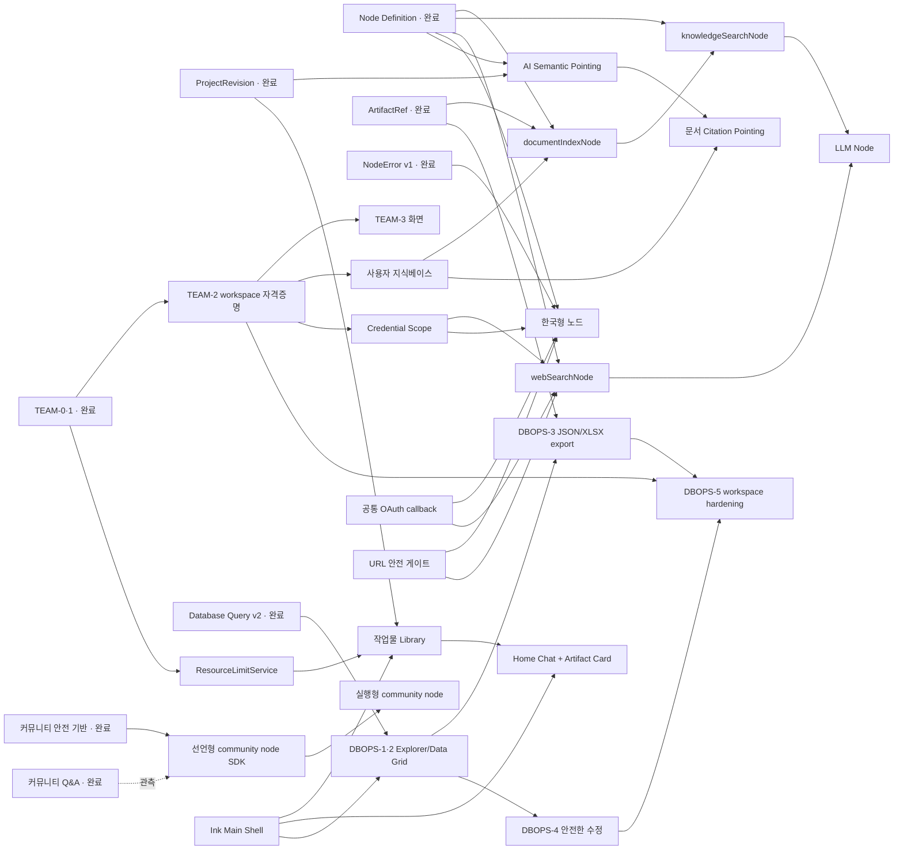

# 제품 로드맵 — 남은 작업

## 문서 정보

| 항목 | 내용 |
| --- | --- |
| 상태 | v2.3 — 백로그 29번 종료, 커뮤니티 템플릿 242종 게시 반영 |
| 최초 작성 | 2026-08-26 |
| 재작성 | 2026-08-30 |
| 대상 | Workflow Automation 제품, App Builder, 생성/평가 시스템 |
| 전제 | 기간은 확정 일정이 아니라 1명의 숙련된 풀스택 개발자 기준의 상대 추정치다 |
| 완료 기록 | `archive/COMPLETED_WORK_2026-08.md` (원본 v1.9는 `archive/LONG_TERM_PRODUCT_ROADMAP_v1.9.md`) |
| 관련 문서 | `UNIMPLEMENTED_BACKLOG.md`(미구현 항목 색인), `plans/KOREAN_SERVICE_NODE_EXPANSION_PLAN.md`, `plans/DATABASE_OPERATIONS_EXPLORER_PLAN.md`, `plans/INCOMPLETE_NODE_STRUCTURE_REVIEW.md`, `plans/LLM_GENERATION_QUALITY_PLAN.md`, `design/MAIN_WORKSPACE_AND_HOME_CHAT_REDESIGN_PLAN.md`, `ADR.md`, `docs/reports/security_assessment.md` |

이 문서에는 **아직 하지 않은 일만** 있다. 2026-08-26~29에 끝낸 백로그 1~10·12·15~25번의 설계
근거와 구현 기록은 `archive/COMPLETED_WORK_2026-08.md`로 옮겼다.

> **무엇이 남았는지만 알고 싶으면 `UNIMPLEMENTED_BACKLOG.md`를 본다.** 이 문서는 백로그 번호
> 단위라 문서 안쪽의 개별 항목이 안 보인다 — 실제로 2026-08-30에 작업 목록을 짜다가 `design/`
> 7개와 `plans/` 3개를 통째로 빠뜨렸다. 그래서 흩어진 미구현 항목을 한곳에 모은 색인을 따로 만들었다.

## 1. 현재 위치

31개 백로그 중 **23개가 끝났다.** 두 기반(Node Definition, ProjectRevision)이 자리 잡았고 그 위에
공식 연동 노드·오류 계약·App Builder·커뮤니티 트랙이 올라갔다. 자세한 내역은 아카이브의 완료
요약 표에 있다.

**열려 있는 트랙은 다섯이다.**

| 트랙 | 상태 | 다음 한 걸음 |
| --- | --- | --- |
| Workspace/RBAC (11번) | TEAM-0·1 완료, TEAM-2·3과 37곳 판정 이전이 남음 | TEAM-2 workspace 자격증명 |
| 사용자 지식베이스·검색 (26·27번) | 미착수 | 지식베이스 권한·수명 주기 정리 |
| AI 시맨틱 포인팅 (28번) | POINT-0·1 구현 완료, **UI는 꺼 둠** | 파괴적 도구 제한 또는 diff preview |
| 메인 작업 공간·홈 채팅 리디자인 (30번) | 계획 완료, 미착수 | MAIN-0 사용량·분류·목록 계약 |
| 운영 Database Explorer (31번) | 계획 완료, 미착수 | DBOPS-0 browse/export/edit 권한 계약 |

**한국형 서비스 노드(29번)는 2026-08-30에 닫혔다.** 아래 §1.2 참조.

**커뮤니티 노드(13·14번)는 의도적으로 멈춰 있다.** §4.2 트랙 B·C의 원칙만 있고, 커뮤니티 Q&A를
열어 보며 사람들이 실제로 무엇을 원하는지 관측한 뒤 계획을 세우는 편이 낫다.

### 1.1 지금 새고 있는 것 — 2026-08-30 전부 처리

`plans/KOREAN_SERVICE_NODE_EXPANSION_PLAN.md` 검토와 그 뒤 작업에서 나온, **어느 트랙에도 속하지
않지만 지금 사용자에게 영향이 있는** 결함이었다.

| 결함 | 영향 | 상태 |
| --- | --- | --- |
| 템플릿 자동 재생성이 사용자 업로드 원본을 덮어씀 | 되돌릴 수 없는 파일 손실 | **해결** — 덮어쓰지 않고 실패시킨다 |
| `webCrawlerNode`가 URL 검증 없이 요청 | SSRF. 커뮤니티 수집 정책도 무력화 | **해결** — `backend/url_guard.py` |
| HWPX 재압축이 `mimetype` STORED 규칙을 깸 | 엄격한 reader에서 파일이 열리지 않음 | **해결** — 원본 `ZipInfo` 보존 |
| `python-hwpx` 버전 미고정 | 라이브러리 변경 시 조용한 회귀 | **해결** — `==3.4.1` |
| 큐레이션 템플릿의 `.hwp` 참조 | 지원하지 않는 확장자로 실행 실패 | **해결** — `.hwpx` |
| `rssTriggerNode` cursor에 겹침 창 없음 | 피드에서 밀려났다 돌아온 항목 재통지 | **해결** — 아래 세 건과 함께 |

**이어서 발견한 네 건**(전부 2026-08-30 해결). 앞의 여섯과 달리 **계획 문서 어디에도 없던 것**이고,
새 노드로 템플릿을 실제로 만들어 보다가 드러났다.

| 결함 | 영향 |
| --- | --- |
| `meta_agent.NodeType`이 하드코딩이라 한국형 노드 5종이 빠짐 | 카탈로그는 LLM에게 49종을 알리는데 출력 스키마는 45종만 받았다 — 그 노드를 쓴 그래프는 **생성·dry-run·커뮤니티 게시가 전부 깨졌다** |
| 시작 노드 판정도 하드코딩 | RSS·YouTube·Gmail·네이버 **트리거 4종으로 시작하는 그래프가 전부** "시작 노드 0개"로 거부됐다 |
| `rssTriggerNode`가 `max_items`로 잘라낸 항목을 통지 없이 seen 처리 | 새 글 50개 중 40개가 조용히 사라진다 |
| `--accent-color` 미정의 | API Center 버튼이 라이트 모드에서 보이지 않았다 |

**앞의 두 건이 같은 모양이다** — 정의에서 파생시킬 수 있는 목록을 손으로 적어 둔 것. 둘 다
`node_definition`에서 파생시키고 대조 테스트로 묶었다. **단위 테스트는 넷 다 통과하고 있었다** —
새 노드로 그래프를 만들어 `dry_run_workflow`까지 돌려 보고서야 드러났다.

회귀 테스트는 `backend/test_url_guard.py`·`test_url_guard_politeness.py`·`test_template_safety.py`·
`test_web_extract.py`·`test_connector_cursor.py`·`test_node_definitions.py`에 있다.

### 1.2 2026-08-30에 닫힌 것

**백로그 29번(한국형 서비스 노드) — Phase 0~3 구현 완료.**

| Phase | 결과 |
| --- | --- |
| Phase 0 이전 | 위 결함 5건 |
| Phase 0 | 공통 OAuth 인가 코드 callback(`connectors/oauth_flow.py`, 마이그레이션 0016), cursor 저장소(0017), 연동 계약(mock·`docsUrl`·`termsGate`) |
| Phase 1 | HWPX 공용 엔진과 `hwpxDocumentNode` — golden 10종을 한/글에서 검증 |
| Phase 2 | `naverSearchNode`·`naverSearchTriggerNode`·`naverCafeNode` |
| Phase 3 | `jusoNode`(도로명주소), `dataGoKrNode`(공공데이터포털), `webCrawlerNode` 정비 |

**남은 것은 승인키로 하는 실호출 대조뿐이다** — 도로명주소·공공데이터포털 둘 다 문서 기준으로
만들고 mock으로 검증했다. 나머지 Phase(X·Instagram, 커뮤니티 preset, 네이버 커머스, NAVER WORKS,
OpenDART, 카카오 로컬, KOSIS)는 **비용·자격·수요를 이유로 보류**했고 재개 조건은 계획 문서 §8
보류표에 있다.

**커뮤니티 템플릿 242종 게시(백로그 12번의 실질 완성).** 갤러리가 0개였다. 기존 142개(n8n 템플릿
로직을 옮긴 것, 그동안 LLM 생성용 벡터 스토어로만 갔다)를 현재 생태계로 재검증해 전량 통과시키고,
그때 없던 노드를 쓰는 **신규 100개**를 만들어 함께 올렸다. 바로 공개 163, 검토 대기 79.

이 과정에서 ADR-0023의 게시 게이트에 **예외를 하나 만들었다** — 운영자 제작 템플릿은
"본인 계정 실행 성공" 요건을 면제한다(`publish_curated`). 나머지 네 게이트는 그대로다.
면제 사실은 `templates.is_curated`·`publish_gate.curated`·갤러리 "공식" 배지 세 곳에 남는다.

## 2. 남은 백로그

번호는 원래 로드맵의 것을 유지한다 — ADR·커밋·아카이브가 이 번호를 참조한다.

| 번호 | 작업 | 크기 | 상태 | 이유 |
| ---: | --- | --- | --- | --- |
| 11 | Workspace/RBAC — TEAM-2·3과 잔여 판정 이전 | L | 진행 중 | 개인 도구에서 조직 도구로 넘어가는 마지막 절반. 자격증명이 소유자 개인 것에 묶여 있어 소유자가 나가면 멈춘다 |
| 26 | 사용자 지식베이스와 `documentIndexNode`·`knowledgeSearchNode` | L | 미착수 | 정적 PDF의 반복 파싱을 없애고 배포된 챗봇이 tenant 격리·버전·페이지 인용이 있는 근거만 조회하게 함 |
| 27 | `webSearchNode` vertical slice | M | 미착수 | 생성 에이전트 내부 검색을 캔버스 실행 기능으로 승격하고 provider·quota·출력·mock 계약을 표준화 |
| 28 | AI 시맨틱 포인팅과 대상 한정 수정 | M | 구현 완료, **꺼 둠** | 범위 밖 변경은 막지만 범위 **안**에서 모델이 파괴적으로 동작하는 것(연결선 삭제)을 못 막았다. 재개 조건은 §3.3 |
| 30 | 메인 작업 공간·작업물 Library·홈 채팅 리디자인 | L | 계획 완료 | Blue 중심 Main Shell을 Black/Neutral로 전환하고 Workflow 5개·Schedule 2개 등 실제 한도, 목록 정보와 비삭제 행동, 생성 결과 Artifact Card를 함께 정리 |
| 31 | 운영 Database Explorer·JSON/XLSX export·안전한 수정 | L | 계획 완료 | 외부 PostgreSQL을 운영 화면에서 탐색·내보내고 별도 write capability와 감사 계약 뒤 제한적인 행 수정을 제공 |
| 29 | 한국형 서비스 노드 확장 | XL | **Phase 0~3 완료** | 남은 Phase는 비용·자격·수요를 이유로 보류. 재개 조건은 계획 문서 §8 |
| 13 | 선언형 community node SDK | L~XL | 보류 | 보안 위험을 제한한 생태계 확장. 수요 관측 후 |
| 14 | 실시간 공동 편집/실행형 노드 | XL 이상 | 보류 | 실제 수요와 격리 기반이 확인된 뒤 |

### 지시 없이 진행할 수 있는 것은 지금 없다

2026-08-30 기준으로 **근거가 문서에 있어 그대로 구현하면 되는 항목이 비었다.** 남은 것은 전부
(1) 제품 판단, (2) 비용·자격, (3) 사용자 기기·계정, (4) 외형 변경 승인, (5) 착수 시점 중 하나를
기다린다. 목록은 `UNIMPLEMENTED_BACKLOG.md`가 정본이다.

가장 값이 큰 순서로 세 가지만 꼽으면:

1. **승인키 발급**(도로명주소·공공데이터포털) — 만들어 둔 노드 둘이 실호출 검증만 남았다.
   `jusoNode`는 공식 문서를 읽지도 못해(403) 규격이 2차 출처다.
2. **검토 대기 템플릿 79개 승인** — 갤러리에 안 보이는 상태로 쌓여 있다. 누가 승인하는지가
   정해지지 않았다.
3. **백로그 30·31 착수 승인** — 둘 다 계획이 끝나 있고 서로 독립이다.

### 진행 순서

```text
11번 TEAM-2 → TEAM-3 → 잔여 37곳     (3~4주)
  │
  ├─ 26번 지식베이스 권한·수명 주기
  │     → documentIndexNode
  │     → knowledgeSearchNode
  │     → 사내 규정 챗봇 template
  │     → 27번 webSearchNode          (L + M)
  │
  ├─ 28번 POINT-0~2 (독립, 병행 가능)
  │     → POINT-3 문서 citation (26번 뒤)
  │
  ├─ 30번 MAIN-0 → Ink Shell → Workflow → Home Chat → App/Schedule
  │     (4~6주, 기능 트랙과 독립적으로 병행 가능)
  │
  └─ 31번 DBOPS-0 → Schema Explorer → Data Grid → JSON/XLSX export
        → 안전한 수정 beta → Workspace hardening (4~6주)
```

**26번과 28번의 관계.** POINT-0~2(Workflow/App Builder)는 26·27번과 독립적이라 프론트엔드와 AI
API 여력이 있으면 병행할 수 있다. 반면 POINT-3의 PDF citation pointing은 26번의 문서 정본·버전·
tenant 격리 계약을 그대로 쓰므로 반드시 26번 뒤에 둔다. POINT-4 이미지 영역/vision은 순서에 자동
포함하지 않고 실제 bbox 요청이 확인될 때 다시 승인한다.

**11번과 나머지의 관계.** 11번은 조직 **내부** 권한이고 26~31번은 기능·경험 확장이라 서로를 막지 않는다.
다만 26번의 지식베이스는 workspace 단위 격리를 전제하므로, TEAM-2(workspace 자격증명)가 먼저 있으면
지식베이스의 소유 모델을 두 번 만들지 않는다.

**30번과 Workspace의 관계.** 화면 개편 자체는 독립적으로 진행할 수 있지만 ResourceUsage와 Card
`capabilities`는 처음부터 `personal | workspace` scope와 `project_access`를 사용한다. 사용자 ID를 UI에
hard-code하면 11번 TEAM-3에서 사용량·행동 계약을 다시 만들게 된다.

**31번의 범위 경계.** 기본 Schema Explorer·read-only Data Grid·export는 개인 credential로 먼저 진행할
수 있다. 행 수정은 별도 Database Write binding과 감사 계약 뒤에만 열며, Workspace 공유 연결은 11번
TEAM-2의 credential scope가 선행한다. 제품 자체 DB와 사용자 소유 외부 DB를 한 목록에 섞지 않는다.

**26·27번이 물려받는 것.** Phase 0에서 만든 OAuth callback·cursor 저장소·연동 계약을 그대로 쓴다 —
외부 provider 연결을 두 번 만들지 않는다.


## 3. 작업별 상세

### 3.1 Workspace/RBAC — 백로그 11번

#### 한눈에 보기

**무엇을 만드나.** 워크플로우를 **개인의 것에서 조직의 것으로** 옮긴다. 지금은 `Project.user_id`
하나가 소유자이자 권한이라, 만든 사람이 떠나면 자동화도 함께 사라진다.

**§4.1과의 관계.** 그 절이 데이터 모델(`Workspace`·`WorkspaceMember`·`AuditEvent`·`CredentialBinding`)과
단계(Team MVP → 협업 v2 → 실시간)를 이미 정해 뒀다. 이 절은 그 위에 **구현 수준의 판단**을 얹는다 —
기존 개인 프로젝트를 어떻게 다룰지, 권한을 어디서 판정할지, 무엇부터 만들지.

**핵심 판단 셋:**

- **권한 판정을 한 함수로 먼저 모은다.** 데이터 이전보다 이것이 먼저다. 지금 프로젝트 접근 검사가
  `project.user_id != user.id` 형태로 **여러 엔드포인트에 흩어져 있어서**, workspace를 도입하며 그것들을
  하나씩 고치면 반드시 한 곳을 빠뜨린다. 빠뜨린 곳이 바로 tenant isolation 구멍이다.
- **개인 프로젝트를 억지로 옮기지 않는다.** `workspace_id`를 nullable로 두고 "비어 있으면 개인 소유"로
  읽는다. 전면 백필은 16명·16개 프로젝트인 지금도 위험하고(모든 조회 경로가 바뀐다), 얻는 것은
  "코드 경로가 하나" 뿐인데 그건 **위의 판정 함수가 이미 준다.**
- **초대는 핸들로 한다.** 이메일로 초대하면 이메일만 알아도 계정 존재 여부가 확인된다(ADR-0020에서
  친구 추가를 핸들로 옮긴 것과 같은 이유). 초대받는 사람이 커뮤니티 핸들을 아직 안 만들었다면
  그 자리에서 만들게 한다.

#### 현재 간극과 위험

| 영역 | 현재 상태 | 문제 |
| --- | --- | --- |
| 소유 | `Project.user_id` 하나가 소유자·권한·과금 대상을 겸한다. | 만든 사람이 떠나면 자동화가 사라진다. 역할을 나눌 수 없다. |
| 권한 판정 | `project.user_id != user.id` 검사가 엔드포인트마다 흩어져 있다. | workspace를 도입하며 하나씩 고치면 **한 곳을 빠뜨리고**, 그것이 곧 격리 구멍이다. |
| 공개 범위 | `visibility`(private/friends/public)는 "누가 보는가"만 표현한다. | "누가 편집·실행·배포·삭제하는가"를 표현하지 못한다. |
| 자격증명 | `UserApiKey`가 사용자에 묶인다. 실행은 **프로젝트 소유자**의 자격증명을 쓴다(`__owner_user_id__`). | 팀 프로젝트를 다른 멤버가 실행하면 소유자의 개인 키가 쓰인다. 소유자가 나가면 전부 멈춘다. |
| 감사 | 실행 로그는 있지만 "누가 권한을 바꿨는가"는 없다. | 조직 자산에는 실행 이력만으로 부족하다. |
| 초대 | 없다. 친구 관계가 유일한 사람-사람 연결이다. | 친구를 팀 권한으로 재사용하면 의미가 섞인다(§4.1 판단). |

#### 목표 계약

```text
Workspace
  id, slug(unique, 공개), name, owner_id, plan, created_at

WorkspaceMember
  workspace_id, user_id, role, status(active | invited | removed), invited_by, joined_at
  역할: owner > admin > editor > runner > viewer

WorkspaceInvite
  workspace_id, handle, role, invited_by, status(pending|accepted|declined|revoked), created_at

Project.workspace_id | null          # 비어 있으면 개인 소유(기존 동작 그대로)

AuditEvent
  workspace_id, actor_id, action, resource_type, resource_id, metadata, created_at
```

**권한 표** — 이 표가 정본이고 코드는 여기서 파생된다.

| 행위 | owner | admin | editor | runner | viewer |
| --- | :-: | :-: | :-: | :-: | :-: |
| 조회 | ✓ | ✓ | ✓ | ✓ | ✓ |
| 편집·저장 | ✓ | ✓ | ✓ | | |
| 실행 | ✓ | ✓ | ✓ | ✓ | |
| 배포·라이브 토글 | ✓ | ✓ | | | |
| 삭제 | ✓ | ✓ | | | |
| 멤버 초대·역할 변경 | ✓ | ✓ | | | |
| workspace 삭제·소유권 이전 | ✓ | | | | |

#### 범위 원칙

- **Team MVP만 한다**(§4.1의 단계 구분). 노드 댓글·멘션·검토 요청(협업 v2)과 실시간 공동 편집은
  범위 밖이다.
- 개인 프로젝트의 동작은 **하나도 바뀌지 않는다.** `workspace_id`가 비어 있으면 지금과 같다.
- 프로젝트를 개인 ↔ workspace로 옮길 수 있되, **옮기는 것은 owner/admin만** 한다.
- workspace 자격증명은 **원문을 노출하지 않는다.** 멤버는 "이 workspace에 Discord 자격증명이 있다"만
  보고, 값은 실행 시점에 서버가 해석한다(ADR-0017과 같은 규칙).
- 감사 이벤트는 **권한·소유·자격증명 변경**만 남긴다. 실행 이력은 이미 `FlowExecutionLog`에 있다.

#### 단계별 구현

##### TEAM-0. 권한 판정 한 곳으로 모으기 — 2~3일

**데이터 모델보다 먼저 한다.** `workspace_id`가 없어도 지금 동작을 그대로 표현할 수 있고, 그래야
workspace를 붙일 때 고칠 자리가 한 곳이다.

1. `project_access.can(db, user, project, action)` — 조회/편집/실행/배포/삭제/공유를 하나의 함수로.
   지금은 "소유자면 전부 허용, 아니면 visibility에 따라 조회만" 을 그대로 표현한다.
2. 흩어진 `project.user_id != user.id` 검사를 전부 이 함수로 바꾼다. **바꾸는 동안 동작이 달라지지
   않아야 한다** — 회귀 테스트로 고정한다.
3. 실행 자격증명의 주체(`__owner_user_id__`)도 이 모듈이 정한다(`credential_owner_for(project)`).

##### TEAM-1. Workspace·멤버·초대 — 3~4일

1. `Workspace`·`WorkspaceMember`·`WorkspaceInvite`와 역할 표.
2. 초대는 **핸들**로. 초대받은 사람이 수락해야 멤버가 된다. 알림은 §4.16의 알림함을 쓴다.
3. `project_access.can()`이 workspace 멤버십을 보게 한다. 이 단계에서 권한 표가 실제로 동작한다.
4. `AuditEvent`와 조회 API.

##### TEAM-2. 프로젝트 이동과 자격증명 바인딩 — 3~4일

1. 프로젝트를 개인 ↔ workspace로 옮긴다(owner/admin만). 이동도 감사 이벤트다.
2. `credential_owner_for(project)`가 workspace 프로젝트면 **workspace 자격증명**을 쓰게 한다 —
   소유자가 나가도 멈추지 않는다. 원문은 노출하지 않는다.
3. workspace 자격증명 등록·해제(admin 이상)와 프로젝트별 허용 범위.

##### TEAM-3. 편집기·목록 UI — 3~4일

1. workspace 전환기, 멤버 목록·역할 변경, 초대 화면.
2. 권한에 따라 편집기의 저장·실행·배포 버튼이 비활성화되고 **왜 안 되는지** 보인다.
3. 감사 이력 화면.

전체 예상 크기는 **XL, 약 3~4주**다. TEAM-0을 먼저 하면 나머지가 안전해진다 — 권한이 한 곳에 모이기
전에는 어떤 변경도 격리 구멍을 만들 수 있다.

#### 검증 매트릭스

| 층 | 필수 검증 |
| --- | --- |
| 회귀 | 개인 프로젝트의 조회·편집·실행·배포·삭제 동작이 **하나도 바뀌지 않는지**(TEAM-0 전후 동일) |
| 권한 표 | 역할 5종 × 행위 7종의 전 조합. 표와 코드가 어긋나면 실패한다 |
| 격리 | 다른 workspace의 프로젝트 조회·편집·실행·삭제 거부, 멤버가 아닌 사용자의 workspace 조회 거부, **API 응답에서** 목록에 섞이지 않는지 |
| 초대 | 핸들 없는 사용자 초대 불가, 중복 초대, 수락·거절·철회, 초대받지 않은 사용자의 수락 거부 |
| 자격증명 | workspace 프로젝트가 workspace 자격증명을 쓰는지, 원문이 어떤 응답에도 없는지, 소유자 탈퇴 뒤에도 실행되는지 |
| 감사 | 권한·소유·자격증명 변경이 남는지, 행위자 id가 기록되는지 |
| 소유권 | 마지막 owner가 나갈 수 없는지, 소유권 이전 뒤 권한이 옮겨지는지 |

#### 출시 게이트와 되돌리기

- 개인 프로젝트 동작이 도입 전과 **바이트 단위로 같다**(회귀 0).
- 권한 표의 전 조합이 코드와 일치한다.
- 다른 workspace의 자원이 목록·조회·실행 어디에도 새지 않는다.
- workspace 자격증명 원문이 어떤 API 응답에도 없다.
- 마지막 owner가 나가 workspace가 주인 없는 상태가 되지 않는다.

배포는 `WORKSPACE_V1` flag로 제한한다. 끄면 workspace 관련 화면과 API가 사라지고 **개인 프로젝트
경로만 남는다** — TEAM-0의 판정 함수는 그 경우에도 그대로 동작한다.

#### 구현 진행 상황 (2026-08-29, 우선 백로그 11번 — TEAM-0·1)

TEAM-0과 TEAM-1을 구현했다(ADR-0024, 마이그레이션 0015). **TEAM-2·3은 남았다.**

- **TEAM-0 권한 판정 모으기** — `project_access.can(db, user, project, action)`. 착수 전 센 결과
  `user_id != user.id` 검사가 **42곳**에 흩어져 있었다. 판정 순서는 만든 사람 → workspace 역할 →
  공개 범위(**조회만**)다. 자격증명 주체(`credential_owner_for`)도 이 모듈이 정한다.
- **TEAM-1 Workspace·멤버·초대·감사** — 역할 5종의 권한 표가 코드와 테스트로 고정됐다. 초대는
  핸들 기반이고 §4.16의 알림함을 쓴다. 마지막 owner는 나갈 수도 강등될 수도 없다.
- **점진 이전이 안전한 이유**: 아직 옮기지 않은 엔드포인트는 `user_id`를 보는데 그건 workspace
  멤버십보다 **더 엄격하다** — 실패 방식이 "팀원이 아직 못 한다"이지 "남이 볼 수 있다"가 아니다.
  42곳 중 핵심 5곳(조회·편집·삭제·실행 자격증명·목록)을 옮겼다.
- **남은 것**: TEAM-2(workspace 전용 자격증명 저장소 — 지금은 workspace owner의 개인 자격증명을
  쓴다), TEAM-3(workspace 화면 — API만 있다), 그리고 나머지 37곳의 판정 이전.

### 3.2 사용자 지식베이스와 인터넷 검색 노드 — 백로그 26·27번

#### 판단

**채택하고 공식 노드 확장의 다음 vertical slice로 둔다.** 현재 프로젝트 문서 RAG는 업로드한 PDF를
한 번 추출·청크화·임베딩해 ChromaDB에 저장하므로 핵심 기술은 이미 있다. 하지만 이 경로는 워크플로
생성 대화에 암묵적으로 붙을 뿐, 배포된 챗봇이 명시적으로 선택한 문서 집합을 조회할 수 없다.
`tokenizerNode`를 배포 흐름에 넣으면 질문마다 같은 PDF를 다시 읽고 전체 텍스트를 다음 노드로 넘겨
파싱 부하와 prompt token이 반복된다.

Node Knowledge Index와 사용자 지식베이스는 이름만 비슷하고 목적이 다르다.

| 구분 | Node Knowledge Index | 사용자 지식베이스 |
| --- | --- | --- |
| 목적 | 생성기가 사용할 노드 타입 선택 | 배포된 Workflow가 사용자 문서 근거 검색 |
| 원본 | 버전 관리된 Node Definition | 사용자·workspace가 소유한 Artifact |
| 갱신 | release/definition 변경 시 | 문서 추가·교체·삭제 시 |
| 권한 | 제품 내부 읽기 | project/workspace RBAC와 문서별 ACL |
| 삭제 | 비활성 노드 동기화 | 사용자 삭제, 보존기간, workspace 탈퇴 전파 |
| 출력 | node type 후보 | 페이지 인용이 있는 문서 chunk |

#### 채택할 노드 계약

| 노드 | 역할 | MVP mode | side effect |
| --- | --- | --- | --- |
| `documentIndexNode` | 정적 문서를 지식베이스에 증분 색인 | `upsert`, `delete_document`, `status` | `internal-write` |
| `knowledgeSearchNode` | 질문과 관련된 저장 문서 근거 조회 | `search` | `internal-read` |
| `webSearchNode` | 최신 인터넷 검색 결과 조회 | `search` | `external-read` |

현재 Node Definition의 `sideEffect` enum은 `none`/`external-read`/`external-write`뿐이다.
Phase 1.7에서 `internal-read`/`internal-write`를 정식 effect로 추가하고 dry-run·audit·retry 정책을
고정한다. 지식베이스 쓰기를 `none`으로 위장하거나 외부 게시와 같은 `external-write`로 뭉개지 않는다.

`knowledgeBaseAnswerNode`처럼 검색과 생성을 합친 노드는 MVP에서 만들지 않는다. 검색 결과를
`llmNode`에 연결하면 답변 모델·system prompt·승인 정책을 사용자가 조립할 수 있고, 검색 품질과 생성
품질도 따로 평가할 수 있다. `llmNode.useMemory`는 대화 이력에만 계속 사용하며 지식베이스 선택이나
문서 수명 주기를 떠맡기지 않는다.

#### `documentIndexNode`

입력은 서버 경로 문자열이 아니라 소유권 검사를 통과한 `ArtifactRef<Document|PDF>`와
`knowledgeBaseId`다. 최초 실행 또는 문서 변경 시 다음 상태 머신을 비동기 job으로 수행한다.

```text
Artifact
  -> SHA-256 + MIME 검증
  -> 페이지 단위 parse
  -> 텍스트가 없는 페이지만 제한적 OCR
  -> heading/page-aware chunk
  -> embedding
  -> versioned upsert
  -> KnowledgeDocument + index report
```

- idempotency key는 `artifact_content_hash + parser_version + chunker_version + embedding_model_id`다.
  값이 같으면 파싱·임베딩을 다시 하지 않고 `reused: true`를 반환한다.
- PDF는 각 chunk에 `documentId`, 원본 파일명, page, section, content hash, 지식베이스 version을
  저장한다. DOCX/TXT는 page 대신 heading/paragraph 위치를 사용한다.
- 스캔 PDF는 전체 문서 OCR을 기본 실행하지 않는다. 텍스트 밀도가 기준보다 낮은 페이지만 OCR하고,
  페이지·파일·job별 시간과 이미지 픽셀 수 상한을 둔다.
- `upsert`는 같은 logical document의 새 버전을 원자적으로 활성화하고 이전 버전은 진행 중 질문에만
  짧게 유지한다. `delete_document`는 metadata뿐 아니라 vector·원문 파생 text·cache를 함께 지운다.
- 노드가 사용자 요청 처리 경로에 실수로 포함돼도 hash가 같으면 무거운 작업을 건너뛴다. 권장 UX는
  “배포/설정 시 색인”과 “요청 시 검색”을 두 lane으로 분리하는 것이다.

출력 계약 초안:

```json
{
  "knowledgeBaseId": "kb_hr_policy",
  "knowledgeBaseVersion": 7,
  "documentId": "doc_...",
  "documentVersion": 3,
  "status": "ready",
  "chunks": 84,
  "reused": false,
  "warnings": []
}
```

#### `knowledgeSearchNode`

- 입력: `knowledgeBaseId`, 질문 문자열, `topK`, `minScore`, 선택적 `documentIds`/version filter.
- 한국어 규정의 정확한 조·항·용어 검색을 위해 BM25/lexical과 vector similarity를 합친 hybrid 검색을
  기본으로 사용한다. reranker는 품질 이득을 평가한 뒤 선택적으로 켠다.
- 출력: `chunks[]` 각각에 text, documentId, filename, page/section, score, content hash를 포함하고,
  답변 UI가 쓸 수 있는 `citations[]`를 별도로 제공한다.
- 최고 점수와 근거 다양성이 기준보다 낮으면 빈 근거와 `insufficientEvidence: true`를 반환한다.
  LLM은 이 신호에서 일반 지식으로 빈칸을 채우지 않고 “규정에서 확인되지 않음”으로 답하도록 한다.
- 질문 embedding은 정규화한 query hash로 짧게 cache하되 workspace·knowledge base·model version을
  cache key에 포함한다. 문서가 바뀌면 해당 knowledge base version의 retrieval/answer cache만 무효화한다.

사내 규정 챗봇의 권장 흐름은 다음과 같다.

```text
[관리자/배포 시]
PDF Artifact -> documentIndexNode -> knowledgeBaseId/version

[사용자 요청 시]
Chat Trigger -> knowledgeSearchNode -> grounded prompt -> llmNode -> Output
```

#### `webSearchNode`

`webSearchNode`는 저장된 사내 규정과 최신 인터넷 정보를 섞지 않는다. 검색어를 URL로 바꾸는
`webCrawlerNode`의 별칭도 아니다.

- 입력: `query`, `locale`, `recency`, `maxResults`, `allowDomains`, `denyDomains`, safe-search 정책.
- 출력: provider와 무관한 `SearchResult[]`(`title`, `url`, `snippet`, `publishedAt`, `source`)와
  quota/rate-limit metadata.
- 첫 provider는 하나만 vertical slice로 구현하되 provider 계약을 분리한다. API key는 API Center에서
  주입하고 검색 결과·credential·개인화 식별자를 graph에 저장하지 않는다.
- `webSearchNode`는 검색 결과 목록만 반환한다. 본문이 필요하면 사용자가 선택한 URL만 기존
  `webCrawlerNode` 또는 향후 안전한 fetch 노드로 전달한다.
- 사내 지식 챗봇 템플릿에는 기본으로 넣지 않는다. “규정만 기준으로 답변”과 “인터넷 자료도 참고”를
  Inspector에서 명시적으로 구분하고, 두 출처가 함께 쓰이면 답변 인용에서 `internal`/`web`을 표시한다.
- mock은 검색 성공, 결과 없음, rate limit, provider timeout, 차단 도메인을 실제 외부 요청 없이 재현한다.

#### 저장·권한·수명 주기 선행 조건

현재 `chat_context_{project_id}` 컬렉션을 그대로 production 지식베이스로 승격하지 않는다.

1. `KnowledgeBase`, `KnowledgeDocument`, `KnowledgeIndexJob`을 관계형 DB의 정본으로 두고 vector store는
   파생 색인으로 취급한다.
2. 모든 쓰기·검색·삭제에서 `owner_user_id` 또는 `workspace_id`와 project 접근 권한을 검증한다.
   컬렉션/metadata namespace에도 tenant ID를 포함하고 클라이언트가 임의의 collection 이름을 넘기지 못하게 한다.
3. `/api/chat`의 문서 retrieval도 인증과 project read 권한을 통과한 뒤에만 호출한다. 숫자 project ID만으로
   `chat_context_*`를 조회하는 현재 결합은 지식베이스 공개 전에 제거한다.
4. 문서 목록, 색인 상태, 실패 사유, 재색인, 삭제, 보존기간을 관리하는 UI/API를 제공한다.
5. workspace 삭제·문서 삭제·권한 철회가 vector, OCR text, query/answer cache와 backup retention까지
   어떻게 전파되는지 runbook과 감사 로그를 둔다.
6. 원문 chunk를 일반 telemetry·LLM 학습 데이터에 남기지 않고 filename·query도 기본 redaction한다.

#### 테스트와 출시 gate

- 같은 PDF를 두 번 넣었을 때 두 번째 실행의 parser/embedding 호출 0회, chunk 중복 0건
- 문서 한 페이지 변경 시 새 version 원자 전환과 구 version 검색 0건
- 다른 사용자/workspace/project의 knowledge base 검색·목록·삭제 0건
- 문서 삭제 후 vector·파생 text·cache 검색 결과 0건
- 페이지 인용 정확도와 규정 질문 retrieval Recall@5 평가 세트 통과
- 근거 없는 질문에서 `insufficientEvidence`를 무시한 답변 0건
- 스캔 PDF OCR timeout/페이지 상한과 zip·PDF parser 자원 공격 fixture 통과
- mock 실행 중 embedding/search provider 외부 요청 0건
- 요청당 PDF 재파싱 0회, 전체 문서 prompt 주입 0회

초기 성능 목표는 색인 완료 후 질문 경로 P95에서 PDF parse 시간 0ms, retrieval P95 300ms 이하,
질문당 주입 문맥을 전체 문서 대비 10% 이하로 두는 것이다. 답변 비용과 지연은 검색 결과의 top-k와
rerank 품질을 함께 보며 조정한다.

### 3.3 AI 시맨틱 포인팅과 대상 한정 수정 — 백로그 28번

#### 판단

**채택한다. 단, 첫 구현은 화면 좌표를 모델에 추측시키는 방식이 아니라 제품이 이미 아는 노드·컴포넌트
ID를 전달하는 시맨틱 포인팅으로 한다.** 포인팅은 특정 모델의 숨은 능력이 아니라 "사용자가 지목한 대상,
그 대상의 버전, AI가 바꿔도 되는 범위"를 명시하는 제품 계약이다. 이 계약을 먼저 만들면 같은 UI를
Workflow Editor, App Builder, 배포된 챗봇의 메시지·문서 인용에 재사용할 수 있다.

기본 편집 범위는 **선택 항목만(`target_only`)**이다. 연결된 노드나 전체 캔버스를 바꾸려면 사용자가
범위를 명시적으로 넓혀야 한다. LLM이 반환한 설명을 믿고 범위를 통제하는 것이 아니라, 서버가 변경 전후
diff를 계산해 허용 범위 밖 변경을 거부한다.

#### 제품에서 말하는 pointing의 범위

| 대상 종류 | 사용 예 | 정본 식별자 | 도입 시점 |
| --- | --- | --- | --- |
| `workflow_node` | "이 LLM 노드가 실패하면 세 번 재시도하게 해줘" | project id + node id + graph revision/client state version | 1차 MVP |
| `workflow_edge` | "이 연결을 제거하고 조건 분기를 넣어줘" | project id + edge id + graph revision/client state version | 1차 MVP |
| `app_component` | "이 전송 버튼을 더 강조하고 완료 알림을 연결해줘" | app id + component id + app revision/client state version | 1차 MVP |
| `app_logic_node` | "이 버튼 트리거 뒤에 검증을 추가해줘" | app id + logic node id + app revision/client state version | 1차 MVP |
| `execution_step` | "여기서 왜 빈 값이 나왔어?" | execution id + step id/node id | 후속 |
| `message_range` | 이전 답변의 한 문장을 선택해 재질문 | conversation id + message id + 문자 범위 + message hash | 후속 |
| `artifact_citation` | PDF 12쪽 규정 문단을 근거로 고정 | artifact/document id + document version + page/chunk id | §4.7/백로그 26 뒤 |
| `image_region` | 이미지나 외부 화면의 특정 영역 질문 | artifact id + 정규화 bbox + viewport/asset hash | 마지막, vision 수요 확인 뒤 |

`workflow_node`와 `app_component`는 좌표가 아니라 ID를 보내므로 캔버스 이동·확대·반응형 레이아웃에도
대상이 바뀌지 않는다. `image_region`만 좌표가 필요하며 `[x, y, width, height]`를 0~1 범위로 정규화하고
원본 asset hash를 함께 보내야 한다. DOM selector, 임의 JavaScript, 모델이 만들어 낸 CSS selector는
대상 식별자나 실행 명령으로 허용하지 않는다.

#### 현재 구조와 간극

| 영역 | 현재 활용 가능한 기반 | 빠진 계약 |
| --- | --- | --- |
| Workflow Editor | React Flow 선택 상태, `focusNodeById()`, Inspector 열기, AI 변경 하이라이트 | 선택 노드 첨부, scope 선택, target-aware prompt, 범위 밖 diff 거부 |
| App Builder | `selectedIds`/`selectedComponent`, 컴포넌트 ID, design/logic 상태 | 선택 컴포넌트 첨부, target hash, 선택 대상 한정 생성 |
| 공통 AI Drawer | 두 편집기가 같은 `AIAssistantDrawer`를 사용 | 대상 칩·삭제·scope·stale 표시·키보드 접근성 |
| AI 요청 | Editor는 전체 `graph_data`, Builder는 전체 `current_state` 전달 | 공통 `pointing_context`, revision, 서버 resolver/redaction |
| AI 응답 | 전체 graph/UI state와 자연어 reply를 반환 | 허용된 patch 검증, diff preview, 구조화 `ui_actions` |

전체 그래프는 초안의 정합성과 결과 diff 검증을 위해 서버에 계속 전달할 수 있지만, **LLM prompt에는 선택
대상과 필요한 1-hop 문맥만 넣는 것**이 목표다. 즉 전체 상태는 검증 정본이고, 포인팅 문맥은 모델 입력
예산이다. 이렇게 해야 큰 캔버스에서 토큰을 줄이면서도 모델이 범위 밖을 바꿨는지 확인할 수 있다.

#### 공통 요청·응답 계약

```typescript
type PointingKind =
  | 'workflow_node'
  | 'workflow_edge'
  | 'app_component'
  | 'app_logic_node'
  | 'execution_step'
  | 'message_range'
  | 'artifact_citation'
  | 'image_region';

type PointingScope =
  | 'reference_only'          // 답변 근거로만 사용, 편집 금지
  | 'target_only'             // 기본값: 선택 ID만 수정
  | 'target_and_neighbors'    // 선택 ID와 직접 연결된 1-hop만 수정
  | 'whole_canvas';           // 사용자가 명시적으로 선택할 때만

interface PointingTarget {
  kind: PointingKind;
  id: string;
  label?: string;             // 표시용이며 권한 판정에 사용하지 않음
  revision?: number;
  clientStateVersion?: number;
  snapshotHash: string;
  path?: string;              // 예: props.text; 서버 allowlist와 대조
  range?: { start: number; end: number; quoteHash: string };
  region?: { x: number; y: number; width: number; height: number };
}

interface PointingContext {
  version: 1;
  scope: PointingScope;
  targets: PointingTarget[];
}
```

기존 `/api/chat`과 `/api/builder/generate_app`에 optional `pointing_context`를 추가해 이전 클라이언트와
호환한다. 서버는 다음 순서로 처리한다.

1. `kind`별 `PointingResolver`가 현재 프로젝트/app/conversation/document에서 ID를 다시 찾는다. 클라이언트가
   보낸 label이나 데이터 snapshot은 신뢰하지 않는다.
2. 사용자·workspace 권한을 대상마다 검사한다. 조회 권한은 reference에, 편집 권한은 mutation에 따로
   적용한다.
3. revision/client state version과 `snapshotHash`를 확인한다. 선택 뒤 대상이 바뀌었으면 409
   `POINTING_TARGET_STALE`로 돌려보내고 현재 대상을 다시 첨부하게 한다.
4. secret 필드, credential 원문, 업로드 서버 경로를 제거한 뒤 대상과 필요한 이웃만 prompt context로 만든다.
   직접 target은 요청당 20개, 해석된 이웃은 50개와 별도 token budget으로 제한하고, 초과하면 조용히
   잘라 다른 범위를 뜻하게 만들지 않고 `POINTING_CONTEXT_TOO_LARGE`로 범위 축소를 요청한다.
5. 모델 결과를 기존 상태와 비교해 허용된 ID·field 밖 변경이 있으면 적용하지 않고
   `POINTING_SCOPE_VIOLATION`으로 기록한다.
6. 검증을 통과한 patch와 사람용 diff를 반환하고, 사용자가 적용하면 기존 revision/history에 AI 변경으로
   남긴다.

응답의 UI 동작도 자유 형식이 아니라 허용 목록으로 제한한다.

```json
{
  "reply": "재시도 정책을 추가했습니다.",
  "patch": [],
  "ui_actions": [
    { "type": "focus_target", "targetId": "node-12" },
    { "type": "open_inspector", "targetId": "node-12", "field": "retryPolicy" },
    { "type": "show_diff" }
  ]
}
```

허용 명령은 `focus_target`, `open_inspector`, `show_diff`처럼 로컬 UI 상태만 바꾸는 것으로 시작한다.
저장·실행·배포·외부 전송은 `ui_actions`로 수행하지 않는다. raw selector, URL navigation, script 실행은
응답 schema에서 거부한다.

#### 편집기 UX

1. 사용자가 캔버스에서 하나 이상을 선택하고 **AI에 첨부**를 누르거나 단축키로 현재 선택을 고정한다.
   단순 선택만으로 자동 첨부하지 않는다. 속성을 보려고 클릭한 것이 AI 권한 확대로 이어지면 안 된다.
2. Drawer 입력창 위에 `HTTP 요청 ×`, `LLM ×` 같은 대상 칩을 표시한다. hover/focus 시 캔버스 대상이
   강조되고, 칩의 × 또는 `Escape`로 제거할 수 있다.
3. 대상이 있으면 scope 기본값은 `선택 항목만`; `연결 항목 포함`, `전체 캔버스`는 별도 선택한다.
   `전체 캔버스`는 요청마다 자동 유지하지 않는다.
4. 전송한 메시지에도 대상 label과 immutable reference를 남긴다. 이후 대상이 삭제되면 "삭제된 대상"으로
   표시하고 다른 ID에 조용히 재연결하지 않는다.
5. 응답은 즉시 덮어쓰지 않고 대상별 변경 요약과 diff preview를 보여준다. 적용·취소·되돌리기는 기존
   editor/app history와 revision을 사용한다.
6. 마우스 없이 대상 목록을 탐색·첨부·제거할 수 있어야 하고 칩, scope, stale 상태를 screen reader가
   읽을 수 있어야 한다.

#### 단계별 구현

##### POINT-0. 계약·resolver·관측 기반 — **2026-08-30 완료**

구현은 `backend/pointing.py`(+ `test_pointing.py` 52건)에 있다. 원래 계획한 네 가지를 그대로 했다.

| | 결과 |
| --- | --- |
| 계약 | `PointingContext v1`, `PointingTarget`, scope 4종, 오류 code 6종(`error_catalog.json` 등록) |
| resolver | `workflow_node`·`workflow_edge`·`app_component`·`app_logic_node`. 컴포넌트는 `children` 중첩까지 훑는다 |
| scope validator | `validate_scope()` — 전후를 직접 비교해 범위 밖이 하나라도 바뀌면 **요청 전체 거부** |
| 관측 | `telemetry()` — 종류·수·scope·위반 수만. **label·본문은 남기지 않는다** |

`/api/chat`에 optional `pointing_context`를 붙였다. 없으면 예전과 똑같이 동작한다.

**구현하며 정한 것 넷.**

- **`whole_canvas`는 빈 집합이 아니라 `None`을 돌려준다.** 빈 집합("아무것도 못 바꾼다")과
  구분되지 않으면 위험한 쪽으로 잘못 읽힌다.
- **조회 권한과 편집 권한을 따로 본다.** `reference_only`는 조회면 충분하고 나머지는 편집이
  필요하다 — 묶으면 viewer가 "이 노드 고쳐줘"로 편집하게 된다. 공개 프로젝트도 편집은 막는다.
- **모르는 `version`을 "포인팅 없음"으로 강등하지 않는다.** 지목했는데 전체 캔버스가 편집
  대상이 되는 것이 가장 나쁘다.
- **`redact()`를 `community_sanitize`와 공유하지 않는다.** 저쪽은 "남에게 보여도 되는가",
  이쪽은 "모델 프롬프트에 넣어도 되는가"로 판단 기준이 다르다.

**아직 안 한 것 — POINT-1의 몫이다.** 프롬프트에 넣을 문맥을 줄이는 것(`build_prompt_context()`는
만들었지만 `run_agent_turn`이 아직 전체 그래프를 받는다)과 UI(첨부·칩·scope selector)다.
지금은 전체 상태를 모델에 주고 **결과만 검증**한다 — 계획의 POINT-0 3번 항목 그대로다.

<details>
<summary>원래 계획 (기록)</summary>

1. `PointingContext v1`, `PointingTarget`, scope와 공통 오류 code를 정의한다.
2. `workflow_node`/`workflow_edge`/`app_component`/`app_logic_node` resolver, 권한·revision·hash 검사,
   secret redaction을 구현한다.
3. 기존 전체-state 모델 응답에 post-diff scope validator를 붙인다. 범위 밖 변경은 일부 적용하지 않고
   요청 전체를 거부한다(atomic).
4. 대상 종류·개수·scope·prompt token·범위 위반·stale 비율을 기록한다. target label/본문/문서 내용은
   telemetry에 남기지 않는다.

</details>

##### POINT-1. Workflow Editor vertical slice — **2026-08-30 구현 완료, UI는 꺼 둠**

> **2026-08-30 결정: 기능을 껐다**(`EditorPage.jsx`의 `POINTING_ENABLED = false`).
> 계약·resolver·검증기(`backend/pointing.py`)와 UI 코드는 그대로 두고 진입점만 막았다 —
> 다시 열 때 상수 하나만 바꾸면 된다.
>
> **왜 껐나.** 범위 검증은 의도대로 동작했지만, **그 범위 안에서 모델이 하는 일을 통제할 수
> 없었다.** "이 LLM 노드를 정적 노드로 바꿔줘" 에 대해 지시문이 `update_node(node_type=...)`
> 를 쓰라고 명시했는데도 모델이 `delete_node` + `add_node` 를 썼고, 그 결과 **연결선이 전부
> 사라졌다.** 삭제된 엣지가 `연결 항목 포함` 범위에서는 허용 대상이라 오류도 나지 않았다.
>
> 즉 검증기는 "범위 밖을 건드렸는가" 는 잡지만 "범위 안에서 파괴적으로 했는가" 는 못 잡는다.
> 그걸 잡으려면 도구 단위 제약이 필요한데(예: 포인팅 요청에서는 `delete_node` 를 아예 빼기),
> 그건 POINT-1의 범위를 넘는다.
>
> **다시 열려면 필요한 것:** 포인팅 요청에서 파괴적 도구를 제외하거나, diff preview 를 먼저
> 만들어 사용자가 적용 전에 확인하게 하는 것. 후자가 계획의 POINT-1 4번 항목이다.

##### POINT-1 구현 내역 (참고)

| | 결과 |
| --- | --- |
| 첨부 UI | 선택 툴바의 "AI에 첨부" 버튼. **선택만으로 자동 첨부하지 않는다** |
| 대상 핸들 | **입력란 안**의 `@` 토큰(메일 To: 칸 방식). 클릭 또는 빈 입력에서 Backspace로 해제. 삭제된 대상은 취소선으로 남기고 다른 id에 재연결하지 않는다 |
| scope selector | 선택 항목만(기본) / 연결 항목 포함 / 전체 캔버스. 전체 캔버스는 경고 문구를 함께 띄운다 |
| 허용 집합 | `editable_ids()`가 결정론적으로 계산. 이웃은 1-hop, 방향을 가리지 않는다 |
| 모델 지시 | `instruction_block()`이 대상 id·type과 수정 가능한 id를 열거하고, 범위를 넘으면 거부된다고 예고한다 |
| 오류 처리 | 포인팅 실패는 일반 오류로 뭉뜽그리지 않는다. `POINTING_TARGET_NOT_FOUND`면 없어진 칩만 걷어낸다 |

**계획과 달라진 것 하나 — "프롬프트에 subgraph만"은 이 구조에 해당하지 않았다.**
계획은 전체 그래프가 프롬프트에 들어간다고 보고 토큰 절감을 노렸는데, 실제로는 그래프가
시스템 프롬프트가 아니라 **tools를 통해** 모델에 간다(`make_tools(graph_data, ...)`).
프롬프트를 줄여도 토큰이 줄지 않는다. 그래서 POINT-1은 토큰이 아니라 **지시의 명확성**에
집중했다 — 무엇을 고쳐야 하고 무엇을 건드리면 안 되는지를 요청 맨 앞에 놓는다.
토큰 절감이 실제로 필요하면 tools 응답을 좁히는 별도 작업이 된다.

**클라이언트와 서버가 같은 해시를 쓴다.** 다르면 멀쩡한 대상이 전부 stale로 튕겨 기능이
통째로 죽는다 — **실제로 그렇게 나갔다가 고쳤다.** 처음에는 직렬화 방식만 맞추고 *무엇을*
해싱하는지를 안 맞췄다. 서버는 `graph_data`(= `createEditorSnapshot` 을 거친 값)를 보는데
클라이언트는 React Flow **원본** 노드를 해싱해서, 모든 대상이 예외 없이 튕겼다. 지금은 같은
출처(`getCurrentFlowData()`)에서 꺼내고, 테스트가 그 출처를 붙들고 있다.

**범위 검증은 표현이 아니라 의미를 본다**(2026-08-30 실사용에서 고침). 처음에는 항목을 통짜로
비교했는데, `auto_layout` 이 노드를 `{id,type,position,data}` 로 재구성하고 엣지를
`FlowEdge.model_dump()` 로 만들면서 `className`·`style`·`width` 가 사라진다. 그래서 AI 가
손대지 않은 항목까지 전부 "바뀌었다" 로 잡혀 **정상 요청이 매번 거부됐다.**

지금은 노드의 `type`·`data`, 엣지의 `source`·`target`·handle 만 비교한다. 자리·색·클래스는
편집 범위가 지키려는 대상이 아니다 — 범위가 지키는 것은 **워크플로우가 하는 일**이다.
느슨해진 만큼 진짜 변경을 놓치지 않는지 테스트가 양방향으로 확인한다.

**핸들은 입력란 안에 둔다**(2026-08-30 사용자 요청). 처음에는 Drawer 상단 칩이었는데 하나씩
지우기 불편했다. 코드 에디터식 인라인 `@`멘션(contenteditable)도 검토했지만 **이 저장소는
한글 IME 문제가 재발한 이력**이 있어 textarea를 유지하는 토큰 필드로 갔다. Backspace 분기와
Enter 분기 모두 조합 상태(`isComposing`)를 확인한다.

<details>
<summary>원래 계획 (기록)</summary>

1. 선택 노드/엣지의 "AI에 첨부", 대상 칩, scope selector를 공통 Drawer에 연결한다.
2. `target_only`와 `target_and_neighbors`의 허용 node/edge 집합을 결정론적으로 계산한다. 이웃은 1-hop으로
   제한하고 방향과 포함 개수를 UI에 보여준다.
3. `/api/chat`에 `pointing_context`를 전달하고 모델 prompt에는 선택 subgraph만 구성한다.
4. diff preview → 적용 → editor history/revision → 포커스/Inspector 이동까지 E2E로 검증한다.

</details>

**아직 안 한 것.** diff preview와 `ui_actions`(focus_target·open_inspector)는 안 만들었다.
지금은 기존 AI 변경 하이라이트 경로를 그대로 쓴다 — 적용 전 미리보기는 POINT-1의 4번 항목이라
남은 몫이다.

##### POINT-2. App Builder vertical slice — 3~4일 — **다음**

1. design 컴포넌트와 logic node를 같은 칩 문법으로 첨부하되 kind를 구분한다.
2. 컴포넌트의 자식/부모, workflow mapping, 관련 logic node는 `target_and_neighbors`에서만 포함한다.
3. `/api/builder/generate_app`의 전체 state 반환을 component/logic patch로 검증하고 범위 밖 CSS/Global JS
   변경을 막는다. Global CSS/JS는 `whole_canvas`에서만 수정 가능하다.
4. 멀티 선택, 삭제된 컴포넌트, 자동 저장 중 revision 변경, undo/redo를 회귀 테스트한다.

##### POINT-3. 배포된 챗봇의 메시지·실행·문서 포인팅 — 4~6일

1. `message_range`는 message id, start/end, 원문 hash를 검증하고 정확한 선택문과 앞뒤 최소 문맥만 전달한다.
2. `execution_step`은 해당 실행을 볼 권한과 step/node 연결을 확인하고, 오류·입출력의 secret을 redaction한다.
3. `artifact_citation`은 §4.7의 `KnowledgeDocument` version, page, chunk id를 정본으로 삼는다. 지목한 chunk는
   retrieval 우선순위를 높이되 system instruction처럼 신뢰하지 않고, 답변 citation에 실제 사용 여부를 남긴다.
4. 삭제·새 버전 발행 뒤 오래된 reference는 현재 문서로 자동 치환하지 않고 stale로 표시한다.

POINT-3의 PDF 범위는 백로그 26의 tenant 격리·문서 버전·페이지 citation이 완료되기 전에는 시작하지 않는다.

##### POINT-4. 이미지 영역/vision 포인팅 — 수요 확인 뒤 3~5일

1. 소유권이 확인된 `ArtifactRef`만 원본으로 받고 정규화 bbox, viewport, asset hash를 검증한다.
2. 서버가 필요한 crop을 만들고 전체 이미지가 필요한지 정책으로 결정한다. 외부 URL을 모델이 직접 읽게
   하지 않는다.
3. 같은 위치라도 asset hash가 바뀌면 stale 처리한다. OCR/vision 결과는 semantic target보다 낮은 확신으로
   표시한다.

POINT-0~2가 편집 환경 MVP이고 **약 2~3주**, POINT-3까지 포함한 전체 기능군은 **M, 약 3~6인주**다.
POINT-4는 사용자가 실제로 이미지/외부 화면을 지목하려는 비율을 측정한 뒤 별도 승인한다.

#### 검증 매트릭스

| 층 | 필수 검증 |
| --- | --- |
| 대상 해석 | 없는 ID, 중복 ID, 다른 종류의 같은 ID, 삭제된 대상, 바뀐 hash/revision을 오인하지 않는지 |
| 범위 | `target_only`에서 비대상 node/component/global CSS가 바뀌면 전체 거부, 1-hop 경계와 edge 처리, `reference_only` mutation 0건 |
| 권한·격리 | 다른 project/workspace/app/conversation/document target 거부, viewer의 mutation 거부, 응답·로그에 credential/secret/서버 경로가 없는지 |
| 동시성 | 첨부 후 수동 편집, 다른 사용자의 저장, undo/redo, 자동 저장 경합이 409/stale로 안전하게 끝나는지 |
| UI | 대상 칩 추가·삭제·포커스, 다중 선택, Drawer 재열기, 키보드/스크린 리더, 모바일에서 대상 식별 가능 여부 |
| 모델 | 같은 요청의 전체 graph 대비 target 성공률, 범위 위반률, prompt token, first-pass 적용률, 잘못된 대상 수정률 |
| 문서·메시지 | quote hash 불일치, 문서 새 버전/삭제, page/chunk citation 역추적, 지목하지 않은 tenant 문맥 혼입 차단 |
| 회귀 | `pointing_context`가 없는 기존 Editor/Builder 요청의 결과와 API schema가 그대로 동작하는지 |

#### 출시 게이트·성공 지표·되돌리기

- scope validator의 **범위 밖 변경 적용은 0건**이어야 한다. 탐지된 결과도 부분 적용하지 않는다.
- 다른 tenant target 접근과 secret 노출 테스트는 전 조합을 통과해야 한다.
- 포인팅 요청의 잘못된 대상 수정률이 전체 캔버스 요청보다 낮고, median prompt token도 감소해야 한다.
- 핵심 지표는 대상 첨부 후 전송률, 첫 결과 적용률, 즉시 undo율, scope 확대율, stale율, 범위 위반률,
  target당 prompt token이다.
- `SEMANTIC_POINTING_V1` flag로 Editor → App Builder 순서로 연다. flag를 끄면 대상 UI와 context만 제거되고
  기존 전체 캔버스 AI 요청은 그대로 동작한다. 저장된 메시지의 target reference는 읽기 전용으로 남긴다.
- 모델이 계속 전체 캔버스를 다시 쓰는 경우 모델을 바꾸기 전에 JSON Patch/도구 호출 방식으로 출력 계약을
  좁힌다. validator를 완화해 출시하지 않는다.

### 3.4 한국형 서비스 노드 — 백로그 29번 — **Phase 0~3 완료**

전체 설계는 `plans/KOREAN_SERVICE_NODE_EXPANSION_PLAN.md`(v1.7)에 있다. 여기에는 로드맵 차원의
판단만 둔다.

**채택하되 서비스 이름을 늘리는 방식으로 하지 않는다.** §4의 공식 연동 노드 공통 계약을 그대로
따르고, 범용 `httpRequestNode`보다 인증·Trigger·상태·오류·mock 경험을 확실히 개선할 때만 추가한다.
이 원칙이 실제로 걸러 낸 예가 `dataGoKrNode`다 — 임의 URL 프록시로 만들면 `httpRequestNode`와
같아지므로, **등록된 데이터셋만 부르는 registry**로 만들었다.

| Phase | 내용 | 상태 |
| --- | --- | --- |
| Phase 0 이전 | 결함 5건 | 완료 |
| Phase 0 | OAuth callback, credential provider, cursor 저장소, 연동 계약 | 완료 |
| Phase 1 | HWPX 공용 엔진과 `hwpxDocumentNode` | 완료 — 한/글 검증까지 |
| Phase 2 | 네이버 검색·트리거·카페 | 완료 |
| Phase 3 | 도로명주소, 공공데이터포털, `webCrawlerNode` 정비 | 완료 — **승인키 실호출 대조만 남음** |
| 보류 | X·Instagram, 커뮤니티 preset, 네이버 커머스·NAVER WORKS·OpenDART, 카카오 로컬, KOSIS | 계획 문서 §8 보류표에 재개 조건 |

**로드맵에 미치는 영향 세 가지.**

1. **Phase 0의 OAuth callback·cursor 저장소·연동 계약을 26·27번이 그대로 쓴다** — 한 번만 만들었다.
2. **`connectors/cursor.py:select_new()`가 트리거 공통 정책의 정본이다.** 시작 모드
   (baseline/backfill/since)·겹침 창·알린 것만 기억하기가 여기 있다. 새 트리거는 이 함수를 쓴다 —
   예전에 `rss.py`와 `naver_search.py`가 같은 일을 각자 구현해서 한쪽 결함이 다른 쪽에 오래 남았다.
3. **커뮤니티 수집은 전용 노드가 아니라 `webCrawlerNode`로 한다.** 사이트마다 전용 노드를 만들면
   그 수만큼 약관을 따로 관리하게 된다. 지금은 robots.txt·호스트별 일일 상한(50회)·요청 간 최소
   간격이 걸려 있다. 디시인사이드·에펨코리아는 차단 목록 유지.

**보류 판단의 근거를 남긴다.** X·Instagram은 **API 비용** 때문이다(X 유료 등급, Instagram Business
인증·App Review). "나중에"로만 적으면 왜 멈췄는지 잊고 같은 조사를 다시 한다.


### 3.5 커뮤니티 노드 트랙 B·C — 백로그 13·14번

#### 트랙 B: 선언형 커뮤니티 노드

임의 코드를 서버에 설치하지 않고 다음만 선언하게 한다.

- HTTP method와 URL template
- 허용 도메인 목록
- 입력/출력 JSON Schema
- credential 종류와 주입 위치
- retry, timeout, pagination, rate-limit 규칙
- UI field schema와 조건부 표시
- mock request/response 사례
- 권한 manifest: network, credential, file, side effect

서버는 검증된 공통 HTTP executor로 이 manifest를 실행한다. 이 방식은 Slack과 Google Sheets처럼 API 기반 연동의 상당 부분을 커버하면서 공급망 위험을 제한한다.

#### 트랙 C: 실행형 커뮤니티 노드

다음 조건을 모두 충족하기 전에는 도입하지 않는다.

- `exec()` 제거와 공식 노드 dispatcher 전환 완료
- node package 서명, 버전 고정, dependency lock과 취약점 검사
- 별도 worker/container, read-only filesystem, egress allowlist
- CPU, 메모리, 실행 시간과 출력 크기 quota
- secret broker를 통한 최소 범위 credential 전달
- 게시 전 자동 테스트와 수동 검수
- 긴급 blocklist와 kill switch

n8n도 커뮤니티/커스텀 노드를 보안 감사의 위험 항목으로 분류하고, verified와 unverified 설치 범위를 구분한다. 이 프로젝트는 처음부터 “검증됨”을 별도 신뢰 등급으로 취급해야 한다.

#### 성공 지표

- 템플릿 검색 후 가져오기 전환율
- 가져온 템플릿의 첫 실행 성공률
- 7일 후 남아 있는 fork 비율
- 노드/템플릿 버전 업그레이드 성공률
- 신고율, 검수 소요 시간, 보안 차단 건수

### 3.6 남은 보완 항목

완료한 작업에서 게이트 뒤로 미룬 것들이다. 각각 독립적이고 작다.

| 항목 | 출처 | 조건 |
| --- | --- | --- |
| MySQL 지원과 connection pool hardening (DB-4) | 백로그 19 (ADR-0017) | PostgreSQL 사용 패턴이 쌓인 뒤 |
| 나머지 노드의 NodeError 이전 | 백로그 21 (ADR-0016) | legacy 비율 telemetry를 보며 점진 |
| Node RAG 기본 selector 승격 (RAG Phase C) | 백로그 5 (ADR-0013) | 운영 shadow 비교 데이터 필요 |
| 실제 Google·Discord·Gmail credential 검증 | 백로그 6·8·20 | **사용자 설정 필요** — 대신 할 수 없다 |
| `NodeResult`/`ArtifactRef` 계약 확산 | `plans/INCOMPLETE_NODE_STRUCTURE_REVIEW.md` P1 | 미착수 |
| 도로명주소·공공데이터포털 **승인키 실호출 대조** | 백로그 29 Phase 3 | **사용자 발급 필요** — 문서 기준으로 만들고 mock으로만 검증했다 |
| `jusoNode`의 `verifiedAt` 채우기 | 같은 곳 | juso.go.kr이 자동 요청에 403 — **공식 규격을 읽지도 못해 2차 출처다.** 대조 전까지 비워 둔다 |
| 검토 대기 템플릿 79개 승인 | 백로그 12 | **승인 주체 미정** — 갤러리에 안 보이는 채로 쌓여 있다 |
| 네이버 카페 실제 게시 검증 | 백로그 29 Phase 2 | 되돌릴 수 없어 첫 게시는 사람이 한다 |
| golden 03 표 페이지네이션 한/글 재확인 | 백로그 29 Phase 1 | 사용자 기기 필요 |

### 3.7 메인 작업 공간·작업물 Library·홈 채팅 — 백로그 30번

상세 정본은 `design/MAIN_WORKSPACE_AND_HOME_CHAT_REDESIGN_PLAN.md`다.

**판단:** Main Shell을 Navy/Blue에서 Black/Neutral 기반 **Ink Workspace**로 바꾼다. 단순 token 교체가
아니라 다음 네 범위를 같은 작업으로 묶는다.

1. `ResourceLimitService`: 현재 실제 제한인 Workflow 5개, Schedule/Webhook/Bot 각 2개와 제한 없는 App을
   서버 단일 계약으로 노출한다. `schedulerNode`/`scheduleNode` 불일치, description prefix 분류와 동시 생성
   경쟁을 먼저 고친다.
2. 작업물 Library: Workflow/App/Schedule에 구조·상태·최근 실행·수정 시각·권한을 보여주고 편집·실행·
   로그·공유·복제·metadata·버전 행동을 제공한다. 삭제는 overflow menu의 Danger 영역으로 내린다.
3. Home Chat: inline style 중심 화면을 Composer/Message/Artifact Card로 분리하고 생성 취소·retry·최근 작업·
   session lazy load와 Conversation Drawer를 추가한다.
4. Ink Shell: Black surface 계층과 inverse monochrome CTA를 쓰며 Blue는 링크/정보 신호로 제한한다. Editor
   노드 카테고리와 Success/Warning/Danger 의미 색은 유지한다.

순서는 `MAIN-0 사용량·분류 계약 → MAIN-1 Ink Shell → MAIN-2 Workflow vertical slice → MAIN-3 Home Chat
→ MAIN-4 App/Schedule/운영 → MAIN-5 접근성·점진 출시`다. 전체 크기는 **L, 약 4~6주**다. 새 PNG/WebP는
필요하지 않으며 CSS token과 기존 SVG/Lucide 자산을 재사용한다.

출시 gate:

- UI의 `used / limit`와 실제 생성 차단값이 항상 같고, 제한 없는 App에는 가짜 최대값을 표시하지 않는다.
- Workflow 5개 상태의 동시 생성 두 요청 중 하나만 성공한다.
- 목록에서 graph 전체를 받지 않고 최근 실행과 요약을 project별 N+1 없이 표시한다.
- Black UI에서도 본문 대비, 2px focus, 상태/선택 구분과 mobile 44px target 기준을 통과한다.
- 기존 `/api/projects/my` 배열 소비자와 Editor/App Builder에 회귀가 없다.

### 3.8 운영 Database Explorer·내보내기·안전한 수정 — 백로그 31번

상세 정본은 `plans/DATABASE_OPERATIONS_EXPLORER_PLAN.md`다.

**판단:** 운영 하위에 `/operations/databases`를 추가한다. 현재 `databaseNode`가 보관한 데이터가 아니라
API 센터 자격증명으로 연결된 사용자 소유 외부 PostgreSQL을 Database → Schema → Table/View → Row 순서로
탐색한다. 제품 자체 운영 DB는 노출하지 않고, 같은 credential을 참조하는 여러 노드도 한 연결로 표시한다.

범위를 다음처럼 분리한다.

1. `DBOPS-0~2`: 연결/사용 Workflow, Schema Explorer와 raw SQL 없는 filter DSL 기반 read-only Data Grid
2. `DBOPS-3`: 현재 page·선택 행·현재 filter 전체의 JSON/XLSX 비동기 export와 만료 Artifact
3. `DBOPS-4`: 별도 Database Write binding, table/column allowlist, no-execute diff preview, 한 행 transaction,
   낙관적 잠금과 감사 로그가 갖춰진 뒤 `insert | update | upsert` beta
4. `DBOPS-5`: TEAM-2 workspace credential, 역할별 browse/export/edit capability, rate limit과 kill switch

전체 크기는 **L, 약 4~6주**다. 조회·내보내기 vertical slice는 2~3주에 먼저 출시할 수 있고 수정 beta는
그 뒤 별도 flag로 연다. `openpyxl`이 이미 있어 XLSX 런타임 의존성은 추가하지 않으며 새 PNG/WebP도
필요하지 않다.

출시 gate:

- browser·API response·export job·Artifact·log에 credential URI와 SQL 원문이 들어가지 않는다.
- browse는 live metadata allowlist, bind value, read-only transaction, timeout과 bounded page를 사용한다.
- 50,000행 export에서 API memory가 결과 크기에 비례해 증가하지 않고 다른 사용자가 파일을 받을 수 없다.
- read-only credential은 write endpoint에서 항상 거부되고 primary key 없는 Table/View는 수정할 수 없다.
- stale row를 조용히 덮어쓰지 않으며 성공한 모든 write에 민감 값 없는 감사 event가 남는다.
- tenant 격리·secret 또는 행 값 log 노출이 한 건이라도 발생하면 write beta를 즉시 닫을 수 있다.

## 4. 공식 연동 노드 공통 계약

백로그 26·27·29번과 이후 모든 연동 노드가 따르는 기준이다. Wave 1(YouTube·RSS·Gmail·Drive)에서
검증됐고 그대로 유지한다.

### 판단

**채택하되 서비스 이름만 늘리는 방식으로 진행하지 않는다.** 현재 카탈로그에는 Schedule, Webhook, Discord/Telegram Trigger, Email/Slack/Kakao 발송, Google Sheets/Calendar, Notion, HTTP, Web Crawler, 결제, 문서 처리 등이 이미 있다. 신규 노드는 범용 `httpRequestNode`보다 인증, Trigger 수신, 페이지네이션, rate limit, 구조화된 출력 또는 전용 mock을 확실히 개선할 때만 추가한다.

공식 노드는 커뮤니티 노드보다 먼저 검증된 실행 경험을 제공하고, 이후 선언형 커뮤니티 노드 SDK가 따라야 할 기준 구현이 된다.

### 제품 원칙

- 한 서비스의 기능마다 노드 타입을 만들지 않는다. 서비스별로 `Trigger`와 `Action/Read`를 분리하고, 세부 기능은 `mode`로 선택한다.
- Trigger는 Workflow 진입점이고 Action/Read는 일반 실행 노드라는 계약을 모든 서비스에서 유지한다.
- 캔버스에는 서비스, mode, credential 연결 상태와 핵심 설정만 표시하고 전체 설정은 Inspector에서 편집한다.
- credential 원문은 graph에 저장하지 않고 API Center의 reference와 최소 scope만 저장한다.
- 검색, 읽기, 생성, 수정, 삭제를 side-effect 등급으로 구분하고 수정·삭제·외부 게시에는 dry-run 또는 사용자 승인을 제공한다.
- LLM 생성기가 하드코딩 문서 대신 동일한 Node Definition에서 허용 mode, 필수 필드, 연결 규칙을 읽게 한다.

### 공통 Connector 계약

```json
{
  "type": "youtubeNode",
  "version": 1,
  "service": "youtube",
  "role": "action",
  "modes": ["upload_video", "update_metadata", "create_comment", "add_to_playlist"],
  "credentials": [{"provider": "google_oauth", "scopes": []}],
  "inputSchema": {},
  "outputSchemaByMode": {},
  "pagination": {},
  "rateLimit": {},
  "retryPolicy": {},
  "sideEffectByMode": {},
  "mock": {},
  "executor": "youtube_v1"
}
```

모든 공식 연동 노드는 다음 구성요소를 함께 제공해야 한다.

- Node Definition, Inspector field schema와 graph migration
- credential provider, scope 설명과 연결 상태 검사
- executor, timeout, pagination, retry와 오류 정규화
- 입력/출력 JSON Schema와 결정론적 validator
- 성공, 인증 실패, rate limit, timeout mock fixture
- dry-run 정책, side-effect 등급과 감사 로그
- LLM node catalog 자동 생성 항목과 최소 3개의 생성 평가 사례
- 노드 단위 사용량, 성공률, P95 latency와 오류 코드 telemetry

### 단계별 후보군

**Wave 0. Connector 기반**

- 공통 OAuth callback과 credential refresh 계약
- Trigger polling/webhook adapter와 cursor 저장
- 공통 pagination, retry, rate-limit, idempotency helper
- 표준 오류 객체: provider, status, code, retryable, user_message
- `Error Handler`, `Retry`, `Rate Limit`, `Schema Validator`, `Data Mapper`

**Wave 1. 콘텐츠와 개인 업무 vertical slice**

| 노드 | MVP mode/이벤트 | 선정 이유 |
| --- | --- | --- |
| YouTube Trigger | 새 영상, 새 댓글, 라이브 시작 | 콘텐츠 자동화의 대표 Trigger이며 Trigger 계약 검증에 적합 |
| YouTube Action | 영상 업로드, 메타데이터 수정, 댓글 작성, 재생목록 추가 | OAuth, 파일 업로드, 외부 게시와 부작용 승인을 함께 검증 |
| RSS Trigger | 새 항목 감지 | credential 없이 Trigger와 cursor/idempotency를 검증 가능 |
| Gmail Trigger | 새 메일, 발신자·라벨 조건 | 실제 업무 자동화 수요가 높고 polling/filter 계약 검증 가능 |
| Gmail Action | 발송, 답장, 임시저장, 라벨 적용 | 외부 발송과 thread context를 검증 |
| Google Drive | 검색, 업로드, 다운로드, 공유 링크 생성 | 파일 입력과 후속 문서·AI 노드를 연결하는 기반 |

YouTube를 첫 서비스 vertical slice로 사용한다. 초기 버전은 `youtubeTriggerNode`와 `youtubeNode` 두 타입만 만들고 Analytics와 자막 추출은 후속 mode 또는 별도 AI·미디어 노드로 분리한다.

**Wave 1.5. 검색과 사용자 지식베이스 vertical slice**

| 노드 | MVP mode | 선정 이유 |
| --- | --- | --- |
| `documentIndexNode` | `upsert`, `delete_document`, `status` | PDF를 변경 시 한 번만 파싱·임베딩하고 배포 요청에서 재사용 |
| `knowledgeSearchNode` | `search` | 프로젝트/workspace 지식만 hybrid 검색하고 페이지 인용 제공 |
| `webSearchNode` | `search` | 최신 인터넷 검색을 알려진 URL 수집과 분리하고 provider·quota·출력을 표준화 |

구현 순서는 지식베이스 권한·수명 주기 → `documentIndexNode` → `knowledgeSearchNode` → 사내 규정
챗봇 template → `webSearchNode`다. 인터넷 검색은 지식베이스 출시를 막지 않으며, 내부 규정 전용
template에는 기본 연결하지 않는다.

**Wave 2. 개발·운영·데이터 연동**

- `GitHub Trigger/Action`: Issue, Pull Request, Commit, Release
- `Slack Trigger`: 새 메시지, 멘션, reaction. 기존 `slackNode` 발송 기능과 credential 계약 통합
- `File Storage`: S3 또는 MinIO의 업로드, 다운로드, 서명 URL
- `Database Write`: schema allowlist 기반 insert, update, upsert. 기존 조회 전용 `databaseNode`와 분리하고
  백로그 31번 DBOPS-4의 UI·권한·감사 계약으로 노출
- `Subworkflow`: 다른 Workflow 호출, 입력/출력 schema 고정, recursion 제한
- `Cache`, `Batch`, `Deduplicate`: 비용과 중복 side effect 제어

**Wave 3. AI·미디어 처리**

- `Speech to Text`, `Text to Speech`
- `OCR`, `Image Analysis`, 범용 `Image Generation`
- `Video Transcript`와 긴 영상 chunk 요약
- `Translation`, `Moderation`
- `Embedding`, `Vector Search`: ChromaDB로 시작하고 저장소 provider 교체 가능 구조

AI·미디어 노드는 provider 이름보다 capability를 노드 이름으로 사용한다. 모델과 provider는 설정으로 선택해 로컬 LLM·로컬 음성 모델로 교체할 수 있게 한다.

**Wave 4. 서비스 생태계 확장**

- Microsoft Teams, OneDrive, Dropbox
- Airtable, Supabase
- Shopify, Stripe
- Jira, Trello
- Google Forms, Google Docs
- 네이버 검색·블로그, 공공데이터, 날씨·지도·주소 검색

한국형 서비스는 `KOREAN_SERVICE_NODE_EXPANSION_PLAN.md`를 세부 실행안으로 삼는다. HWPX 문서 생성,
네이버 검색·카페를 먼저 검증하고, 공식 RSS 기반 커뮤니티 감지와 X·Instagram
Professional 연동을 후속 Social Pack으로 진행한다. 사이트별 전용 커뮤니티 노드 대신 `webCrawlerNode` 를
정비해 쓰며(구조화 추출·robots.txt·호스트별 호출량 상한), 디시인사이드·에펨코리아는 차단 목록을 유지하고
네이버 블로그 자동 발행도 제공하지 않는다.

Wave 4의 실제 순서는 요청 로그와 커뮤니티 템플릿에서 `httpRequestNode`로 반복 구현되는 서비스 빈도를 기준으로 결정한다.

### Wave 1에서 아직 닫히지 않은 것

Wave 1(YouTube·RSS·Gmail·Drive)은 구현이 끝났지만 아래는 남아 있고, 신규 연동 노드도 같은 항목을
그대로 물려받는다.

- **실제 credential 검증.** Google Cloud 프로젝트와 OAuth 동의 화면은 사용자 계정에 묶인
  설정이라 대신 만들 수 없다. mock 환경 검증만 끝났고, API 센터에 값을 등록한 뒤 실제 호출을
  확인해야 출시 게이트가 닫힌다.
- **OAuth 동의 절차(state/PKCE/redirect allowlist) 내재화.** 지금은 카카오와 같이 사용자가 받은
  토큰을 붙여넣는 방식이고, 자동 갱신은 그 시점부터 동작한다. 백로그 29번 Phase 0이 이걸 만든다 —
  한 번만 만들어 26·27·29번이 같이 쓴다.
- 트리거는 폴링이라 스케줄 주기만큼 지연된다(웹훅 방식은 공개 콜백 URL 과 구독 갱신 필요).
- 생성 평가 사례("새 영상 → 요약 → Slack 알림", "영상 업로드 → 재생목록 추가")와 노드별
  telemetry 수집은 아직 붙이지 않았다.

### 보안과 운영 조건

- OAuth state, PKCE 또는 동등한 위조 방지와 redirect URI allowlist를 적용한다.
- refresh token은 암호화 저장하고 로그, graph, revision, template에 포함하지 않는다.
- 사용자에게 실제 필요한 최소 scope와 각 scope가 허용하는 동작을 보여준다.
- Webhook은 서명 또는 검증 token을 확인하고 replay 방지와 payload 크기 제한을 적용한다.
- 파일 노드는 허용 확장자, MIME, 크기, 저장 경로와 악성 파일 검사를 거친다.
- retry는 읽기 또는 idempotency가 보장된 작업에만 자동 적용한다.
- 외부 게시, 메시지 발송, DB 쓰기, 파일 공유는 side-effect audit event를 남긴다.
- provider 장애와 rate limit은 표준 오류로 변환하고 Workflow의 Error Handler 경로로 전달한다.

### 출시 게이트

각 노드는 다음 조건을 모두 만족할 때 기본 팔레트에 노출한다.

1. Definition, UI, validator, executor의 필수 필드와 기본값이 일치한다.
2. credential이 없는 경우 실행 전에 정확한 연결 안내를 제공한다.
3. 성공과 주요 오류 mock test, executor unit test, end-to-end sandbox test가 통과한다.
4. LLM 생성 평가에서 잘못된 mode, 누락 credential, 고아 노드가 발생하지 않는다.
5. timeout, pagination, rate limit과 중복 실행 정책이 정의되어 있다.
6. 기존 graph를 깨지 않는 version migration과 disable/rollback 방법이 있다.

### 성공 지표

- 공식 연동 노드별 주간 활성 Workflow 수
- 생성된 연동 Workflow의 첫 validation과 첫 실행 성공률
- credential 연결 완료율과 scope 오류율
- `httpRequestNode` 대신 전용 노드가 채택된 비율
- provider별 P50/P95 latency, retry와 rate-limit 비율
- 중복 Trigger와 중복 side effect 발생률
- mock 성공 후 실제 실행 성공률
- 노드 추가에 필요한 파일 수와 평균 개발 기간

## 5. 의존 관계

남은 작업만 그린다. 완료된 기반은 사각형 없이 전제로 둔다.



`공통 OAuth callback`과 `URL 안전 게이트`가 여러 갈래의 공통 선행 조건이다. 둘 다 한국형 노드
계획에서 나왔지만 그 계획 전용이 아니다.

## 6. 중단 또는 재검토 기준

### 남은 작업에 적용

- **팀 기능**: 초대된 사용자의 공동 편집률이 낮으면 실시간 편집 대신 승인/검토 흐름에 집중한다.
- **사용자 지식베이스**: 규정 질문 Recall@5와 페이지 인용 정확도가 기준을 통과하지 못하면 answer
  node를 합치거나 top-k를 무작정 늘리지 않고 parser·chunk·hybrid retrieval부터 개선한다. tenant
  격리나 삭제 전파가 실패하면 beta 자체를 중단한다.
- **인터넷 검색**: 검색 provider 비용 대비 실제 하류 사용률이 낮거나 `webCrawlerNode`로 이어지는
  성공률이 낮으면 provider를 늘리지 않고 결과 선택·출처·domain filter UX를 개선한다.
- **AI 시맨틱 포인팅**: 대상 첨부가 prompt token을 줄이지 못하거나 잘못된 대상 수정률·즉시 undo율을
  낮추지 못하면 대상 종류를 늘리지 않고 resolver와 patch 출력 계약부터 좁힌다. 범위 밖 변경이나
  tenant 격리 실패가 한 건이라도 적용되면 beta를 중단하며 scope validator를 완화해 우회하지 않는다.
  이미지 bbox 사용량이 낮으면 vision pointing은 만들지 않는다.
- **메인 작업 공간**: 목록 정보와 행동을 늘린 뒤 원하는 Workflow를 찾고 여는 시간·클릭 수가 나빠지면
  필드를 무작정 없애지 않고 기본 List와 compact view를 분리한다. UI의 사용량과 실제 생성 차단값이
  다르거나 Card `capabilities`와 endpoint 권한이 어긋나면 출시를 멈추고 서버 계약부터 합친다. 서버에
  제한이 없는 App에는 임의의 최대 개수를 표시하지 않는다.
- **운영 Database Explorer**: browse 사용률이 낮으면 범용 SQL console을 덧붙이지 않고 연결 → Table →
  Workflow deep link를 단순화한다. 대용량 export가 worker를 압박하면 상한을 올리지 않고 분할·sampling을
  검토한다. write credential 오사용, tenant 격리 실패, secret 또는 행 값 log 노출이 한 건이라도 발생하면
  수정 beta를 즉시 중단한다.
- **공식 연동 노드**: 전용 노드가 범용 HTTP보다 첫 실행 성공률을 개선하지 못하거나 사용량이 낮으면
  신규 서비스 추가를 멈추고 공통 HTTP/선언형 노드 UX를 개선한다.
- **커뮤니티 노드**: 공개 프로젝트 가져오기 후 실행 성공률이 낮으면 평점 기능보다 템플릿 검증과
  sanitize를 먼저 개선한다.
- **공식 템플릿**: 실행 이력 요건을 면제했으므로(ADR-0023 개정) **첫 실행 성공률을 일반 템플릿과
  나눠서 본다.** 공식 쪽이 눈에 띄게 낮으면 면제가 잘못된 것이다 — 배지를 떼거나 게시를 되돌리고,
  면제 범위를 넓히지 않는다.

### 이미 출시한 기능에서 계속 지켜볼 것

- **커뮤니티 Q&A**: 질문은 올라오는데 **답변률이 낮으면** 검색·피드를 더 만들지 않고 답변자를 만드는
  쪽(알림·미해결 목록 노출·오류 카드 연결)부터 고친다. 질문 자체가 올라오지 않으면 기능이 아니라
  **막히는 지점이 드러나지 않는 문제**다. 특정 `errorCode`에 질문이 몰리면 그건 커뮤니티가 답할
  문제가 아니라 **우리가 고칠 제품 결함**이다.
- **메시지**: 친구 요청 수락률과 첫 대화 전환이 낮으면 요청함을 여는 대신 **친구 요청의 맥락**을
  먼저 고친다. 신고율이 대화량보다 빠르게 늘면 요청함 도입 판단을 무기한 보류한다.
- **오류 코드**: provider 원문마다 code가 늘어나거나 code가 사용자 조치·재시도·telemetry 중 어느
  것에도 쓰이지 않으면 catalog를 더 세분화하지 않고 상위 domain code로 합친다.
- **pythonNode**: 정상 변환이 기본 한도(1초·256MB)에 자주 걸리면 한도를 올리기 전에 **무엇을 하려는
  코드인지** 먼저 본다. 반대로 프로세스 기동 비용이 정상 실행 지연을 눈에 띄게 늘리면 격리 범위를
  유지한 채 풀링부터 시도한다.
- **Node RAG**: hybrid selector가 expected node recall이나 최종 validation을 개선하지 못하면 vector를
  기본 경로로 전환하지 않고 lexical selector와 구조화 registry만 유지한다.
- **목업 탭**: mock 성공과 실제 실행 성공의 상관이 낮으면 mock fidelity와 credential/config
  validation을 재설계한다.
- **튜토리얼**: 완료율은 높지만 첫 실행 성공률이 변하지 않으면 설명이 아니라 usability 문제다.

## 7. 아직 정하지 않은 것

결정된 질문(Q&A 성격, 공유 공개 범위, 메시지 수신 범위, 보존 기간)은 아카이브로 옮겼다.

1. 1차 핵심 고객은 개인 제작자인가, 3~20명 규모의 업무 팀인가?
2. 팀 프로젝트의 비용과 token balance는 개인, workspace, 프로젝트 중 어디에 귀속할 것인가?
3. 커뮤니티에서 먼저 키울 것은 template 공급인가, 국내 서비스 integration node 공급인가?
4. community node는 self-host 사용자만 허용할 것인가, hosted 환경에서도 검증 노드를 허용할 것인가?
5. 생성 품질의 최우선 목표는 first-pass 성공률, 최종 채택률, 지연시간 중 무엇인가?
6. mock 서버는 개발 도구인가, 비개발 사용자의 배포 전 필수 검증 단계인가?
7. hosted와 local 환경에서 사용할 기본 embedding provider와 허용 P95 지연시간은 무엇인가?
8. 답변 품질 신호를 좋아요만으로 둘 것인가, 평판 점수를 도입할 것인가? MVP는 좋아요·채택만 두었다.
   평판은 도입하면 되돌리기 어렵고 초기 소수 사용자에게는 왜곡이 크다.
10. ~~네이버 카페 게시를 계속 계획에 둘 것인가?~~
    → **2026-08-30 확인: 둔다.** 카페는 HUB 이관 대상이 아니었을 뿐 개발자센터에 그대로 있다
    (문서 온전·종료 공지 0건·엔드포인트가 405로 응답 — 미등록 경로의 400과 구분된다).
    남은 것은 등록 화면에서 '카페'를 고를 수 있는지 눈으로 보는 것 하나다
    (`plans/KOREAN_SERVICE_NODE_EXPANSION_PLAN.md` §4.0).

9. ~~`webCrawlerNode`를 URL 게이트로 살릴 것인가, 폐기할 것인가?~~
   → **2026-08-30 결정: 선택지 A(게이트).** `backend/url_guard.py`로 구현했다.

   ~~이어지는 질문 — 같은 게이트를 `httpRequestNode`에도 걸 것인가?~~
   → **2026-08-30 결정: (a) 그대로 둔다.** 사설 IP를 막으면 사내망·자체 호스팅 연동이 깨지는데,
   "임의 HTTP 요청"이 그 노드의 존재 이유다. (b) 노드 설정 예외와 (c) workspace allowlist는
   둘 다 **사설 IP 접근을 여는 권한**이라 누가 그 목록을 편집하는지부터 정해야 하고, 잘못 열면
   그 자체가 권한 상승 경로가 된다. 지금 규모에서 감당할 복잡도가 아니라고 봤다.

   **그래서 남는 것 — 받아들인 위험이다.**

   - `httpRequestNode`는 URL 검증이 없다. LLM이나 사용자가 만든 주소가 `169.254.169.254`
     (클라우드 메타데이터)나 내부 주소를 가리키면 그대로 요청이 나간다.
   - `url_guard.PARTNERSHIP_REQUIRED_HOSTS`(디시인사이드·에펨코리아)도 이 노드로는 우회된다.
   - `rssTriggerNode`는 scheme만 본다.

   다시 볼 조건: **자체 호스팅 연동이 실제로 쓰이는지 확인되면** (b)를 재검토한다 — 아무도
   안 쓰는 기능 때문에 SSRF를 열어 둘 이유는 없다.

## 8. 참고 자료

### 남은 작업이 손댈 저장소 위치

- `backend/project_access.py`: TEAM-0의 권한 판정 함수. 잔여 37곳이 여기로 모여야 한다
- `backend/connectors/oauth.py`: 지금은 refresh 갱신만. 인가 코드 callback이 들어갈 자리
- `backend/connectors/services/`: 연동 노드 executor. 신규 provider가 추가될 곳
- `backend/rag_utils.py`: ChromaDB 검색과 현재 OpenAI embedding 의존성. 26번의 시작점
- `backend/node_generators/action_nodes.py`: `webCrawlerNode`. URL 게이트가 들어갈 자리
- `frontend/src/components/AIAssistantDrawer.jsx`: Workflow/App Builder 공용 AI 패널, target chip 없음
- `frontend/src/pages/EditorPage.jsx`: 노드 선택·focus와 전체 `graph_data` AI 요청
- `frontend/src/pages/AppBuilderPage.jsx`: 컴포넌트 `selectedIds`와 전체 `current_state` AI 요청
- `backend/app_agent.py`: App Builder 상태 prompt. target-aware context/patch 검증 추가 지점
- `design/MAIN_WORKSPACE_AND_HOME_CHAT_REDESIGN_PLAN.md`: 30번의 화면·데이터·행동·검증 정본
- `frontend/src/MainSidebar.jsx`, `frontend/src/pages/MainPage.jsx`: Ink Shell, 홈 채팅과 Conversation Drawer
- `frontend/src/pages/WorkflowsPage.jsx`, `CustomAppsDashboardPage.jsx`, `SchedulerPage.jsx`: 작업물 Library
- 신규 `backend/resource_limits.py`, `backend/main.py`: 단일 사용량·한도와 목록 summary/action API
- `plans/DATABASE_OPERATIONS_EXPLORER_PLAN.md`: 31번의 조회·export·수정·보안 정본
- `frontend/src/pages/OperationsOverviewPage.jsx`, 신규 `DatabaseOperationsPage.jsx`: 운영 진입점과 Explorer
- 신규 `backend/database_browse.py`, `database_exports.py`, `database_writes.py`: bounded 조회·파일·수정 경계

### 외부 공식 문서

- [Notion: Intro to teamspaces](https://www.notion.com/help/intro-to-teamspaces)
- [Notion: Manage members and guests](https://www.notion.com/help/add-members-admins-guests-and-groups)
- [n8n: Workflow sharing](https://docs.n8n.io/workflows/sharing/)
- [n8n: Community nodes](https://docs.n8n.io/integrations/community-nodes/)
- [n8n: Node UI elements](https://docs.n8n.io/integrations/creating-nodes/build/reference/ui-elements/)
- [n8n: Security audit](https://docs.n8n.io/hosting/securing/security-audit/)
