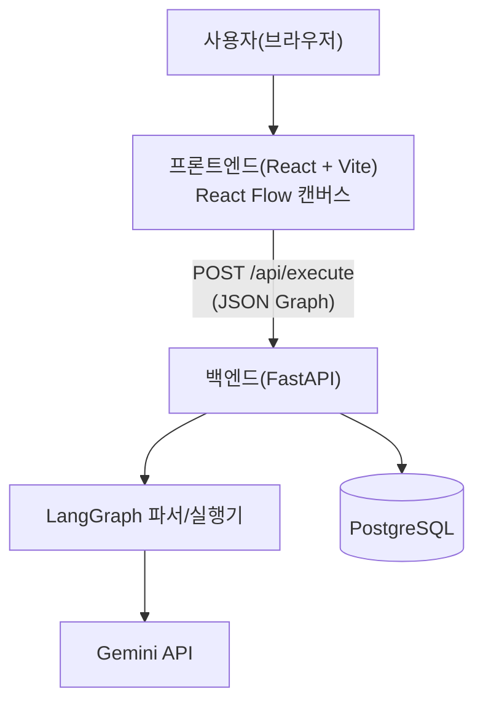
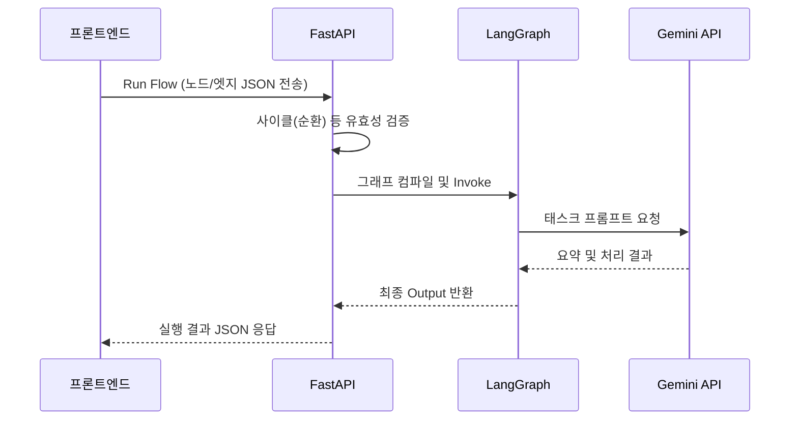

# TDD — 업무자동화 비주얼화 (Pilot)

<aside>
📙

**이 문서는 업무자동화 비주얼화 도구 파일럿 프로젝트의 기술 설계 문서입니다.**

</aside>

---

## 문서 정보

| 상태 | Draft · v1.0 |
| --- | --- |
| 작성자 / 오너 | 김춘식 (아키텍트) |
| 관련 문서 | PRD · 기능정의서 · ADR |
| 최종 수정 | 2026-07-10 |

## 1. 개요 & 범위

- **대상**: 비즈니스 자동화 워크플로우 시각화 및 실행 파일럿 툴.
- **다루는 것**: 프론트-백엔드 간 통신 아키텍처, LangGraph 연동 방식, 데이터 스키마 초안.
- **안 다루는 것(비목표)**: 복잡한 인증/인가(OAuth 등), 분산 처리 환경, 모바일 환경 대응.

## 2. 설계 목표 & 제약

- **목표**: ①JSON 기반의 유연한 그래프 데이터 파싱 ②LangGraph를 이용한 AI 워크플로우 맵핑 ③PostgreSQL을 활용한 기초 확장성 확보.
- **제약**: Python 3.10+, FastAPI 환경, 외부 API(Gemini) 의존.

## 3. 시스템 아키텍처

| 컴포넌트 | 책임 |
| --- | --- |
| 프론트엔드 (React Flow) | 노드 조작, 그래프 상태 관리, 실행 API 호출 |
| 백엔드 API (FastAPI) | 라우팅, 그래프 검증, LangGraph 구동 |
| LangGraph 모듈 | JSON 그래프를 LangGraph Node/Edge로 변환 후 실행 |
| PostgreSQL | 실행 이력 및 메타데이터 저장(향후 고도화용) |

## 4. 핵심 흐름 (Sequence — 워크플로우 실행)

## 5. 데이터 모델 (DB 초안)

| 엔티티 | 주요 필드 | 비고 |
| --- | --- | --- |
| Workflow | id, name, graph_data(JSONB), created_at | 생성된 그래프 메타 정보 |
| ExecutionLog| id, workflow_id, status, result, executed_at | 실행 이력 추적용 |

## 6. 인터페이스 / API (초안)

| 엔드포인트 | 메서드 | 설명 |
| --- | --- | --- |
| `/api/execute` | POST | 캔버스의 노드/엣지 데이터를 받아 LangGraph 실행 후 결과 반환 |
| `/api/health` | GET | 백엔드 서버 상태 체크 |

## 7. 기술 스택 & 선택 근거

| 레이어 | 선택 | 주요 대안 | 근거 요약 | ADR |
| --- | --- | --- | --- | --- |
| Frontend | React + Vite | Next.js | 빠른 SPA 파일럿 구축 | ADR-0002 |
| Node UI | React Flow | JointJS | React 생태계 통합 및 레퍼런스 풍부 | ADR-0002 |
| Backend | FastAPI | Django, Flask | 비동기 지원, Pydantic 검증 | - |
| AI Agent | LangGraph | 순수 LangChain | 노드 기반 상태 전이 표현에 최적화 | ADR-0001 |
| LLM | Gemini API | OpenAI API | 파일럿 환경에서의 접근성 및 테스트 용이성 | ADR-0003 |

## 8. 횡단 관심사

- **보안**: Gemini API Key 환경변수(`.env`) 격리.
- **성능**: LangGraph 실행 시 타임아웃(Timeout) 설정으로 무한 대기 방지.
- **에러 핸들링**: Gemini API 호출 실패 시 FastAPI 커스텀 Exception Handler를 통해 명확한 500 에러 및 메시지 프론트에 전달.

## 9. AI 파이프라인 설계

- **LangGraph 매핑**: 프론트엔드의 `Start` 노드는 LangGraph의 `entry_point`, `Task` 노드는 일반 `node`, 화살표는 `edge`로 1:1 매핑.
- **프롬프트 구성**: 각 Task 노드 실행 시 이전 노드의 결과(State)를 넘겨받아 체인 형태로 Gemini에게 컨텍스트를 전달.

## 10. 대안 & 트레이드오프

| 주제 | 택한 것 | 포기한 것 / 트레이드오프 |
| --- | --- | --- |
| 그래프 실행 로직 | LangGraph | 자체 DAG 스케줄러 (유지보수 부담 감소 대신 라이브러리 학습 곡선 감수) |

## 11. 리스크 & 미해결

<aside>
⚠️

- **동적 그래프 변환 복잡도**: React Flow의 JSON을 동적인 Python LangGraph로 런타임에 빌드하는 로직이 복잡할 수 있음. → 노드 타입을 제한하여 단순화 접근.

</aside>

## 12. 배포 & 롤아웃

- **로컬 실행**: 파일럿 단계이므로 `npm run dev` 및 `uvicorn`을 통한 로컬 검증 최우선.
- **향후**: Docker Compose를 활용하여 FE, BE, DB를 한 번에 띄우는 환경 구성.

## 13. 관련 ADR

- ADR-0001 워크플로우 엔진: LangGraph 채택
- ADR-0002 프론트엔드 UI: React Flow 채택
- ADR-0003 LLM 제공: Gemini API 채택