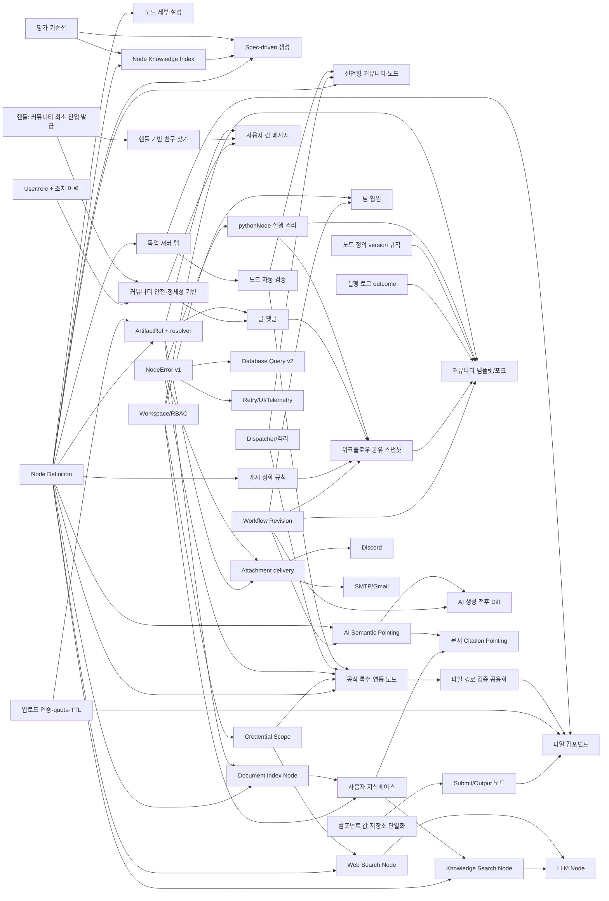

# 장기 제품 로드맵: 협업, 생태계, 생성 품질

## 문서 정보

| 항목 | 내용 |
| --- | --- |
| 상태 | 제안안 v1.9 |
| 작성일 | 2026-08-26 |
| 최근 갱신 | 2026-08-30 |
| 대상 | Workflow Automation 제품, App Builder, 생성/평가 시스템 |
| 전제 | 팀 규모와 목표 출시일은 미정이며, 기간은 확정 일정이 아니라 1명의 숙련된 풀스택 개발자를 기준으로 한 상대 추정치다. |
| 관련 문서 | `LLM_GENERATION_QUALITY_PLAN.md`, `LOCAL_LLM_RUNBOOK.md`, `INCOMPLETE_NODE_STRUCTURE_REVIEW.md`, `KOREAN_SERVICE_NODE_EXPANSION_PLAN.md`, `docs/reports/security_assessment.md` |

## 1. 결론 요약

제안된 기능은 모두 가치가 있지만 서로 독립적이지 않다. 다음 두 기반을 먼저 만들면 이후 기능의 중복 구현과 데이터 마이그레이션을 크게 줄일 수 있다.

1. **통합 Node Definition**
   - 노드 필드, 기본값, 조건부 표시, 입출력, 자격 증명, 권한, 검증, mock 계약과 버전을 하나의 스키마로 관리한다.
   - 노드 세부 설정, LLM 노드 지식, 커뮤니티 노드, 목업 서버가 같은 정의를 사용한다.

2. **워크플로 버전과 소유권 모델**
   - `Project.graph_data`를 바로 덮어쓰지 않고 revision을 남긴다.
   - 팀 동시 편집의 충돌 처리, 커뮤니티 템플릿 포크 계보, AI 생성 전후 비교가 같은 revision 모델을 사용한다.

추천 방향은 다음과 같다.

| 제안 | 판단 | 우선 범위 |
| --- | --- | --- |
| 1. 팀 단위 작업 | 채택 | 비동기 협업과 RBAC부터 시작하고 실시간 공동 편집은 나중에 추가 |
| 2. 커뮤니티와 커뮤니티 노드 | 조건부 채택 — 재정렬 | **기본 커뮤니티(글·댓글·워크플로우 공유) → 템플릿 → 선언형 노드 → 격리된 실행형 노드** 순서. 마켓플레이스는 사람이 이미 모여 있을 때 성립한다(§4.12) |
| 3. 노드 세부 설정 | 최우선 채택 | 통합 스키마와 우측 Inspector 패널을 먼저 구축 |
| 4. 다중 API spec-driven 생성 | 채택 | 무조건 병렬 호출이 아닌 복잡도 기반 adaptive fan-out 적용 |
| 5. 튜토리얼 | 즉시 고도화 | 현재 정적 오버레이를 과업 완료형 온보딩으로 전환 |
| 6. 목업 서버 탭 | 채택 | 기존 Express mock 서버를 유지하고 제품 UI에서 제어하는 방식 |
| 7. 공식 특수·연동 노드 확장 | 단계적 채택 | Node Definition 기반 Hybrid Node RAG → YouTube vertical slice → 사용자 지식베이스·인터넷 검색 → 업무·AI·미디어 연동 순서 |
| 8. App Builder 실행 모델과 파일 입력 | 채택 | 컴포넌트 값 저장소 단일화 → Submit/Output 노드 → 업로드 인증 → 파일 컴포넌트 순서 |
| 9. Database Query 실작동 복구 | 최우선 보완 — 완료 | PostgreSQL vertical slice 완료(ADR-0017): 명명된 credential → AST 판별 → 바인드 파라미터 → 구조화 결과. MySQL·pool hardening(DB-4)만 남음 |
| 10. Discord·Email 파일 전송 | 최우선 보완 | 공통 Artifact resolver → Discord → SMTP/Gmail 순서. 서버 경로 문자열 추측은 제거 |
| 11. 제품 공통 오류 코드 | 선행 기반 — 완료 | NodeError v1과 중앙 catalog 완료(ADR-0016). Database·Discord·SMTP·HTTP·connector 노드 이전 완료, 나머지 노드는 legacy adapter 위에서 점진 이전 |
| 12. 커뮤니티 기본 기능 | 채택 — 다음 차례 | **질문·답변(Q&A) 중심**으로 확정(§9-9). 안전·정체성 기반 → 질문·답변·채택 → 워크플로우 공유 순서. 실행 오류에서 질문으로 이어지고, 공유는 복사가 아니라 정화된 스냅샷이다(§4.12) |
| 13. 사용자 간 메시지 | 채택 — 커뮤니티 기반 위 | **친구 한정**으로 확정(§9-11). 요청함이 빠져 범위가 작아졌다. SSE 전달, 차단·신고가 먼저 없으면 열지 않는다(§4.13) |
| 14. 사용자 지식베이스·인터넷 검색 노드 | 최우선 노드 확장 | `documentIndexNode`로 정적 문서를 변경 시 한 번만 색인하고 `knowledgeSearchNode`로 실행마다 관련 근거만 조회한다. `webSearchNode`는 최신 인터넷 검색을 별도 경로로 제공한다(§4.7) |
| 15. AI 챗봇 시맨틱 포인팅 | 채택 — 제작 경험 우선 | 노드·컴포넌트·메시지·문서 인용을 실제 ID로 AI 요청에 고정하고 기본 수정 범위를 선택 대상으로 제한한다. 화면 좌표/스크린샷 기반 포인팅은 시맨틱 계약이 안정된 뒤 추가한다(§4.18) |

## 2. 현재 제품 기준선

### 이미 존재하는 기반

- 프로젝트는 `Project.user_id`를 단일 소유자로 가지며 `private`, `friends`, `public` 공개 범위를 지원한다.
- 친구 관계, 공개 프로젝트 목록, 공개 프로젝트 복사 기능이 있어 가벼운 공유와 템플릿 탐색은 가능하다.
- 개인 템플릿은 브라우저 `localStorage`에 저장되고, 서버의 공개 프로젝트와는 별도 체계다.
- 프론트엔드에는 약 30개의 하드코딩 노드와 5개의 schema-like 동적 노드가 공존한다.
- 백엔드 `NodeRegistry`는 실행 코드 생성 함수만 보유하며 UI 필드나 권한 메타데이터를 모른다.
- 메인과 에디터에는 1회성 `TutorialOverlay`가 있으며 설정에서 다시 실행할 수 있다.
- `mock_server/`에는 네이버 주문, 카카오 알림톡, 결제 시나리오를 흉내 내는 Express 서버가 있다.
- 생성 요청은 브라우저에서는 한 번의 API 요청이지만, 백엔드에서는 이미 TaskSpec 정규화, 에이전트 생성, 선택적 repair와 평가를 위해 여러 LLM 호출이 발생할 수 있다.
- TaskSpec과 RAG 문맥 검색은 이미 `asyncio.gather()`로 병렬 처리한다. 따라서 4번의 목표는 단순한 “다중 호출 도입”이 아니라 호출 그래프와 품질 예산을 명시적으로 관리하는 것이다.
- ChromaDB는 번역 템플릿, n8n 원본 템플릿과 프로젝트 문서 검색에 사용되지만, 지원 노드 정의를 찾는 Node RAG에는 아직 사용되지 않는다.
- `/api/chat/upload_context`는 PDF·문서를 프로젝트별 Chroma 컬렉션에 색인하지만 워크플로 생성 대화에만 주입된다. 배포된 Workflow가 조회할 수 있는 지식베이스 resource와 `documentIndexNode`/`knowledgeSearchNode`는 없다.
- `tokenizerNode`는 실행할 때마다 파일을 다시 읽고, `llmNode.useMemory`는 세션 대화 이력만 저장한다. 둘 다 정적 문서를 한 번 색인해 재사용하는 장기 지식 메모리가 아니다.
- 인터넷 검색은 생성 에이전트 내부의 `web_search` 도구와 알려진 URL을 읽는 `webCrawlerNode`만 있다. 캔버스에서 실행 가능한 검색 전용 `webSearchNode`는 없다.
- 워크플로우 에디터에는 노드 선택과 `focusNodeById()`가 있고 App Builder도 선택한 컴포넌트 ID를 관리하지만, AI 요청은 선택 대상을 구분하지 않고 전체 `graph_data`/`current_state`를 보낸다. 공통 `AIAssistantDrawer`에는 대상 칩, 수정 범위, 포인팅 해제 UI가 없다.

### 먼저 보완해야 하는 공통 기반

- Alembic 기반 DB migration 체계
- 워크플로 revision과 optimistic concurrency
- workspace 기반 tenant/RBAC 테스트
- 통합 Node Definition과 graph schema version
- 실행 코드의 `exec()` 제거 또는 강한 프로세스 격리
- 기능별 사용 이벤트와 funnel 측정
- API 키가 템플릿, 포크, revision에 복사되지 않는 credential reference 모델

## 3. 평가 기준

점수는 1~5이며 높을수록 유리하다. 난이도는 별도로 S, M, L, XL로 표시한다.

| 항목 | 사용자 가치 | 전략 기반성 | 현재 준비도 | 위험 통제 용이성 | 예상 난이도 |
| --- | ---: | ---: | ---: | ---: | --- |
| 노드 세부 설정 | 5 | 5 | 4 | 4 | L |
| 과업형 튜토리얼 | 4 | 3 | 5 | 5 | S~M |
| 목업 서버 탭 | 4 | 4 | 4 | 3 | M |
| Adaptive spec-driven 생성 | 5 | 5 | 4 | 3 | L |
| 팀 단위 작업 | 5 | 5 | 2 | 3 | XL |
| 커뮤니티 템플릿 | 4 | 4 | 3 | 4 | M |
| 선언형 커뮤니티 노드 | 4 | 5 | 2 | 3 | L~XL |
| 임의 코드 커뮤니티 노드 | 4 | 5 | 1 | 1 | XL 이상 |
| 공식 특수·연동 노드 | 5 | 5 | 3 | 3 | L, 노드별 S~M |
| 사용자 지식베이스·인터넷 검색 노드 | 5 | 5 | 3 | 3 | L |
| AI 챗봇 시맨틱 포인팅 | 5 | 4 | 4 | 4 | M |

난이도 해석:

- S: 약 1~2인주
- M: 약 3~6인주
- L: 약 6~10인주
- XL: 약 10인주 이상 또는 별도 프로젝트

## 4. 항목별 평가

### 4.1 팀 단위 작업

#### 판단

**채택하되, Notion식 실시간 공동 편집부터 시작하지 않는다.** 먼저 workspace, 역할, revision, audit log가 있는 비동기 협업을 완성해야 한다.

#### 사용자 가치

- 한 사람이 만든 자동화를 조직 자산으로 전환할 수 있다.
- 담당자 퇴사나 계정 삭제로 워크플로가 사라지는 문제를 줄인다.
- 제작자, 검토자, 실행 담당자의 역할을 나눌 수 있다.
- 팀 단위 결제, 사용량 제한, 관리자 기능으로 확장할 기반이 된다.

#### 현재 구조와의 차이

현재 친구 공개는 “누가 볼 수 있는가”만 표현하고 “누가 편집, 실행, 배포, 공유, 삭제할 수 있는가”는 표현하지 못한다. `Project.user_id` 단일 소유 구조도 팀 자산을 담기 어렵다. 친구 관계를 팀 권한으로 재사용하면 권한 의미가 섞이므로 별도 workspace 모델을 만들어야 한다.

#### 구현 진행 상황 (2026-08-28)

ProjectRevision과 Alembic을 도입했다(ADR-0006, 우선 백로그 2번). 팀 기능 자체가 아니라,
팀·포크·AI diff가 모두 전제하는 "변경 이력이 남는다"를 먼저 만든 것이다.

- 스키마 변경은 Alembic 마이그레이션으로만 한다. `0001_baseline` 이 도입 직전 스키마이고,
  규칙은 `backend/migrations/README` 에 적었다. 기존 `create_all` DB는 시작 시
  `db_migrate.ensure_schema()` 가 기준선으로 stamp 한 뒤 인계받는다.
- 저장할 때마다 `project_revisions` 에 그래프 스냅샷을 남긴다. 직전과 내용이 같으면
  남기지 않는다. 되돌리기도 새 revision 으로 남아 이력이 잘리지 않는다.
- `Project.current_revision` 이 낙관적 동시성 토큰이다. 클라이언트가 편집을 시작한 시점의
  값을 `base_revision` 으로 보내고, 그 사이 바뀌었으면 덮어쓰지 않고 409로 돌려보낸다.
  409 본문에 "내가 시작한 뒤 서버에서 바뀐 것"과 "내가 바꾼 것"을 노드/엣지 diff로 담아
  에디터가 사용자에게 무엇이 충돌했는지 보여주고 덮어쓸지 묻는다.
- 마이그레이션이 기존 프로젝트의 현재 그래프를 revision 1로 백필하므로, 도입 직후부터
  모든 프로젝트가 되돌릴 수 있는 지점을 갖는다.
- 이력 조회·스냅샷 조회·두 시점 diff·되돌리기 엔드포인트를 추가했다(소유자만 접근).

이로써 Phase 0의 완료 조건 두 가지를 모두 만족한다 — 3개 노드가 같은 정의로 UI·validator·
LLM catalog를 생성하고(§4.3), 저장 충돌이 덮어쓰기가 아니라 409와 diff 가능한 revision으로
남는다.

아직 남은 범위는 revision 보관 정책(오래된 스냅샷 정리), 에디터의 버전 이력 UI(현재는 충돌
시 안내와 덮어쓰기 선택까지만 있고 이력 화면은 API만 있다), 그리고 Workspace/RBAC 기반의
실제 팀 기능이다. `is_live` 토글처럼 편집이 아닌 상태 변경은 revision 을 만들지 않는다.

#### 권장 데이터 모델

```text
Workspace
  id, name, slug, owner_id, plan, created_at

WorkspaceMember
  workspace_id, user_id, role, status, joined_at

Project
  workspace_id, created_by, current_revision_id

ProjectRevision
  project_id, revision_no, graph_data, base_revision_no,
  created_by, change_source(manual|ai|import), created_at

AuditEvent
  workspace_id, actor_id, action, resource_type, resource_id, metadata

CredentialBinding
  workspace_id, provider, credential_id, allowed_project_ids, access_policy
```

권장 역할은 `owner`, `admin`, `editor`, `runner`, `viewer`다. 외부 협력자를 위한 guest는 기본 권한 체계가 안정된 뒤 추가한다.

#### 단계별 범위

**Team MVP**

- workspace 생성, 초대, 탈퇴
- 역할별 프로젝트 조회/편집/실행/배포 권한
- 프로젝트를 개인 영역과 workspace 사이에서 이동
- revision 생성, 변경 이력, 이전 버전 복원
- API 키 원문을 노출하지 않는 workspace credential binding
- 서버에서 모든 권한을 검증하는 tenant isolation 테스트

**협업 v2**

- 노드 단위 댓글, 멘션, 검토 요청
- 현재 편집자 presence와 읽기 전용 표시
- 저장 충돌 감지와 변경 diff
- 승인 후 배포, 운영/개발 버전 분리

**실시간 공동 편집**

- WebSocket presence
- CRDT 또는 operation log 기반 노드/엣지 동기화
- 같은 노드 필드 동시 수정에 대한 충돌 UX
- 연결이 끊긴 클라이언트의 재동기화

#### 주요 위험

- 프론트엔드에서만 버튼을 숨기는 권한 처리는 보안 경계가 아니다.
- workspace credential을 모든 editor가 사용할 수 있게 하면 권한 상승 경로가 생긴다.
- 실시간 편집을 revision보다 먼저 도입하면 데이터 손실과 복원 문제가 복잡해진다.
- 계정 삭제 시 개인 소유 프로젝트와 팀 소유 프로젝트의 보존 정책을 분리해야 한다.

#### 성공 지표

- 초대 후 첫 공동 프로젝트 편집 완료율
- 팀 프로젝트의 7일/30일 재방문율
- revision 복원 성공률과 저장 충돌률
- 권한 거부 오류 중 실제 정책 오류 비율
- 팀 프로젝트당 활성 편집자 수

### 4.2 커뮤니티 기능과 커뮤니티 노드

#### 판단

**템플릿 커뮤니티는 가까운 단계에서 채택하고, 임의 코드 노드는 가장 마지막에 둔다.** 커뮤니티 템플릿과 커뮤니티 노드는 보안 위험이 완전히 다른 제품이므로 별도 트랙으로 운영한다.

> **2026-08-29 재정렬.** 이 절은 "남이 만든 실행물을 내 계정에서 돌린다"는 무거운 계약(템플릿·노드)만
> 다뤘고, 정작 사람이 모이는 표면 — 글·댓글·워크플로우 공유 — 이 빠져 있었다. 그 기본 기능은
> **§4.12**로 분리해 먼저 만들고, 사용자 간 메시지는 **§4.13**으로 함께 계획한다. 아래 트랙 A
> (`PublishedTemplate`)는 그 위에서 **"검증된 공유를 불변 버전으로 승격"**하는 기능으로 재정의한다 —
> 게시는 가볍고 템플릿은 버전을 보증해야 하므로 한 엔티티로 합치지 않는다. 트랙 B·C의 판단은 그대로다.

#### 현재 활용 가능한 기반

- `public` 프로젝트 목록과 가져오기 기능이 이미 있다.
- 가져오기는 원본 프로젝트를 사본으로 만들지만 원본 revision, 버전, 작성자 계보를 보존하지 않는다.
- 검색은 제목, 설명, 작성자 문자열 수준이다.
- 평점, 태그, 호환 버전, 신고, 검수, 사용 통계가 없다.

#### 트랙 A: 커뮤니티 템플릿

> **2026-08-29: 상세 계획은 §4.14로 옮겼다.** 아래 엔티티 목록은 §4.12(커뮤니티 기본)가 없던 시점에
> 쓰인 것이라 스냅샷·정화·신고·가져오기를 템플릿이 직접 소유하는 모양이다. 그 넷은 이제 §4.12에 있고,
> 템플릿은 **버전·호환성·설치 계보·승격 심사**만 얹는다. 아래는 최초 구상 기록으로 남긴다.

먼저 다음 엔티티를 도입한다.

```text
PublishedTemplate
  id, source_project_id, source_revision_id, author_id,
  title, description, category, tags, graph_schema_version,
  status(draft|review|published|suspended), published_at

TemplateVersion
  template_id, semantic_version, graph_data, changelog,
  required_node_versions, required_credentials

TemplateFork
  template_version_id, imported_project_id, imported_by

TemplateReview / TemplateReport
  rating, comment, reason, moderation_status
```

MVP 기능:

- 카테고리, 태그, 필요한 자격 증명, 예상 비용과 위험 노드 표시
- 특정 revision을 불변 템플릿 버전으로 발행
- 가져오기 시 credential 값, 사용자 파일 경로, webhook secret 제거
- 설치 수가 아니라 “가져오기 후 첫 실행 성공”과 “7일 유지”를 품질 신호로 사용
- 신고, 비공개 전환, 관리자 검수

#### 트랙 B: 선언형 커뮤니티 노드

임의 코드를 서버에 설치하지 않고 다음만 선언하게 한다.

- HTTP method와 URL template
- 허용 도메인 목록
- 입력/출력 JSON Schema
- credential 종류와 주입 위치
- retry, timeout, pagination, rate-limit 규칙
- UI field schema와 조건부 표시
- mock request/response 사례
- 권한 manifest: network, credential, file, side effect

서버는 검증된 공통 HTTP executor로 이 manifest를 실행한다. 이 방식은 Slack과 Google Sheets처럼 API 기반 연동의 상당 부분을 커버하면서 공급망 위험을 제한한다.

#### 트랙 C: 실행형 커뮤니티 노드

다음 조건을 모두 충족하기 전에는 도입하지 않는다.

- `exec()` 제거와 공식 노드 dispatcher 전환 완료
- node package 서명, 버전 고정, dependency lock과 취약점 검사
- 별도 worker/container, read-only filesystem, egress allowlist
- CPU, 메모리, 실행 시간과 출력 크기 quota
- secret broker를 통한 최소 범위 credential 전달
- 게시 전 자동 테스트와 수동 검수
- 긴급 blocklist와 kill switch

n8n도 커뮤니티/커스텀 노드를 보안 감사의 위험 항목으로 분류하고, verified와 unverified 설치 범위를 구분한다. 이 프로젝트는 처음부터 “검증됨”을 별도 신뢰 등급으로 취급해야 한다.

#### 성공 지표

- 템플릿 검색 후 가져오기 전환율
- 가져온 템플릿의 첫 실행 성공률
- 7일 후 남아 있는 fork 비율
- 노드/템플릿 버전 업그레이드 성공률
- 신고율, 검수 소요 시간, 보안 차단 건수

### 4.3 노드의 세부 설정

#### 판단

**공통 기반 가운데 가장 먼저 구조적으로 투자할 기능이다.** 단순히 입력란을 더 추가하는 작업이 아니라, 노드 정의를 단일 소스로 만드는 작업으로 진행한다.

#### 현재 문제

- 대부분의 설정 UI가 `customNodes.jsx` 안에 노드별 JSX로 직접 작성되어 있다.
- 프론트엔드 동적 registry는 일부 노드만 `fields`를 선언한다.
- 백엔드 registry는 코드 생성 함수만 알고 프론트엔드 필드 정의를 모른다.
- LLM 카탈로그, 프론트 UI, validator, executor의 기본값이 서로 달라질 수 있다.
- 많은 입력 폼이 캔버스 노드 안에 들어가 있어 복잡한 설정을 표현할수록 노드 크기와 배치가 불안정해진다.

#### 구현 진행 상황 (2026-08-28)

Node Definition v1의 첫 vertical slice를 구현했다(ADR-0005, 우선 백로그 1번).

- 저장소 루트 `node_definitions/<type>.json` 을 노드 정의의 정본으로 삼았다.
- `httpRequestNode`, `llmNode`, `conditionNode` 3종을 정의 파일로 이전했다.
- 세 소비자가 같은 정의를 읽는다 — 에디터 필드 렌더러(`DefinitionFields`),
  서버 validator(`backend/node_definition.py`), LLM 노드 카탈로그(`NODE_CATALOG`).
- 모델·연산자·HTTP 메서드 허용값이 정의의 select `options` 에서 파생되므로,
  에디터 드롭다운과 검증 통과값이 어긋날 수 없다.
- 프론트엔드 번들은 `python backend/export_node_definitions.py` 가 만들고,
  정의와 어긋나면 테스트가 실패한다. `GET /api/node-definitions` 로도 노출한다.
- 이전 조건으로 LLM 카탈로그 원문(24,376자)의 바이트 동등성과 검증 오류 메시지의
  문구 동등성을 요구했다 — 생성 품질과 repair 로직이 이 문구에 의존하기 때문이다.

정의 스키마에는 `mock`, `capabilities`, `sideEffect`, `credentials` 슬롯을 미리 두었다.
`mock` 은 Mock 탭 vertical slice(백로그 7)에서 채운다.

#### 구현 진행 상황 (2026-08-28, 백로그 9번)

주요 10종을 추가 이전해 정의 기반 노드가 15종이 됐다(기존 3종 + 연동 2종 + 신규 10종):
email, slack, schedule, jsonParser, delay, templateAnalyzer, fileModifier, posterGenerator,
humanApproval, database.

- **이전 조건 유지**: LLM 카탈로그 바이트 동등성(자리표시자 치환을 접두사 보존 방식으로
  바꿔 15자 초과 노드명의 패딩까지 원문 그대로), 검증 오류 메시지 문구 동등성.
- **규칙 DSL 확장**: `when.equals`(jsonParser의 "mode가 extract일 때 extractKey 필수"),
  `number` 규칙(delay의 숫자·최소값 검사) — 계획된 필드 항목(min/max, 조건부)의 일부.
- **하이브리드 검증**: databaseNode의 SQL 가드(세미콜론 분해 + SELECT/WITH 강제)는 DSL로
  표현할 수 없어, 정의 검증 후 잔여 하드코딩 분기로 이어지는 구조를 공식화했다(테스트에
  예외로 문서화). 나머지 9종은 분기를 완전히 제거했다.
- **프론트**: email/jsonParser/delay/humanApproval/database 컴포넌트가 `DefinitionFields`로
  전환됐고, 레지스트리 기반 노드(slack, posterGenerator)는 `DynamicNode`가 정의를 우선
  사용한다. schedule(크론 빌더)·templateAnalyzer/fileModifier(파일 업로드)는 전용 UI를
  유지하되 검증·카탈로그는 정의에서 온다.
- **부수 효과**: `ALLOWED_JSON_PARSER_MODES`가 정의에서 파생되고, node_knowledge(백로그
  5번)의 색인 metadata가 10종에 대해 보조 표 대신 정의를 읽는다.

남은 이전 대상은 약 24종(messaging 트리오 discord/telegram/kakao의 형식 검증은 regex 규칙
추가가 필요)과 우측 Inspector 패널, node version migration이다.

아직 남은 범위는 우측 Inspector 패널(`Parameters`/`Input`/`Output`/`Logs` 탭), repeatable
필드의 일반 렌더링(현재 `conditionNode` 의 `rules` 는 분기 Handle과 묶여 있어 UI만 노드가
직접 그린다), expression·data mapping, `Test step`, 나머지 30여 종 노드의 이전과
기존 graph data의 node version migration이다. 이전하지 않은 노드는 예전 방식
(`nodeRegistry.js` + `_validate_node_data` 하드코딩 분기)으로 계속 동작한다.

#### 목표 구조

```json
{
  "type": "httpRequestNode",
  "version": 2,
  "category": "integration",
  "display": {"label": "HTTP Request", "icon": "arrow-left-right"},
  "inputs": [{"name": "main", "dataType": "json"}],
  "outputs": [{"name": "success", "dataType": "json"}],
  "fields": [],
  "credentials": [],
  "validation": {},
  "capabilities": ["network"],
  "sideEffect": "external-write",
  "mock": {},
  "executor": "http_request_v2"
}
```

필드 정의가 지원해야 할 항목:

- text, textarea, number, select, checkbox, secret reference, JSON, code, file
- required, default, min/max, regex, enum
- 다른 필드 값에 따른 조건부 표시
- 기본/고급 섹션과 반복 가능한 key-value 목록
- expression과 이전 노드 출력 data mapping
- inline validation과 실행 전 validation
- 예시, 문서 링크, deprecation과 migration

#### UX 권장안

- 캔버스 노드는 상태와 핵심 요약만 표시한다.
- 선택한 노드의 전체 설정은 우측 Inspector 패널에서 편집한다.
- Inspector에는 `Parameters`, `Input`, `Output`, `Logs` 탭을 둔다.
- 이전 실행 데이터를 필드로 끌어 놓으면 expression을 만든다.
- `Test step`은 해당 노드만 mock 또는 제한 실행하고 출력 schema를 갱신한다.
- secret은 값이 아니라 API Center credential reference만 선택한다.

#### 구현 순서

1. `NodeDefinition` 스키마와 버전 규칙 확정
2. 기존 노드 3종으로 vertical slice: HTTP Request, LLM, Condition
3. 서버 validator와 프론트 Inspector가 같은 정의를 사용
4. LLM 프롬프트의 node catalog를 같은 정의에서 생성
5. 기존 노드를 위험도와 사용량 순서로 이전
6. 기존 graph data를 node version에 맞춰 migrate

#### 성공 지표

- 필수 설정 누락으로 인한 실행 실패율
- 노드 설정 완료 시간
- 생성 그래프의 field validation 첫 통과율
- 노드 정의 변경 시 수정해야 하는 파일 수
- `customNodes.jsx` 노드별 중복 코드 감소율

### 4.4 여러 API 호출을 이용한 spec-driven 생성

#### 판단

**채택하되, 모든 요청에 여러 후보를 병렬 생성하지 않는다.** 간단한 요청은 한 번에 처리하고 어려운 요청만 fan-out하는 adaptive orchestration이 비용과 속도의 균형이 좋다.

#### 현재 구조에 대한 정정

브라우저는 `/api/chat`을 한 번 호출하지만 서버 내부는 이미 다음 작업을 수행한다.

- TaskSpec 정규화
- RAG 문맥 검색과 TaskSpec의 병렬 처리
- 상위 agent의 생성 또는 편집 tool 호출
- 결정론적 구조/의도 검증
- 필요한 경우 부분 repair
- 정밀 모드에서 선택적 평가와 재생성

따라서 목표는 호출 횟수를 늘리는 것이 아니라 **각 호출의 입력/출력 계약, 의존성, 예산과 선택 기준을 명시하는 것**이다.

#### 권장 생성 DAG

```text
Request
  -> TaskSpec normalizer
  -> Context/Node selector
  -> GenerationPlan
       -> simple: graph candidate 1개
       -> complex: planner 후보 2개 또는 subgraph 병렬 생성
  -> deterministic validators (병렬 가능)
  -> candidate ranker
  -> targeted repair (실패 부분만)
  -> dry-run
  -> final graph + trace
```

`GenerationPlan`에는 다음이 들어가야 한다.

```text
complexity, risk_level, required_integrations, selected_node_types,
candidate_count, parallelizable_subtasks, provider_route,
token_budget, latency_budget_ms, repair_budget, evaluation_policy
```

#### 병렬화할 작업

- RAG 문맥 검색과 TaskSpec 정규화
- 서로 독립적인 integration schema 조회
- 복잡한 워크플로의 독립 subgraph 초안
- 완성된 candidate에 대한 구조, 보안, credential, 의도 validator
- 서로 다른 candidate의 dry-run

#### 순차 처리할 작업

- TaskSpec이 필요한 graph generation
- graph가 필요한 validation
- validation 오류가 필요한 targeted repair
- 모든 결과가 필요한 candidate selection
- 최종 선택이 필요한 저장과 trace adoption

#### adaptive fan-out 정책

| 요청 유형 | 후보 수 | 평가 |
| --- | ---: | --- |
| 단순 선형, 저위험 | 1 | schema + structural validator |
| 조건/반복/2개 이상 연동 | 2 | validator + dry-run |
| 결제/삭제/외부 게시 | 2 | 독립 policy check + 사용자 승인 요구 |
| 기존 그래프 일부 수정 | 1 | 변경 범위 validator + regression dry-run |

#### 로컬 LLM 고려사항

RTX 5070 Ti 16GB에서 단일 모델 서버가 여러 요청을 동시에 받으면 VRAM 경쟁과 KV cache 증가 때문에 병렬 호출이 오히려 느려질 수 있다. 로컬 경로에서는 다음을 우선한다.

- 작은 모델의 TaskSpec과 큰 모델의 graph generation을 역할 분리
- 모델 서버의 batching 지원 확인
- bounded concurrency와 queue
- hosted provider에서만 제한적 parallel candidate 사용
- 동일 spec/context 결과 cache
- 첫 유효 candidate가 기준을 넘으면 남은 요청 취소

#### 품질 선택 기준

LLM judge 하나로 고르지 않는다. 다음 순서로 점수를 만든다.

1. schema와 보안 위반은 즉시 탈락
2. structural, task coverage, credential completeness 점수
3. dry-run 성공과 side-effect 안전성
4. 수정 횟수와 graph 복잡도 penalty
5. 동점일 때만 의미 평가 또는 judge 사용

#### 구현 진행 상황 (2026-08-28, 우선 백로그 10번)

GenerationPlan과 adaptive candidate를 실험 모드로 구현했다(`backend/generation_plan.py`).

- **GenerationPlan**: 요청·TaskSpec에서 결정론적으로(LLM 호출 0회) 계획을 만든다 —
  complexity/risk/candidate_count/평가 정책이 위 adaptive 정책 표 그대로다. 기존 그래프
  수정은 항상 1개, 로컬 라우팅(local/hybrid)에서는 VRAM 경쟁 때문에 병렬 후보를 끈다.
- **adaptive fan-out**: `GENERATION_ADAPTIVE_CANDIDATES=1`일 때, 후보 2개가 계획되면 같은
  요청을 빠름(generate_flow)·정밀(generate_flow_precise) 두 관점으로 병렬 생성하고 LLM
  judge 없이 결정론 기준(schema/보안 탈락 → structural → task coverage → dry-run → 복잡도
  penalty)으로 고른다. 기본값은 꺼짐 — 아래 게이트를 통과해야 전환한다.
- **계측**: 계획과 후보별 점수·선택이 generation trace의 `generation_plan`(마이그레이션
  0006)에 항상 남는다(adaptive가 꺼져 있어도 계획은 기록 — 전환 판단 데이터).
- **비교 러너**: `generation_plan_eval.py`가 같은 평가 케이스를 두 모드로 돌려
  structural/dry-run 통과율·지연을 비교한다(캐시 비활성).
- **초기 검증**: smoke 3케이스는 두 모드 모두 만점(천장 효과 — 판별력 없음). 실측 사례에서
  판별이 실제로 동작함을 확인했다 — 조건 분기 요청에서 정밀 후보(7노드)가 dry-run에
  실패하자 랭커가 빠름 후보(6노드, 전부 통과)를 선택했다.
- 알려진 한계: 도구 내부 생성 호출의 토큰이 usage에 완전히 잡히지 않아 비용은 후보 수를
  근사 지표로 쓴다. "첫 유효 후보 기준 통과 시 남은 요청 취소"는 미구현(현재는 병렬 완료 후
  선택).

**게이트 판정 (2026-08-28, 판별 케이스 6개 × 2라운드)**: **미채택 — §8 중단 기준 적용,
후보 수 1 유지(validator/repair 중심).**

1차 비교에서 두 결함을 확인해 수정했다(회귀 테스트 포함):
- 랭커의 coverage가 구조 기대를 못 봄(반복 요청인데 loopNode 없는 정밀 후보 선택) →
  구조 기대 신호(`_STRUCTURE_SIGNALS`: 반복→loopNode, 각각→distributorNode, 승인→
  humanApprovalNode 등)를 커버리지 계층에 추가.
- 랭킹 시점(리페어 전)과 최종 상태 불일치 → 결정론 리페어(repair_disconnected_flow) 후
  랭킹으로 전환.

2차 비교에서 두 결함의 재발은 없었으나(케이스 6·29 정상), 게이트 지표는 여전히 미달:
dry-run 통과율 단일 83.3% vs adaptive 66.7%, 평균 지연 9.1s vs 14.4s(+58%). 남은 실패는
adaptive 고유 결함이 아니라 두 모드 공통의 생성 변동성이었다 — LLM이 pythonNode에 금지
구문(Try/Import)을 넣어 보안 검증에서 컴파일이 거부되는 사례가 단일 모드에서도 발생(케이스
26). n=6 단일 표본에서는 모드 간 차이가 라운드 간 변동보다 작다.

§8 중단 기준("P95가 개선되지 않으면 후보 수를 1로 되돌리고 validator/repair만 유지")에
따라 adaptive는 기본 꺼짐으로 확정한다. 인프라·계측·랭커는 유지 — 향후 후보 다양화 방법이
생기면(모델 다변화, 프롬프트 변주) 같은 러너로 재검증한다. 별도 발견: pythonNode 금지 구문
생성은 카탈로그 지침 보강 후보다(두 모드 공통 문제).
비교 원본: generation-plan-20260828T084253Z.json(1차) / -20260828T085102Z.json(2차),
총 관측 약 41.6만 토큰.

#### 성공 지표와 배포 게이트

- 첫 생성 structural pass rate
- 최종 dry-run pass rate
- 사용자 채택률과 edit distance
- accepted workflow당 토큰과 비용
- 전체 P50/P95 latency
- candidate cancellation rate
- repair/fallback rate

새 구조는 기존 평가 세트에서 단일 candidate 기준보다 채택률 또는 dry-run 통과율이 유의미하게 개선되고, accepted workflow당 비용 상한을 지킬 때만 기본값으로 전환한다.

### 4.5 튜토리얼

#### 판단

**새로운 튜토리얼을 처음부터 만들기보다 기존 오버레이를 과업형 onboarding으로 고도화한다.** 상대적으로 비용이 작고 신규 사용자의 첫 성공까지 시간을 줄일 수 있어 빠른 제품 학습에 적합하다.

#### 현재 상태

- 메인 화면 4단계와 에디터 5단계의 selector 기반 오버레이가 있다.
- 완료 여부는 브라우저 `localStorage`에만 저장된다.
- 사용자가 실제로 노드를 만들거나 실행하지 않아도 다음 버튼으로 완료할 수 있다.
- App Builder, API Center, 배포, mock과 실패 복구 과정은 다루지 않는다.

#### 구현 진행 상황 (2026-08-26)

과업형 onboarding MVP의 첫 vertical slice를 구현했다.

- 메인과 에디터에서 이어지는 5단계 시작 체크리스트
- 버전형 로컬 진행 상태와 설정 화면의 초기화 기능
- 그래프 생성, 노드 필드 변경, 실행/평가 성공, 저장 성공, 배포 선택 화면 열기를 실제 행동으로 감지
- 기존 selector 기반 화면 안내는 보조 튜토리얼로 유지
- 모바일에서는 체크리스트를 접힌 상태로 시작하고 사용자의 펼침 상태를 저장

아직 남은 범위는 sandbox 프로젝트, mock 기반 무비용 실행, 오류별 contextual help, 계정 기반 진행률 동기화, 분석 이벤트 수집이다. 현재 `workflow_tested`는 실제 실행 또는 평가 성공을 기준으로 하므로, mock 탭 vertical slice가 완성되면 첫 사용자에게 mock 실행을 우선 제안하도록 변경한다.

과업형 onboarding의 두 번째 vertical slice로 `/tutorial` 학습 센터를 추가했다. 기존 화면 오버레이를 재생할 수 있는 진입점은 유지하면서 다음 토큰 무비용 실습을 제공한다.

- 입력 → 처리 → 출력 데이터 흐름 애니메이션
- 팔레트 노드 배치와 Handle 기반 연결 실습
- 노드 필드 설정, 실행 상태와 로그 확인
- Condition, Loop, Webhook, Human Approval 시뮬레이션
- 실제 외부 요청이 없는 App Runner, Chatbot, API 배포 미리보기
- 과정별 실제 성공 조건, 버전형 로컬 진행률, 전체 초기화

따라서 남은 튜토리얼 범위는 실제 mock 서버 연동, 실패 복구 과정, 계정 기반 진행률 동기화와 분석 이벤트 수집이다.

#### 목표 경험

긴 기능 설명이 아니라 다음 실제 성공 과업을 완료하게 한다.

1. 예제 요청으로 워크플로 생성
2. 노드 하나 선택하고 필드 수정
3. dry-run 또는 mock 실행
4. 실행 결과와 로그 확인
5. 저장하고 배포 미리보기 열기

#### 기능 범위

- 홈의 “시작하기” 체크리스트
- 미리 준비된 sandbox 프로젝트와 mock credential
- 사용 행동을 감지해 자동 완료되는 단계
- 오류가 나면 해당 문제를 해결하는 contextual help
- 노드별 짧은 tooltip과 문서 링크
- 설정에서 과정별 재실행
- 계정 기반 진행률 저장과 버전 관리
- `first_graph_created`, `first_run_succeeded`, `first_deploy_previewed` 이벤트 측정

#### 피해야 할 방식

- 모든 버튼을 순서대로 소개하는 긴 제품 투어
- 사용자가 닫은 도움말을 반복 노출
- 실제 데이터나 API 키를 요구하는 첫 과업
- 성공 여부 없이 “완료”로 기록

#### 성공 지표

- 가입 후 첫 유효 그래프 생성까지 걸린 시간
- 첫 실행 성공률
- 튜토리얼 시작/완료/이탈 단계
- 7일 내 두 번째 워크플로 생성률
- 튜토리얼 완료자와 미완료자의 활성화율 차이

### 4.6 목업 서버 탭

#### 판단

**채택한다.** 현재 mock 서버를 없애고 메인 백엔드에 합치기보다 별도 서비스로 유지하며, 제품 안에 native control tab과 request inspector를 추가한다.

#### 현재 활용 가능한 기반

`mock_server/server.js`에 다음 시나리오가 이미 있다.

- 네이버 주문 webhook emitter
- 카카오 알림톡 action receiver
- 결제 링크와 가상 결제 화면
- 지연시간을 포함한 간단한 시연 UI

현재 구현은 시연용 하드코딩 화면이며 범용 mock 정의, 사용자 인증, project 격리, request history와 정교한 보안 정책은 없다.

#### 제품 탭의 역할

Editor의 `Mock` 탭에서 다음을 제공한다.

- 현재 workflow의 trigger/action 노드 자동 감지
- 관련 mock scenario 추천
- webhook payload 편집과 전송
- 수신 request의 headers/body/status/latency 확인
- 성공, 4xx, 5xx, timeout, rate-limit preset
- 저장된 scenario 재실행
- 실제 credential 없이 end-to-end dry-run
- mock 결과를 evaluation fixture로 저장

#### 권장 구조

```text
Frontend Mock Tab
  -> Main Backend auth/project authorization
  -> Mock Control API
     -> Scenario registry
     -> Webhook emitter
     -> Stub receiver
     -> Request log store with TTL
```

mock 실행 엔진은 별도 프로세스로 둔다. 메인 백엔드는 인증, 프로젝트 권한과 scenario 메타데이터를 관리하고 mock 서비스에는 단기 서명 토큰만 전달한다.

#### Node Definition과의 연결

각 노드가 다음 mock 계약을 제공하면 탭을 노드별로 하드코딩하지 않아도 된다.

```text
sample_inputs
expected_request_schema
sample_success_response
error_presets
webhook_event_schema
secret_redaction_paths
```

#### 필수 보안 조건

- 현재처럼 임의 `targetWebhookUrl`을 서버가 호출하게 두면 SSRF 경로가 될 수 있으므로 localhost/private/metadata IP 정책과 project webhook allowlist가 필요하다.
- wildcard CORS를 제거하고 사용자/프로젝트 인증을 적용한다.
- request log에서 Authorization, cookie, API key를 제거한다.
- payload, 응답, 보관 시간, 요청 횟수에 quota를 둔다.
- 실제 운영 credential을 mock 서버에 전달하지 않는다.

#### 구현 진행 상황 (2026-08-28)

Mock 탭 vertical slice 를 구현했다(ADR-0009, 우선 백로그 7번).

- 목업을 별도 서비스가 아니라 **실행 모드**로 만들었다. 커넥터 노드가 세션을 만들 때 실제
  transport 대신 노드 정의의 `mock` 시나리오를 재생하는 transport 를 받는다. 그래서 바깥으로
  나가는 요청이 하나도 없고, 위 "필수 보안 조건"이 지적한 SSRF 경로가 애초에 생기지 않는다.
- 모드는 스레드 로컬이라 여러 사용자의 목업 실행이 동시에 돌아도 섞이지 않는다.
- mock 모드에서는 실제 자격증명을 읽지 않는다. 아무것도 등록하지 않은 사용자도 끝까지 돌려볼
  수 있고, 인증 실패는 `auth_failed` 시나리오로 재현한다.
- 요청 기록에서 `Authorization`·`Cookie`·API 키 헤더를 지우고, 기록 수와 본문 길이에 상한을 뒀다.
- 재시도 대기를 실제로 자지 않고 "실제 실행이었다면 몇 초를 더 기다렸을지"만 보여준다.
- `httpRequestNode` 를 공통 커넥터 계약으로 이전했다. 가장 많이 쓰는 연동 노드인데 codegen 이
  `requests` 를 직접 조립해서 목업으로 갈아끼울 수 없었다. 재시도와 오류 분류도 함께 얻었다.
- 에디터 실행 패널에 `목업 (Mock)` 탭을 추가했다 — 시작 노드와 예시 payload 선택, 상황 프리셋,
  저장 전 캔버스 상태로 실행, 오간 요청의 상태/지연/헤더/본문 확인.
- **온보딩의 "결과 확인" 단계를 목업으로 통과할 수 있게 했다**(§4.5의 남은 범위 중 하나).
  이제 첫 사용자에게 실제 실행보다 목업을 먼저 제안한다.

아직 남은 범위:

- **아직 정의로 이전되지 않은 연동 노드(카카오·이메일·디스코드 등)는 목업 실행에서도 실제
  호출을 시도한다.** 화면에 경고로 표시하지만 막지는 않는다 — 막으면 그 노드가 든 워크플로우는
  목업 자체를 못 쓴다. 노드를 정의로 옮길수록 이 목록이 줄어든다.
- `llmNode` 는 실제로 호출되므로 목업 실행에도 토큰이 든다(소모량은 결과에 표시).
- 요청 기록을 서버에 보관하지 않는다 — TTL 있는 request log store 와 "mock 결과를 evaluation
  fixture 로 저장"은 아직 없다.
- 기존 `mock_server/` 의 네이버 주문 emitter 와 카카오 수신 시나리오는 아직 통합하지 않았다.

#### 성공 지표

- 실제 credential 없이 첫 end-to-end 실행에 성공한 사용자 비율
- 배포 전 mock을 실행한 workflow의 운영 실패율 변화
- scenario별 성공/오류 재현률
- mock 결과에서 evaluation fixture로 전환된 사례 수

### 4.7 공식 특수·연동 노드 확장

#### 판단

**채택하되 서비스 이름만 늘리는 방식으로 진행하지 않는다.** 현재 카탈로그에는 Schedule, Webhook, Discord/Telegram Trigger, Email/Slack/Kakao 발송, Google Sheets/Calendar, Notion, HTTP, Web Crawler, 결제, 문서 처리 등이 이미 있다. 신규 노드는 범용 `httpRequestNode`보다 인증, Trigger 수신, 페이지네이션, rate limit, 구조화된 출력 또는 전용 mock을 확실히 개선할 때만 추가한다.

공식 노드는 커뮤니티 노드보다 먼저 검증된 실행 경험을 제공하고, 이후 선언형 커뮤니티 노드 SDK가 따라야 할 기준 구현이 된다.

#### 제품 원칙

- 한 서비스의 기능마다 노드 타입을 만들지 않는다. 서비스별로 `Trigger`와 `Action/Read`를 분리하고, 세부 기능은 `mode`로 선택한다.
- Trigger는 Workflow 진입점이고 Action/Read는 일반 실행 노드라는 계약을 모든 서비스에서 유지한다.
- 캔버스에는 서비스, mode, credential 연결 상태와 핵심 설정만 표시하고 전체 설정은 Inspector에서 편집한다.
- credential 원문은 graph에 저장하지 않고 API Center의 reference와 최소 scope만 저장한다.
- 검색, 읽기, 생성, 수정, 삭제를 side-effect 등급으로 구분하고 수정·삭제·외부 게시에는 dry-run 또는 사용자 승인을 제공한다.
- LLM 생성기가 하드코딩 문서 대신 동일한 Node Definition에서 허용 mode, 필수 필드, 연결 규칙을 읽게 한다.

#### 공통 Connector 계약

```json
{
  "type": "youtubeNode",
  "version": 1,
  "service": "youtube",
  "role": "action",
  "modes": ["upload_video", "update_metadata", "create_comment", "add_to_playlist"],
  "credentials": [{"provider": "google_oauth", "scopes": []}],
  "inputSchema": {},
  "outputSchemaByMode": {},
  "pagination": {},
  "rateLimit": {},
  "retryPolicy": {},
  "sideEffectByMode": {},
  "mock": {},
  "executor": "youtube_v1"
}
```

모든 공식 연동 노드는 다음 구성요소를 함께 제공해야 한다.

- Node Definition, Inspector field schema와 graph migration
- credential provider, scope 설명과 연결 상태 검사
- executor, timeout, pagination, retry와 오류 정규화
- 입력/출력 JSON Schema와 결정론적 validator
- 성공, 인증 실패, rate limit, timeout mock fixture
- dry-run 정책, side-effect 등급과 감사 로그
- LLM node catalog 자동 생성 항목과 최소 3개의 생성 평가 사례
- 노드 단위 사용량, 성공률, P95 latency와 오류 코드 telemetry

#### LLM 생성 기능 강화: Hybrid Node RAG

##### 현재 하드코딩 구조

신규 노드를 추가할 때 현재 생성 기능은 다음 여러 지점을 함께 수정해야 한다.

- `backend/meta_agent.py`의 긴 `NODE_CATALOG` 문자열
- 생성 결과 타입을 제한하는 `NodeType Literal`
- 노드별 Pydantic data schema와 `validate_flow` 규칙
- `TaskSpec`의 intent → node type coverage mapping
- 백엔드 generator/dispatcher와 프론트 `customNodes.jsx`/Sidebar registry
- few-shot, repair, dry-run, terminal/side-effect 노드 집합

현재 `select_relevant_node_types()`는 요청마다 별도 LLM을 호출하고, 지원 타입 이름 목록만 보여준 뒤 관련 타입을 선택하게 한다. 선택된 타입의 설명은 다시 `NODE_CATALOG` 문자열에서 잘라 생성 프롬프트에 넣고, 선별 결과가 부족하면 전체 카탈로그로 폴백한다. 노드 수가 늘수록 다음 문제가 커진다.

- 신규 노드가 타입 이름만으로 선택되지 않거나 기존 범용 노드에 묻힌다.
- 같은 필드, 기본값과 연결 규칙이 여러 파일에서 서로 달라질 수 있다.
- 전체 카탈로그 폴백 시 입력 token과 지시문 간섭이 증가한다.
- 타입 선택을 위한 생성형 LLM 호출이 지연시간과 비용을 추가한다.
- 삭제·게시처럼 위험한 규칙까지 유사도 검색에만 맡기면 필수 안전 규칙이 누락될 수 있다.

ChromaDB는 이미 `pre_translated_templates`, `raw_n8n_templates`, 프로젝트별 문서 문맥 컬렉션에 사용되지만, **지원 노드의 정의와 사용법을 검색하는 컬렉션은 없다.** 따라서 기존 RAG를 확장할 수는 있지만, Vector DB를 노드 스키마의 정답 원본으로 사용해서는 안 된다.

##### 목표 원칙

1. **구조화된 Node Definition이 정답 원본이다.** 타입, mode, 필드, 입출력, credential, 위험도와 validator는 정확한 schema에서 읽는다.
2. **Vector DB는 후보 검색과 예제 검색에만 사용한다.** “어떤 노드가 관련 있는가”와 “어떤 조합이 자연스러운가”를 좁히되 정확한 필드 계약을 대신하지 않는다.
3. **필수 안전 규칙은 결정론적으로 주입한다.** side effect, credential, Trigger 수, 연결 제약은 검색 점수와 관계없이 항상 포함한다.
4. **Dense 검색 하나로 결정하지 않는다.** 타입 별칭/키워드, TaskSpec capability, metadata filter, vector similarity와 graph compatibility를 합치는 hybrid retrieval을 사용한다.
5. **Vector DB 장애 시 생성이 중단되지 않는다.** lexical selector와 최소 core catalog로 폴백하고, 검색 없이 만든 결과도 동일한 validator를 통과해야 한다.

##### Node Knowledge Index

Node Definition에서 다음 세 검색 문서를 자동 생성한다.

```text
node_capabilities_v1
  노드 하나당 1개: 목적, 사용자 표현, mode, 입출력, credential, 위험도

node_examples_v1
  검증된 사용 사례: 요청 문장, 필요한 노드, 연결 pattern, 설정 요약

node_failure_cases_v1
  혼동하기 쉬운 요청, 쓰면 안 되는 경우, credential/연결/side-effect 오류
```

노드 capability 문서 예시:

```json
{
  "id": "youtubeNode@1",
  "text": "YouTube에 영상을 업로드하거나 제목·설명·댓글·재생목록을 변경한다...",
  "metadata": {
    "node_type": "youtubeNode",
    "version": 1,
    "status": "active",
    "role": "action",
    "service": "youtube",
    "capabilities": ["video.upload", "video.update", "comment.create", "playlist.write"],
    "input_types": ["file", "json"],
    "output_types": ["json"],
    "credential_provider": "google_oauth",
    "side_effect": "external-publish",
    "locale": "ko"
  }
}
```

`text`에는 한국어·영어 별칭과 실제 사용자 표현을 담되, schema 전체 JSON을 그대로 embedding하지 않는다. 정확한 fields와 validator는 검색 후 registry에서 type/version으로 다시 조회한다.

##### 생성 시 검색 파이프라인

```text
User Request
  -> TaskSpec: trigger, actions, data types, integrations, risk
  -> Hybrid Node Retrieval
       1. capability/alias lexical match
       2. metadata filter: active, role, service, credential availability
       3. vector search: node_capabilities top-k
       4. hard-negative/risk rule 적용
       5. dependency closure: Trigger, input adapter, parser, output/error path
  -> Example Retrieval: 선택 후보에 해당하는 검증 예제 top 2~3
  -> Prompt Context Compiler
       exact Node Definitions + relevant examples + mandatory safety rules
  -> Graph Generation
  -> schema/structure/credential/side-effect validators
  -> 누락 capability만 targeted retrieval/repair
```

초기 `top-k`는 8~12개로 시작하고 고정값으로 확정하지 않는다. 정답 노드 recall과 prompt token을 평가해 조정한다. 단순 요청에는 core 노드와 검색 결과만 넣고, 복합 요청에는 독립 capability별 검색 결과를 합친 뒤 중복을 제거한다.

TaskSpec의 `required_integrations`, `trigger`, `actions`, `input_types`, `output_types`, `risk_level`을 metadata filter와 dependency closure에 사용한다. 예를 들어 “새 YouTube 댓글을 요약해서 Slack에 보내기”는 다음처럼 처리한다.

```text
TaskSpec
  trigger = youtube.comment.created
  actions = summarize, slack.message.send

Retrieved candidates
  youtubeTriggerNode, llmNode, slackNode

Dependency closure
  outputNode는 slackNode가 terminal action이므로 제외
  google OAuth와 Slack credential 요구사항 추가
  Trigger 중복 금지와 외부 발송 side-effect 규칙 추가
```

##### 동적 출력 계약

`NodeType Literal`을 손으로 계속 확장하지 않도록 다음 두 방식 중 하나를 채택한다.

- 애플리케이션 시작 시 활성 Node Definition으로 Enum/Pydantic model을 생성한다.
- 생성 출력은 `type: string`으로 받고 registry membership validator가 허용 type/version을 강제한다.

초기에는 두 번째 방식이 migration과 오류 메시지 구현이 단순하다. 허용되지 않은 타입은 즉시 탈락시키고 이름이 비슷한 노드로 자동 교체하지 않는다. 신규 노드 등록 후 서버 재시작이나 schema cache invalidation만으로 생성기가 해당 타입을 사용할 수 있어야 한다.

##### Embedding과 로컬 LLM 대응

현재 기본 vector store는 `OpenAIEmbeddings(text-embedding-3-small)`에 의존하므로 query마다 외부 API 비용이 발생할 수 있다. 다음 provider abstraction을 추가한다.

```text
EmbeddingProvider
  embed_documents(texts)
  embed_query(text)
  model_id
  dimension
  normalization
```

- 개발·로컬 배포에서는 다국어 local embedding 모델을 우선 선택할 수 있게 한다.
- hosted 환경에서는 품질·지연시간·비용 측정 후 hosted 또는 local embedding을 선택한다.
- embedding model이 바뀌면 기존 vector를 섞지 않고 `collection + model_id + index_version`으로 새 컬렉션을 만들고 재색인한다.
- Node Definition은 release 시 한 번만 embedding하고 query embedding은 normalized request hash로 짧게 cache한다.
- Vector DB나 embedding provider를 사용할 수 없으면 BM25/alias 검색으로 폴백한다.
- steady state에서는 현재의 생성형 LLM 기반 타입 선별 호출을 제거해 전체 LLM 호출 수를 한 번 줄이는 것을 목표로 한다.

##### 인덱스 동기화와 품질 관리

- Node Definition의 canonical JSON hash를 vector metadata에 저장한다.
- 서버 시작 또는 배포 migration에서 추가·변경·비활성 노드만 증분 upsert/delete한다.
- `draft`, `active`, `deprecated`, `disabled` 상태를 두고 `active`만 기본 검색한다.
- 노드 버전이 바뀌면 예제와 failure case의 호환 버전도 함께 검증한다.
- 검색 문서는 운영 대화나 사용자 입력에서 자동 승격하지 않는다. 실패 trace는 검수 큐를 거쳐 hard negative 또는 예제로 등록한다.
- 사용자 credential, 실제 payload와 개인정보는 embedding 문서에 넣지 않는다.

##### 평가 세트와 출시 게이트

신규 노드마다 최소 다음 사례를 추가한다.

- 직접 표현 3개: “YouTube에 영상 업로드”처럼 서비스와 행동이 명시된 요청
- 동의어·간접 표현 3개: “새 영상을 채널에 올리고 재생목록에 넣어줘”
- 복합 Workflow 3개: Trigger, 처리, 외부 Action이 함께 필요한 요청
- hard negative 2개 이상: 영상 요약만 필요해 업로드 노드를 쓰면 안 되는 요청
- credential 누락, 잘못된 mode, 위험한 side effect 사례

측정 지표:

| 지표 | 초기 목표 |
| --- | ---: |
| expected node Recall@10 | 95% 이상 |
| hallucinated/disabled node type | 0% |
| 첫 graph schema/structural pass | 기존 기준선 이상 |
| 신규 노드 요청의 intent coverage | 90% 이상 |
| node context prompt token | 전체 카탈로그 대비 50% 이상 감소 |
| node selection 추가 LLM 호출 | 0회 |
| retrieval 포함 P95 증가 | 250ms 이하, 로컬 환경은 별도 기준 |

Vector selector는 먼저 shadow mode로 실행해 현재 LLM selector의 결과와 비교한다. Recall@k, 최종 validation, 사용자 채택률이 기준을 충족하기 전에는 생성 프롬프트의 기본 selector로 전환하지 않는다.

##### 단계별 전환

**RAG Phase A. 계측과 정답 세트**

- 현재 selector 결과, 최종 사용 노드, 누락/불필요 노드와 token을 trace에 기록
- 기존 평가 요청에 expected/forbidden node type 라벨 추가

**RAG Phase B. Node Definition 색인과 shadow retrieval**

- `node_capabilities_v1`과 local embedding provider 구현
- LLM selector와 hybrid selector를 동시에 실행하되 기존 결과만 생성에 사용

**RAG Phase C. 검색 기반 Prompt Context Compiler**

- Recall gate 통과 후 hybrid 결과를 기본으로 사용
- exact definition, 예제, 필수 규칙을 token budget 안에서 컴파일
- 검색 실패 시 lexical/core catalog 폴백

**RAG Phase D. 하드코딩 제거**

- `NODE_CATALOG`, `NodeType Literal`, TaskSpec coverage mapping을 Node Definition 생성물로 이전
- validator, dry-run, frontend palette도 동일 registry에서 생성

**RAG Phase E. 피드백 개선**

- 검수된 실패 trace를 hard negative와 example에 반영
- 서비스별 검색 품질과 신규 노드 discoverability dashboard 운영

##### 구현 진행 상황 (2026-08-28) — RAG Phase A·B 완료

Node Knowledge Index와 hybrid retrieval shadow mode를 구현했다(ADR-0013, 우선 백로그 5번).

- **Phase A(계측).** 생성 턴마다 LLM 선별 결과·토큰(실측 약 470)·지연, 트리밍된 카탈로그
  크기, 최종 그래프에 실제 쓰인 노드와의 누락/불필요 비교를 generation trace의
  `node_selection`(신규 컬럼, 마이그레이션 0004)에 남긴다. 평가 30케이스에
  `forbidden_nodes`(hard negative) 라벨을 추가했다 — 점수·통과 기준은 바꾸지 않았다.
- **Phase B(색인과 shadow).** `backend/node_knowledge.py`가 노드 39종의
  `node_capabilities_v1` 문서를 카탈로그 설명 + 한/영 별칭에서 생성해 content hash로 증분
  색인한다(서버 시작 시 백그라운드). EmbeddingProvider 추상화로 openai/local(OpenAI 호환
  `/v1/embeddings`, 기본 bge-m3)/off를 고르고, 컬렉션 이름에 model_id를 넣어 모델 교체 시
  재색인한다. hybrid 선별 = 별칭 lexical(한국어 조건 어미 정규식 포함) ∪ vector top-10 ∪
  결정론적 dependency closure(트리거 없음 → dynamicInputNode, 분기 → mergeNode).
  provider가 없거나 죽으면 lexical만으로 동작한다.
- **측정.** `node_retrieval_eval.py` 기준 hybrid **Recall@10 = 100%**(29케이스, lexical만은
  92.1%), 후보 평균 14종/39종, 선별 LLM 호출 0회, p50 약 120ms — 출시 게이트(95%)를
  오프라인에서 통과했다. 금지선택률 41%는 recall 우선 설계의 정밀도 비용으로, 생성기가
  정확한 정의·연결 규칙을 함께 받으므로 최종 검증이 막는다.

생성 프롬프트는 여전히 LLM 선별 결과를 쓴다(shadow는 `NODE_RETRIEVAL_SHADOW=0`으로 끔).
남은 범위는 Phase C 승격 판단(운영 shadow 데이터로 Recall·불필요 노드 생성률 확인 후
검색 기반 Prompt Context Compiler로 전환), node_examples/failure_cases 색인, Phase D
하드코딩 제거다.

#### 사용자 지식베이스와 인터넷 검색 노드

##### 판단

**채택하고 공식 노드 확장의 다음 vertical slice로 둔다.** 현재 프로젝트 문서 RAG는 업로드한 PDF를
한 번 추출·청크화·임베딩해 ChromaDB에 저장하므로 핵심 기술은 이미 있다. 하지만 이 경로는 워크플로
생성 대화에 암묵적으로 붙을 뿐, 배포된 챗봇이 명시적으로 선택한 문서 집합을 조회할 수 없다.
`tokenizerNode`를 배포 흐름에 넣으면 질문마다 같은 PDF를 다시 읽고 전체 텍스트를 다음 노드로 넘겨
파싱 부하와 prompt token이 반복된다.

Node Knowledge Index와 사용자 지식베이스는 이름만 비슷하고 목적이 다르다.

| 구분 | Node Knowledge Index | 사용자 지식베이스 |
| --- | --- | --- |
| 목적 | 생성기가 사용할 노드 타입 선택 | 배포된 Workflow가 사용자 문서 근거 검색 |
| 원본 | 버전 관리된 Node Definition | 사용자·workspace가 소유한 Artifact |
| 갱신 | release/definition 변경 시 | 문서 추가·교체·삭제 시 |
| 권한 | 제품 내부 읽기 | project/workspace RBAC와 문서별 ACL |
| 삭제 | 비활성 노드 동기화 | 사용자 삭제, 보존기간, workspace 탈퇴 전파 |
| 출력 | node type 후보 | 페이지 인용이 있는 문서 chunk |

##### 채택할 노드 계약

| 노드 | 역할 | MVP mode | side effect |
| --- | --- | --- | --- |
| `documentIndexNode` | 정적 문서를 지식베이스에 증분 색인 | `upsert`, `delete_document`, `status` | `internal-write` |
| `knowledgeSearchNode` | 질문과 관련된 저장 문서 근거 조회 | `search` | `internal-read` |
| `webSearchNode` | 최신 인터넷 검색 결과 조회 | `search` | `external-read` |

현재 Node Definition의 `sideEffect` enum은 `none`/`external-read`/`external-write`뿐이다.
Phase 1.7에서 `internal-read`/`internal-write`를 정식 effect로 추가하고 dry-run·audit·retry 정책을
고정한다. 지식베이스 쓰기를 `none`으로 위장하거나 외부 게시와 같은 `external-write`로 뭉개지 않는다.

`knowledgeBaseAnswerNode`처럼 검색과 생성을 합친 노드는 MVP에서 만들지 않는다. 검색 결과를
`llmNode`에 연결하면 답변 모델·system prompt·승인 정책을 사용자가 조립할 수 있고, 검색 품질과 생성
품질도 따로 평가할 수 있다. `llmNode.useMemory`는 대화 이력에만 계속 사용하며 지식베이스 선택이나
문서 수명 주기를 떠맡기지 않는다.

##### `documentIndexNode`

입력은 서버 경로 문자열이 아니라 소유권 검사를 통과한 `ArtifactRef<Document|PDF>`와
`knowledgeBaseId`다. 최초 실행 또는 문서 변경 시 다음 상태 머신을 비동기 job으로 수행한다.

```text
Artifact
  -> SHA-256 + MIME 검증
  -> 페이지 단위 parse
  -> 텍스트가 없는 페이지만 제한적 OCR
  -> heading/page-aware chunk
  -> embedding
  -> versioned upsert
  -> KnowledgeDocument + index report
```

- idempotency key는 `artifact_content_hash + parser_version + chunker_version + embedding_model_id`다.
  값이 같으면 파싱·임베딩을 다시 하지 않고 `reused: true`를 반환한다.
- PDF는 각 chunk에 `documentId`, 원본 파일명, page, section, content hash, 지식베이스 version을
  저장한다. DOCX/TXT는 page 대신 heading/paragraph 위치를 사용한다.
- 스캔 PDF는 전체 문서 OCR을 기본 실행하지 않는다. 텍스트 밀도가 기준보다 낮은 페이지만 OCR하고,
  페이지·파일·job별 시간과 이미지 픽셀 수 상한을 둔다.
- `upsert`는 같은 logical document의 새 버전을 원자적으로 활성화하고 이전 버전은 진행 중 질문에만
  짧게 유지한다. `delete_document`는 metadata뿐 아니라 vector·원문 파생 text·cache를 함께 지운다.
- 노드가 사용자 요청 처리 경로에 실수로 포함돼도 hash가 같으면 무거운 작업을 건너뛴다. 권장 UX는
  “배포/설정 시 색인”과 “요청 시 검색”을 두 lane으로 분리하는 것이다.

출력 계약 초안:

```json
{
  "knowledgeBaseId": "kb_hr_policy",
  "knowledgeBaseVersion": 7,
  "documentId": "doc_...",
  "documentVersion": 3,
  "status": "ready",
  "chunks": 84,
  "reused": false,
  "warnings": []
}
```

##### `knowledgeSearchNode`

- 입력: `knowledgeBaseId`, 질문 문자열, `topK`, `minScore`, 선택적 `documentIds`/version filter.
- 한국어 규정의 정확한 조·항·용어 검색을 위해 BM25/lexical과 vector similarity를 합친 hybrid 검색을
  기본으로 사용한다. reranker는 품질 이득을 평가한 뒤 선택적으로 켠다.
- 출력: `chunks[]` 각각에 text, documentId, filename, page/section, score, content hash를 포함하고,
  답변 UI가 쓸 수 있는 `citations[]`를 별도로 제공한다.
- 최고 점수와 근거 다양성이 기준보다 낮으면 빈 근거와 `insufficientEvidence: true`를 반환한다.
  LLM은 이 신호에서 일반 지식으로 빈칸을 채우지 않고 “규정에서 확인되지 않음”으로 답하도록 한다.
- 질문 embedding은 정규화한 query hash로 짧게 cache하되 workspace·knowledge base·model version을
  cache key에 포함한다. 문서가 바뀌면 해당 knowledge base version의 retrieval/answer cache만 무효화한다.

사내 규정 챗봇의 권장 흐름은 다음과 같다.

```text
[관리자/배포 시]
PDF Artifact -> documentIndexNode -> knowledgeBaseId/version

[사용자 요청 시]
Chat Trigger -> knowledgeSearchNode -> grounded prompt -> llmNode -> Output
```

##### `webSearchNode`

`webSearchNode`는 저장된 사내 규정과 최신 인터넷 정보를 섞지 않는다. 검색어를 URL로 바꾸는
`webCrawlerNode`의 별칭도 아니다.

- 입력: `query`, `locale`, `recency`, `maxResults`, `allowDomains`, `denyDomains`, safe-search 정책.
- 출력: provider와 무관한 `SearchResult[]`(`title`, `url`, `snippet`, `publishedAt`, `source`)와
  quota/rate-limit metadata.
- 첫 provider는 하나만 vertical slice로 구현하되 provider 계약을 분리한다. API key는 API Center에서
  주입하고 검색 결과·credential·개인화 식별자를 graph에 저장하지 않는다.
- `webSearchNode`는 검색 결과 목록만 반환한다. 본문이 필요하면 사용자가 선택한 URL만 기존
  `webCrawlerNode` 또는 향후 안전한 fetch 노드로 전달한다.
- 사내 지식 챗봇 템플릿에는 기본으로 넣지 않는다. “규정만 기준으로 답변”과 “인터넷 자료도 참고”를
  Inspector에서 명시적으로 구분하고, 두 출처가 함께 쓰이면 답변 인용에서 `internal`/`web`을 표시한다.
- mock은 검색 성공, 결과 없음, rate limit, provider timeout, 차단 도메인을 실제 외부 요청 없이 재현한다.

##### 저장·권한·수명 주기 선행 조건

현재 `chat_context_{project_id}` 컬렉션을 그대로 production 지식베이스로 승격하지 않는다.

1. `KnowledgeBase`, `KnowledgeDocument`, `KnowledgeIndexJob`을 관계형 DB의 정본으로 두고 vector store는
   파생 색인으로 취급한다.
2. 모든 쓰기·검색·삭제에서 `owner_user_id` 또는 `workspace_id`와 project 접근 권한을 검증한다.
   컬렉션/metadata namespace에도 tenant ID를 포함하고 클라이언트가 임의의 collection 이름을 넘기지 못하게 한다.
3. `/api/chat`의 문서 retrieval도 인증과 project read 권한을 통과한 뒤에만 호출한다. 숫자 project ID만으로
   `chat_context_*`를 조회하는 현재 결합은 지식베이스 공개 전에 제거한다.
4. 문서 목록, 색인 상태, 실패 사유, 재색인, 삭제, 보존기간을 관리하는 UI/API를 제공한다.
5. workspace 삭제·문서 삭제·권한 철회가 vector, OCR text, query/answer cache와 backup retention까지
   어떻게 전파되는지 runbook과 감사 로그를 둔다.
6. 원문 chunk를 일반 telemetry·LLM 학습 데이터에 남기지 않고 filename·query도 기본 redaction한다.

##### 테스트와 출시 gate

- 같은 PDF를 두 번 넣었을 때 두 번째 실행의 parser/embedding 호출 0회, chunk 중복 0건
- 문서 한 페이지 변경 시 새 version 원자 전환과 구 version 검색 0건
- 다른 사용자/workspace/project의 knowledge base 검색·목록·삭제 0건
- 문서 삭제 후 vector·파생 text·cache 검색 결과 0건
- 페이지 인용 정확도와 규정 질문 retrieval Recall@5 평가 세트 통과
- 근거 없는 질문에서 `insufficientEvidence`를 무시한 답변 0건
- 스캔 PDF OCR timeout/페이지 상한과 zip·PDF parser 자원 공격 fixture 통과
- mock 실행 중 embedding/search provider 외부 요청 0건
- 요청당 PDF 재파싱 0회, 전체 문서 prompt 주입 0회

초기 성능 목표는 색인 완료 후 질문 경로 P95에서 PDF parse 시간 0ms, retrieval P95 300ms 이하,
질문당 주입 문맥을 전체 문서 대비 10% 이하로 두는 것이다. 답변 비용과 지연은 검색 결과의 top-k와
rerank 품질을 함께 보며 조정한다.

#### 구현 진행 상황 (2026-08-28)

공통 Connector·자격증명·오류 계약을 구현했다(ADR-0007, 우선 백로그 4번). 서비스 이름을
늘리기 전에, 서비스마다 같은 실수를 복제하지 않도록 공통 런타임을 먼저 만든 것이다.

- `backend/connectors/` — 오류 정규화, 재시도, 페이지네이션, 호출 창구, provider 레지스트리,
  노드 정의의 계약 블록.
- 오류를 하나의 어휘로 정규화한다. 사용자가 할 수 있는 일이 다른 것만 코드로 나누고,
  상대 서비스 원문은 로그용 `detail` 에만 남긴다. 재시도 가능 여부와 "자격증명을 손봐야
  하는지"가 코드에서 바로 나온다.
- **쓰기 요청은 기본적으로 재시도하지 않는다.** 발송이 timeout 났을 때 다시 보내면 메시지가
  두 번 갈 수 있고, 자동화에서 중복 발송은 한 번 실패보다 나쁘다. 비멱등 요청은 429 만
  재시도하고, 멱등 키를 갖춘 노드가 직접 열어야 한다.
- 자격증명 provider 정본을 `credential_providers.json` 으로 옮겼다(ADR-0005와 같은 방식).
  프론트 `ApiCenterPage.jsx` 안에만 있던 목록이라 서버는 provider 를 몰랐다. 이제
  `GET /api/credential-providers` 가 연결 상태를 알려주고, 카카오처럼 자동 갱신이 있는
  provider 는 "토큰은 있는데 REST API 키가 없어 갱신이 조용히 실패하는" 상태를 미리 드러낸다.
- 연동 전용 사실은 NodeDefinition 의 선택적 `connector` 블록에 담는다 — 서비스, 동작 모드,
  필요한 scope, 정책, 모드별 부수효과. 모드마다 부수효과 등급이 없으면 로딩 시점에 실패한다.

아직 남은 범위는 **기존 연동 노드 10여 종의 이관**이다. 이번 변경은 계약과 런타임을 만든
것이고 첫 소비자는 백로그 6(YouTube vertical slice)이다. 기존 노드는 codegen 으로 실행 코드를
문자열 조립하는 구조라 노드별로 실행 경로를 바꿔야 한다. mock fixture, dry-run 정책 연결,
노드별 telemetry 수집, 생성 평가 사례도 vertical slice 에서 함께 만든다.

#### 단계별 후보군

**Wave 0. Connector 기반**

- 공통 OAuth callback과 credential refresh 계약
- Trigger polling/webhook adapter와 cursor 저장
- 공통 pagination, retry, rate-limit, idempotency helper
- 표준 오류 객체: provider, status, code, retryable, user_message
- `Error Handler`, `Retry`, `Rate Limit`, `Schema Validator`, `Data Mapper`

**Wave 1. 콘텐츠와 개인 업무 vertical slice**

| 노드 | MVP mode/이벤트 | 선정 이유 |
| --- | --- | --- |
| YouTube Trigger | 새 영상, 새 댓글, 라이브 시작 | 콘텐츠 자동화의 대표 Trigger이며 Trigger 계약 검증에 적합 |
| YouTube Action | 영상 업로드, 메타데이터 수정, 댓글 작성, 재생목록 추가 | OAuth, 파일 업로드, 외부 게시와 부작용 승인을 함께 검증 |
| RSS Trigger | 새 항목 감지 | credential 없이 Trigger와 cursor/idempotency를 검증 가능 |
| Gmail Trigger | 새 메일, 발신자·라벨 조건 | 실제 업무 자동화 수요가 높고 polling/filter 계약 검증 가능 |
| Gmail Action | 발송, 답장, 임시저장, 라벨 적용 | 외부 발송과 thread context를 검증 |
| Google Drive | 검색, 업로드, 다운로드, 공유 링크 생성 | 파일 입력과 후속 문서·AI 노드를 연결하는 기반 |

YouTube를 첫 서비스 vertical slice로 사용한다. 초기 버전은 `youtubeTriggerNode`와 `youtubeNode` 두 타입만 만들고 Analytics와 자막 추출은 후속 mode 또는 별도 AI·미디어 노드로 분리한다.

**Wave 1.5. 검색과 사용자 지식베이스 vertical slice**

| 노드 | MVP mode | 선정 이유 |
| --- | --- | --- |
| `documentIndexNode` | `upsert`, `delete_document`, `status` | PDF를 변경 시 한 번만 파싱·임베딩하고 배포 요청에서 재사용 |
| `knowledgeSearchNode` | `search` | 프로젝트/workspace 지식만 hybrid 검색하고 페이지 인용 제공 |
| `webSearchNode` | `search` | 최신 인터넷 검색을 알려진 URL 수집과 분리하고 provider·quota·출력을 표준화 |

구현 순서는 지식베이스 권한·수명 주기 → `documentIndexNode` → `knowledgeSearchNode` → 사내 규정
챗봇 template → `webSearchNode`다. 인터넷 검색은 지식베이스 출시를 막지 않으며, 내부 규정 전용
template에는 기본 연결하지 않는다.

**Wave 2. 개발·운영·데이터 연동**

- `GitHub Trigger/Action`: Issue, Pull Request, Commit, Release
- `Slack Trigger`: 새 메시지, 멘션, reaction. 기존 `slackNode` 발송 기능과 credential 계약 통합
- `File Storage`: S3 또는 MinIO의 업로드, 다운로드, 서명 URL
- `Database Write`: schema allowlist 기반 insert, update, upsert. 기존 조회 전용 `databaseNode`와 분리
- `Subworkflow`: 다른 Workflow 호출, 입력/출력 schema 고정, recursion 제한
- `Cache`, `Batch`, `Deduplicate`: 비용과 중복 side effect 제어

**Wave 3. AI·미디어 처리**

- `Speech to Text`, `Text to Speech`
- `OCR`, `Image Analysis`, 범용 `Image Generation`
- `Video Transcript`와 긴 영상 chunk 요약
- `Translation`, `Moderation`
- `Embedding`, `Vector Search`: ChromaDB로 시작하고 저장소 provider 교체 가능 구조

AI·미디어 노드는 provider 이름보다 capability를 노드 이름으로 사용한다. 모델과 provider는 설정으로 선택해 로컬 LLM·로컬 음성 모델로 교체할 수 있게 한다.

**Wave 4. 서비스 생태계 확장**

- Microsoft Teams, OneDrive, Dropbox
- Airtable, Supabase
- Shopify, Stripe
- Jira, Trello
- Google Forms, Google Docs
- 네이버 검색·블로그, 공공데이터, 날씨·지도·주소 검색

한국형 서비스는 `KOREAN_SERVICE_NODE_EXPANSION_PLAN.md`를 세부 실행안으로 삼는다. HWPX 문서 생성,
네이버 검색·카페, 쿠팡 판매자 상품 알림을 먼저 검증하고, 공식 RSS 기반 커뮤니티 감지와 X·Instagram
Professional 연동을 후속 Social Pack으로 진행한다. 디시인사이드·에펨코리아는 공식 feed/API 또는 서면
제휴 전까지 비노출하며, 네이버 블로그 자동 발행과 임의 쿠팡 상품 스크래핑도 제공하지 않는다.

Wave 4의 실제 순서는 요청 로그와 커뮤니티 템플릿에서 `httpRequestNode`로 반복 구현되는 서비스 빈도를 기준으로 결정한다.

#### YouTube vertical slice

1. API Center에 Google OAuth credential provider와 필요한 scope 선택 UI를 추가한다.
2. `youtubeTriggerNode`가 마지막 처리 event cursor를 저장하고 중복 이벤트를 제거하게 한다.
3. `youtubeNode`의 upload, update metadata, comment, playlist mode를 Node Definition으로 선언한다.
4. 파일 경로, 제목, 공개 범위, video/playlist ID를 expression으로 매핑할 수 있게 한다.
5. 업로드·댓글·공개 범위 변경은 dry-run 요약과 확인 단계를 거친다.
6. 실제 API 없이 성공, 인증 실패, rate limit과 잘못된 ID를 재현하는 mock fixture를 제공한다.
7. “새 영상 → 요약 → Slack 알림”, “영상 업로드 → 재생목록 추가” 생성 평가 사례를 추가한다.

#### 구현 진행 상황 (2026-08-28)

YouTube vertical slice 를 구현했다(ADR-0008, 우선 백로그 6번). ADR-0007 의 공통 계약에 첫
실제 소비자를 붙여 계약이 맞는지 검증하는 것이 목적이었다.

- `youtubeTriggerNode`(읽기 전용 폴링)와 `youtubeNode`(업로드/정보 수정/댓글/재생목록)를
  NodeDefinition + `connector` 블록만으로 선언했다. 프론트엔드에 새로 쓴 JSX 는 한 줄짜리
  래퍼 두 개뿐이다 — UI·validator·LLM 카탈로그가 정의에서 생성된다.
- 토큰 갱신을 `connectors/oauth.py` 한 곳으로 옮겼다. 서비스마다 다른 것은 전부
  `credential_providers.json` 선언으로 갔고, 그 결과 **구글은 갱신 코드를 한 줄도 새로 쓰지
  않고 추가됐다**(카카오 전용 코드는 102줄 → 37줄). Phase 1.5 완료 조건 중 "두 번째 OAuth
  서비스가 전용 코드를 복사하지 않고 추가된다"를 만족한다.
- 토큰은 실행 시점에 API 센터에서 가져오므로 `graph_data`·revision·템플릿·로그 어디에도
  남지 않는다 — "credential 원문이 남지 않는다" 완료 조건을 만족한다.
- mock 시나리오(성공/인증 실패/호출 한도/잘못된 ID/타임아웃)를 정의의 `mock` 블록에 넣었다.
  ADR-0005 에서 슬롯만 잡아뒀던 자리이고, 목업 서버 탭(백로그 7)이 같은 transport 를 쓴다.
- dry-run 의 부수효과·트리거 분류를 하드코딩 집합이 아니라 정의에서 파생시킨다. 목록에
  넣는 걸 잊으면 새 연동 노드가 dry-run 을 조용히 통과하던 구조적 위험을 없앴다.
- 업로드 경로를 허용 목록으로 좁게 검증한다(디렉터리 이탈·확장자·빈 파일·크기). 경로는
  대개 앞 노드나 LLM 이 만든 문자열이라 검증 없이 열면 서버 파일이 공개 영상으로 올라간다.

#### 구현 진행 상황 (2026-08-28) — Wave 1: RSS · Gmail · Drive (우선 백로그 8번)

ADR-0007/0008 계약의 반복 적용으로 4종을 추가했다(정의 기반 연동 노드 2종 → 6종).
전용 코드 복사 없이 NodeDefinition + `connectors/services/` 모듈 + 얇은 codegen 래퍼로
구성되며, UI·validator·LLM 카탈로그·mock 시나리오·dry-run 분류가 정의에서 파생된다.

- `rssTriggerNode` — 자격증명 없는 첫 트리거. RSS 2.0/Atom을 의존성 추가 없이 파싱하고,
  피드 윈도우 id 집합을 cursor로 써서 중복 통지를 막는다(첫 실행은 기준점만).
- `gmailTriggerNode` — Gmail 검색 문법(query)으로 새 메일 감지. `after:`가 초 단위라
  시각+메시지 id 집합을 cursor로 함께 둔다(YouTube와 같은 이유).
- `gmailNode` — 발송/답장/임시저장/라벨. 답장은 원본의 제목·스레드·Message-ID를 자동으로
  잇는다. 모든 모드가 external-write로 분류된다(임시저장 포함 — 계정 상태 변경).
- `googleDriveNode` — 검색/업로드/공유 링크. 업로드 경로는 YouTube와 같은 공용 검증
  (ADR-0010)을 지난다. **download는 제외** — 현재 전송 계층(Response.body=json/text)이
  바이너리를 안전하게 다루지 못해 받은 파일이 조용히 깨진다. 전송 계층에 바이너리 지원을
  더한 뒤 추가한다.
  → **2026-08-29 해소.** `ConnectorSession.download()`가 응답을 chunk 단위로 sink에 흘려
  넣고(실패 응답은 작은 JSON이라 그대로 읽어 오류 분류로 넘긴다), 한도를 넘으면 다 받기 전에
  끊는다. 받은 파일은 ADR-0018의 artifact로 등록되므로 "Drive에서 받아 → 메일 첨부"가 경로
  문자열 없이 이어진다. Google 문서 형식(google-apps/*)은 그대로 받을 수 없어 명시적으로
  거절한다(export는 별도 범위).
- 트리거 루트/고아 분류를 하드코딩 5종에서 `node_definition.trigger_types()` 파생으로
  바꿨다 — youtubeTriggerNode도 이제 정확히 시작 노드로 인정된다.
- google_oauth provider에 Gmail/Drive scope 안내를 추가했고, mock 시나리오(성공/인증
  실패/한도/타임아웃 등)가 정의에 있어 목업 탭에서 바로 돌려볼 수 있다.

Wave 1의 남은 범위는 YouTube와 동일하다 — 실제 credential 검증(사용자 Google Cloud 설정),
생성 평가 사례, 노드별 telemetry. Gmail 트리거는 폴링이라 스케줄 주기만큼 지연된다.

#### 남은 범위 (YouTube vertical slice)

- **실제 credential 검증.** Google Cloud 프로젝트와 OAuth 동의 화면은 사용자 계정에 묶인
  설정이라 대신 만들 수 없다. mock 환경 검증만 끝났고, API 센터에 값을 등록한 뒤 실제 호출을
  확인해야 출시 게이트가 닫힌다.
- OAuth 동의 절차(state/PKCE/redirect allowlist) 내재화. 지금은 카카오와 같이 사용자가 받은
  토큰을 붙여넣는 방식이고, 자동 갱신은 그 시점부터 동작한다.
- 트리거는 폴링이라 스케줄 주기만큼 지연된다(웹훅 방식은 공개 콜백 URL 과 구독 갱신 필요).
- 생성 평가 사례("새 영상 → 요약 → Slack 알림", "영상 업로드 → 재생목록 추가")와 노드별
  telemetry 수집은 아직 붙이지 않았다.

#### 보안과 운영 조건

- OAuth state, PKCE 또는 동등한 위조 방지와 redirect URI allowlist를 적용한다.
- refresh token은 암호화 저장하고 로그, graph, revision, template에 포함하지 않는다.
- 사용자에게 실제 필요한 최소 scope와 각 scope가 허용하는 동작을 보여준다.
- Webhook은 서명 또는 검증 token을 확인하고 replay 방지와 payload 크기 제한을 적용한다.
- 파일 노드는 허용 확장자, MIME, 크기, 저장 경로와 악성 파일 검사를 거친다.
- retry는 읽기 또는 idempotency가 보장된 작업에만 자동 적용한다.
- 외부 게시, 메시지 발송, DB 쓰기, 파일 공유는 side-effect audit event를 남긴다.
- provider 장애와 rate limit은 표준 오류로 변환하고 Workflow의 Error Handler 경로로 전달한다.

#### 출시 게이트

각 노드는 다음 조건을 모두 만족할 때 기본 팔레트에 노출한다.

1. Definition, UI, validator, executor의 필수 필드와 기본값이 일치한다.
2. credential이 없는 경우 실행 전에 정확한 연결 안내를 제공한다.
3. 성공과 주요 오류 mock test, executor unit test, end-to-end sandbox test가 통과한다.
4. LLM 생성 평가에서 잘못된 mode, 누락 credential, 고아 노드가 발생하지 않는다.
5. timeout, pagination, rate limit과 중복 실행 정책이 정의되어 있다.
6. 기존 graph를 깨지 않는 version migration과 disable/rollback 방법이 있다.

#### 성공 지표

- 공식 연동 노드별 주간 활성 Workflow 수
- 생성된 연동 Workflow의 첫 validation과 첫 실행 성공률
- credential 연결 완료율과 scope 오류율
- `httpRequestNode` 대신 전용 노드가 채택된 비율
- provider별 P50/P95 latency, retry와 rate-limit 비율
- 중복 Trigger와 중복 side effect 발생률
- mock 성공 후 실제 실행 성공률
- 노드 추가에 필요한 파일 수와 평균 개발 기간

### 4.8 App Builder 실행 모델과 파일 입력

#### 판단

**채택한다.** 다만 "노드를 추가하는" 일이 아니라 **실행 경로를 하나로 합치는** 일로 진행한다.
지금 앱 빌더에는 버튼을 눌렀을 때 무슨 일이 일어나는지를 정하는 길이 셋이고, 그 셋이 서로를
조용히 덮어쓴다. 파일 입력은 그 정리 위에 얹어야 한다 — 지금 구조에 그대로 얹으면 "파일을
올렸는데 어디로 갔는지 알 수 없는" 문제가 하나 더 생긴다.

#### 현재 문제

버튼 하나의 동작이 세 갈래로 정의될 수 있고, `inferButtonActionMode` 가 우선순위로 **하나만
고른다.** 나머지는 경고 없이 무시된다.

| 경로 | 전송 방식 | 결과가 가는 곳 |
| --- | --- | --- |
| 버튼의 `workflowId` 직접 연결 | 입력 전체를 통째로 보냄 | 화면 하단 "실행 결과" 패널 **고정** — 원하는 컴포넌트로 보낼 수 없다 |
| 버튼의 `onClickHandler` (Global JS) | 사용자 코드가 알아서 | 사용자 코드가 알아서 |
| Blueprint (`workflowNode` → `actionNode`) | `payloadIn` 데이터 엣지 하나 | `setText` 로 지정한 컴포넌트 |

여기서 실제로 다음 문제들이 나왔다.

- Blueprint 트리거를 연결해도 버튼에 `onClickHandler` 나 `workflowId` 가 있으면 트리거가
  **조용히 무시된다.** 속성 패널은 저장된 값이 아니라 "추론된 값"을 보여줘서 알아채기 어렵다.
- 직접 연결 방식에는 출력 대상이 없다. 결과가 하단 패널에만 뜬다.
- 전송 payload 가 이름 없는 값이다. 백엔드는 `payload.inputs` 의 **첫 번째 값**을 골라
  `default_input` 으로 삼는다 — 입력이 둘 이상이면 어느 것이 갈지 사전에 알 수 없다.
- 결과를 쓰는 저장소(`componentStates.text`)와 입력 컴포넌트가 읽는 저장소(`inputValues`)가
  달라서, 출력용 `textarea` 에 결과가 저장되고도 화면에는 안 나왔다. `text` 컴포넌트로
  만들면 보이고 `textarea` 로 만들면 안 보였다 — 같은 앱에서 컴포넌트 종류에 따라 갈렸다.
  (2026-08-28에 표시 문제는 고쳤지만, 저장소가 둘인 구조 자체는 남아 있다.)

파일 입력은 아예 없다. 컴포넌트는 container/text/input/button/image/textarea/dropdown/
checkbox/divider 아홉 종뿐이라, 문서 요약·서식 채우기·영상 업로드처럼 **워크플로우 쪽에는 이미
있는 기능**(`tokenizerNode`, `fileModifierNode`, `templateAnalyzerNode`, `youtubeNode`)을
앱에서 쓸 방법이 없다.

#### 목표 구조: 전송과 출력을 각각의 노드로

Blueprint 를 **유일한 실행 모델**로 삼고, 버튼의 직접 연결과 Global JS 바인딩은 그 위의
단축키로 재정의한다.

```text
[Trigger]  버튼 클릭 등 이벤트
    ↓ trigger
[Submit]   전송 — 어떤 워크플로우에, 어떤 필드로
    ↓ result
[Output]   출력 — 어떤 컴포넌트에, 결과의 어느 부분을
```

**Submit 노드가 명시하는 것**

- 호출할 워크플로우
- payload 필드 매핑: `{ "원문": src_input, "언어": lang_dropdown }` — 이름 있는 필드로 보낸다.
  지금처럼 "첫 번째 값"을 백엔드가 추측하지 않는다.
- 실행 중 표시할 대상(버튼 비활성화, 로딩 표시)
- 실패했을 때의 경로(`onError` 출력)

**Output 노드가 명시하는 것**

- 대상 컴포넌트
- 결과의 어느 부분을 쓸지(전체 / `result.text` 같은 JSON 경로)
- 표시 형식(텍스트 / JSON / 이미지 / 파일 다운로드 링크)

**핵심 전제 — 컴포넌트 값 저장소를 하나로 합친다.** 지금의 `inputValues` 와
`componentStates` 이원 구조가 위 표시 버그의 원인이었다. Output 노드가 어떤 종류의
컴포넌트에 쓰든 같은 저장소를 거치게 만든다. 이 정리 없이 노드만 나누면 같은 종류의 버그가
새 노드에서 다시 난다.

#### 목표 구조: 파일 컴포넌트

`file` 컴포넌트를 추가한다. **파일 자체가 아니라 서버가 검증해서 저장한 경로를 값으로 갖는다.**

- 선택/드래그 → `/api/upload` → 서버가 만든 경로를 컴포넌트 값으로 보관
- 그 값이 Submit 의 payload 필드가 되고, 워크플로우의 `tokenizerNode` 등이 경로로 받는다
- 진행률, 파일명, 크기, 삭제, 실패 사유를 컴포넌트가 직접 보여준다
- 허용 확장자/최대 크기를 컴포넌트 속성으로 두되, **서버가 최종 판단한다**(클라이언트 제한은
  안내용일 뿐이다)

용도별 허용 목록이 달라야 한다. 지금 `GENERAL_UPLOAD_EXTENSIONS` 에는 영상 확장자가 없어
YouTube 업로드 노드가 쓸 수 없고, 반대로 문서 요약 앱에 실행 파일이 올라갈 이유도 없다.
`youtubeNode` 가 쓰는 경로 검증(`connectors/services/youtube.resolve_upload_path` — 업로드
디렉터리 이탈·확장자·빈 파일·크기)을 공용으로 올려 파일 소비 노드가 공유한다.

#### 선행 보안 과제

**`/api/upload` 에 인증이 없다.** 지금은 누구나 서버 디스크에 파일을 쌓을 수 있다.
(`/api/chat/upload_context` 는 인증이 있고 처리 후 파일을 지우므로 해당하지 않는다.)
파일 컴포넌트는 이 엔드포인트를 정식 기능으로 승격시키는 일이므로, 그 전에 다음을 먼저 처리한다.

- 로그인 사용자만 업로드 허용, 사용자·프로젝트 단위 용량·건수 quota
- 업로드 파일의 소유자 기록과 보존 기간(TTL), 만료 파일 정리
- 앱 뷰어(배포된 앱)에서의 업로드는 앱 소유자의 quota 로 계산
- 파일을 다시 내려받는 경로에도 소유·공개범위 검사(지금 `/uploads/` 는 백엔드로 그대로 프록시된다)
- 목업 실행에서는 실제 업로드 없이 fixture 경로를 쓴다(ADR-0009 의 무비용 실행 원칙)


#### 구현 진행 상황 (2026-08-28, 컴포넌트·편집 기능 확장)

파일 컴포넌트까지 붙인 뒤 남아 있던 두 종류의 구멍을 채웠다 — "결과를 보여줄 컴포넌트가
text/textarea 뿐"이라는 출력 쪽 구멍과, "워크플로우 에디터에는 있는 편집 편의가 앱 빌더에는
없다"는 편집 쪽 구멍.

- **컴포넌트 6종 추가**: `radio`(단일 선택), `slider`(숫자 범위), `link`, `markdown`(LLM 결과를
  서식 있게), `table`(JSON 배열 → 표, `{rows|data|items|result}` 한 겹은 자동으로 벗김),
  `progress`(0~max 막대). `input` 은 `inputType`(number/email/password/date/time/url)을 갖는다.
  입력 계열 목록은 `INPUT_COMPONENT_TYPES` 하나로 모아 UIEngine 의 payload 수집과 속성 패널이
  같은 기준을 쓴다. markdown/table 의 기본 내용은 비어 있다 — 배포된 앱에 예시 문구가 남으면
  안 되므로 편집 화면에서만 안내 문구·예시 행을 그린다.
- **카탈로그 단일화**(`appBuilderCatalog.js`): 팔레트·계층 트리 아이콘·새 컴포넌트 기본 props 가
  한 목록에서 나온다. 예전에는 세 곳에 흩어져 있어 `file` 이 계층 트리에 아이콘 없이 떠 있었다.
  팔레트는 카테고리(레이아웃/입력/동작/표시)로 묶고 검색할 수 있다.
- **편집 편의**(`appBuilderEditing.js`, `useAppBuilderHistory.js`): 되돌리기/다시 실행(변경이
  300ms 조용해지면 한 항목 — 드래그 한 번·타이핑 한 번·AI 생성 한 번이 각각 하나), 복제·복사·
  붙여넣기, 방향키 이동, 그리기 순서(앞/뒤), 다중 선택 정렬·분배·크기 맞추기(같은 부모 아래일
  때만 — 좌표계가 다르면 의미가 없다), 계층 트리의 표시/숨김 토글(편집 화면에서는 흐리게 남겨
  다시 고를 수 있게 하고 미리보기·배포에서만 숨긴다). 순수 함수는 `node --test` 로 검증한다.
- **속성 패널**: 굵기·정렬·테두리·투명도·읽기 전용·초기 표시 여부·줄바꿈.
- **Blueprint**: Event Trigger 에 `onChange` 가 생겼다(입력이 바뀔 때마다 체인 실행). 이때
  같은 체인의 다음 노드가 "방금 쓴 값"을 읽도록 값 저장소 ref 를 즉시 동기화한다 — 예전에는
  렌더 뒤 effect 에서만 동기화돼 한 틱 늦은 값을 읽을 수 있었다.
- `app_agent` 프롬프트가 새 타입과 용도(서식 있는 결과 → markdown, 행 목록 → table)를 안다.

아직 남은 범위: `app_agent` 가 Submit/Output 노드를 직접 생성하는 것(구현 순서 7)은 그대로
남아 있다. Output 노드의 표시 형식에 이미지/파일 다운로드 링크는 아직 없다.

#### 구현 진행 상황 (2026-08-28, 18번)

파일 컴포넌트를 구현했다(ADR-0012). §4.8 의 계획 중 15~18번이 모두 완료됐다.

- `file` 컴포넌트의 값은 서버가 검증해 저장한 경로다. 업로드 즉시 `/api/upload` 로 가고,
  경로가 값 저장소에 들어가 Submit payload 필드가 된다.
- `fileKind`('document'|'video')가 업로드 `purpose` 로 전달되고 서버가 용도별 허용
  목록·크기 한도를 적용한다. 영상 목록은 YouTube 노드와 같다.
- 익명 뷰어 업로드는 ADR-0010 귀속 규칙을 그대로 탄다(`uploadProjectId`).
- 실패(한도·확장자·인증) 사유가 컴포넌트에 표시되고 값은 비워 둔다.
- AI(app_agent)가 file 컴포넌트를 알고 생성할 수 있다.

남은 범위: §4.8 구현 순서 6(목업 실행의 파일 fixture)과 7(생성 평가 사례)은 붙이지 않았다.

#### 구현 진행 상황 (2026-08-28, 15·16번)

값 저장소 단일화(15번)와 Submit/Output 실행 모델(16번)을 구현했다(ADR-0011).

- 모든 컴포넌트 동적 상태가 컴포넌트 id 를 키로 저장소 하나에 저장된다. `inputKey` 는 payload
  필드 이름일 뿐이다. 기존 Global JS API(`inputs`/`appState`/`setAppState`)는 뷰로 유지된다.
- Submit 노드가 필드 매핑으로 이름 있는 payload 를 보내고, 실패 흐름(errorOut)을 노드로
  연결할 수 있다. Output 노드가 대상 컴포넌트·결과 경로·형식을 명시한다.
- 버튼 속성의 "워크플로우 연결"은 Trigger → Submit → Output 을 자동 생성하는 단축키가 됐다
  (`buildSubmitChain`). 만들어진 노드는 Blueprint 탭에서 그대로 보이고 수정할 수 있다.
  기존 workflowNode 체인과 직접 연결 실행은 재배선 없이 그대로 동작한다.
- 체인 실행 중 트리거한 버튼이 로딩 표시된다.

아직 남은 범위: `app_agent` 프롬프트가 여전히 기존 노드(workflowNode/actionNode)만 생성한다
(구현 순서 7). 컴포넌트 값 저장소가 하나가 됐으므로 18번(파일 컴포넌트)의 값 전달 기반은
준비됐다.

#### 구현 진행 상황 (2026-08-28)

우선 백로그 17번(업로드 인증·quota·TTL·경로 검증 공용화)을 완료했다(ADR-0010). 파일
컴포넌트(18번)의 선행 조건이었다.

- `uploaded_files` 로 업로드마다 소유·크기·만료를 기록한다(마이그레이션 `0003_uploaded_files`).
- **"올린 사람"과 "용량을 부담하는 사람"을 분리했다.** 배포된 앱 화면에는 로그인 요구가 없어서
  "로그인 필수"로 막으면 익명으로 쓰라고 만든 앱이 파일을 못 받는다. 익명 업로드는 공개
  프로젝트에 한해 허용하고 소유자 용량으로 계산한다 — 비공개 프로젝트 id 로는 거부되므로
  id 를 찍어보며 남의 용량을 소모시킬 수 없다.
- 파일 수·총 바이트 두 축의 한도, 기본 30일 보존과 하루 한 번 정리 작업.
- 기록이 없는 기존 파일은 정리 대상에서 제외한다(소유자를 모르는 파일을 추측해 지우면
  사용자의 결과물이 조용히 사라진다).
- 경로 검증을 `upload_security.resolve_stored_path` 로 올려 용도별 허용 목록을 인자로 받게
  했다. YouTube 노드가 이 공용 검증기를 쓴다.
- `GET /api/uploads/usage` 로 한도에 걸린 이유를 보여줄 수 있다.

아직 남은 범위는 **읽기 경로**다. `/uploads` 는 `StaticFiles` 로 마운트돼 있어 이름만 알면
누구나 내려받는다(이름은 128비트 uuid 라 추측은 불가능하지만, 한 번 샌 경로는 계속 유효하다).
인증을 걸면 `` 로 결과 이미지를 보여주는 화면이 깨지므로 서명된 URL
전환이 별도로 필요하다 — 소유 기록이 생겼으니 추가 마이그레이션 없이 가능하다.

#### UX 상 유의점

노드를 나누면 정확해지지만 **간단한 앱이 더 번거로워진다.** 지금은 버튼에 워크플로우를 고르면
끝인데, 앞으로는 Trigger + Submit + Output 세 노드를 놓아야 한다.

그래서 속성 패널의 "워크플로우 연결"을 없애지 않고 **노드 3종을 자동으로 만들어주는 단축키로
바꾼다.** 사용자는 예전처럼 한 번에 연결하고, 만들어진 노드는 Blueprint 탭에서 그대로 보이고
수정할 수 있다. 모델은 하나로 유지하면서 쉬운 경로도 남기는 방식이다.

#### 구현 순서

1. 컴포넌트 값 저장소 단일화 — 입력·출력이 같은 곳을 읽고 쓴다. 표시 버그의 구조적 원인 제거.
2. Submit / Output 노드 도입. 기존 `workflowNode` + `actionNode` 는 자동 변환 대상으로 남긴다.
3. 버튼 직접 연결을 "노드 3종 자동 생성" 단축키로 재정의하고, 기존 앱은 불러올 때 변환한다
   (`EDITOR_LAYOUT_VERSION` 과 같은 방식의 `appLogicVersion` 표시자).
4. 업로드 엔드포인트 인증·quota·TTL. 파일 경로 검증 공용화.
5. `file` 컴포넌트와 Submit payload 연동, 진행률·오류 표시.
6. 목업 실행에서의 파일 fixture 와 Submit/Output 시나리오.
7. `app_agent` 프롬프트를 새 모델로 갱신하고, "파일 업로드 → 요약 → 출력" 생성 평가 사례 추가.

#### 마이그레이션과 되돌리기

- 불러올 때 변환하고 **저장할 때 새 형식으로 기록한다.** 변환 결과가 이상하면 사용자가
  Blueprint 탭에서 직접 고칠 수 있어야 한다 — 자동 변환을 숨기지 않는다.
- 기존 실행 경로(`button.workflowId` 직접 실행)는 한 버전 동안 그대로 동작시킨다. 새 모델로
  변환된 앱이 충분히 쌓인 뒤에 제거한다.
- 파일 컴포넌트는 업로드 인증·quota 가 배포된 뒤에만 팔레트에 노출한다.

#### 성공 지표

- 버튼 동작이 정의됐는데 실행되지 않는 사례(트리거 무시, 출력 미표시) 발생률
- 앱 실행 결과가 의도한 컴포넌트에 표시된 비율
- 입력이 둘 이상인 앱에서 payload 필드가 맞게 전달된 비율
- 파일 업로드 성공률과 실패 사유 분포(용량·확장자·인증)
- 파일 입력을 쓰는 앱의 첫 실행 성공률
- 업로드 디스크 사용량과 만료 정리 동작 여부

### 4.9 Database Query 실작동 복구

#### 판단

Database 노드의 P0 보안 조치는 완료 상태로 유지한다. 현재 구현은 평문 연결 문자열 저장 차단,
read-only 세션, timeout, 행·응답 크기 제한과 오류의 URI 마스킹까지 갖췄다. 그러나 이 상태는
"안전하지 않은 실행을 막는다"는 기준을 충족한 것이지, 사용자가 API Center에 연결 정보를 넣고
편집기에서 실제 데이터베이스를 조회할 수 있다는 의미는 아니다.

따라서 기존 P0를 다시 여는 대신 **실제 credential → PostgreSQL → workflow output**을 관통하는
운영 vertical slice를 최우선 보완 작업으로 둔다. 기존 `databaseNode`는 표시명을
`Database Query`로 명확히 하고 읽기 전용으로 유지한다. INSERT/UPDATE/DELETE와 트랜잭션은
§4.7의 `Database Write` 노드에서 별도의 권한·승인·감사 계약으로 구현한다.

#### 현재 실작동을 막는 확인된 간극

| 영역 | 현재 상태 | 사용자 영향 |
| --- | --- | --- |
| 기본 템플릿 | 일부 템플릿이 `sqlite:///...` 평문 URI를 계속 저장한다. 현재 안전장치는 이를 의도적으로 차단한다. | 제품이 제공하는 예제를 실행해도 연결 안내 또는 오류로 끝난다. |
| credential 모델 | 사용자·provider당 사실상 하나의 `database` credential만 저장한다. | 개발/운영 DB나 여러 프로젝트의 DB를 이름으로 선택할 수 없다. |
| dialect/driver | API Center 안내는 PostgreSQL·MySQL을 모두 표기하지만 현재 의존성에는 PostgreSQL driver만 있다. | MySQL URI는 설정에 성공한 것처럼 보여도 런타임에서 driver 오류가 난다. |
| 실행 검증 | SQLite 중심 단위 테스트는 있으나 암호화 저장 → 해석 → 실제 PostgreSQL → workflow 출력 E2E가 없다. | 배포 환경의 DNS, TLS, 인증, driver 문제를 출시 전에 잡지 못한다. |
| 결과 계약 | 성공 JSON과 `Database Error: ...`가 모두 문자열로 흘러간다. | 후속 노드가 데이터, 실패, 잘림 여부를 안정적으로 구분할 수 없다. |
| 쿼리 입력 | incoming node 값과 bind parameter 계약이 없고 완성된 SQL 문자열만 받는다. | 동적 조회를 만들기 어렵고 문자열 보간을 유도할 수 있다. |
| 편집 경험 | 연결 테스트, credential 선택, schema 탐색과 결과 미리보기가 없다. | 인증 실패와 쿼리 오류를 구분하기 어렵고 테이블·컬럼을 외워야 한다. |
| 방어 깊이 | 첫 키워드와 세미콜론 중심의 판별이며 schema allowlist와 네트워크 egress 정책이 없다. | 복잡한 CTE, dialect별 우회, 내부 주소 접근을 운영 수준으로 통제하기 어렵다. |

#### 범위 원칙

- MVP 지원 DB는 **PostgreSQL 하나**로 고정한다. SQLite는 로컬·테스트 fixture로만 유지한다.
- MySQL은 `PyMySQL` 등 명시적인 driver와 동일한 통합 테스트가 추가되기 전까지 UI에서 지원으로
  표시하지 않는다.
- 연결 비밀은 graph, revision, 생성 코드, 실행 trace 어디에도 복사하지 않는다. 실행기가
  `credentialId`로 실행 시점에만 복호화한다.
- v2 쿼리는 SQLAlchemy bind parameter만 허용한다. 값 대신 테이블명·컬럼명을 동적으로 바꾸는
  identifier 보간은 허용하지 않는다.
- Database Query에서는 쓰기, DDL, stored procedure, `COPY`, `SELECT INTO`를 지원하지 않는다.
- 기존 평문 URI 경로를 호환성 명목으로 다시 활성화하지 않는다.

#### 목표 노드 계약

```text
DatabaseQueryNode v2
  credentialId: database credential instance id
  queryTemplate: SQL text
  parameters: [{ name, source, type, required }]
  maxRows: 100                 # 1..1000
  timeoutSeconds: 10           # 1..30
  allowedSchemas: ["public"]

NodeResult<DatabaseQueryResult>
  ok: boolean
  data:
    columns: [{ name, type }]
    rows: object[]
    rowCount: number
    truncated: boolean
    durationMs: number
    dialect: "postgresql"
  error: NodeError | null
```

`parameters[].source`는 고정값 또는 선행 노드의 출력 경로를 가리킨다. 자격 증명과 실제 URI는
이 계약의 출력, 오류 또는 생성된 Python 소스에 포함되지 않는다. 공통 `NodeResult`가 준비되기
전에는 이 vertical slice에서 같은 모양을 먼저 적용하고, 이후 공통 계약으로 승격한다.

#### 구현 진행 상황 (2026-08-28, 우선 백로그 19번)

Database Query v2 를 구현했다(ADR-0017). DB-0~DB-3 을 완료했고 DB-4(MySQL·운영 hardening)는
게이트 뒤로 남겼다. 오류 code 는 21번의 catalog(ADR-0016)에서 그대로 골라 썼다 — 새 code 는 없다.

- **명명된 자격증명(DB-1)**: `user_api_keys.label`(마이그레이션 0009)로 provider=database 가 여러
  행을 갖는다. 노드는 secret 이 아니라 reference 만 저장한다 — `{{API_CENTER:database}}` 와
  `{{API_CENTER:database#<id>}}`. 여러 개인데 기본 reference 면 자동 선택하지 않고 선택을 요구한다.
  `backend/database_credentials.py`, `GET/POST/DELETE /api/database/credentials`(생성·삭제는 sudo).
- **자격증명 해석이 실행기 안으로**: 생성 코드에는 reference 만 들어가고 실행 직전
  `run_readonly_query_result(credential_ref=…, owner_user_id=…, db=…)` 가 해석한다. 접속 URI 는
  그래프·revision·생성 소스·실행 로그·오류 어디에도 남지 않는다(예전 경로는 URI 를 코드에 심었다).
- **AST 판별기(DB-2.2)**: `backend/sql_guard.py` 가 sqlglot 으로 파싱해 허용 목록으로 판정한다 —
  최상위 SELECT/집합 연산 하나, DML/DDL/락/파일/세션 노드와 금지 함수(pg_read_file·lo_import·
  pg_sleep·dblink·set_config·advisory lock) 없음, schema 허용 목록, 시스템 schema 금지, 해석 불가면
  거부(fail closed). **생성 시점 검증(meta_agent)과 실행이 같은 판별기를 쓴다.**
- **바인드 파라미터(DB-2.3)**: `backend/db_query_parameters.py` — `:이름` 자리표시자와 노드 정의의
  `parameters[]`(name/source/value|path/type/required)를 맞추고 타입 변환·필수 검사를 **접속 전에**
  끝낸다. `source=input` 은 직전 노드 출력의 JSON 경로에서 읽는다. identifier 보간은 없다.
- **접속 정책(DB-1.4)**: `backend/database_policy.py` — PostgreSQL 만(그 외 `DATABASE_DRIVER_MISSING`),
  SQLite 는 `DATABASE_QUERY_ALLOW_SQLITE=1` 일 때만, loopback·link-local(metadata)·reserved 는 항상
  차단, private CIDR 은 `DATABASE_QUERY_ALLOW_PRIVATE_HOSTS=1` 로만, DNS 해석 후 `hostaddr` 고정으로
  rebinding 차단, sslmode 기본 `require`.
- **구조화 결과(DB-2.4)**: 성공 data 는 위 목표 계약의 `DatabaseQueryResult` 모양
  (columns/rows/rowCount/truncated/durationMs/dialect + credential 요약). 컬럼 타입은 JSON 정규화
  **전** 값에서 추론한다. 표시 문자열은 `outputFormat` 으로 고른다 — `rows`(기본, 기존 하류 노드
  호환) / `result`(NodeResult 전체 JSON).
- **진단·탐색·미리보기(DB-1.3·DB-3)**: `backend/database_diagnostics.py` 의 단계별 연결 테스트
  (driver→dns→tcp→auth→readonly_probe)와 `information_schema` 기반 schema 탐색(데이터 sample 을 읽지
  않고 5분 TTL 캐시, 자격증명 변경 시 무효화), `POST /api/database/preview` 의 Test step. 프론트는
  API 센터의 `DatabaseCredentialsCard` 와 노드 Inspector 의 `DatabaseQueryPanel`(자격증명 선택·연결
  테스트·테이블/컬럼 탐색·SQL 삽입·파라미터 편집·미리보기)이다.
- **템플릿 복구(DB-0.2)**: 내장 Database 예제 4종이 빈 값/URL 자리표시자 대신 API 센터 자격증명
  reference 상태로 열린다.
- **되돌리기**: `DATABASE_QUERY_V2=0` 이면 생성기가 예전 경로로 돌아간다. 어느 쪽에서도 평문 URI
  실행 경로는 되살아나지 않는다.
- **남은 범위**: DB-4(MySQL 드라이버·통합 테스트, 동시 실행·pool 부하 테스트), 자격증명별 connection
  pool(현재는 실행마다 engine 생성·dispose — 20회 반복 후 누수 없음을 확인), 쿼리 편집기의
  autocomplete, 하류 노드의 typed 소비(백로그 20의 attachment port 와 함께).

#### 단계별 구현

##### DB-0. 재현 가능한 기준선과 템플릿 복구 — 0.5~1일

1. CI에서 임시 PostgreSQL을 띄우고 암호화된 API Center credential을 통해 쿼리하는 통합
   fixture를 만든다.
2. 내장 Database 템플릿의 평문 SQLite URI를 제거한다. 연결되지 않은 예제는 명시적인
   `credentialId` 선택 상태 또는 mock fixture를 사용한다.
3. 실패를 `driver_missing`, `dns`, `tls`, `auth`, `timeout`, `query_rejected`, `query_failed`로
   분류하고 URI·비밀번호가 로그와 응답에 없음을 테스트한다.

완료 조건은 내장 예제 하나가 **암호화 저장된 credential로 실제 PostgreSQL을 조회하고 표 형태
결과를 반환하는 것**이다.

##### DB-1. 명명된 credential과 연결 진단 — 2~3일

1. provider당 한 행을 덮어쓰는 구조를 다중 credential instance로 확장한다. 최소 필드는
   `id`, `provider`, `label`, `owner/workspace`, `encrypted_secret`, `created_at`, `updated_at`이다.
2. 프로젝트에는 secret이 아니라 `credentialId` binding만 저장하고 권한 검사를 실행 직전에
   다시 수행한다.
3. 연결 테스트 API를 추가해 dialect, driver, DNS/TCP, TLS, 인증, read-only probe 단계를
   구분해서 반환한다. 원문 예외와 URI는 서버에 남기지 않는다.
4. 허용 driver 목록과 TLS 기본값을 고정한다. loopback, link-local, cloud metadata IP는 차단하고,
   private CIDR은 self-host 또는 관리자 정책에서만 명시적으로 허용한다. DNS 재해석 후 최종
   접속 주소도 같은 정책으로 검사한다.
5. 기존 `{{API_CENTER:database}}`는 한 릴리스 동안 "기본 database credential"로만 매핑하고,
   여러 개가 있으면 자동 선택하지 않고 사용자에게 선택을 요구한다.

##### DB-2. 실행기·파라미터·구조화 결과 — 3~4일

1. 생성기가 복호화 URI를 Python 문자열로 삽입하는 경로를 제거하고, 실행기가
   `credentialId`를 받아 내부에서 credential을 해석하도록 변경한다.
2. dialect-aware SQL parser(예: `sqlglot`)로 단일 read query AST만 허용한다. CTE 안의 DML,
   다중 statement, DDL, procedure 호출과 파일·서버 측 복사 명령을 거부한다.
3. SQLAlchemy named bind parameter와 타입 변환을 구현한다. 누락, 잘못된 타입, 정의되지 않은
   parameter는 DB 연결 전에 검증한다.
4. 기존 timeout, max rows, 256KB 응답 제한을 유지하되 `truncated`, `rowCount`, `durationMs`를
   구조화 결과로 돌려준다.
5. 취소·timeout 시 transaction rollback과 connection 반환을 보장하고, 매 실행 engine 생성이
   병목이면 credential별 제한된 pool을 도입한다. pool key에는 secret 자체를 쓰지 않는다.

##### DB-3. Inspector와 schema 탐색 — 3~5일

1. Inspector에 credential 선택, 상태, `연결 테스트` 버튼과 안전한 실패 해결 안내를 추가한다.
2. 허용된 schema의 table/view/column metadata를 지연 로딩한다. 검색과 새로 고침은 제공하되
   데이터 sample을 자동으로 읽지는 않는다.
3. 쿼리 편집기에 table/column autocomplete, parameter chip, `Test step`을 추가한다.
4. 미리보기는 columns/rows 표, 실행 시간, 반환 행 수와 잘림 경고를 표시한다. auth/TLS/timeout/
   SQL 오류는 서로 다른 후속 조치를 보여준다.
5. schema metadata는 짧은 TTL로 캐시하고 credential 권한 변경·회전 시 즉시 무효화한다.

##### DB-4. MySQL 확장과 운영 hardening — 2~4일

1. PostgreSQL 출시 게이트 통과 후 MySQL driver를 명시적으로 추가하고 같은 container 통합
   테스트를 통과시킨다.
2. dialect별 read-only transaction, timeout, identifier와 type 차이를 테스트한다.
3. 동시 실행, 느린 쿼리, 취소, pool 고갈, credential 회전 부하 테스트와 메트릭을 추가한다.
4. 실행 메트릭은 dialect, error category, duration, rows, truncated만 기록하고 SQL 원문,
   parameter 값과 연결 정보는 기본적으로 기록하지 않는다.

전체 예상 크기는 PostgreSQL 출시까지 **M, 약 2주**, MySQL과 운영 hardening까지 포함하면
**M~L, 약 2~3주**다. 공통 credential/NodeResult 작업을 먼저 완료하면 중복 기간이 줄어든다.

#### 검증 매트릭스

| 층 | 필수 검증 |
| --- | --- |
| 단위 | AST read-only 판별, bind parameter 타입, 결과 직렬화, URI·password redaction |
| PostgreSQL 통합 | 암호화 credential 조회, TLS/auth 실패, timeout, max rows/bytes, rollback, connection 반환 |
| MySQL 통합 | DB-4에서 동일 계약과 dialect별 timeout/read-only 동작 검증 |
| 편집기 E2E | credential 선택 → 연결 테스트 → schema 선택 → Test step → 저장 → 전체 workflow 실행 |
| 보안 회귀 | DML CTE, 다중 statement, 주석·문자열 속 세미콜론, metadata IP, DNS rebinding, 오류 내 secret 노출 |
| 실행 경로 회귀 | 수동 실행, webhook, schedule, app submit이 같은 runtime·권한 검사를 사용함을 검증 |

#### 출시 게이트와 되돌리기

- 저장된 프로젝트를 다시 열어도 credential binding이 유지되고 실제 PostgreSQL SELECT가 성공한다.
- graph, revision, 생성 소스, trace, 서버 로그와 오류 응답에서 연결 URI·비밀번호 노출이 0건이다.
- DML/DDL/다중 statement 테스트는 모두 실행 전에 거부되고 대상 DB가 변경되지 않는다.
- timeout은 설정값과 짧은 정리 유예 안에 끝나며, 반복 실행 20회 후 connection 누수가 없다.
- 후속 노드가 `ok`, `rows`, `truncated`, typed error를 문자열 추측 없이 읽을 수 있다.
- 내장 템플릿과 migration fixture에 평문 DB URI가 남아 있지 않다.
- MySQL은 driver·통합 테스트 게이트 전까지 선택지와 문서에서 지원 완료로 노출하지 않는다.

배포는 `DATABASE_QUERY_V2` feature flag로 제한한다. v1 평문 `connectionString`은 자동 복구하지
않고 credential 생성 화면으로 안내한다. 문제가 생기면 v2 UI와 실행 경로를 끄되 평문 URI 실행
경로로 후퇴하지 않는다. Database Write는 이 게이트를 모두 통과한 뒤 별도 설계·승인을 거친다.

### 4.10 Discord·Email 파일 전송

#### 판단

현재 Discord 발송에는 선행 노드의 문자열에서 `uploads/...` 패턴을 찾아 로컬 파일 한 개를
multipart로 보내는 코드가 있다. 하지만 이는 파일 전송 계약이 아니라 특정 경로 문자열에 의존하는
호환 코드다. 포스터·문서·이미지 노드의 출력 모양이 달라지거나 실행 작업 디렉터리가 바뀌면
동작하지 않고, 파일 소유권·만료 상태도 확인하지 않는다. 파일을 찾은 경우 Discord 본문도 빈
문자열로 전송된다. SMTP `emailNode`와 Gmail action은 현재 텍스트 MIME만 조립하므로 첨부 기능이
없다.

따라서 채널마다 파일 경로 파서를 추가하지 않고, §3에서 미착수로 남은 `ArtifactRef`를 공통 입력으로
승격해 **이미지/포스터/문서 생성 → Discord 또는 Email 첨부**가 타입으로 연결되는 전송 계층을
구축한다. Email 범위에는 SMTP `emailNode`와 OAuth 기반 `gmailNode`의 발송·답장·임시저장을 모두
포함한다.

#### 현재 간극과 위험

| 영역 | 현재 상태 | 문제 |
| --- | --- | --- |
| Discord 첨부 감지 | 결과 문자열에서 첫 `uploads/...` 경로만 정규식으로 찾는다. | 다중 첨부, 명시적 선택, 원격 object storage와 구조화 결과를 지원하지 못한다. |
| Discord 메시지 | 첨부가 있으면 multipart의 `content`를 빈 값으로 만든다. | 사용자가 작성한 본문·캡션이 사라진다. |
| 파일 접근 | `os.path.exists()`만 확인하고 소유자·프로젝트·만료·허용 저장소를 검증하지 않는다. | 다른 실행의 파일 참조, 만료 파일, 경로·symlink 오용을 통제할 수 없다. |
| 자원 관리 | 생성 코드가 파일을 직접 `open()`하고 채널별로 처리한다. | 예외·재시도 때 descriptor/임시 파일 정리가 일관되지 않다. |
| SMTP Email | `multipart` 컨테이너를 쓰지만 실제로는 `text/plain` 본문만 붙인다. | 업로드 또는 생성 파일을 메일에 첨부할 수 없다. |
| Gmail | `MIMEText`를 base64 인코딩하는 발송만 구현돼 있다. | 발송·답장·임시저장 모두 첨부를 표현할 수 없다. |
| 노드 계약 | 입력·출력이 `any` 또는 문자열이며 attachment port가 없다. | AI 생성기와 사용자가 파일을 연결해도 런타임이 의도를 알 수 없다. |
| 실행 결과 | 발송 본문 또는 경고 문자열만 반환한다. | 파일별 성공/실패, provider message ID와 재시도 가능 여부를 판별할 수 없다. |

#### 목표 계약

```text
ArtifactRef
  artifactId: string
  ownerUserId: number
  projectId: number | null
  kind: image | document | pdf | archive | other
  originalName: string
  mimeType: string
  sizeBytes: number
  sha256: string
  createdAt: datetime
  expiresAt: datetime | null

FileDeliveryInput
  body: string
  attachments: ArtifactRef[]

NodeResult<DeliveryResult>
  ok: boolean
  data:
    provider: discord | smtp | gmail
    messageId: string | null
    threadId: string | null
    attachments: [{ artifactId, filename, sizeBytes, status }]
  error: NodeError | null
```

그래프와 실행 로그에는 `artifactId`만 저장한다. `storedName`, 절대 경로, signed URL과 파일 내용은
전송 직전 서버 내부 resolver에서만 다룬다. 본문 포트와 attachment 포트를 분리하되, 선행 노드의
`NodeResult.artifacts`는 attachment 포트에 자동 연결할 수 있다. 사용자가 특정 파일만 보내도록
Inspector에서 선택·제외할 수도 있어야 한다.

#### 범위 원칙

- MVP는 생성 이미지, 포스터 이미지/PDF, 문서 생성 결과와 인증된 업로드 파일을 지원한다.
- URL 문자열을 파일로 간주해 서버가 대신 내려받지 않는다. 외부 URL 가져오기는 별도의
  제한된 download/import 노드 범위다.
- 실제 저장 경로나 문자열 속 `uploads/...`를 신규 그래프의 정식 입력으로 인정하지 않는다.
- 파일 개수·개별 크기·총 크기는 connector별 설정값으로 검증하고, provider 한도보다 작은 제품
  기본값을 둔다. 한도를 넘으면 전송 전에 파일별 오류를 보여준다.
- MIME type은 확장자만 믿지 않고 저장 시 감지한 metadata와 실제 signature를 함께 확인한다.
- 메일 본문과 Discord 캡션은 첨부 유무와 관계없이 유지한다.
- 발송 재시도는 동일 메시지가 중복 전송될 수 있으므로 idempotency 상태와 provider 응답을 확인할
  수 있는 경우에만 자동 수행한다.

#### 단계별 구현

##### FILE-SEND-0. 공통 Artifact resolver — 2~3일

1. `UploadedFile`, `ImageArtifact`와 문서·포스터 결과를 공통 `ArtifactRef` 조회 서비스로 감싼다.
   완전 통합 테이블이 늦어지면 기존 테이블별 adapter로 시작하되 외부 계약은 하나로 유지한다.
2. 생성 노드가 파일 경로 문자열 대신 `NodeResult.artifacts[]`를 반환하도록 등록 경로를 추가한다.
3. resolver가 owner/workspace, project binding, TTL, 허용 storage root, regular file 여부와 symlink를
   검증한 후에만 읽기 stream을 연다.
4. 원본 이름은 헤더 주입과 경로 문자를 제거해 정규화하고, MIME·크기·hash metadata를 등록 시점과
   전송 직전에 검증한다.
5. `artifact_not_found`, `artifact_forbidden`, `artifact_expired`, `unsupported_type`, `file_too_large`를
   공통 typed error로 정의한다.

##### FILE-SEND-1. 공통 attachment runtime — 2~3일

1. `resolve_delivery_attachments(user, project, artifactIds, connectorPolicy)`를 만들어 모든 발송 노드가
   같은 검증·stream·cleanup 경로를 사용하게 한다.
2. connector 정책에 허용 MIME, 최대 개수, 개별/총 byte, timeout을 선언하고 Node Definition,
   Inspector 사전 검증과 런타임이 같은 값을 읽는다.
3. 메모리에 파일 전체를 복사하지 않고 stream 또는 제한된 spool을 사용한다. 성공·실패·취소·재시도
   모두에서 descriptor와 임시 파일을 닫는다.
4. 파일명·본문·provider 오류를 안전하게 정규화하고 파일 내용, 로컬 경로와 credential은 로그에
   기록하지 않는다.

##### FILE-SEND-2. Discord 발송 통합 — 2~3일

1. webhook과 Bot API 양쪽을 같은 Discord delivery adapter로 통합하고 `payload_json.content`와
   복수 attachment를 함께 전송한다.
2. `discordNode`의 attachment 입력, 파일 chip, 개수·크기 표시와 전송 전 검증을 추가한다.
3. Discord Trigger의 자동 답장도 독자적인 경로 정규식 대신 같은 adapter를 사용한다.
4. 성공 응답의 message ID와 파일별 상태를 `DeliveryResult`로 반환하고 인증·권한·크기·rate limit·
   네트워크 오류를 구분한다.
5. 기존 문자열 경로 감지는 한 릴리스의 legacy adapter에서만 유지한다. 등록된 artifact로 역조회되고
   현재 프로젝트 소유권이 확인되는 경우에만 변환하며, 임의 로컬 경로는 열지 않는다.

##### FILE-SEND-3. SMTP·Gmail 첨부 통합 — 3~4일

1. SMTP `emailNode`는 표준 `EmailMessage` 또는 `multipart/mixed`로 본문과 MIME attachment를
   조립한다. 수신자·제목·파일명 header injection을 차단한다.
2. `gmailNode`의 `send_email`, `reply_email`, `create_draft`가 같은 MIME builder를 사용하도록
   바꾸고 Gmail API에는 완성된 raw message를 URL-safe base64로 전달한다.
3. 답장에서는 기존 `threadId`, `In-Reply-To`, `References`를 유지하면서 첨부를 추가한다.
4. SMTP와 Gmail 모두 일부 파일만 빠진 상태로 발송하지 않는다. 사전 검증이 하나라도 실패하면
   외부 호출 전에 전체 요청을 중단한다.
5. 결과에는 provider message/thread ID와 첨부별 전송 상태를 반환한다. 주소·본문·파일명은 기본
   telemetry에 남기지 않는다.

##### FILE-SEND-4. 편집기·생성기·이전 — 2~3일

1. Discord, SMTP Email, Gmail 노드에 본문 입력과 별도의 `attachments` 포트/필드를 표시한다.
2. Inspector에는 연결된 파일 chip, 종류·용량, 제거 버튼, provider 한도 대비 총량과 만료 경고를
   보여준다. 실제 전송 없는 `첨부 검증`과 mock preview를 제공한다.
3. AI 생성 catalog에 "포스터를 만들어 Discord로 보내기", "문서를 이메일로 보내기"는 생성 노드의
   artifact output을 발송 노드 attachment handle에 연결하도록 명시한다.
4. 기존 `uploads/...` 문자열 그래프는 로드 시 artifact binding으로 변환 가능한 경우만 제안하고,
   변환할 수 없으면 파일을 다시 선택하라는 `needs_input` 상태로 표시한다.
5. patch note의 "Discord 파일 첨부 지원" 문구는 production gate 통과 전까지 제한 사항을 함께
   표기하고, 게이트 통과 후 SMTP/Gmail을 포함한 정식 지원으로 갱신한다.

전체 예상 크기는 **M, 약 1.5~2주**다. 공통 `NodeResult`/`ArtifactRef`가 먼저 확정되면 Discord와
Email adapter는 병렬 구현할 수 있다. 반대로 경로 문자열 상태에서 채널별 첨부만 늘리면 이후
object storage 전환과 파일 소유권 보완 때 다시 구현해야 한다.

#### 검증 매트릭스

| 층 | 필수 검증 |
| --- | --- |
| 단위 | artifact 소유권·TTL·MIME·크기, 파일명/header injection, symlink/path traversal, stream cleanup |
| Discord 통합 | webhook/Bot API, 본문+단일/다중 첨부, rate limit, 부분 응답, trigger 자동 답장 |
| SMTP 통합 | 로컬 test SMTP에서 MIME 구조, Unicode 파일명·본문, TLS/auth/timeout 오류 |
| Gmail 통합 | send/reply/draft raw MIME, thread header 유지, mock API의 message/thread ID |
| 편집기 E2E | 이미지 생성 → Discord, 포스터 PDF → Gmail, 업로드 문서 → SMTP Email |
| 보안 회귀 | 타 사용자·타 프로젝트 artifact, 만료/삭제 파일, 위조 artifact ID, oversized payload, 로그 내 경로 노출 |
| 실행 경로 회귀 | 수동, webhook, schedule, Discord bot, app submit이 같은 resolver와 connector policy를 사용 |

#### 출시 게이트와 되돌리기

- 이미지·포스터·문서 생성 노드 각각의 결과를 다시 업로드하지 않고 Discord와 Email로 전송한다.
- 첨부가 있어도 Discord 캡션과 메일 본문·제목·답장 thread가 보존된다.
- 타 사용자 또는 타 프로젝트 artifact는 외부 네트워크 호출 전에 100% 거부된다.
- graph, revision, 실행 로그와 오류 응답에 절대/상대 서버 파일 경로가 남지 않는다.
- 다중 파일 중 하나가 만료·초과·미지원이면 발송 전에 전체 요청이 안전하게 중단된다.
- 반복·실패·취소 테스트 뒤 열린 descriptor와 임시 파일이 남지 않는다.
- 발송 결과에서 provider message ID, 첨부별 상태와 안전한 typed error를 확인할 수 있다.

배포는 `ARTIFACT_DELIVERY_V1`과 connector별 flag로 제한한다. 공통 resolver를 먼저 켠 뒤 Discord,
Gmail, SMTP 순서로 adapter를 활성화한다. 문제가 생기면 해당 connector의 attachment UI와 adapter만
끄고 기존 텍스트 발송은 유지한다. 단, 소유권을 확인하지 않는 로컬 경로 fallback은 되살리지 않는다.

#### 구현 진행 상황 (2026-08-29, 우선 백로그 20번)

Artifact 기반 파일 전송을 구현했다(ADR-0018). FILE-SEND-0~4를 한 번에 넣었다 — 공통 `ArtifactRef`가
확정되지 않으면 채널 adapter를 붙일 수 없고, 반대로 adapter 없이 resolver만 넣으면 검증할 대상이 없다.

- **FILE-SEND-0 공통 resolver** (`backend/artifacts.py`, 마이그레이션 0010): `uploaded_files`에
  `artifact_id`(공개 식별자)와 `sha256`을 더하고 기존 행을 백필했다. `upload_security.record_upload()`가
  두 값을 항상 남기므로 업로드가 들어오는 네 경로(에디터 노드·챗봇 첨부·앱 입력·이미지 생성)가
  자동으로 등록된다. 디스크에만 생기던 포스터·문서 결과는 `register_generated_file()`로 등록한다.
  `resolve()`는 소유자·프로젝트·TTL·저장 루트·symlink·정규 파일·크기·hash를 통과한 뒤에만 stream을
  연다. MIME은 확장자가 아니라 실제 signature로 정하고, 확정하지 못한 인라인 렌더 형식은
  `application/octet-stream`으로 낮춘다.
- **FILE-SEND-1 attachment runtime** (`backend/delivery_attachments.py`): connector 정책(개수·개별/총
  byte·MIME·timeout)을 한 곳에 선언하고 Node Definition·Inspector 사전 검증·런타임이 같은 값을 읽는다.
  `validate_attachments()`는 all-or-nothing이고, `open_attachments()`가 성공·실패·취소 어느 경로로
  끝나도 descriptor를 닫는다.
- **FILE-SEND-2 Discord** (`backend/delivery_runtime.py`): webhook과 Bot API를 한 adapter로 통합하고
  `payload_json.content`에 본문을 담아 다중 첨부와 함께 보낸다 — 첨부가 있으면 캡션을 지우던 버그가
  사라졌다. `discord_bot.py`의 자동 답장도 자기 정규식을 버리고 같은 정책·검증을 쓴다.
- **FILE-SEND-3 SMTP·Gmail**: 두 채널이 같은 MIME builder를 쓴다. 수신자·제목·파일명의 헤더 주입을
  한 곳에서 막고, Gmail의 `send_email`/`reply_email`/`create_draft`가 모두 첨부를 싣는다. 답장은
  `threadId`·`In-Reply-To`·`References`를 그대로 유지한다.
- **FILE-SEND-4 편집기·생성기·이전**: 본문 포트와 별개의 `attachments` 포트(`targetHandle="attachments"`,
  제어 흐름에서 제외)를 두고, Inspector에 파일 chip·종류·용량·제거 버튼·한도 대비 총량·만료 경고와
  **실제 전송 없는 `첨부 검증`**을 넣었다(검증 버튼과 런타임이 같은 서버 함수를 부른다). AI 생성
  카탈로그는 "생성 노드 뒤에 발송 노드를 연결하면 자동 첨부"로 바꿨다 — 경로 문자열을 본문에 끼워
  넣지 말라고 명시한다. legacy `uploads/...` 문자열은 **등록된 artifact로 역조회되고 소유자가 일치할
  때만** 변환하는 한 릴리스짜리 adapter로 남겼다.

- **오류는 ADR-0016 catalog에서 골라 썼다** — 예약돼 있던 `ARTIFACT_*` 5종과 기존 `DELIVERY_*`. 새
  code를 만들지 않았다.
**잔여 정리 (2026-08-29, 같은 날 이어서)**

- **`discordNode` 정의 이전**: 첨부 포트가 생기면서 필드가 셋으로 늘어 손으로 배치한 UI와 정의 파일이
  갈라질 자리가 됐다. `node_definitions/discordNode.json`으로 옮기고 `meta_agent`의 하드코딩 검증
  분기를 제거했다 — 카탈로그 문구는 바이트 동일하고, 검증 메시지는 13개 입력 조합에서 이전 구현과
  같은 결과를 낸다. 규칙 DSL에 두 가지를 더했다: `digits`(채널 ID가 숫자 스노우플레이크인지)와
  `when.notStartsWith`(botToken이 Webhook URL이 아닐 때만 channelId를 요구). 프론트는
  `DefinitionFields` + 정의에서 파생된 입력 포트를 쓴다. 정의 기반 노드는 21종이 됐다.
- **Google Drive `download` 모드**: 위 §4.7 해소 기록 참고. `drive_downloads.ArtifactSink`가 받는
  중간에 끊기면 파일과 등록을 모두 되돌린다 — 반쯤 받은 파일이 첨부되면 "첨부는 됐는데 열리지 않는"
  상태가 된다. mock 시나리오도 바이너리 본문(`bodyBase64`)을 지원해 목업 탭에서 확인할 수 있다.
- **남은 것**: 실제 Discord·Gmail·Drive credential로 하는 end-to-end 확인은 사용자 설정이 필요해
  남아 있다(mock·통합 테스트까지는 통과). Drive의 Google 문서 export는 별도 범위다.

### 4.11 제품 공통 오류 코드와 NodeError 계약

#### 판단

ADR-0007에서 `ConnectorError`와 `auth_missing`, `rate_limited`, `timeout` 등의 공통 어휘를 이미
도입했다. 이 기반은 유지할 가치가 있지만 적용 범위가 공식 HTTP connector에 한정돼 있다. Database,
Discord/SMTP, 파일·템플릿, 이미지 생성과 일부 core 노드는 여전히 예외 원문 또는 `[⚠️ ...]`,
`Database Error: ...` 같은 문자열을 정상 출력에 섞는다. 실행 성공 여부와 evaluator도 이 문자열을
검색해 추정하는 구간이 남아 있다.

따라서 새 체계를 따로 만드는 대신 기존 `ConnectorError`를 provider adapter로 유지하면서,
그 위에 제품 전체가 반환하는 **`NodeError v1` wire contract와 중앙 오류 catalog**를 둔다. 이 작업은
§4.9 DB-2와 §4.10 FILE-SEND-1보다 먼저 완료한다. 특히 Discord·Email처럼 외부 상태를 바꾸는
노드는 timeout 뒤 무조건 재시도하면 중복 발송될 수 있으므로 `retryable`만으로는 부족하고
`effectState`가 반드시 필요하다.

#### 구현 진행 상황 (2026-08-28, 우선 백로그 21번)

NodeError v1과 중앙 오류 catalog를 구현했다(ADR-0016). ERROR-0~2는 전부, ERROR-3·4는 첫 vertical
slice까지 완료했고, 나머지 노드 이전은 legacy adapter 위에서 점진 작업으로 남겼다.

- **catalog**: 저장소 루트 `error_catalog.json`이 정본이다(아래 초기 catalog 37개 code 그대로 +
  이행용 `LEGACY_NODE_ERROR`). `backend/node_errors/catalog.py`가 로딩 시 code 형식·유일성·
  category/resolution 참조·messageKey 충돌·deprecated alias·retry/effectState 일관성을 검사하고,
  `python backend/export_node_definitions.py`가 프론트 번들(`generated/errorCatalog.json`)과
  `Documents/ERROR_CATALOG.md`를 생성한다. 드리프트는 테스트가 막는다.
- **contract**: `node_errors.NodeError`(위 목표 계약 필드 그대로)·`NodeResult`·`make_error`·
  `from_exception`. safeDetails 허용 key 밖의 값은 생성 시점에 `ContractViolation`, 없는 code는
  `UnknownErrorCode`. 내부 `ErrorRecord`(예외 type·redaction 된 메시지/stack·provider code)는
  requestId로만 연결된다. redactor는 credential·URI userinfo·Bearer/Bot 토큰·이메일·SQL 리터럴·
  로컬 경로·stack을 가린다.
- **runner**: 생성 코드의 `log_step`이 `error` 필드(NodeError v1 dict)를 싣고, `/api/execute`·
  webhook·승인 재개·evaluator·discord_bot·Mock 탭이 `node_errors.runtime`으로 판정한다. 결과 문자열
  검색은 legacy 패턴에 한정한 fallback으로만 남았고 발화 여부(`outcome_source`)를 함께 돌려준다.
  노드가 잡지 못한 예외는 `node_type='workflow'` step(INTERNAL_UNKNOWN)으로 남는다.
  `/api/execute` 응답에 `error_schema=1, node_error_v1, outcome, errors[]`가 추가됐다.
- **ConnectorError 호환**: `ConnectorError.to_node_error(domain)`이 canonical code로 변환한다
  (auth → CREDENTIAL_*, 조회 429 → CONNECTOR_RATE_LIMITED, 발송 429 → DELIVERY_RATE_LIMITED,
  발송 timeout/5xx → effectState=unknown). domain은 정의 파일의 `connector.sideEffectByMode`에서
  온다. `connectors.retry.should_retry`는 NodeError로 판단하되 ADR-0007 동작과 같다.
  `to_dict()`의 provider 원문 `detail`은 제거됐다.
- **우선 노드 이전(ERROR-3.1)**: Database Query(`db_query_runtime.run_readonly_query_result()`,
  성공 data는 위 §4.9 `DatabaseQueryResult` 모양), Discord, SMTP Email, HTTP Request, YouTube·RSS·
  Gmail·Drive connector 노드, 공용 needs_input/DB 안내 블록. 노드 사이 값은 아직 문자열이라
  하류에는 `str(NodeResult)`(기존 표시 관례)를 넘기고 구조는 실행 로그에 싣는다.
- **UI·telemetry(ERROR-4)**: 에디터 결과 탭과 검사 탭의 `NodeErrorCard`(category 아이콘·
  userMessage·code·해결 동작·요청 ID 복사, 재시도 버튼은 effectState가 안전할 때만). 마이그레이션
  0008이 `node_execution_logs`에 `error_code/error_category/effect_state/error_legacy/
  error_request_id`를 추가했고 `GET /api/admin/node-errors`가 code별·노드별·effectState별 수와
  legacy 비율, `INTERNAL_UNKNOWN` 반복 노드를 낸다. `NODE_ERROR_V1` 플래그는 클라이언트 표시만 제어한다.
- **의도된 동작 변화**: 발송이 실패한 legacy 노드(토큰 없는 카카오 등)의 step이 이제 `error`로
  기록된다(예전엔 `success`). 정상 결과에 "Error" 단어가 있어도 실패로 기록되지 않는다.
- **남은 범위**: Kakao·Telegram·Notion·Sheets·Calendar·이미지·템플릿·포스터·파일 수정 노드 이전
  (ERROR-3.2, legacy 비율 telemetry로 순서 결정), 하류 노드의 typed data 소비(백로그 19·20),
  messageKey 기반 다국어 UI, evaluator·runner의 legacy fallback 제거 게이트(ERROR-4.4).

#### 목표 계약

```text
NodeError v1
  version: 1
  code: DELIVERY_TIMEOUT
  category: timeout
  messageKey: delivery.timeout
  userMessage: 전송 결과를 확인하지 못했습니다.
  retryable: false
  effectState: not_applicable | not_started | unknown | applied
  field: attachments[0] | null
  retryAfterMs: number | null
  requestId: string
  safeDetails: object | null
```

- `code`는 프로그램 분기, telemetry와 문서 검색에 사용하는 불변 식별자다.
- `category`는 UI 그룹화와 HTTP/API 표현에 쓰는 넓은 분류다.
- `messageKey`는 다국어 UI의 기준이며 `userMessage`는 클라이언트가 해당 key를 모를 때의 안전한
  fallback이다.
- `safeDetails`에는 필드명, 허용 범위, 제한값처럼 사용자가 수정할 수 있는 정보만 넣는다.
  provider 응답 원문, stack trace, SQL, credential, 로컬 경로와 parameter 값은 넣지 않는다.
- `requestId`는 사용자 오류와 내부 진단 기록을 연결하지만 내부 예외 자체를 노출하지 않는다.

외부 부수효과가 없는 검증·조회는 `not_applicable`, 외부 요청 전 실패는 `not_started`, 요청을
보냈지만 결과를 모르면 `unknown`, provider 반영 뒤 로컬 후처리만 실패한 경우는 `applied`다.
`unknown` 또는 `applied`인 오류는 기본적으로 자동 재시도하지 않는다.

#### 코드 명명과 수명 규칙

1. 공개 wire code는 `SCREAMING_SNAKE_CASE`의 `DOMAIN_REASON` 형식을 쓴다.
   예: `CREDENTIAL_MISSING`, `ARTIFACT_FORBIDDEN`, `DELIVERY_RATE_LIMITED`,
   `DATABASE_QUERY_REJECTED`.
2. code는 사용자가 취해야 할 조치와 제품의 처리 방식이 달라질 때만 나눈다. provider의 모든
   status/error 문자열을 각각 제품 code로 만들지 않는다.
3. Gmail 429와 Discord 429처럼 사용자 조치가 같은 오류는 `DELIVERY_RATE_LIMITED`로 매핑하고,
   provider 고유 의미가 제품 동작을 바꿀 때만 `GMAIL_*`, `DISCORD_*` 같은 이름을 허용한다.
4. 출시한 code의 의미를 변경하거나 다른 오류에 재사용하지 않는다. 제거할 때는 deprecated alias와
   대체 code를 한 릴리스 이상 유지한다.
5. HTTP status는 transport 표현일 뿐 오류 code가 아니다. 같은 `ARTIFACT_FORBIDDEN`이 workflow
   내부에서는 NodeResult로, REST API에서는 403으로 표현될 수 있다.
6. `INTERNAL_UNKNOWN`은 마지막 fallback으로만 사용한다. 새 분기를 이 code에 의존해 구현하지 않고,
   발생률을 관찰해 반복 원인은 구체적인 code로 승격한다.
7. catalog에는 owner, category, 기본 retry 정책, 기본 message key, 허용 safe detail key,
   문서 링크와 deprecated 상태를 함께 저장한다.

#### 초기 오류 catalog

| Domain | 초기 code | 기본 처리 |
| --- | --- | --- |
| Credential | `CREDENTIAL_MISSING`, `CREDENTIAL_INVALID`, `CREDENTIAL_FORBIDDEN`, `CREDENTIAL_EXPIRED` | API Center 연결·권한·갱신 안내, 자동 재시도 안 함 |
| Validation | `VALIDATION_REQUIRED`, `VALIDATION_INVALID_TYPE`, `VALIDATION_OUT_OF_RANGE` | 해당 Inspector 필드로 이동, 외부 호출 안 함 |
| Artifact | `ARTIFACT_NOT_FOUND`, `ARTIFACT_FORBIDDEN`, `ARTIFACT_EXPIRED`, `ARTIFACT_TOO_LARGE`, `ARTIFACT_UNSUPPORTED_TYPE` | 파일 재선택 또는 제한 안내, 외부 호출 안 함 |
| Database | `DATABASE_DRIVER_MISSING`, `DATABASE_CONNECTION_FAILED`, `DATABASE_AUTH_FAILED`, `DATABASE_TIMEOUT`, `DATABASE_QUERY_REJECTED`, `DATABASE_QUERY_FAILED` | 연결 진단 또는 쿼리 필드로 안내 |
| Delivery | `DELIVERY_INVALID_RECIPIENT`, `DELIVERY_AUTH_FAILED`, `DELIVERY_FORBIDDEN`, `DELIVERY_RATE_LIMITED`, `DELIVERY_TIMEOUT`, `DELIVERY_PROVIDER_REJECTED`, `DELIVERY_RESULT_UNKNOWN` | effectState 확인 뒤 수동/자동 재시도 결정 |
| Connector | `CONNECTOR_NOT_FOUND`, `CONNECTOR_INVALID_REQUEST`, `CONNECTOR_QUOTA_EXCEEDED`, `CONNECTOR_NETWORK_ERROR`, `CONNECTOR_PROVIDER_ERROR` | 공통 connector 안내와 제한된 backoff |
| Runtime | `RUNTIME_CANCELLED`, `RUNTIME_OUTPUT_TOO_LARGE`, `RUNTIME_SERIALIZATION_FAILED`, `INTERNAL_UNKNOWN` | 실행 상태 보존, request ID로 진단 |

catalog는 처음부터 모든 예외를 열거하지 않는다. 위 범위로 Database·파일 전송 vertical slice를
완성한 뒤 실제 `INTERNAL_UNKNOWN` telemetry와 지원 문의를 근거로 추가한다.

#### 매핑과 재시도 규칙

오류 매핑 우선순위는 다음과 같이 고정한다.

1. Node Definition/입력 검증에서 외부 호출 전 `VALIDATION_*`을 만든다.
2. credential·artifact·database 등 domain service가 알고 있는 원인은 해당 domain code를 만든다.
3. connector adapter가 provider HTTP/status/error를 공통 제품 code로 변환한다.
4. 예상하지 못한 예외는 내부 진단 기록을 남기고 사용자에게 `INTERNAL_UNKNOWN`만 반환한다.

`retryable`은 code의 기본값을 catalog에서 가져오되 **이번 실패 인스턴스의 상태**로 최종 결정한다.
예를 들어 rate limit은 일반적으로 재시도 가능하지만 attachment stream을 모두 보낸 뒤 응답만
유실됐다면 `effectState=unknown`, `retryable=false`다. `retryAfterMs`가 있으면 bounded backoff가
그 값을 우선하며, side-effect 노드는 idempotency key 또는 provider 조회로 미반영이 확인된 경우에만
자동 재시도한다. 재시도 횟수 소진은 원래 code를 유지하고 attempt metadata만 내부 trace에 남긴다.

#### 단계별 구현

##### ERROR-0. ADR과 오류 inventory — 1~2일

1. `ConnectorError`, 생성기별 `Error:`/`[⚠️]` 문자열, REST HTTPException, worker와 evaluator의
   오류 판별 지점을 inventory로 만든다.
2. `NodeError v1`, code 명명, category, effectState, 공개/내부 payload 경계를 ADR로 확정한다.
3. 중앙 catalog를 machine-readable 파일 또는 단일 Python registry로 만들고 code 중복, 형식,
   message key, category와 retry 기본값을 CI에서 검증한다.
4. 각 code의 owner와 문서 설명을 정해 여러 팀이 비슷한 code를 임의로 추가하지 않게 한다.

##### ERROR-1. NodeResult·직렬화·보안 경계 — 2~3일

1. 공통 `NodeResult<T>`와 `NodeError` 모델, success/error factory와 JSON serializer를 구현한다.
2. 공개 payload와 내부 `ErrorRecord`를 분리한다. 내부 record에 예외 type, stack, provider code를
   보관하더라도 redaction 후 request ID로만 연결한다.
3. credential, authorization header, URI userinfo, 이메일 주소, SQL parameter, 로컬 경로를 가리는
   공통 redactor와 최대 길이 제한을 적용한다.
4. workflow runner, step log와 API 응답이 문자열을 검색하지 않고 `NodeResult.status/error`를 읽도록
   새 경로를 추가한다.

##### ERROR-2. 기존 ConnectorError 호환 — 2~3일

1. 현재 lowercase code를 canonical code로 변환하는 adapter를 둔다. 예를 들어 `auth_missing`은
   `CREDENTIAL_MISSING`, `rate_limited`는 실행 맥락에 따라 `CONNECTOR_RATE_LIMITED` 또는
   `DELIVERY_RATE_LIMITED`로 변환한다.
2. 기존 retry helper는 `NodeError.retryable`, `effectState`, `retryAfterMs`를 사용하게 한다.
3. `ConnectorError.to_dict()`의 `detail`은 공개 응답에서 제거하고 내부 record에만 보존한다.
4. HTTP Request, YouTube, Gmail, Drive connector의 mock failure를 새 code로 snapshot 검증한다.

##### ERROR-3. 우선 노드 이전 — 3~5일

1. Database Query와 Artifact resolver/Discord/SMTP/Gmail을 첫 vertical slice로 이전한다.
2. 이미지 생성, 템플릿 분석·채우기, 포스터 생성과 파일 수정 노드를 다음 순서로 이전한다.
3. 사용자 승인, 결제, 메시징처럼 외부 부수효과가 있는 노드에 `effectState`와 idempotency 정책을
   명시한다.
4. 새로 작성하는 generator/executor가 오류 문자열을 정상 `data`에 붙이면 실패하는 정적 검사 또는
   contract test를 추가한다.

##### ERROR-4. UI·telemetry·legacy 제거 — 2~3일 + 점진 이전

1. Inspector와 실행 로그는 category별 아이콘, `userMessage`, 오류 code, 해결 동작과 request ID를
   표시한다. `field`가 있으면 해당 입력으로 바로 이동한다.
2. 재시도 버튼은 `retryable=true`이면서 effectState가 안전한 경우에만 활성화한다.
3. 운영 지표는 node type, code, category, retry 결과와 effectState만 수집하고 사용자 입력·provider
   원문은 수집하지 않는다.
4. 한 릴리스 동안 legacy 문자열을 `LEGACY_NODE_ERROR` adapter로 감싸되 문자열 패턴 기반 분기는
   신규 코드에서 금지한다. 이전율이 충족되면 evaluator와 runner의 문자열 검색을 제거한다.

공통 계약과 우선 vertical slice까지 예상 크기는 **M, 약 1~1.5주**다. 모든 기존 노드 이전은 별도
점진 작업으로 계산한다. ERROR-0~2를 먼저 완료하면 §4.9와 §4.10의 오류·재시도 코드를 중복 구현하지
않아 전체 일정은 오히려 줄어든다.

#### 검증 매트릭스

| 층 | 필수 검증 |
| --- | --- |
| catalog | code 정규식·유일성, category/message key/retry 기본값, deprecated alias의 대체 code |
| contract | success/error 상호 배타성, schema version, safeDetails allowlist, JSON round trip |
| mapping | HTTP status, provider 오류, Python exception과 기존 ConnectorError가 예상 canonical code로 변환 |
| retry | read/write, not_started/unknown/applied, Retry-After, 취소, 최대 시도와 중복 부수효과 방지 |
| 보안 | credential·URI·이메일·SQL parameter·파일 경로·stack trace가 공개 payload와 telemetry에 없음 |
| E2E | DB 인증 실패, 만료 artifact, Discord rate limit, Gmail timeout이 UI의 올바른 해결 동작으로 연결 |
| 호환 | legacy 문자열 노드와 새 NodeResult 노드가 한 workflow에 있어도 실행·로그·평가가 깨지지 않음 |

#### 출시 게이트와 되돌리기

- Database와 파일 전송의 주입된 모든 실패가 문구 검색 없이 기대 code/effectState로 판별된다.
- 공개 API, step log와 UI payload에 provider 원문·stack·credential·서버 경로 노출이 0건이다.
- `effectState=unknown|applied` 외부 작업은 자동 재시도되지 않아 중복 발송·결제가 발생하지 않는다.
- catalog에 없는 code, 중복 code와 safeDetails 비허용 key는 CI에서 차단된다.
- 기존 ConnectorError retry 동작과 사용자 안내가 canonical adapter 적용 후에도 회귀하지 않는다.
- 신규 executor가 `NodeResult` 없이 오류 문자열만 반환하면 contract test가 실패한다.
- telemetry에서 legacy 오류 비율을 측정할 수 있고 제거 시점이 수치로 결정된다.

배포는 `NODE_ERROR_V1` feature flag와 API 응답 schema version으로 제한한다. 한 릴리스 동안 새
`error` 객체와 기존 표시용 문자열을 함께 제공하되 내부 분기는 항상 구조화 객체를 우선한다.
문제가 생기면 클라이언트 표시만 legacy fallback으로 되돌릴 수 있지만, 공개 응답에 내부 `detail`을
노출하거나 `effectState=unknown`을 자동 재시도하는 경로는 되살리지 않는다.

### 4.12 커뮤니티 기본 기능: 글·댓글·워크플로우 공유

#### 한눈에 보기

**무엇을 만드나.** **질문하고 답하는 게시판**이다(2026-08-29 결정 — §9의 9번). "이 워크플로우가 안
돌아가요"라고 묻고, 다른 사람이 답하고, 질문자가 도움이 된 답을 **채택**한다. 질문에도 답변에도
워크플로우를 붙일 수 있다 — 질문에는 *안 되는 것*, 답변에는 *이렇게 하면 되는 것*이 붙는다.
결과물을 자랑하는 글(showcase)도 올릴 수 있지만, 기본 화면은 **아직 답이 없는 질문**이다.

**왜 이걸 먼저 하나.** 원래 계획은 "템플릿 장터"(§4.2 트랙 A)부터였다. 그런데 장터는 파는 사람과 사는
사람이 이미 모여 있어야 열린다. 지금은 모일 자리 자체가 없다 — 워크플로우를 만들어도 남에게 보여줄
방법이 링크 하나뿐이다. 그래서 사람이 모이는 게시판을 먼저 만들고, 장터는 나중에 "게시판에서 검증된
워크플로우를 정식 템플릿으로 올려주는 기능"으로 붙인다.

**이 절에서 반복되는 말 세 가지를 미리 풀면:**

- **"공유는 복사가 아니라 스냅샷"** — 민수가 워크플로우를 글로 올린 뒤 자기 워크플로우를 고쳐도,
  올린 글은 그대로여야 한다. 글에 저장되는 것은 *올린 순간의 사진*이지 *민수의 현재 워크플로우를
  따라가는 링크*가 아니다. 링크로 두면 어제 본 글이 오늘 다른 내용이 된다.
- **"정화(sanitize)"** — 워크플로우 안에는 디스코드 봇 토큰이나 이메일 비밀번호가 들어 있어서, 그대로
  올리면 남에게 다 보인다. 올리기 전에 지우는 일을 정화라고 부른다. 지우는 방법을 **"botToken을
  지워라"처럼 이름을 나열하는 방식(차단 목록)으로 하면 나중에 추가되는 노드를 반드시 놓친다.** 대신
  노드 정의 파일에 이미 적혀 있는 "이 칸은 비밀 칸이다"라는 표시를 보고 지운다(허용 목록). 새 노드가
  생겨도 자동으로 적용되고, 정의 파일이 없는 노드가 섞여 있으면 아예 게시를 막는다.
- **"안전 장치가 먼저"** — 신고·차단·관리자 화면·도배 방지·알림은 게시판에도 §4.13의 쪽지에도 똑같이
  필요하다. 따로 만들면 "게시판에서 차단했는데 쪽지는 오는" 상태가 된다. 그래서 한 번만 만들어 둘 다
  쓰게 한다(COMMUNITY-0).

**사용자가 겪는 흐름.** 민수의 워크플로우가 실행 중 오류로 멈춘다 → 오류 카드에서 바로 "질문 올리기"를
누른다(오류 코드와 안내 문구만 옮겨 붙고 토큰·경로는 넘어가지 않는다) → 자기 워크플로우도 함께
첨부한다(이때 비밀 값이 지워지고, 무엇이 지워졌는지 **게시 전에** 보여준다) → 영희가 "이 노드 설정을
이렇게 바꾸세요"라고 고친 워크플로우를 답변에 붙인다 → 민수가 "가져오기"를 눌러 자기 계정에 **사본**을
만들고, "디스코드 봇 토큰을 채우세요" 안내를 따라 값을 채운 뒤 **직접** 실행한다 → 해결되면 그 답변을
**채택**한다. 가져오기만으로는 아무것도 실행되지 않는다.

다음에 같은 오류를 만난 사람은 **같은 오류 코드로 묶인 질문 목록**에서 이 스레드를 먼저 만난다.

#### 판단

§4.2는 커뮤니티를 **템플릿 마켓플레이스(트랙 A)와 커뮤니티 노드(트랙 B·C)**로만 다뤘다. 셋 다
"남이 만든 실행물을 내 계정에서 돌린다"는 무거운 계약이라 버전·검수·격리가 선행돼야 하고, 그래서
백로그에서 계속 뒤로 밀렸다. 그 사이 정작 **사람이 모이는 표면 자체가 없다** — 사용자가 자기가 만든
워크플로우를 남에게 보여줄 방법은 `share_token` 링크 하나뿐이고, 질문하거나 답할 자리가 없다.

그래서 순서를 바꾼다. **글·댓글·워크플로우 공유를 먼저 만들고, 템플릿 마켓플레이스(백로그 12)는 그
위에서 "검증된 공유를 승격"하는 기능으로 재정의한다.** 커뮤니티 글은 가볍게 올리고 지울 수 있어야
하고, 템플릿은 버전과 계보를 보증해야 한다 — 두 계약을 한 엔티티로 합치면 게시가 무거워지거나
템플릿이 헐거워진다.

세 가지 판단이 이 절의 뼈대다.

- **공유는 복사가 아니라 스냅샷이다.** 글에 붙는 워크플로우는 프로젝트를 가리키는 포인터가 아니라
  게시 시점의 불변 사본이다(ADR-0006 `ProjectRevision` 재사용). 포인터로 두면 작성자가 자기 프로젝트를
  고칠 때 남이 이미 읽은 글의 내용이 조용히 바뀌고, 가져간 사람과 원본이 언제 갈라졌는지 알 수 없다.
- **정화는 차단 목록이 아니라 허용 목록으로 한다.** "botToken·smtp_credentials를 지운다"는 식의
  이름 목록은 **다음에 추가되는 노드를 반드시 놓친다**. 노드 정의(ADR-0005)가 이미 어떤 필드가
  비밀인지 선언하고 있으므로(`kind: "secret"`, `credential` 블록) 그 선언에서 정화 규칙을 파생시키고,
  **정의가 없는 노드 타입이 그래프에 있으면 게시 자체를 막는다.**
- **안전 장치가 기능보다 먼저다.** 신고·차단·관리자 큐·rate limit·알림은 글과 댓글, 그리고 §4.13의
  메시지가 **함께 쓰는 기반**이다. 기능마다 따로 만들면 조치 이력이 흩어져 운영이 불가능해진다.

#### 현재 활용 가능한 기반

- 친구 관계(`Friendship`/`FriendRequest`)와 `visibility = private | friends | public`이 이미 있다.
- `ProjectRevision`(ADR-0006)이 있어 "게시 시점 스냅샷"을 새로 설계할 필요가 없다.
- `ArtifactRef`/resolver(ADR-0018)가 있어 글의 이미지 첨부를 새 저장 계층 없이 붙일 수 있다.
- 노드 정의 21종(ADR-0005/0007)이 필드별 비밀 여부를 이미 선언한다 — 정화 규칙의 정본이다.
- `dry_run`(구조 검사)과 `validate_flow`가 있어 "깨진 워크플로우 게시"를 게시 전에 막을 수 있다.

#### 현재 간극과 위험

| 영역 | 현재 상태 | 문제 |
| --- | --- | --- |
| 공개 목록 | `/api/projects/public`이 공개 프로젝트 **전체**를 반환한다(`.all()` + `p.owner.name`으로 N+1). | 목록이 늘수록 그대로 느려진다. 정렬·검색·커서·차단 반영이 없다. |
| 정체성 | `User`는 `google_id`·`email`·`name`·`picture`뿐이고, 친구 추가가 **이메일**로 이뤄진다. | 공개 표면에 이메일 기반 정체성을 노출하면 계정 열거가 된다. 공개 표시 이름·핸들·프로필·차단이 없다. |
| 글·댓글 | 없다. | 결과물을 보여주거나 질문할 자리가 없어 커뮤니티가 성립하지 않는다. |
| 워크플로우 공유 | `visibility=public` + `share_token` 링크. | 링크를 아는 사람만 본다. 가져오기 시 자격증명·파일·secret 정화가 **전혀 없다**. |
| 정화 | 없다. | `discordNode.botToken`(봇 토큰/웹훅 URL 원문), `emailNode.smtp_credentials`("계정:앱비밀번호"), `kakaoNode.accessToken`, `httpRequestNode`의 Authorization 헤더, `webhookNode` secret, `share_token`이 그대로 공개된다. |
| 자격증명 reference | ADR-0017의 `{{API_CENTER:database#<id>}}`는 **자격증명 id**를 담는다. | 그대로 공개하면 작성자의 자격증명 구성이 새고, 가져간 쪽에서는 존재하지 않는 id를 가리켜 조용히 실패한다. |
| 첨부 파일 | ADR-0018 artifact는 30일 TTL로 정리된다. | 글에 붙인 이미지가 **30일 뒤 조용히 사라진다**. 게시물이 참조하는 파일은 정리 대상에서 빠져야 한다. |
| 신고·차단 | 없다. | 괴롭힘·스팸에 대응할 수단이 없고, 차단이 없으면 메시지(§4.13)를 열 수 없다. |
| 알림 | 없다(승인 대기만 `/approvals`에서 본다). | 댓글·답글·메시지가 왔는지 알 방법이 없어 대화가 이어지지 않는다. |
| 관리자 | `ADMIN_EMAILS` 환경변수로 판정한다. | 검수 큐·조치 이력·되돌리기가 없다. 누가 무엇을 지웠는지 남지 않는다. |
| 남용 방지 | rate limit이 없다. | 도배·스팸·자동 계정을 막을 수단이 없다. |

#### 목표 계약

```text
CommunityProfile                      # User 확장 — 공개 표면의 정체성
  userId, handle(unique, 공개), displayName, bio, avatarArtifactId,
  links[], postCount, joinedAt, suspendedUntil | null

Post                                   # 질문이 1급 시민이다
  id, authorId, kind(question | showcase | tip),
  visibility(public | friends),        # 게시 시점에 고른다. Project.visibility 와 별개다
  title, body(markdown), tags[],
  imageArtifactIds[],
  acceptedAnswerId | null, answerCount,          # kind=question 일 때만 의미가 있다
  status(published | hidden | removed), counts{likes, views},
  createdAt, editedAt

Answer                                 # 질문에 달리는 답. 여러 개, 하나만 채택된다
  id, postId, authorId, body(markdown),
  likeCount, isAccepted, status, createdAt, editedAt

Comment                                # 질문·답변에 붙는 짧은 말(1단계)
  id, targetType(post | answer), targetId, authorId,
  body, status, createdAt, editedAt

WorkflowShare                          # 게시 시점의 불변 스냅샷
  id, ownerType(post | answer), ownerId,         # 질문에도 답변에도 붙는다
  sourceProjectId, sourceRevision,
  graphSnapshot(정화 완료), schemaVersion,
  nodeTypes[], requiredCredentials[], riskFlags[],   # 가져오기 전에 보여줄 것
  importCount

ExecutionExcerpt                       # "이 오류가 났어요" — 질문에 붙이는 실행 기록 발췌
  postId, nodeType, errorCode, errorCategory, effectState,
  userMessage, occurredAt              # NodeError v1(ADR-0016)의 공개 payload 만

Reaction        targetType(post | answer | comment), targetId, userId, kind(like)
Report          targetType(post | answer | comment | message | profile), targetId,
                reporterId, reason, status(open | resolved | rejected)
Block           blockerId, blockedId                # 글·답변·메시지가 함께 본다
ModerationAction targetType, targetId, adminId, action, reason, createdAt
Notification    userId, kind, targetType, targetId, actorId, readAt | null
```

**질문·답변·댓글을 셋으로 나눈 이유.** "글 + 댓글" 한 겹으로 두면 *답*과 *되묻는 말*이 같은 줄에 섞여
채택할 대상을 고를 수 없다. 답변은 정렬·채택·좋아요의 단위이고, 댓글은 "어떤 노드 쓰셨어요?" 같은
짧은 확인이라 성격이 다르다.

**실행 오류를 붙이는 것이 이 제품의 Q&A다.** 사용자가 겪는 문제는 대부분 특정 노드의 특정 오류다.
실행 로그를 통째로 붙이면 접속 문자열·토큰·서버 경로가 그대로 새므로, ADR-0016 `NodeError v1`의
**공개 payload만**(code·category·effectState·userMessage) 발췌해 붙인다 — 이미 redaction을 거친 값이라
새로 정화 규칙을 만들지 않아도 된다. 그 대가로 질문이 `errorCode`로 묶이고 검색된다.

정화 파이프라인(`WorkflowShare` 생성 시, **되돌릴 수 없는 단방향 변환**):

1. 노드 정의에서 `kind == "secret"`인 필드는 값을 지운다.
2. `credential` 블록이 있는 필드는 `{{API_CENTER:<provider>}}`로 정규화한다 — ADR-0017의 `#<id>`는 뗀다.
3. `attachments.artifactIds`(ADR-0018)는 비우고 `needs_input`으로 표시한다 — 남의 파일을 가리킬 수 없다.
4. `uploads/...` 경로 문자열, `share_token`, webhook secret, 이메일 주소, 전화번호를 제거한다.
5. **정의가 없는 노드 타입이 하나라도 있으면 게시를 거부한다**(허용 목록). 새 노드가 정화 규칙 없이
   공개되는 경로를 원천 차단한다.
6. 정화 결과를 `dry_run` 구조 검사에 통과시킨다 — 깨진 워크플로우를 공유하지 않는다.

#### 범위 원칙

- MVP는 **질문 + 답변 + 1단계 댓글 + 좋아요 + 채택**이다. 팔로우 피드, 추천 알고리즘, 평판 점수,
  현상금, 위키식 공동 편집, 그룹/서브커뮤니티는 범위 밖이다.
- **채택은 질문자만 한다.** 관리자가 대신 채택하지 않는다 — 무엇이 자기 문제를 풀었는지는 질문자만 안다.
  채택 뒤에도 답변은 계속 달릴 수 있고, 채택은 바꿀 수 있다.
- 워크플로우 첨부는 **질문과 답변 양쪽에 1개씩**이다. 질문에는 "안 되는 것", 답변에는 "이렇게 하면
  되는 것"이 붙는다. 답변의 워크플로우도 질문과 **같은 정화 파이프라인**을 지난다.
- 가져오기는 언제나 **사본**이고, 원본 계보(작성자 핸들·`sourceRevision`)를 사본에 남긴다.
- 가져온 워크플로우를 **자동으로 실행하지 않는다.** 사용자가 자기 계정에서 자격증명을 채운 뒤
  직접 실행한다. 가져오기 화면은 필요한 자격증명과 위험 노드를 먼저 보여준다.
- **`pythonNode`가 든 공유는 코드 전문을 펼쳐 보여주고 확인을 받는다.** 다만 이유가 보안이 아니라
  **"무엇을 가져오는지 알고 가져간다"**에 있다는 점을 분명히 해둔다. `workflow_security`의 허용
  목록이 `import`·함수 정의·속성 접근을 문법 수준에서 막고 그 검사가 `compile_workflow` 한 곳에서
  강제되므로(§4.15), **공유받은 `pythonNode`는 내가 직접 쓴 것보다 더 위험하지 않다.** 정화로 지울
  값이 아니라 코드 자체가 내용이므로 지우지도 않는다. 남는 위험은 자원 소진인데 그건 공유와 무관하게
  §4.15가 다룬다.
- 글에 붙은 artifact는 TTL 정리 대상에서 **제외**한다(참조 카운트). 대신 글이 삭제되면 참조가 풀리고
  보존 기간이 다시 흐른다.
- 마크다운은 **서버에서** sanitize한다. 클라이언트 렌더러만 믿으면 API를 직접 부르는 경로가 남는다.
- 이메일 주소는 어떤 공개 API 응답에도 넣지 않는다. 공개 표면의 식별자는 `handle` 하나다.
- **공개 범위는 글마다 고른다**(`public` | `friends`, §9-10). 기본값은 `public`이되 게시 화면에서 매번
  보이게 한다. `friends` 글은 목록·검색·상세 **API 응답에서** 친구가 아닌 사용자에게 빠진다 —
  차단과 같은 자리에서 함께 판정한다.
- 삭제는 soft delete를 기본으로 한다 — 신고 조사 중인 글이 사라지면 판단할 근거가 없어진다.
  보존 기간이 지나면 hard delete한다.

#### 단계별 구현

##### COMMUNITY-0. 안전·정체성 공통 기반 — **§4.16으로 분리했다**

핸들·신고·차단·관리자 조치·rate limit·알림함은 §4.13(쪽지)도 함께 쓰는 기반이라 별도 절로 떼고
백로그 22번으로 세웠다. 결정 7건(핸들 발급 시점, 이메일 친구 추가 폐기, rate limit 저장소, 차단
의미론, 알림 전달, 관리자 권한, 보존 기간)이 2026-08-29에 확정됐다 — **§4.16 참고.**

이 절(§4.12)의 COMMUNITY-1 이후는 §4.16이 끝난 것을 전제로 한다.

##### COMMUNITY-1. 질문·답변·댓글 — 5~6일

1. `Post`·`Answer`·`Comment`·`Reaction` CRUD, 커서 기반 목록, 서버측 마크다운 sanitize.
2. **채택**: 질문자만, 질문당 하나, 변경 가능. `acceptedAnswerId`와 `isAccepted`는 한 트랜잭션에서
   함께 바뀐다 — 둘이 어긋나면 "해결됨인데 채택 답변이 없는" 질문이 생긴다.
3. **답변 정렬**: 채택된 답변이 맨 위, 그다음 좋아요·최신순. 자기 답변에 좋아요를 누를 수 없다.
4. 실행 오류 발췌(`ExecutionExcerpt`) 붙이기 — 최근 실행 로그에서 고르면 `NodeError`의 공개 payload만
   복사된다. 원문·requestId·경로는 넘어오지 않는다.
5. 이미지 첨부는 ADR-0018 artifact를 재사용하고 참조 카운트로 TTL에서 제외한다.
6. 수정 이력 표시(`editedAt`), soft delete, 본인·관리자 권한 분리, 신고·차단 반영.

##### COMMUNITY-2. 워크플로우 공유와 가져오기 — 4~5일

1. 정화 파이프라인(`community_sanitize`)을 **단위 테스트 가능한 순수 함수**로 만든다. 노드 정의에서
   규칙을 파생시키고, 정의가 없는 타입은 거부한다.
2. 게시 화면: 어떤 값이 지워지는지 **게시 전에 보여준다**. 사용자가 무엇을 공개하는지 모른 채
   누르게 하지 않는다.
3. 가져오기: 사본 생성 + 계보 기록 + 필요한 자격증명·위험 노드·`needs_input` 목록 표시.
   `pythonNode`가 있으면 `riskFlags`에 표시하고 **코드 전문을 펼친 채로** 확인을 받는다
   (`dry_run.ARBITRARY_CODE_NODE_TYPES` 분류를 그대로 쓴다). 실행 격리는 §4.15가 담당하므로 여기서
   따로 막지 않는다.
4. `WorkflowShare`에서 `nodeTypes`·`requiredCredentials`·`riskFlags`를 파생해 목록에서 필터링한다.
   질문과 답변 양쪽의 첨부가 같은 경로를 쓴다.
5. 정화 회귀 테스트: 알려진 비밀 필드 전부와, **정의에 새 secret 필드가 추가되면 자동으로 포함되는지**.

##### COMMUNITY-3. 목록·검색·알림 연결 — 3~4일

1. **기본 목록은 "미해결 질문 최신순"이다.** 그다음이 답변 있음·미채택, 해결됨 순이다. Q&A에서 가장
   중요한 화면은 인기 글이 아니라 **아직 답이 없는 질문**이다 — 답변률이 떨어지면 커뮤니티가 죽는다.
2. `/api/projects/public`의 `.all()`을 커서 페이지네이션·필터로 교체하고 N+1을 제거한다. 기존 공개
   프로젝트는 "공유 글 없음" 상태로 남기고 강제 이전하지 않는다.
3. 검색·필터: 제목·본문·태그·노드 타입, 그리고 **오류 code**. 같은 `errorCode`의 질문을 한데 모아
   보여주면 "나만 겪는 문제인가"를 먼저 확인할 수 있고, 중복 질문이 줄어든다.
4. 답변·댓글·좋아요·**채택**·가져오기 알림을 COMMUNITY-0의 알림함에 연결한다. 채택 알림은 답변자에게
   가장 중요한 신호다.
5. 커뮤니티 진입점을 사이드바에 추가하고, **실행 오류 카드(ADR-0016)에서 "비슷한 질문 보기 / 질문
   올리기"로 이어지는 경로**를 만든다. 막힌 그 자리가 질문이 시작되는 자리다.

##### COMMUNITY-4. 관리자 검수와 운영 — 2~3일

1. 신고 큐(대상 미리보기·처리 상태·조치 이력), 숨김/삭제/정지와 **되돌리기**.
2. 운영 지표: **답변률(24시간 내 첫 답변 비율)·채택률·첫 답변까지 걸린 시간**이 1차 지표다. 그다음이
   신고율·처리 소요, 게시→가져오기 전환과 가져오기 후 첫 실행 성공률이다.
3. **오류 code별 질문 수를 제품 지표로 되먹인다.** 어떤 `errorCode`에 질문이 몰리면 그건 커뮤니티가
   답할 문제가 아니라 우리가 고칠 문제다 — ADR-0016 telemetry와 같은 축으로 본다.
4. 긴급 스위치: 커뮤니티 쓰기 전체 중지(읽기는 유지).

전체 예상 크기는 **L, 약 3~4주**다. COMMUNITY-0이 §4.13(메시지)과 공유되므로, 메시지를 함께 계획하면
안전 기반을 두 번 만들지 않는다.

#### 검증 매트릭스

| 층 | 필수 검증 |
| --- | --- |
| 정화(단위) | 노드별 secret 필드 제거, credential reference 정규화(`#id` 제거), attachment 비우기, `uploads/` 경로·share_token·webhook secret 제거, 정의 없는 노드 타입 거부, 정의에 secret 필드가 추가되면 규칙에 자동 반영 |
| 공개 범위 | `friends` 글이 친구가 아닌 사용자의 목록·검색·상세 **API 응답**에서 빠지는지, 친구 해제 뒤 즉시 반영되는지, 비로그인 사용자에게 `friends` 글이 보이지 않는지 |
| 권한 | 비로그인 읽기 범위, 타인 글·답변·댓글 수정/삭제 거부, 차단한 사용자 콘텐츠가 **API 응답에서** 빠지는지, 정지 계정의 쓰기 차단 |
| Q&A | 채택은 질문자만·질문당 하나·변경 가능, `acceptedAnswerId`와 `isAccepted`가 어긋나지 않는지, 채택 답변이 삭제될 때의 처리, 자기 답변 좋아요 차단, 답변 정렬(채택 → 좋아요 → 최신) |
| 오류 발췌 | `ExecutionExcerpt`에 code·category·effectState·userMessage만 담기는지, requestId·예외 원문·경로·접속 문자열이 넘어오지 않는지, 남의 실행 로그를 붙일 수 없는지 |
| 가져오기 | 사본 생성과 계보 기록, 필요한 자격증명·needs_input 표시, 가져온 그래프에 비밀이 하나도 없는지, 자동 실행되지 않는지, `pythonNode` 코드가 접히지 않고 전부 보이며 확인 없이는 가져올 수 없는지(보안이 아니라 고지 목적) |
| 남용 | rate limit, 도배, 신규 계정 유예, 대량 신고, 자기 글 좋아요/조회 부풀리기 |
| XSS·주입 | 마크다운 sanitize(스크립트·이벤트 핸들러·`javascript:`), 이미지 URL 제한, 핸들·표시 이름의 제어문자 |
| 보존 | soft delete 뒤 조사 가능, 보존 기간 뒤 hard delete, 글 삭제 시 artifact 참조 해제와 TTL 재개 |
| 성능 | 커서 페이지네이션, N+1 제거, 목록 p95, 태그·노드 타입 필터 |
| 회귀 | 기존 `share_token` 링크와 `visibility` 동작이 그대로인지 |

#### 출시 게이트와 되돌리기

- 공개된 워크플로우 스냅샷에 **자격증명·토큰·서버 경로·이메일이 하나도 없다**(정화 회귀 100%).
- 정의가 없는 노드 타입이 포함된 그래프는 게시되지 않는다.
- 차단한 사용자의 글·답변·댓글이 API 응답에서 빠진다.
- 질문에 붙인 실행 오류 발췌에 code·문구 외의 값(요청 id·예외 원문·경로)이 들어가지 않는다.
- 채택이 질문자에게만 허용되고, 해결됨 표시와 채택 답변이 항상 일치한다.
- 신고 → 검수 → 조치 → 되돌리기가 이력과 함께 동작한다.
- 글에 붙은 이미지가 TTL 정리로 사라지지 않는다.
- 가져오기가 자동 실행을 유발하지 않고, 필요한 자격증명을 먼저 보여준다.
- `pythonNode`가 든 공유는 코드 전문을 보여준 뒤에만 가져올 수 있다(고지 목적 — 실행 격리는 §4.15).

배포는 `COMMUNITY_V1`과 하위 flag(`COMMUNITY_POSTS`, `COMMUNITY_WORKFLOW_SHARE`)로 제한한다.
문제가 생기면 쓰기만 끄고 읽기는 유지한다. 정화 없이 게시하던 경로는 **어떤 경우에도 되살리지 않는다.**

#### 구현 진행 상황 (2026-08-29, 우선 백로그 23번)

COMMUNITY-1~3을 구현했다(ADR-0021, 마이그레이션 0012).

- **COMMUNITY-1 질문·답변·댓글** — `community_posts`. 채택은 질문자만·질문당 하나이고
  `accepted_answer_id`와 `is_accepted`가 한 트랜잭션에서 바뀐다. 답변 정렬은 채택 → 좋아요 → 최신이고,
  자기 글에는 좋아요를 누를 수 없다. 마크다운은 **서버에서** 정리한다.
- **COMMUNITY-2 워크플로우 공유** — `community_sanitize` + `community_shares`. 정화는 노드 정의에서
  파생되고, 자격증명 **reference는 남기되** `#id`만 뗀다. 가져오기는 비공개 사본을 만들고 계보를
  남기며 **실행하지 않는다**. 실행 오류 발췌는 `NodeError`의 공개 payload만 옮긴다.
- **COMMUNITY-3 목록·검색·알림** — 기본 정렬이 **미해결 질문**이고, 오류 code로 질문을 묶어 볼 수 있다.
  답변·채택·가져오기 알림이 §4.16의 알림함에 연결된다. **편집기 오류 카드에 "비슷한 질문 보기 /
  질문 올리기"를 붙였다** — 막힌 그 자리가 질문이 시작되는 자리다.
- **계획과 달라진 것 둘.** (1) "정의가 없는 노드 타입이면 게시 거부"를 **"정화 규칙이 등록됐는가"**로
  바꿨다 — 조사해 보니 실제 워크플로우가 쓰는 13개 타입 중 8개가 정의 없는 기본 노드라 그대로 적용하면
  전부 거부된다. 안전 성질은 같고, 커버리지는 **모든 등록 생성기 타입이 규칙을 갖는지 확인하는
  테스트**로 강제한다. (2) `needs_input`을 게시 시점에 저장하지 않고 **스냅샷 상태에서 파생**한다 —
  이미 정화된 스냅샷에 정화를 다시 돌리면 빈 목록이 나오고, 저장해 두면 규칙이 바뀔 때 어긋난다.
- **COMMUNITY-4 검수 화면**(2026-08-29, 22·23·24번 뒤에 이어서) — 22~24번이 신고·조치를 전부 API로만
  만들어 두어 운영자가 API를 직접 불러야 했다. 커뮤니티가 열려 있는데 검수 도구가 없는 상태라 12번
  전에 먼저 붙였다.
  - **대상 미리보기**를 신고 목록에 실었다. 신고된 것이 무엇인지 모르면 판단할 근거가 없다.
    검수 화면에도 이메일은 나가지 않는다.
  - 콘텐츠 조치(`hide`/`remove`/`restore`)와 **되돌리기도 이력에 남는다**. 쪽지는 본문만 지우고
    자리는 남긴다(대화 흐름이 끊기지 않게).
  - **긴급 스위치를 조치 이력으로 표현했다.** 환경변수로 두면 재배포를 요구해 정작 긴급할 때 쓸 수
    없고, 이력에 두면 누가 언제 껐는지가 공짜로 남는다. 쓰기만 멈추고 읽기는 유지된다 —
    쓰기 경로가 모두 `_require_active_profile()`을 지나므로 한 곳이면 전체가 멈춘다.
  - 검수 화면은 admin 전용이 아니다. `moderator`도 신고 큐를 다뤄야 운영이 굴러가므로 사이드바
    진입점을 서버가 알려준 `isStaff`로 판단한다.
- **남은 것**: 글 이미지 첨부의 TTL 참조 카운트가 아직이다 — 지금은 이미지 없이 텍스트·워크플로우만
  붙는다.

### 4.13 사용자 간 메시지

#### 한눈에 보기

**무엇을 만드나.** 사용자끼리 1:1로 주고받는 쪽지다. (지금 있는 `ChatSession`은 AI와의 대화 기록이라
용도가 다르다.)

**왜 게시판과 따로 다루나.** 글과 댓글은 공개라 다른 사람이 보고 신고할 수 있지만, 쪽지는 아무도 보지
않는 곳에서 오간다. 그래서 "채팅 화면을 붙이는 일"이 아니라 **광고·괴롭힘을 어떻게 막을지 먼저 정하는
일**이다.

**정한 것 세 가지:**

- **친구끼리만 주고받는다.** 친구가 아닌 사람에게는 아예 보낼 수 없다. 대화하고 싶으면 친구 요청을
  보내고 상대가 수락해야 한다 — 이미 있는 친구 기능이 그대로 "이 사람과 이야기해도 될까요"를 묻는
  관문이 된다. 처음부터 넓게 열면 첫날부터 광고가 오고, 되돌리려면 이미 받은 스팸을 감당해야 한다.
  좁게 시작해서 필요해지면 넓히는 편이 안전하다.
- **SSE로 전달한다.** SSE는 "서버가 브라우저로 밀어주는 단방향 통로"다. 새 쪽지가 오면 새로고침 없이
  화면에 뜬다. 게임 채팅에 쓰는 양방향 기술(WebSocket)보다 훨씬 단순한데, 쪽지는 "받는 것은 흘러오고
  보내는 것은 요청 한 번"이라 이걸로 충분하다. 주기적으로 서버에 물어보는 방식(폴링)은 느리면서
  부하도 커서 쓰지 않는다.
- **내가 지워도 상대 화면에서는 안 지워진다.** 양쪽에서 사라지면 신고가 들어왔을 때 확인할 방법이
  없어진다. 관리자가 지운 것은 따로 표시가 남는다.

**Q&A와의 관계.** §4.12를 질문·답변 중심으로 정했으므로 대화는 **공개 스레드에서 이어지는 것이 기본**
이다. 답이 쪽지로 새면 다음 사람이 같은 질문을 또 하게 된다. 쪽지는 공개하기 어려운 이야기(개인 설정,
자격증명 화면 공유 등)를 위한 예외 통로다 — 그래서 친구 한정이 Q&A와 잘 맞는다.

**전제.** §4.12의 차단·신고·알림(COMMUNITY-0)이 먼저 있어야 한다. 그것 없이 쪽지를 열면 대응 수단이
하나도 없는 상태로 남용 표면을 여는 셈이다.

#### 판단

메시지는 "채팅 UI를 붙이는 일"이 아니라 **남용 표면과 보존 의무를 새로 여는 일**이다. 글·댓글은 공개라
신고로 자정이 가능하지만, 1:1 대화는 아무도 보지 않는 곳에서 벌어진다. 그래서 기능보다 **누가 누구에게
말을 걸 수 있는가**를 먼저 정한다.

- **친구 한정으로 시작한다(2026-08-29 결정).** 아무나 DM을 보낼 수 있으면 첫날부터 스팸이 온다.
  친구가 아닌 상대에게는 **전송 자체를 막고**, 대화하려면 친구 요청을 거치게 한다 — 이미 있는
  `Friendship` 그래프가 그대로 관문이 되므로 별도의 "메시지 요청함"을 만들지 않는다. 그만큼 MVP가
  작아진다(`MessageRequest` 엔티티와 수락 흐름이 통째로 빠진다).
  대신 **친구 요청에 인사말 한 줄**을 붙일 수 있게 한다 — 현재 `FriendRequest`에는 메시지 필드가 없어
  "누군지 모르는 요청"만 오는데, Q&A에서 답변을 받은 뒤 친구를 걸 때 맥락이 필요하다. 그 한 줄이
  사실상 요청함의 역할을 하되, 수락 전에는 대화가 열리지 않는다.
  범위를 넓히는 판단(요청함 도입)은 친구 요청만으로 대화가 충분히 시작되지 않는 것이 관측된 뒤에 한다.
- **차단은 메시지보다 먼저 존재해야 한다.** §4.12 COMMUNITY-0의 `Block`을 공유한다 — 메시지 전용
  차단을 따로 만들면 "커뮤니티에서 차단했는데 DM은 온다"가 된다.
- **전달은 SSE로 시작한다.** 양방향 WebSocket은 인증·재연결·sticky session·배포 구성이 함께 따라온다.
  메시지는 본질적으로 "받는 스트림 + 보내는 요청"이라 서버 → 클라이언트 단방향(SSE) + POST 전송으로
  충분하다. 폴링은 지연과 부하를 동시에 나쁘게 만들어 채택하지 않는다. 실시간 공동 편집(Phase 5)이
  WebSocket을 요구하면 그때 함께 옮긴다.

#### 현재 간극과 위험

| 영역 | 현재 상태 | 문제 |
| --- | --- | --- |
| 대화 | 없다. `ChatSession`은 **AI 대화** 기록이라 용도가 다르다. | 사용자끼리 이어지는 통로가 없다. |
| 수신 범위 | 없다. | 정하지 않고 열면 전체 공개 DM이 되고, 되돌리려면 이미 온 스팸을 감당해야 한다. **친구 한정으로 결정**했으므로 판정은 단순해지지만, 친구 요청이 유일한 관문이 되므로 그 경로가 막히면 대화가 아예 시작되지 않는다. |
| 친구 요청 | `FriendRequest`에 메시지 필드가 없다. | 누가 왜 요청했는지 알 수 없어 수락률이 낮다. 친구 한정 쪽지에서는 이 요청이 대화의 유일한 입구다. |
| 실시간 | 없다. nginx가 정적 dist를 서빙하고 API는 uvicorn으로 프록시한다. | SSE는 `proxy_buffering off`가 필요하다 — 켜져 있으면 메시지가 버퍼에 갇혀 늦게 도착한다. |
| 차단·신고 | 없다. | §4.12 COMMUNITY-0에 의존한다. 그것 없이 메시지를 열 수 없다. |
| 보존·삭제 | 없다. | "내가 지우면 상대에게도 지워지는가", 계정 삭제 시 대화는 어떻게 되는가를 정하지 않으면 나중에 바꿀 수 없다. |
| 알림 | 없다. | 읽지 않은 메시지를 알 방법이 없다. |
| 첨부 | 없다. | ADR-0018 resolver를 쓰면 소유·만료·크기 검증을 새로 만들지 않아도 된다. |

#### 목표 계약

```text
Conversation
  id, kind(direct), participantIds[2], lastMessageAt,
  state(active | blocked)              # 친구 한정이라 요청 대기 상태가 없다

ConversationMember                    # 참가자별 상태 — 읽음·숨김은 개인 것이다
  conversationId, userId, lastReadMessageId, mutedUntil | null,
  hiddenAt | null, leftAt | null

Message
  id, conversationId, senderId, body,
  attachmentArtifactIds[],            # ADR-0018 resolver로 검증
  status(sent | deleted_for_me | removed_by_admin),
  createdAt, editedAt | null

FriendRequest.greeting                # 기존 테이블에 한 줄 추가 — 대화의 유일한 입구
```

**`MessageRequest`가 없다.** 친구 한정으로 정했으므로 "수락 대기 중인 대화"라는 상태 자체가 생기지
않는다. 수락 흐름은 이미 있는 친구 요청이 담당하고, 쪽지는 친구가 된 뒤에만 열린다.

전달: `GET /api/messages/stream`(SSE, 인증된 사용자 전용) + `POST /api/conversations/{id}/messages`.
클라이언트는 재연결 시 `lastEventId`로 놓친 구간을 메운다 — SSE 재연결은 정상 동작이지 예외가 아니다.

#### 범위 원칙

- MVP는 **친구 간 1:1 대화**만이다. 메시지 요청함, 그룹 대화, 읽음 표시의 상세(누가 언제), 타이핑 표시,
  음성·영상은 범위 밖이다.
- 첨부는 ADR-0018 정책을 그대로 쓴다(소유·프로젝트·TTL·크기·MIME). 새 저장 경로를 만들지 않는다.
- **삭제는 기본이 내 화면에서만**(`deleted_for_me`)이다. 양쪽 삭제는 오해를 부르고 신고 조사를
  불가능하게 만든다. 관리자 삭제는 별도 상태로 남긴다.
- 계정이 정지되면 전송이 막히고, 삭제되면 대화는 "알 수 없는 사용자"로 남되 본문은 보존 기간 뒤 지운다.
- 메시지 본문은 실행 로그·telemetry·오류 payload에 **절대 남기지 않는다**(ADR-0016 redaction 규칙).
- 워크플로우 실행이 사용자에게 DM을 보내는 것은 범위 밖이다 — 그건 발송 노드(§4.10)의 영역이고,
  사람 간 대화 통로와 섞으면 스팸 경로가 된다.

#### 단계별 구현

##### MSG-0. 대화 모델과 수신 범위 — 1~2일

1. `Conversation`·`ConversationMember`·`Message` 도입. 1:1 대화는 참가자 쌍으로 **유일성을 보장**한다
   (같은 상대와 대화가 두 개 생기지 않게).
2. 수신 범위 판정을 한 곳에 둔다: **차단 → 친구 → 거부.** 전송 API와 SSE 구독이 **같은 함수**를 쓴다 —
   전송만 막고 구독을 열어두면 차단한 상대의 메시지가 스트림으로 흘러 들어온다.
3. 친구 관계가 끊기면 기존 대화는 읽기만 남기고 전송을 막는다. 대화를 지우지는 않는다 — 신고 조사
   근거가 사라진다.
4. `FriendRequest.greeting`(한 줄 인사말) 추가와 친구 요청 화면 반영. 친구 한정 쪽지에서는 이 요청이
   대화의 유일한 입구이므로, 맥락 없는 요청은 그대로 수락률로 이어진다.

##### MSG-1. 전송·읽음·목록 — 3~4일

1. 전송·목록(커서)·읽음 위치(`lastReadMessageId`)·안 읽은 수.
2. 본문 sanitize와 길이 제한, 사용자·대화별 rate limit.
3. 대화 숨기기(내 목록에서만), 알림 음소거.

##### MSG-2. SSE 전달 — 2~3일

1. `GET /api/messages/stream` — 인증, 하트비트, `lastEventId` 재개, 연결 수 상한.
2. 배포 구성: nginx `proxy_buffering off`, 타임아웃, uvicorn worker 수 확인. **구성 없이 켜면
   메시지가 버퍼에 갇힌다** — 배포 문서에 함께 남긴다.
3. 실패 시 폴백: 스트림이 끊기면 목록 폴링으로 내려가고 UI에 연결 상태를 표시한다.

##### MSG-3. 첨부·신고·운영 — 2~3일

1. 첨부는 ADR-0018 `resolve_delivery_attachments`와 같은 검증 경로를 쓴다.
2. 대화·메시지 신고를 §4.12의 공통 `Report`로 보낸다. 신고된 대화만 조사 범위로 열린다.
3. 보존 정책 적용(soft delete → 보존 기간 → hard delete)과 운영 지표.

전체 예상 크기는 **M, 약 1.5~2주**다(친구 한정 결정으로 요청함 흐름이 빠지면서 줄었다).
COMMUNITY-0(차단·신고·알림·rate limit)이 선행되면 MSG-0부터 바로 시작할 수 있고, 선행되지 않으면
같은 것을 메시지 전용으로 다시 만들게 된다.

#### 검증 매트릭스

| 층 | 필수 검증 |
| --- | --- |
| 수신 범위 | 차단한 상대에게 전송·구독 불가, **친구가 아닌 상대에게는 전송 자체가 불가**, 친구 해제 뒤 읽기만 남고 전송이 막히는지, 전송 API와 SSE 구독이 같은 판정을 쓰는지 |
| 권한 | 참가자가 아닌 사용자의 대화 조회·전송·SSE 구독 거부, 정지 계정 전송 차단 |
| 전달 | SSE 재연결과 `lastEventId` 재개(메시지 유실·중복 없음), 하트비트, 연결 상한, 버퍼링 구성 |
| 첨부 | 타인·타 프로젝트·만료 artifact 거부(ADR-0018 회귀와 동일 기준), 크기·MIME 한도 |
| 보존 | 내 화면 삭제가 상대에게 영향 없음, 관리자 삭제 표시, 계정 삭제 뒤 표시와 본문 정리 |
| 보안 | 본문이 로그·telemetry·오류 payload에 남지 않는지, XSS, 대화 id 추측 접근 |
| 남용 | 전송 rate limit, 대량 대화 생성, 신규 계정 유예 |

#### 출시 게이트와 되돌리기

- 차단한 상대의 메시지가 **어떤 경로로도** 도달하지 않는다(전송·SSE·목록 전부).
- 친구가 아닌 상대에게는 전송이 아예 되지 않고, 친구 해제 뒤에는 기존 대화도 읽기만 남는다.
- SSE가 끊겨도 재연결로 유실·중복 없이 이어지고, 실패하면 폴백이 동작한다.
- 메시지 본문이 로그·telemetry·오류 응답에 남지 않는다.
- 신고된 대화만 조사 범위로 열리고, 조치 이력이 남는다.

배포는 `MESSAGING_V1` flag로 제한한다. 범위는 **친구 간 대화만**이고, 요청함은 이번 범위에 없다 —
친구 요청만으로 대화가 충분히 시작되지 않는 것이 관측되면 그때 별도로 판단한다.
문제가 생기면 전송만 끄고 기존 대화 읽기는 유지한다.

#### 구현 진행 상황 (2026-08-29, 우선 백로그 24번)

MSG-0~3을 구현했다(ADR-0022, 마이그레이션 0013).

- **MSG-0 대화 모델과 수신 범위** — `messaging.can_message()`가 **전송과 SSE 구독이 함께 쓰는 판정**이다.
  차단 → 친구 → 거부이고, 거절 문구는 차단 여부를 드러내지 않는다. 대화 쌍의 유일성은 "작은 id를 a에"
  규칙 + unique 제약으로 DB가 보장한다. 친구가 끊기면 읽기만 남고 대화는 지우지 않는다.
- **MSG-1 전송·읽음·목록** — 읽음 위치는 참가자별이고, 숨김도 내 목록에만 적용된다. 삭제는 내 화면
  에서만이라 상대의 화면과 신고 조사용 원본은 그대로다.
- **MSG-2 SSE** — **DB가 정본이고 브로커는 지연 최적화다.** 스트림이 깨어날 때마다 DB를 읽으므로
  워커가 여럿이어도 유실되지 않는다(최대 지연 = 하트비트 15초). `X-Accel-Buffering: no`를 응답에 실어
  nginx 버퍼링을 막고, 실제 서버에 curl로 붙여 확인했다.
- **MSG-3 첨부·신고·운영** — 첨부는 ADR-0018의 검증 경로를 그대로 쓰고, 오류 문구에 파일 경로가
  들어가지 않는다. 관리자 삭제는 §4.16의 조치 이력에 남는다.
- **계획과 달라진 것 없음.** 친구 한정 결정 덕분에 `MessageRequest`와 수락 흐름이 빠져 범위가 그대로
  M(1.5~2주)에 맞았다.
- **알게 된 한계**: FastAPI `TestClient`로는 SSE를 검증할 수 없다(스트리밍 응답에서 멈춘다). 생성기를
  직접 돌려 테스트하고 엔드포인트는 실제 서버로 확인했다 — 이 사실을 테스트 파일에 적어 뒀다.

### 4.14 커뮤니티 템플릿: 검증된 공유의 승격

#### 한눈에 보기

**무엇을 만드나.** §4.12에서 사람들이 글에 붙여 공유한 워크플로우 중 **쓸 만하다고 확인된 것에 버전을
붙여 정식 등록**하는 기능이다. "민수가 올린 글"과 "정식 템플릿 v1.2"는 다르다 — 전자는 사진 한 장이고,
후자는 **누가 어느 버전을 가져갔는지 추적되고, 새 버전이 나오면 알려주는** 계약이다.

**왜 공유(23번)와 따로 두나.** 글은 가볍게 올리고 지울 수 있어야 하고, 템플릿은 **한 번 게시하면 절대
바뀌지 않아야** 한다. 누군가 v1.0을 설치했는데 v1.0의 내용이 나중에 바뀌면 "v1.0을 설치했다"는 기록이
거짓말이 된다. 두 요구를 한 엔티티에 담을 수 없다.

**핵심은 세 가지다:**

- **템플릿 버전은 공유 스냅샷을 다시 만들지 않는다.** §4.12의 `WorkflowShare`가 이미 정화된 불변
  스냅샷이므로, 템플릿 버전은 그것을 **가리키기만 한다**. 정화 로직을 두 벌 만들면 한쪽만 고쳐지는 날이 온다.
- **"자기도 안 돌려본 워크플로우는 템플릿이 될 수 없다."** 게시하려면 본인 계정에서 **최소 한 번 실행에
  성공한 기록**이 있어야 한다. 실행 로그(`FlowExecutionLog.outcome`)로 확인할 수 있으므로 심사 인력 없이
  걸러지는, 가장 값싼 품질 게이트다.
- **`pythonNode`는 §4.15의 실행 격리가 들어간 뒤에 허용한다.** 이 노드는 흔히 오해되는 것과 달리
  임의 코드가 아니다 — 허용 목록이 `import`·함수 정의·속성 접근을 문법 수준에서 막아 파일·네트워크·
  DB에 닿지 못한다. 그래서 트랙 C(실행형 커뮤니티 노드)와는 위험이 근본적으로 다르고, 금지할 이유가
  없다. 다만 **자원 한도가 아직 없어서**(§4.15) 그것이 갖춰지기 전까지만 게시를 막는다.

**사용자가 겪는 흐름.** 민수가 워크플로우를 글로 공유한다(§4.12) → 여러 사람이 가져가서 잘 쓴다 →
민수가 "템플릿으로 등록" 을 누른다 → 자동 검사(실행 성공 이력·위험 노드·필요 자격증명 완결성)를 통과하면
**v1.0**으로 게시된다 → 영희가 설치한다(설치 기록이 남는다) → 민수가 고쳐서 **v1.1**을 낸다 →
영희에게 "새 버전이 있습니다 · 바뀐 점: …" 알림이 간다. **영희의 사본을 자동으로 고치지는 않는다.**

#### 판단

§4.2 트랙 A는 `PublishedTemplate` / `TemplateVersion` / `TemplateFork` / `TemplateReview` 엔티티 목록을
제시했다. 그 목록은 §4.12가 없던 시점에 쓰였고, 그래서 **스냅샷·정화·신고·가져오기를 템플릿이 직접
소유하는 모양**이었다. 이제 그 넷은 모두 §4.12에 있다. 템플릿이 다시 만들 것은 하나도 없고,
**버전·호환성·설치 계보·승격 심사**만 얹으면 된다.

- **별점을 1차 품질 신호로 쓰지 않는다.** §4.2의 판단을 유지한다 — 설치 수와 별점은 조작하기 쉽고
  초기 소수 사용자에게는 표본이 너무 작다. 대신 **가져오기 후 첫 실행 성공률**과 **7일 뒤 유지율**을
  본다. 우리는 실행 로그를 갖고 있으므로 이 신호를 실제로 계산할 수 있다.
- **사전 검수는 위험한 것만.** 모든 템플릿을 사람이 검수하는 것은 지금 인력으로 불가능하고, 그렇다고
  전부 통과시키면 "검증됨" 라벨이 거짓이 된다. 자동 검사를 통과하면 게시하되, `dry_run`이 이미 분류하는
  **고위험 노드**(`databaseNode`·`tossNode`·`paymentLinkNode` 등 `HIGH_RISK_NODE_TYPES`)가 포함되면
  사전 검수 큐로 보낸다. 나머지는 신고 기반 사후 검수다.
- **되돌릴 수 없는 것을 분명히 한다.** 악성으로 판명된 템플릿은 **정지(추가 설치 차단)**할 수 있지만,
  이미 설치된 사본은 남의 프로젝트라 회수할 수 없다. 할 수 있는 것은 설치자에게 알리는 것뿐이다 —
  이 한계를 게시 심사 기준에 반영한다(회수할 수 없으니 들여보낼 때 걸러야 한다).

#### 현재 간극과 위험

| 영역 | 현재 상태 | 문제 |
| --- | --- | --- |
| 승격 경로 | 없다. 공개 프로젝트를 그대로 가져오는 것이 전부다. | "이건 검증된 것"과 "누가 올린 것"을 구분할 방법이 없다. |
| 버전 | 없다. | 설치한 뒤 원본이 바뀌면 무엇을 설치했는지 알 수 없다. 업그레이드도, 되돌리기도 불가능하다. |
| 노드 호환성 | 정의에 `version` 필드가 있고 실제로 올라간 사례도 있다(`databaseNode` v2). 그러나 **그 값이 "호환되지 않는 변경"을 뜻한다는 규칙이 없다.** | 노드 정의가 바뀌면 예전 템플릿이 조용히 깨진다. 설치 시점에 "이 템플릿은 지금 노드와 맞지 않습니다"를 말할 근거가 없다. |
| `pythonNode` | 허용 목록이 접근을 문법 수준에서 막지만(§4.15에서 확인), **자원 한도가 없다.** | 템플릿은 "검증됨" 라벨이 붙어 사용자가 읽지 않고 설치한다. 한도 없는 코드가 그 라벨을 달고 퍼지면 설치자마다 워커가 멈출 수 있다. §4.15가 선행되어야 한다. |
| 게시 자격 | 없다. | 돌아가지 않는 워크플로우가 템플릿으로 올라오면 "가져왔는데 안 된다"가 첫 경험이 된다. |
| 품질 신호 | 없다. | 무엇을 상위에 보여줄지 정할 근거가 없다. |
| 정지·회수 | 없다. | 문제가 생겨도 추가 설치를 막을 수단이 없고, 설치자에게 알릴 방법도 없다. |
| 이름 | 없다. | 공개 slug를 선점하거나 공식 연동을 사칭하는 이름을 막을 규칙이 없다. |

#### 목표 계약

```text
Template                               # 이름·소개·상태. 내용은 버전이 갖는다
  id, ownerId, slug(unique, 공개), title, description,
  category, tags[],
  status(draft | in_review | published | deprecated | suspended),
  latestVersionId | null, installCount, publishedAt

TemplateVersion                        # 한 번 게시되면 절대 바뀌지 않는다
  id, templateId, version(semver),
  workflowShareId,                     # §4.12 의 정화된 스냅샷을 가리킨다 — 다시 만들지 않는다
  changelog,
  compatibility {                      # 설치 시점에 지금 환경과 대조한다
    graphSchemaVersion,
    nodeTypeVersions: {nodeType: version},
    requiredCredentials[], requiredCapabilities[]
  },
  publishGate {                        # 게시 때 통과한 근거를 남긴다
    executionVerifiedAt, dryRunPassedAt, reviewedBy | null
  },
  status(published | yanked), publishedAt

TemplateInstall                        # 계보 — 업그레이드 알림의 근거
  templateVersionId, installedProjectId, installedBy, installedAt,
  firstRunOutcome(success | error | none), retainedAt7d(bool | null)

TemplateSuspension  templateId, adminId, reason, notifiedInstallCount, createdAt
```

품질 신호는 별도 테이블 없이 `TemplateInstall`에서 파생한다.

- **첫 실행 성공률** = `firstRunOutcome == success` / 전체 설치
- **7일 유지율** = 설치 7일 뒤에도 프로젝트가 남아 있고 실행 기록이 있는 비율
- 설치 수와 별점은 **보조 표시**이지 정렬의 1차 기준이 아니다.

#### 범위 원칙

- 템플릿 버전은 **불변**이다. 고치려면 새 버전을 낸다. 잘못 낸 버전은 `yanked`로 표시해 새 설치만 막고,
  이미 설치한 사람의 것은 건드리지 않는다.
- **자동 업그레이드는 하지 않는다.** 사용자는 설치 뒤 자기 사본을 고쳤을 수 있다. 새 버전은 알림과
  변경 요약까지다. 버전 간 diff·병합은 이번 범위 밖이다(ADR-0006 revision diff가 갖춰지면 재검토).
- 게시 가능한 그래프의 조건: 정화 통과(§4.12) + `dry_run` 구조 검사 통과 + **본인 계정 실행 성공 이력** +
  정의 없는 노드 타입 없음. `pythonNode`는 §4.15의 실행 격리가 배포되기 전까지만 막고, 이후에는
  다른 노드와 같이 취급한다(조건부 게이트이지 영구 금지가 아니다).
- 고위험 노드가 있으면 자동 게시하지 않고 검수 큐로 보낸다.
- `slug`는 소문자·숫자·하이픈만, 예약어(`official`, `workflow-ai`, 공식 연동 서비스명)를 금지한다.
- 카테고리는 **고정 목록**으로 시작한다. 자유 태그는 검색용이고 분류는 우리가 정한다 — 초기에 태그를
  열어두면 같은 뜻의 태그가 열 개로 갈라진다.

#### 단계별 구현

##### TEMPLATE-0. 승격 계약과 버전 — 3~4일

1. `Template`·`TemplateVersion` 도입. 버전 내용은 `workflowShareId` 참조로만 갖는다 — 스냅샷과 정화를
   §4.12에서 그대로 물려받고 다시 구현하지 않는다.
2. semver 규칙과 **불변성 강제**: 게시된 버전 행은 `status` 외에 어떤 컬럼도 갱신하지 않는다(테스트로 고정).
3. `compatibility` 채우기 — 스냅샷의 노드 타입에서 현재 정의 `version`을 읽어 기록한다.
4. **노드 정의 버전 규칙을 문서화한다**: `version`을 올리는 것은 "기존 그래프가 그대로 동작하지 않는
   변경"일 때뿐이다. 지금은 값만 있고 규칙이 없어서, 이 규칙이 없으면 `compatibility`가 의미를 갖지 못한다.

##### TEMPLATE-1. 게시 게이트 — 3~4일

1. 게시 전 자동 검사 파이프라인: 정화 결과 재확인 → `dry_run` 구조 검사 → **실행 성공 이력 조회**
   (`FlowExecutionLog`에서 해당 프로젝트의 `outcome == success`) → 위험 노드 분류.
2. `pythonNode` 포함 시 게시 거부 — **단, §4.15의 `PYTHON_NODE_ISOLATION`이 켜져 있으면 통과시킨다.**
   영구 금지가 아니라 격리에 연동된 조건부 게이트이고, 거부 문구도 "지금은 안 된다"가 아니라
   "실행 격리가 배포되면 열린다"로 쓴다.
3. 고위험 노드 포함 시 `in_review`로 두고 검수 큐로 보낸다.
4. 게시 화면에서 통과·불통과 항목을 체크리스트로 보여준다. **왜 게시할 수 없는지가 즉시 보여야 한다.**
5. `slug` 예약어·중복·사칭 방지.

##### TEMPLATE-2. 설치·계보·업그레이드 알림 — 3~4일

1. 설치 = §4.12 가져오기 경로 재사용 + `TemplateInstall` 기록. 설치 화면에서 필요한 자격증명·위험 노드·
   `needs_input` 목록을 먼저 보여주는 것도 동일하다.
2. **설치 시점 호환성 검사**: `compatibility.nodeTypeVersions`를 현재 정의와 대조해 없어진 노드 타입이나
   올라간 버전이 있으면 설치를 막거나 경고한다.
3. 첫 실행 결과를 `firstRunOutcome`에 기록한다(품질 신호의 원천).
4. 새 버전 게시 시 설치자에게 알림(§4.12 `Notification` 재사용) + 변경 요약. 자동 반영은 하지 않는다.

##### TEMPLATE-3. 카탈로그와 품질 신호 — 2~3일

1. 카테고리·태그·필요 자격증명·노드 타입 필터, 커서 페이지네이션.
2. 정렬 기본값은 **첫 실행 성공률**과 최근 설치 추세다. 설치 수는 보조 표시다.
3. 각 템플릿에 §4.12의 Q&A 스레드를 연결한다 — 별도 리뷰 시스템을 만들지 않고 질문·답변을 그대로 쓴다.
4. 템플릿 상세에 "무엇이 필요한가"(자격증명·예상 토큰 비용·위험 노드)를 설치 전에 보여준다.

##### TEMPLATE-4. 검수·정지·운영 — 2~3일

1. 검수 큐(고위험 노드 템플릿), 승인·반려와 사유 기록. §4.12의 `ModerationAction`을 공유한다.
2. **정지**: 추가 설치를 막고 설치자 전원에게 알린다. 회수는 불가능하다는 것을 UI에 명시한다.
3. 운영 지표: 게시 시도 대비 통과율, 검수 대기 시간, 설치 후 첫 실행 성공률, 7일 유지율, 정지 건수.
4. 긴급 스위치: 템플릿 게시·설치 중지(기존 설치와 읽기는 유지).

전체 예상 크기는 **M, 약 2~3주**다. §4.12(23번)가 끝나 있으면 스냅샷·정화·신고·알림·가져오기를 그대로
쓰므로 이 범위로 줄어든다. 반대로 §4.12 없이 먼저 하면 그 다섯 가지를 템플릿 전용으로 다시 만들게 되고,
크기가 L로 늘어난다.

#### 검증 매트릭스

| 층 | 필수 검증 |
| --- | --- |
| 불변성 | 게시된 `TemplateVersion`의 내용이 어떤 경로로도 바뀌지 않는지, 원본 프로젝트를 고쳐도 게시된 버전이 그대로인지, `yanked`가 기존 설치에 영향을 주지 않는지 |
| 게시 게이트 | 실행 성공 이력 없는 그래프 거부, 정의 없는 노드 타입 거부, `dry_run` 실패 거부, 고위험 노드의 검수 큐 진입, 체크리스트 문구, **`pythonNode` 게이트가 §4.15 flag에 연동되는지**(격리 켜짐 → 통과 / 꺼짐 → 거부) |
| 정화 회귀 | 템플릿 경로가 §4.12와 **같은** 정화 함수를 쓰는지(우회 경로가 없는지), 게시된 버전에 비밀이 하나도 없는지 |
| 호환성 | 노드 타입 삭제·정의 version 상승 시 설치 차단/경고, `compatibility` 기록이 게시 시점 값과 일치하는지 |
| 설치·계보 | 사본 생성과 계보 기록, 첫 실행 결과 기록, 같은 템플릿 재설치 시 중복 처리 |
| 업그레이드 | 새 버전 알림이 설치자에게만 가는지, **사용자 사본이 자동으로 바뀌지 않는지** |
| 권한 | 타인 템플릿 게시·수정·정지 거부, 정지된 템플릿의 신규 설치 차단, 검수자 권한 |
| 품질 신호 | 첫 실행 성공률·7일 유지율 계산이 실행 로그와 일치하는지, 자기 설치로 지표를 부풀릴 수 없는지 |
| 이름 | slug 예약어·중복·공식 사칭 차단, 대소문자·유사문자 우회 |

#### 출시 게이트와 되돌리기

- 게시된 템플릿 버전이 **한 번도 변경되지 않는다**(불변성 회귀 100%).
- `pythonNode`가 포함된 그래프는 §4.15의 실행 격리가 켜져 있을 때만 템플릿이 된다.
- 본인 계정 실행 성공 이력 없이는 게시되지 않는다.
- 설치 시 필요한 자격증명과 위험 노드가 먼저 보이고, 자동 실행되지 않는다.
- 노드 정의가 바뀐 뒤 예전 템플릿을 설치하면 조용히 깨지지 않고 차단·경고된다.
- 정지된 템플릿은 신규 설치가 막히고 설치자에게 알림이 간다.

배포는 `TEMPLATE_V1` flag로 제한한다. 문제가 생기면 **게시만 막고 기존 설치와 카탈로그 읽기는 유지**한다.
정화·`dry_run`·실행 이력 게이트 중 어느 하나라도 우회하는 경로는 되살리지 않는다.

#### 구현 진행 상황 (2026-08-29, 우선 백로그 12번)

TEMPLATE-0~4를 구현했다(ADR-0023, 마이그레이션 0014).

- **TEMPLATE-0 승격 계약** — `TemplateVersion`이 스냅샷을 다시 만들지 않고 §4.12의 `WorkflowShare`를
  가리킨다. 게시된 버전은 불변이고, 고치려면 새 버전을 낸다.
- **TEMPLATE-1 게시 게이트** — 정화 → 구조 검사 → **본인 실행 성공 이력** → `pythonNode` 조건부 →
  고위험 노드 검수 큐. 게시 화면이 체크리스트로 **왜 안 되는지**를 즉시 보여준다.
- **TEMPLATE-2 설치·계보·업그레이드** — 비공개 사본 + 계보 기록, 설치 시점 호환성 대조,
  새 버전 알림(사본은 자동으로 고치지 않는다).
- **TEMPLATE-3 카탈로그** — 정렬 1차 기준이 **첫 실행 성공률**이고 설치 수는 보조 표시다.
  측정된 실행이 없는 템플릿은 뒤로 간다.
- **TEMPLATE-4 검수·정지** — §4.16의 검수 화면과 조치 이력을 그대로 쓴다. 정지는 추가 설치만 막고,
  설치자에게 알린다(**회수는 불가능하다**).
- **계획과 달라진 것**: `TemplateSuspension` 테이블을 만들지 않고 ADR-0020의 `ModerationAction`을
  썼다 — 검수 화면이 하나여야 관리자가 한 자리에서 판단할 수 있다.
- **기존 화면 교체**: `/community/templates`가 `/api/projects/public`을 그대로 나열하던 것을 승격된
  템플릿만 보여주도록 바꿨다. 예전 경로는 정화도 버전도 계보도 없이 남의 프로젝트를 복사했다.

### 4.15 pythonNode 실행 격리와 자원 한도

#### 한눈에 보기

**무엇이 문제인가.** `pythonNode`는 사용자가 쓴 파이썬 코드를 워크플로우 안에서 실행한다. 다만
**임의 코드는 아니다** — `workflow_security.py`의 허용 목록이 `import`·함수 정의·`while`·`try`와
대부분의 속성 접근을 문법 수준에서 막고, 이름 로드도 지역 변수와 안전 빌트인 24개로 제한한다.
그래서 파일·네트워크·DB·환경변수에 **애초에 닿지 않는다.**

막지 못하는 것은 **비용**이다. 허용 목록은 무엇에 닿을 수 있는지를 통제할 뿐 코드가 얼마나 오래,
얼마나 많은 메모리를 쓰는지는 보지 않는다. 그리고 실행 경로 어디에도 시간·메모리 제한이 없다.
`output_data = 10 ** 10 ** 10` 한 줄이면 워커가 멈춘다.

**이건 커뮤니티 기능의 문제가 아니다.** 오늘 로그인한 사용자 누구나 자기 워크플로우로 할 수 있고,
서버가 부하에서 이미 불안정하면 원인 구분조차 되지 않는다. §4.12(공유)·§4.14(템플릿)보다 **먼저
또는 병행해서** 처리한다.

**해결의 열쇠는 검증기가 이미 보장하는 순수성이다.** import도 속성 접근도 함수 정의도 없으므로
`pythonNode` 본문은 `input_data`를 받아 `output_data`를 내는 **순수 함수**다. 공유 상태가 없으니
별도 프로세스로 옮기는 비용이 거의 들지 않는다 — JSON을 넣고 JSON을 받으면 끝이다.

#### 판단

- **격리를 다시 설계하지 않는다.** 허용 목록(접근 통제)은 이미 잘 동작하고 `compile_workflow` 한
  곳에서 강제되므로 저장·가져오기·템플릿 설치·AI 생성 어느 경로로도 우회되지 않는다. 여기에
  **자원 통제만** 더한다.
- **정적 검사만으로는 부족하다.** 리터럴 폭탄(`10 ** 10 ** 10`)은 AST에서 잡히지만
  `n = 10 ** 5` 뒤의 `n ** n`처럼 계산된 값은 정적으로 알 수 없다. 정적 검사는 앞단 필터이지
  방어선이 아니다.
- **인터프리터를 직접 만들지 않는다.** 허용 문법이 작아서 트리 순회 인터프리터로 단계 예산을 정확히
  걸 수는 있지만, 파이썬 의미론을 다시 구현하는 만큼 미묘한 버그가 따라온다. 프로세스 격리로 충분한지
  먼저 확인하고, 부족하다고 판명될 때만 재검토한다.
- **수요를 줄이는 것이 병행 전략이다.** 저장된 `pythonNode` 코드를 훑으면 대부분 JSON 재구성·문자열
  포맷·필터·날짜 계산일 것이다. 그 수요를 선언형 `transformNode`로 옮기면 표면이 줄어든다. 다만 그건
  **데이터를 보고 판단할 일**이지 지금 가정으로 만들 것이 아니다.

#### 현재 간극과 위험

검증기에 직접 걸어 확인한 결과다(실행하지 않고 판정만).

| 시도 | 결과 |
| --- | --- |
| `import os`, `input_data.__class__.__mro__`, `db.query(...)`, `open(...)`, `eval`, `lambda`, `def`, `while`, `try`, `getattr`, `os.environ` | **11/11 차단** — 접근 통제는 의도대로 동작한다 |
| `10 ** 10 ** 10`, `[0] * (10 ** 9)`, `'x' * (10 ** 9)`, 10만×10만 중첩 반복 | **4/4 통과** — 자원 통제가 없다 |

| 영역 | 현재 상태 | 문제 |
| --- | --- | --- |
| 실행 시간 | 제한이 없다(`SIGALRM`·wall timeout 없음). | 무한에 가까운 반복이 워커를 점유한다. FastAPI 스레드풀에서 도는 경로라 시그널 기반 타임아웃도 신뢰할 수 없다. |
| 메모리 | 제한이 없다(`setrlimit` 없음). | 거대 정수·시퀀스 곱셈이 프로세스를 OOM으로 몰고, 같은 프로세스의 다른 요청까지 죽인다. |
| 출력 크기 | `log_step`이 결과 문자열을 10,000자로 자르지만 **값 자체는 이미 메모리에 있다.** | 자르기는 로그 보호이지 자원 보호가 아니다. |
| 실행 문맥 | 사용자 코드가 생성 소스에 인라인되고, 네임스페이스에 `db`(살아 있는 세션)와 `models`가 있다. | 지금은 허용 목록이 이름 로드를 막아 닿지 않는다. 그러나 **허용 목록 한 줄이 느슨해지는 순간 DB 세션이 바로 옆에 있다** — 방어가 한 겹뿐이다. |
| 입력 타입 | 안전 메서드 목록에 `get`·`items`·`pop` 등이 있고, 이들은 `input_data`가 무엇이냐에 따라 다른 객체의 메서드가 된다. | 지금은 상류 노드가 문자열·dict·list만 넘겨 안전하다. 어떤 노드가 **살아 있는 객체**(세션·응답·핸들)를 `last_result`에 넣는 순간 이 전제가 깨진다. 불변식으로 못 박아야 한다. |
| 오류 표현 | 자원 초과를 나타낼 code가 없다. | 사용자는 "왜 멈췄는지" 알 수 없고, 재시도 안전성도 판단할 수 없다. |

#### 목표 계약

```text
run_isolated(code, input_data, limits) -> IsolatedResult

  limits   cpuSeconds(기본 1), addressSpaceBytes(기본 256MB),
           wallSeconds(기본 2), outputBytes(기본 256KB)

  IsolatedResult
    ok, output_data | None,
    error: NodeError | None,
    metrics: {cpuMs, peakRssBytes, outputBytes}
```

- 자식 프로세스는 `env={}`, 빈 임시 디렉터리를 `cwd`로, `resource.setrlimit(RLIMIT_AS, RLIMIT_CPU)`와
  wall timeout을 함께 건다. 부모는 JSON을 넣고 JSON을 받는다.
- **새 오류 code 하나가 필요하다** — `RUNTIME_RESOURCE_EXCEEDED`(category `runtime`,
  `effectStateDefault: not_started`, `retryable: false`, safeDetails: `limit`·`limitKind`).
  ADR-0016 규칙대로 `error_catalog.json`에 먼저 등록하고 export 스크립트로 번들을 재생성한다.
  기존 `RUNTIME_OUTPUT_TOO_LARGE`는 출력 초과에 그대로 쓴다.
- 격리 실패는 워크플로우를 죽이지 않는다. 해당 노드가 `NodeResult.failure`로 끝나고 나머지는 계속된다.

#### 범위 원칙

- 허용 목록(`workflow_security`)은 **손대지 않는다.** 이번 작업은 자원 통제만 더한다. 목록을 넓히는
  판단은 격리가 자리 잡은 뒤에 따로 한다.
- 프로세스 격리는 **`pythonNode` 본문에만** 적용한다. 워크플로우 전체를 자식 프로세스로 옮기는 것은
  범위 밖이다(그러면 `db`·자격증명·SSE까지 다시 설계해야 한다).
- 컨테이너·gVisor·WASM은 이번 범위가 아니다. 접근 통제가 이미 문법 수준에서 이뤄지므로 그만한 격리
  비용을 지금 낼 이유가 없다 — 실행형 커뮤니티 노드(§4.2 트랙 C)를 여는 시점의 과제다.
- 기본 한도는 **넉넉하지 않게** 잡는다. 정상적인 데이터 변환은 1초·256MB를 넘지 않는다. 한도에 걸리는
  워크플로우가 나오면 그때 근거를 보고 올린다.

#### 단계별 구현

##### PYEXEC-0. 명백한 폭탄 정적 차단 — 1일

1. AST 단계에서 리터럴 상한을 본다: `**`의 상수 지수, 시퀀스·문자열 곱셈의 상수 배수, `range()` 상수
   인자, 반복 중첩 깊이.
2. 이건 **앞단 필터**임을 코드 주석과 테스트 이름에 남긴다 — 계산된 값은 잡지 못하므로 PYEXEC-1이
   방어선이라는 것을 다음 사람이 오해하지 않게 한다.
3. 편집기에서 저장 시점에 걸리게 해 실행 전에 알려준다.

##### PYEXEC-1. 프로세스 격리와 자원 한도 — 3~4일

1. `python_runtime.run_isolated()` — JSON in / JSON out, `setrlimit` + wall timeout, `env={}`,
   빈 `cwd`, 자식 프로세스 정리(성공·실패·타임아웃 모두).
2. `pythonNode` 생성기를 실행기 호출 한 줄로 바꾼다(databaseNode·발송 노드가 간 것과 같은 방향).
   **사용자 코드가 생성 소스에 인라인되지 않는 것 자체가 방어**다 — DB 세션이 있는 네임스페이스에서
   코드가 분리된다.
3. `RUNTIME_RESOURCE_EXCEEDED`를 catalog에 등록하고 한도 종류별로 구분해 돌려준다.
4. `metrics`(cpuMs·peakRss)를 실행 로그에 남겨 기본 한도가 적절한지 데이터로 본다.
5. **불변식 테스트**: `input_data`로 들어오는 값은 순수 데이터(str·dict·list·숫자)여야 한다. 살아 있는
   객체를 `last_result`에 넣는 노드가 생기면 이 테스트가 깨지게 한다.

##### PYEXEC-2. 수요 관측과 전용 노드 판단 — 2일

1. 저장된 `pythonNode` 코드를 유형별로 집계한다(JSON 재구성·문자열 포맷·필터·날짜 계산·기타).
2. 상위 유형이 뚜렷하면 선언형 `transformNode` 설계를 별도 항목으로 세운다. 뚜렷하지 않으면 만들지
   않는다 — 쓰이지 않을 노드를 늘리는 비용이 더 크다.
3. 한도에 실제로 걸린 실행을 집계해 기본값을 조정한다.

전체 예상 크기는 **S~M, 약 1주**다.

#### 검증 매트릭스

| 층 | 필수 검증 |
| --- | --- |
| 접근(회귀) | 기존 차단 11종이 그대로 막히는지 — 이번 작업이 허용 목록을 느슨하게 만들지 않았음을 고정한다 |
| 자원 | 거대 지수·시퀀스 폭탄·문자열 폭탄·중첩 반복이 **부모가 아니라 자식에서** 한도로 끝나는지, 각각 올바른 한도 종류를 보고하는지 |
| 정리 | 타임아웃·OOM·정상 종료 어느 경로에서도 자식 프로세스와 임시 디렉터리가 남지 않는지, 좀비 프로세스가 없는지 |
| 격리 | 자식이 환경변수를 보지 못하는지, `cwd` 밖을 읽지 못하는지, 부모의 DB 세션에 어떤 경로로도 닿지 않는지 |
| 오류 | `RUNTIME_RESOURCE_EXCEEDED`의 code·effectState·safeDetails, 사용자 코드 원문이 공개 payload에 실리지 않는지 |
| 불변식 | `input_data`가 순수 데이터인지(살아 있는 객체가 상류에서 흘러들면 실패) |
| 성능 | 프로세스 기동 오버헤드 p95, 정상 변환의 지연 증가폭, 연속 실행 시 누수 없음 |
| 실행 경로 | 에디터·스케줄·웹훅·디스코드 봇·앱 제출이 모두 같은 격리 경로를 지나는지 |

#### 출시 게이트와 되돌리기

- 자원 폭탄 4종이 **워커를 죽이지 않고** 타입 있는 오류로 끝난다.
- 기존 접근 차단 11종이 그대로 막힌다(회귀 0).
- 사용자 코드가 생성 워크플로우 소스에 더 이상 인라인되지 않는다.
- 반복·실패·타임아웃 뒤 자식 프로세스·임시 디렉터리가 남지 않는다.
- 정상적인 데이터 변환의 지연 증가가 사용자가 느낄 수준이 아니다.

배포는 `PYTHON_NODE_ISOLATION` flag로 제한한다. 문제가 생기면 격리만 끄고 **정적 상한(PYEXEC-0)과
기존 허용 목록은 유지**한다. 자원 한도 없이 인라인 실행하던 경로는 되살리지 않는다.

#### 구현 진행 상황 (2026-08-29, 우선 백로그 25번)

PYEXEC-0~2를 구현했다(ADR-0019).

- **PYEXEC-0 정적 상한** — `workflow_security._check_resource_bombs`. 상수 거듭제곱 지수, 시퀀스 반복
  횟수, `range` 상수, 상수 범위 중첩 반복의 **곱**을 본다. 깊이가 아니라 곱을 보는 것이 핵심이다 —
  `range(1000)` 3중 중첩은 각 항이 한도 아래여도 10억 회다. **이것이 방어선이 아니라는 사실을
  주석·테스트 이름·전용 테스트로 못 박았다**(`test_static_filter_admits_it_cannot_catch_computed_bombs`).
- **PYEXEC-1 프로세스 격리** — `python_runtime.run_isolated` + `python_sandbox.py`. `RLIMIT_CPU`·
  `RLIMIT_AS`, wall timeout, `env` 3개, 빈 `cwd`. 사용자 코드가 **생성 소스에 인라인되지 않고** 문자열
  리터럴로만 전달되어, `db` 세션이 있는 네임스페이스에서 분리됐다(방어 두 겹).
- **PYEXEC-2 수요 관측** — `python_node_survey.py`(읽기 전용). 저장된 그래프를 조사한 결과 **새 상한에
  걸리는 기존 워크플로우는 0건**이었다. 다만 표본이 `pythonNode` 1개뿐이라 `transformNode` 도입 판단
  (§9-13)에는 **아직 근거가 부족하다** — 만들지 않고 표본이 쌓이기를 기다린다.
- **계획과 달라진 것 둘.** (1) 새 오류 code가 하나가 아니라 둘이 됐다 — 사용자 코드 자체의 오류를
  구분할 자리가 필요해 `RUNTIME_USER_CODE_FAILED`를 더했다(예전에는 그런 오류가 흐름 전체를 죽였다).
  (2) 조사 중 **AI 생성 카탈로그가 `pythonNode`의 제약을 전혀 알려주지 않아** LLM이 실행될 수 없는
  `import os` 코드를 만들고 있었다. 실제 저장된 유일한 `pythonNode`가 그 상태였다 — 카탈로그 항목에
  쓸 수 있는 문법·함수·한도를 명시했다.
- **§4.12·§4.14에 미친 영향**: 템플릿의 `pythonNode` 금지가 `PYTHON_NODE_ISOLATION` 연동 **조건부
  게이트**로 바뀌었고, 공유의 "코드 전문 표시"는 보안이 아니라 **고지** 목적으로 남는다.

### 4.16 커뮤니티 안전·정체성 공통 기반

#### 한눈에 보기

**무엇을 만드나.** 커뮤니티(§4.12)와 쪽지(§4.13)가 **함께 쓰는 바닥**이다 — 공개 이름(핸들), 신고,
차단, 관리자 조치, 도배 방지, 알림함. 기능이 아니라 기반이라 눈에 잘 띄지 않지만, 이것 없이 글이나
쪽지를 열면 문제가 생겼을 때 **손쓸 방법이 하나도 없다.**

**왜 따로 떼어 한 번만 만드나.** 글에 붙는 신고와 쪽지에 붙는 신고가 서로 다른 테이블에 쌓이면
관리자는 두 화면을 보며 같은 사용자를 판단해야 하고, "커뮤니티에서 차단했는데 쪽지는 오는" 상태가
생긴다. 차단은 한 곳에서 정해지고 모든 목록 조회가 그것을 봐야 한다.

**정한 것(2026-08-29).**

| | 결정 |
| --- | --- |
| 핸들 | **커뮤니티 최초 진입 시** 만든다. 전체 백필도, 기존 사용자 강제도 없다 |
| 이메일 친구 추가 | **폐기**한다. 핸들로 찾고, 요청은 **사이트 내 알림**으로 알린다 |
| rate limit 저장소 | **PostgreSQL**. 워커 수·재시작과 무관하게 정확해야 한다 |
| 차단 | 차단당한 쪽에도 **알린다**. 친구 관계도 **해제**한다 |
| 알림 전달 | **인앱 알림함**으로 시작한다. 실시간 푸시는 §4.13의 SSE가 들어올 때 얹는다 |
| 관리자 | `User.role` 컬럼을 두고 `ADMIN_EMAILS`는 **부트스트랩**으로만 남긴다 |
| 보존 | soft delete 후 **30일** → hard delete. 신고된 항목은 처리 완료 후 30일 |

#### 판단

- **핸들을 미리 채우지 않는다.** 16명뿐인 지금 전체 백필을 하면 구글 이름에서 만든 핸들이 중복되거나
  한글이라 URL 에 쓰기 어렵고, 무엇보다 **커뮤니티를 쓸 생각이 없는 사용자에게 공개 이름을 강제**하게
  된다. 커뮤니티에 처음 들어오는 순간 한 번 묻는 편이 자연스럽고, 그 시점에는 사용자가 왜 필요한지
  안다. 핸들이 없는 사용자는 공개 표면에 **존재하지 않는다** — 검색되지도, 친구로 찾아지지도 않는다.
  이것은 결함이 아니라 기본값이 비공개라는 뜻이다.
- **이메일 친구 추가를 폐기하는 것은 기능 축소가 아니라 구멍 막기다.** 지금은 이메일만 알면 아무나
  친구 요청을 보낼 수 있어 **계정 존재 여부가 확인된다**(계정 열거). 공개 표면이 생기면 이 경로가
  스팸의 입구가 된다. 핸들로 바꾸면 사용자가 스스로 공개한 이름으로만 찾힌다.
  다만 **순서가 중요하다** — 핸들이 생기기 전에 이메일 경로를 끊으면 아무도 친구를 만들 수 없다.
  그래서 핸들 발급(SAFE-1)과 같은 릴리스에서 끊고, 그 전까지는 두 경로가 공존한다.
- **rate limit 은 PostgreSQL 로 센다.** 지금 `--workers 1` 이라 인메모리도 정확하지만, 2 vCPU 서버에서
  워커를 늘릴 이유는 충분하고 **늘리는 순간 한도가 조용히 N배 느슨해진다.** 게다가 서비스가 재시작을
  자주 겪고 있어 인메모리 카운터는 그때마다 초기화된다. 16명·DB 14MB 규모에서 쓰기 왕복 1~3ms 는
  의미가 없다 — 정확성이 지연보다 싸다. 새 의존성(Redis)은 도입하지 않는다.
- **차단은 알리고 친구도 끊는다**(제품 결정). 대부분의 플랫폼이 차단을 숨기는 이유는 보복 접촉과 우회
  계정 때문이므로, 알림에 **이유는 싣지 않고** 조용한 등급으로 둔다(배지 없이 알림함에만). 우회 계정
  대비로 신규 계정 유예 규칙을 함께 둔다. 이 결정의 효과는 신고율로 관측하고, 역효과가 보이면 §8의
  기준에 따라 되돌린다.
- **알림은 인앱으로 시작한다.** 댓글·답글·좋아요·채택은 초 단위 실시간이 필요 없다. 1.9GB·2 vCPU
  서버에서 SSE 연결을 상시 유지하는 비용을 지금 낼 이유가 없고, §4.13에서 쪽지 때문에 어차피 SSE 가
  들어오므로 그때 같은 채널에 얹으면 된다. **이메일 알림은 만들지 않는다** — 인앱 기록만 남긴다.
- **관리자는 DB 로 옮기되 첫 관리자는 환경변수로 만든다.** `ADMIN_EMAILS` 만으로는 조치 이력에 "누가"를
  사용자 id 로 남길 수 없고 권한 변경에 재배포가 필요하다. `User.role` 을 두되 환경변수는 **부트스트랩
  전용**으로 남긴다 — 시작 시 그 목록의 계정을 admin 으로 승격시킨다. 그러면 "첫 관리자를 어떻게
  만드나" 가 풀린다.
- **보존은 저장 문제가 아니다.** 디스크 12GB 여유에 DB 는 14MB 다. 30일은 용량이 아니라 **신고 조사와
  사용자의 삭제 기대가 만나는 지점**에서 고른 값이다.

#### 현재 간극과 위험

| 영역 | 현재 상태 | 문제 |
| --- | --- | --- |
| 정체성 | `User` 는 `google_id`·`email`·`name`·`picture`·`token_balance` 뿐. 공개 이름이 없다. | 글쓴이를 표시할 안전한 이름이 없다. 구글 이름은 실명일 수 있다. |
| 친구 추가 | **이메일**로만 가능하다(`/api/friends/request`). | 계정 열거 경로. 공개 표면이 생기면 스팸 입구가 된다. |
| 차단 | 없다. | §4.13(쪽지)을 열 수 없다. 신고만으로는 개인이 스스로를 보호할 수 없다. |
| 신고 | 없다. | 공개 글에 대응할 수단이 없다. |
| 관리자 | `ADMIN_EMAILS` 환경변수. `User` 에 role 컬럼이 없다. | 조치 이력에 사용자 id 를 남길 수 없고, 권한 변경에 재배포가 필요하다. |
| 알림 | 없다. 승인 대기만 `/approvals` 페이지에서 본다. | 댓글·요청이 온 것을 알 방법이 없어 대화가 이어지지 않는다. |
| rate limit | 없다. Redis 도 limiter 라이브러리도 없다. | 도배·스팸을 막을 수단이 없다. |
| 서버 여력 | 2 vCPU · 1.9GB(가용 ~950MB) · `uvicorn --workers 1`. `fastapi.service` 가 크래시 루프 중. | 상시 연결(SSE)과 인메모리 상태에 기댈 여유가 적다. 재시작이 잦으면 프로세스 안의 카운터는 신뢰할 수 없다. |

#### 목표 계약

```text
CommunityProfile                       # 커뮤니티 최초 진입 시 생성된다
  userId(unique), handle(unique, 소문자·숫자·하이픈, 3~20자),
  displayName, bio, avatarArtifactId | null,
  joinedAt, suspendedUntil | null

User.role                              # 'user' | 'moderator' | 'admin'
FriendRequest.greeting                 # 한 줄 인사말 (§4.13 — 대화의 유일한 입구)

Block            blockerId, blockedId, createdAt          # 한 곳에서 정하고 모두가 본다
Report           targetType(post | answer | comment | message | profile),
                 targetId, reporterId, reason, detail,
                 status(open | reviewing | resolved | rejected), createdAt
ModerationAction targetType, targetId, adminId, action(hide | remove | suspend | restore),
                 reason, createdAt
Notification     userId, kind, targetType, targetId, actorId | null,
                 quiet(bool), readAt | null, createdAt

RateLimitCounter                       # 고정 윈도우 한 행
  key(subject:action:bucket) PRIMARY KEY, count, expiresAt
```

- **차단의 의미론**: 차단하면 (1) 양쪽의 친구 관계가 해제되고 (2) 차단당한 쪽에 `quiet` 알림이 가고
  (3) 이후 서로의 글·답변·댓글이 **API 응답에서** 빠지며 (4) 쪽지 전송·구독이 막힌다(§4.13).
  알림에 **이유는 싣지 않는다.**
- **rate limit 증가**는 한 문장이다 —
  `INSERT ... ON CONFLICT (key) DO UPDATE SET count = count + 1 RETURNING count`.
  키의 `bucket` 은 고정 윈도우(분 단위)라 행이 저절로 갈린다. 만료 행은 지연 삭제한다.
- **보존**: soft delete(`status`) → 30일 → hard delete. 신고가 걸린 항목은 신고가 `resolved`/`rejected`
  된 뒤 30일부터 센다. 계정 삭제 시 작성자 표시는 즉시 익명화하고 본문은 위 규칙을 따른다.

#### 범위 원칙

- 이 절은 **바닥만** 만든다. 글·답변·쪽지 자체는 §4.12·§4.13이다.
- 핸들은 한 번 정하면 **당분간 바꾸지 않는다**(변경 이력·리다이렉트가 필요해진다). 변경 기능은 범위 밖.
- 알림은 **인앱만**이다. 이메일·외부 채널은 만들지 않는다.
- rate limit 은 **쓰기 엔드포인트에만** 건다. 읽기까지 걸면 정상 사용자가 먼저 막힌다.
- 신고 사유는 **고정 목록**으로 시작한다(스팸·괴롭힘·부적절·저작권·기타). 자유 서술은 보조 입력이다.
- 정지(suspend)는 **쓰기만** 막고 읽기는 남긴다. 계정 삭제는 이 절의 범위가 아니다.

#### 단계별 구현

##### SAFE-0. 관리자 권한과 조치 이력 — 1~2일

1. 마이그레이션: `users.role`(기본 `'user'`). 시작 시 `ADMIN_EMAILS` 의 계정을 `admin` 으로 승격한다
   (부트스트랩 전용 — 이후 권한 부여는 DB 에서 한다).
2. `is_admin_user()` 를 role 우선·환경변수 폴백으로 바꾼다. 폴백은 한 릴리스 뒤 제거한다.
3. `ModerationAction` 과 조치 API. **모든 조치는 되돌릴 수 있어야 한다**(`restore`).

##### SAFE-1. 핸들과 프로필 — 2~3일

1. `CommunityProfile` 과 **커뮤니티 최초 진입 시** 발급 흐름. 후보를 제안하되 사용자가 정한다.
2. 예약어·중복·유사문자 검사, 공개 응답에서 **이메일 제거**.
3. 친구 찾기를 핸들 기반으로 바꾸고 **이메일 경로를 같은 릴리스에서 끊는다**. 핸들이 없는 사용자는
   검색되지 않는다.
4. `FriendRequest.greeting` 추가(§4.13의 전제).

##### SAFE-2. 차단과 신고 — 2~3일

1. `Block` 과 **목록 조회 레벨 적용**. 화면에서만 숨기면 API 로 그대로 보인다 — 쿼리에서 뺀다.
2. 차단 시 친구 관계 해제 + 차단당한 쪽에 `quiet` 알림(이유 없음).
3. `Report` 와 신고 큐. 대상 종류에 무관한 하나의 테이블이다.

##### SAFE-3. 알림함 — 2일

1. `Notification` 과 알림함 API(커서), 안 읽은 수, 읽음 처리.
2. 화면 전환 시 갱신한다. **폴링을 넣지 않는다** — §4.13의 SSE 가 들어오면 그 채널에 얹는다.
3. `quiet` 알림은 배지에 세지 않고 목록에만 남는다.

##### SAFE-4. rate limit 과 보존 — 2일

1. `RateLimitCounter` 와 쓰기 엔드포인트 공통 의존성. 신규 계정 유예(가입 후 N시간은 더 엄격).
   **구현은 한 모듈에 가둔다** — 나중에 저장소를 바꿔도 호출부가 바뀌지 않게.
2. 만료 행 지연 삭제와 보존 정리 작업(30일). `upload_security.purge_expired_uploads` 와 같은 방식.
3. 긴급 스위치: 커뮤니티 쓰기 전체 중지(읽기 유지).

전체 예상 크기는 **M, 약 1.5~2주**다.

#### 검증 매트릭스

| 층 | 필수 검증 |
| --- | --- |
| 핸들 | 예약어·중복·대소문자·유사문자 차단, 최초 진입 발급, **핸들 없는 사용자가 검색·목록에 노출되지 않는지** |
| 이메일 비노출 | 공개 API 응답 전수에 이메일이 없는지, 친구 찾기가 이메일로 동작하지 않는지 |
| 차단 | 목록·상세·검색 **API 응답**에서 빠지는지(화면만이 아니라), 친구 관계 해제, 차단 알림에 이유가 없는지, 차단 해제 뒤 복원 |
| 신고·조치 | 대상 종류별 신고 접수, 큐 상태 전이, 조치 이력에 관리자 id 기록, **되돌리기** |
| 권한 | 일반 사용자의 조치 API 거부, moderator/admin 구분, 정지 계정의 쓰기 차단·읽기 허용, `ADMIN_EMAILS` 부트스트랩 |
| rate limit | 한도 초과 차단, 윈도우 경계, **워커를 2개로 늘려도 한도가 그대로인지**(인메모리였다면 깨지는 지점), 재시작 뒤 유지, 만료 행 정리 |
| 알림 | 대상별 생성, 안 읽은 수, `quiet` 가 배지에 세지 않는지, 차단한 상대의 알림이 오지 않는지 |
| 보존 | soft delete 뒤 조사 가능, 30일 뒤 hard delete, 신고된 항목의 연장, 계정 삭제 시 익명화 |

#### 출시 게이트와 되돌리기

- 공개 API 응답 어디에도 이메일이 없다.
- 차단한 사용자의 콘텐츠가 **API 응답에서** 빠지고, 친구 관계가 해제된다.
- **워커를 2개로 늘려도 rate limit 이 그대로다**(PostgreSQL 선택의 이유가 실제로 지켜지는지).
- 신고 → 검수 → 조치 → 되돌리기가 관리자 id 와 함께 이력에 남는다.
- 핸들이 없는 사용자는 공개 표면에 나타나지 않는다.
- 30일이 지난 soft delete 항목이 실제로 삭제된다.

배포는 `COMMUNITY_SAFETY_V1` flag 로 제한한다. 문제가 생기면 커뮤니티 쓰기를 끄되 **차단·신고·조치는
계속 동작해야 한다** — 안전 장치를 끄는 되돌리기는 하지 않는다. 이메일 기반 친구 추가는 되살리지 않는다.

#### 구현 진행 상황 (2026-08-29, 우선 백로그 22번)

SAFE-0~4를 구현했다(ADR-0020, 마이그레이션 0011). 결정 7건이 그대로 코드가 됐다.

- **SAFE-0 권한·이력** — `users.role`(user | moderator | admin)과 `ModerationAction`. `ADMIN_EMAILS`는
  서버 시작 시 **첫 관리자를 만드는 부트스트랩**으로만 남는다. `moderator`를 따로 둬서 신고 큐·조치는
  admin이 아니어도 다룰 수 있다. 정지·복구가 **둘 다** 이력에 남고 관리자 id가 기록된다.
- **SAFE-1 핸들** — `community_identity`. 커뮤니티 최초 진입 시 발급하고 후보를 제안한다. 중복 검사는
  혼동 문자를 접은 **정규형**으로 한다. 이메일 기반 친구 추가를 **같은 릴리스에서** 끊었다 — 순서를
  어기면 아무도 친구를 만들 수 없어서다. 설정 화면에 핸들 만들기를 넣어 기존 사용자가 그 자리에서
  해결하게 했다.
- **SAFE-2 차단·신고** — `community_safety`. 차단은 **목록 쿼리에서** 적용되고(`hidden_user_ids`가
  양방향), 친구 해제와 조용한 통지가 한 트랜잭션이다. 차단한 상대의 프로필은 404다 — 차단 사실을
  API로 확인할 수 없어야 한다. 신고 보존 시계는 **처리가 끝난 시점부터** 돈다.
- **SAFE-3 알림함** — `notifications`. 인앱만, 폴링 없음. `quiet` 알림은 배지에 세지 않는다.
- **SAFE-4 rate limit·보존** — `rate_limit`. PostgreSQL 고정 윈도우, `ON CONFLICT DO UPDATE` 한 문장.
  신규 계정 강화, 만료 행 정리를 스케줄러에 등록했다.
- **계획과 달라진 것**: 계정 나이를 가입 시각이 아니라 **커뮤니티 프로필 생성 시각**으로 근사한다 —
  `users`에 가입 시각 컬럼이 없었고, 커뮤니티 남용 방지 목적에는 오히려 이 기준이 맞다.
- **남은 것**: 신고 큐 관리자 **화면**은 API만 만들고 UI는 §4.12(23번)의 관리자 화면과 함께 붙인다.
  지금은 조치가 API로만 가능하다.

### 4.17 Workspace/RBAC Team MVP

#### 한눈에 보기

**무엇을 만드나.** 워크플로우를 **개인의 것에서 조직의 것으로** 옮긴다. 지금은 `Project.user_id`
하나가 소유자이자 권한이라, 만든 사람이 떠나면 자동화도 함께 사라진다.

**§4.1과의 관계.** 그 절이 데이터 모델(`Workspace`·`WorkspaceMember`·`AuditEvent`·`CredentialBinding`)과
단계(Team MVP → 협업 v2 → 실시간)를 이미 정해 뒀다. 이 절은 그 위에 **구현 수준의 판단**을 얹는다 —
기존 개인 프로젝트를 어떻게 다룰지, 권한을 어디서 판정할지, 무엇부터 만들지.

**핵심 판단 셋:**

- **권한 판정을 한 함수로 먼저 모은다.** 데이터 이전보다 이것이 먼저다. 지금 프로젝트 접근 검사가
  `project.user_id != user.id` 형태로 **여러 엔드포인트에 흩어져 있어서**, workspace를 도입하며 그것들을
  하나씩 고치면 반드시 한 곳을 빠뜨린다. 빠뜨린 곳이 바로 tenant isolation 구멍이다.
- **개인 프로젝트를 억지로 옮기지 않는다.** `workspace_id`를 nullable로 두고 "비어 있으면 개인 소유"로
  읽는다. 전면 백필은 16명·16개 프로젝트인 지금도 위험하고(모든 조회 경로가 바뀐다), 얻는 것은
  "코드 경로가 하나" 뿐인데 그건 **위의 판정 함수가 이미 준다.**
- **초대는 핸들로 한다.** 이메일로 초대하면 이메일만 알아도 계정 존재 여부가 확인된다(ADR-0020에서
  친구 추가를 핸들로 옮긴 것과 같은 이유). 초대받는 사람이 커뮤니티 핸들을 아직 안 만들었다면
  그 자리에서 만들게 한다.

#### 현재 간극과 위험

| 영역 | 현재 상태 | 문제 |
| --- | --- | --- |
| 소유 | `Project.user_id` 하나가 소유자·권한·과금 대상을 겸한다. | 만든 사람이 떠나면 자동화가 사라진다. 역할을 나눌 수 없다. |
| 권한 판정 | `project.user_id != user.id` 검사가 엔드포인트마다 흩어져 있다. | workspace를 도입하며 하나씩 고치면 **한 곳을 빠뜨리고**, 그것이 곧 격리 구멍이다. |
| 공개 범위 | `visibility`(private/friends/public)는 "누가 보는가"만 표현한다. | "누가 편집·실행·배포·삭제하는가"를 표현하지 못한다. |
| 자격증명 | `UserApiKey`가 사용자에 묶인다. 실행은 **프로젝트 소유자**의 자격증명을 쓴다(`__owner_user_id__`). | 팀 프로젝트를 다른 멤버가 실행하면 소유자의 개인 키가 쓰인다. 소유자가 나가면 전부 멈춘다. |
| 감사 | 실행 로그는 있지만 "누가 권한을 바꿨는가"는 없다. | 조직 자산에는 실행 이력만으로 부족하다. |
| 초대 | 없다. 친구 관계가 유일한 사람-사람 연결이다. | 친구를 팀 권한으로 재사용하면 의미가 섞인다(§4.1 판단). |

#### 목표 계약

```text
Workspace
  id, slug(unique, 공개), name, owner_id, plan, created_at

WorkspaceMember
  workspace_id, user_id, role, status(active | invited | removed), invited_by, joined_at
  역할: owner > admin > editor > runner > viewer

WorkspaceInvite
  workspace_id, handle, role, invited_by, status(pending|accepted|declined|revoked), created_at

Project.workspace_id | null          # 비어 있으면 개인 소유(기존 동작 그대로)

AuditEvent
  workspace_id, actor_id, action, resource_type, resource_id, metadata, created_at
```

**권한 표** — 이 표가 정본이고 코드는 여기서 파생된다.

| 행위 | owner | admin | editor | runner | viewer |
| --- | :-: | :-: | :-: | :-: | :-: |
| 조회 | ✓ | ✓ | ✓ | ✓ | ✓ |
| 편집·저장 | ✓ | ✓ | ✓ | | |
| 실행 | ✓ | ✓ | ✓ | ✓ | |
| 배포·라이브 토글 | ✓ | ✓ | | | |
| 삭제 | ✓ | ✓ | | | |
| 멤버 초대·역할 변경 | ✓ | ✓ | | | |
| workspace 삭제·소유권 이전 | ✓ | | | | |

#### 범위 원칙

- **Team MVP만 한다**(§4.1의 단계 구분). 노드 댓글·멘션·검토 요청(협업 v2)과 실시간 공동 편집은
  범위 밖이다.
- 개인 프로젝트의 동작은 **하나도 바뀌지 않는다.** `workspace_id`가 비어 있으면 지금과 같다.
- 프로젝트를 개인 ↔ workspace로 옮길 수 있되, **옮기는 것은 owner/admin만** 한다.
- workspace 자격증명은 **원문을 노출하지 않는다.** 멤버는 "이 workspace에 Discord 자격증명이 있다"만
  보고, 값은 실행 시점에 서버가 해석한다(ADR-0017과 같은 규칙).
- 감사 이벤트는 **권한·소유·자격증명 변경**만 남긴다. 실행 이력은 이미 `FlowExecutionLog`에 있다.

#### 단계별 구현

##### TEAM-0. 권한 판정 한 곳으로 모으기 — 2~3일

**데이터 모델보다 먼저 한다.** `workspace_id`가 없어도 지금 동작을 그대로 표현할 수 있고, 그래야
workspace를 붙일 때 고칠 자리가 한 곳이다.

1. `project_access.can(db, user, project, action)` — 조회/편집/실행/배포/삭제/공유를 하나의 함수로.
   지금은 "소유자면 전부 허용, 아니면 visibility에 따라 조회만" 을 그대로 표현한다.
2. 흩어진 `project.user_id != user.id` 검사를 전부 이 함수로 바꾼다. **바꾸는 동안 동작이 달라지지
   않아야 한다** — 회귀 테스트로 고정한다.
3. 실행 자격증명의 주체(`__owner_user_id__`)도 이 모듈이 정한다(`credential_owner_for(project)`).

##### TEAM-1. Workspace·멤버·초대 — 3~4일

1. `Workspace`·`WorkspaceMember`·`WorkspaceInvite`와 역할 표.
2. 초대는 **핸들**로. 초대받은 사람이 수락해야 멤버가 된다. 알림은 §4.16의 알림함을 쓴다.
3. `project_access.can()`이 workspace 멤버십을 보게 한다. 이 단계에서 권한 표가 실제로 동작한다.
4. `AuditEvent`와 조회 API.

##### TEAM-2. 프로젝트 이동과 자격증명 바인딩 — 3~4일

1. 프로젝트를 개인 ↔ workspace로 옮긴다(owner/admin만). 이동도 감사 이벤트다.
2. `credential_owner_for(project)`가 workspace 프로젝트면 **workspace 자격증명**을 쓰게 한다 —
   소유자가 나가도 멈추지 않는다. 원문은 노출하지 않는다.
3. workspace 자격증명 등록·해제(admin 이상)와 프로젝트별 허용 범위.

##### TEAM-3. 편집기·목록 UI — 3~4일

1. workspace 전환기, 멤버 목록·역할 변경, 초대 화면.
2. 권한에 따라 편집기의 저장·실행·배포 버튼이 비활성화되고 **왜 안 되는지** 보인다.
3. 감사 이력 화면.

전체 예상 크기는 **XL, 약 3~4주**다. TEAM-0을 먼저 하면 나머지가 안전해진다 — 권한이 한 곳에 모이기
전에는 어떤 변경도 격리 구멍을 만들 수 있다.

#### 검증 매트릭스

| 층 | 필수 검증 |
| --- | --- |
| 회귀 | 개인 프로젝트의 조회·편집·실행·배포·삭제 동작이 **하나도 바뀌지 않는지**(TEAM-0 전후 동일) |
| 권한 표 | 역할 5종 × 행위 7종의 전 조합. 표와 코드가 어긋나면 실패한다 |
| 격리 | 다른 workspace의 프로젝트 조회·편집·실행·삭제 거부, 멤버가 아닌 사용자의 workspace 조회 거부, **API 응답에서** 목록에 섞이지 않는지 |
| 초대 | 핸들 없는 사용자 초대 불가, 중복 초대, 수락·거절·철회, 초대받지 않은 사용자의 수락 거부 |
| 자격증명 | workspace 프로젝트가 workspace 자격증명을 쓰는지, 원문이 어떤 응답에도 없는지, 소유자 탈퇴 뒤에도 실행되는지 |
| 감사 | 권한·소유·자격증명 변경이 남는지, 행위자 id가 기록되는지 |
| 소유권 | 마지막 owner가 나갈 수 없는지, 소유권 이전 뒤 권한이 옮겨지는지 |

#### 출시 게이트와 되돌리기

- 개인 프로젝트 동작이 도입 전과 **바이트 단위로 같다**(회귀 0).
- 권한 표의 전 조합이 코드와 일치한다.
- 다른 workspace의 자원이 목록·조회·실행 어디에도 새지 않는다.
- workspace 자격증명 원문이 어떤 API 응답에도 없다.
- 마지막 owner가 나가 workspace가 주인 없는 상태가 되지 않는다.

배포는 `WORKSPACE_V1` flag로 제한한다. 끄면 workspace 관련 화면과 API가 사라지고 **개인 프로젝트
경로만 남는다** — TEAM-0의 판정 함수는 그 경우에도 그대로 동작한다.

#### 구현 진행 상황 (2026-08-29, 우선 백로그 11번 — TEAM-0·1)

TEAM-0과 TEAM-1을 구현했다(ADR-0024, 마이그레이션 0015). **TEAM-2·3은 남았다.**

- **TEAM-0 권한 판정 모으기** — `project_access.can(db, user, project, action)`. 착수 전 센 결과
  `user_id != user.id` 검사가 **42곳**에 흩어져 있었다. 판정 순서는 만든 사람 → workspace 역할 →
  공개 범위(**조회만**)다. 자격증명 주체(`credential_owner_for`)도 이 모듈이 정한다.
- **TEAM-1 Workspace·멤버·초대·감사** — 역할 5종의 권한 표가 코드와 테스트로 고정됐다. 초대는
  핸들 기반이고 §4.16의 알림함을 쓴다. 마지막 owner는 나갈 수도 강등될 수도 없다.
- **점진 이전이 안전한 이유**: 아직 옮기지 않은 엔드포인트는 `user_id`를 보는데 그건 workspace
  멤버십보다 **더 엄격하다** — 실패 방식이 "팀원이 아직 못 한다"이지 "남이 볼 수 있다"가 아니다.
  42곳 중 핵심 5곳(조회·편집·삭제·실행 자격증명·목록)을 옮겼다.
- **남은 것**: TEAM-2(workspace 전용 자격증명 저장소 — 지금은 workspace owner의 개인 자격증명을
  쓴다), TEAM-3(workspace 화면 — API만 있다), 그리고 나머지 37곳의 판정 이전.

### 4.18 AI 챗봇 시맨틱 포인팅과 대상 한정 수정

#### 판단

**채택한다. 단, 첫 구현은 화면 좌표를 모델에 추측시키는 방식이 아니라 제품이 이미 아는 노드·컴포넌트
ID를 전달하는 시맨틱 포인팅으로 한다.** 포인팅은 특정 모델의 숨은 능력이 아니라 "사용자가 지목한 대상,
그 대상의 버전, AI가 바꿔도 되는 범위"를 명시하는 제품 계약이다. 이 계약을 먼저 만들면 같은 UI를
Workflow Editor, App Builder, 배포된 챗봇의 메시지·문서 인용에 재사용할 수 있다.

기본 편집 범위는 **선택 항목만(`target_only`)**이다. 연결된 노드나 전체 캔버스를 바꾸려면 사용자가
범위를 명시적으로 넓혀야 한다. LLM이 반환한 설명을 믿고 범위를 통제하는 것이 아니라, 서버가 변경 전후
diff를 계산해 허용 범위 밖 변경을 거부한다.

#### 제품에서 말하는 pointing의 범위

| 대상 종류 | 사용 예 | 정본 식별자 | 도입 시점 |
| --- | --- | --- | --- |
| `workflow_node` | "이 LLM 노드가 실패하면 세 번 재시도하게 해줘" | project id + node id + graph revision/client state version | 1차 MVP |
| `workflow_edge` | "이 연결을 제거하고 조건 분기를 넣어줘" | project id + edge id + graph revision/client state version | 1차 MVP |
| `app_component` | "이 전송 버튼을 더 강조하고 완료 알림을 연결해줘" | app id + component id + app revision/client state version | 1차 MVP |
| `app_logic_node` | "이 버튼 트리거 뒤에 검증을 추가해줘" | app id + logic node id + app revision/client state version | 1차 MVP |
| `execution_step` | "여기서 왜 빈 값이 나왔어?" | execution id + step id/node id | 후속 |
| `message_range` | 이전 답변의 한 문장을 선택해 재질문 | conversation id + message id + 문자 범위 + message hash | 후속 |
| `artifact_citation` | PDF 12쪽 규정 문단을 근거로 고정 | artifact/document id + document version + page/chunk id | §4.7/백로그 26 뒤 |
| `image_region` | 이미지나 외부 화면의 특정 영역 질문 | artifact id + 정규화 bbox + viewport/asset hash | 마지막, vision 수요 확인 뒤 |

`workflow_node`와 `app_component`는 좌표가 아니라 ID를 보내므로 캔버스 이동·확대·반응형 레이아웃에도
대상이 바뀌지 않는다. `image_region`만 좌표가 필요하며 `[x, y, width, height]`를 0~1 범위로 정규화하고
원본 asset hash를 함께 보내야 한다. DOM selector, 임의 JavaScript, 모델이 만들어 낸 CSS selector는
대상 식별자나 실행 명령으로 허용하지 않는다.

#### 현재 구조와 간극

| 영역 | 현재 활용 가능한 기반 | 빠진 계약 |
| --- | --- | --- |
| Workflow Editor | React Flow 선택 상태, `focusNodeById()`, Inspector 열기, AI 변경 하이라이트 | 선택 노드 첨부, scope 선택, target-aware prompt, 범위 밖 diff 거부 |
| App Builder | `selectedIds`/`selectedComponent`, 컴포넌트 ID, design/logic 상태 | 선택 컴포넌트 첨부, target hash, 선택 대상 한정 생성 |
| 공통 AI Drawer | 두 편집기가 같은 `AIAssistantDrawer`를 사용 | 대상 칩·삭제·scope·stale 표시·키보드 접근성 |
| AI 요청 | Editor는 전체 `graph_data`, Builder는 전체 `current_state` 전달 | 공통 `pointing_context`, revision, 서버 resolver/redaction |
| AI 응답 | 전체 graph/UI state와 자연어 reply를 반환 | 허용된 patch 검증, diff preview, 구조화 `ui_actions` |

전체 그래프는 초안의 정합성과 결과 diff 검증을 위해 서버에 계속 전달할 수 있지만, **LLM prompt에는 선택
대상과 필요한 1-hop 문맥만 넣는 것**이 목표다. 즉 전체 상태는 검증 정본이고, 포인팅 문맥은 모델 입력
예산이다. 이렇게 해야 큰 캔버스에서 토큰을 줄이면서도 모델이 범위 밖을 바꿨는지 확인할 수 있다.

#### 공통 요청·응답 계약

```typescript
type PointingKind =
  | 'workflow_node'
  | 'workflow_edge'
  | 'app_component'
  | 'app_logic_node'
  | 'execution_step'
  | 'message_range'
  | 'artifact_citation'
  | 'image_region';

type PointingScope =
  | 'reference_only'          // 답변 근거로만 사용, 편집 금지
  | 'target_only'             // 기본값: 선택 ID만 수정
  | 'target_and_neighbors'    // 선택 ID와 직접 연결된 1-hop만 수정
  | 'whole_canvas';           // 사용자가 명시적으로 선택할 때만

interface PointingTarget {
  kind: PointingKind;
  id: string;
  label?: string;             // 표시용이며 권한 판정에 사용하지 않음
  revision?: number;
  clientStateVersion?: number;
  snapshotHash: string;
  path?: string;              // 예: props.text; 서버 allowlist와 대조
  range?: { start: number; end: number; quoteHash: string };
  region?: { x: number; y: number; width: number; height: number };
}

interface PointingContext {
  version: 1;
  scope: PointingScope;
  targets: PointingTarget[];
}
```

기존 `/api/chat`과 `/api/builder/generate_app`에 optional `pointing_context`를 추가해 이전 클라이언트와
호환한다. 서버는 다음 순서로 처리한다.

1. `kind`별 `PointingResolver`가 현재 프로젝트/app/conversation/document에서 ID를 다시 찾는다. 클라이언트가
   보낸 label이나 데이터 snapshot은 신뢰하지 않는다.
2. 사용자·workspace 권한을 대상마다 검사한다. 조회 권한은 reference에, 편집 권한은 mutation에 따로
   적용한다.
3. revision/client state version과 `snapshotHash`를 확인한다. 선택 뒤 대상이 바뀌었으면 409
   `POINTING_TARGET_STALE`로 돌려보내고 현재 대상을 다시 첨부하게 한다.
4. secret 필드, credential 원문, 업로드 서버 경로를 제거한 뒤 대상과 필요한 이웃만 prompt context로 만든다.
   직접 target은 요청당 20개, 해석된 이웃은 50개와 별도 token budget으로 제한하고, 초과하면 조용히
   잘라 다른 범위를 뜻하게 만들지 않고 `POINTING_CONTEXT_TOO_LARGE`로 범위 축소를 요청한다.
5. 모델 결과를 기존 상태와 비교해 허용된 ID·field 밖 변경이 있으면 적용하지 않고
   `POINTING_SCOPE_VIOLATION`으로 기록한다.
6. 검증을 통과한 patch와 사람용 diff를 반환하고, 사용자가 적용하면 기존 revision/history에 AI 변경으로
   남긴다.

응답의 UI 동작도 자유 형식이 아니라 허용 목록으로 제한한다.

```json
{
  "reply": "재시도 정책을 추가했습니다.",
  "patch": [],
  "ui_actions": [
    { "type": "focus_target", "targetId": "node-12" },
    { "type": "open_inspector", "targetId": "node-12", "field": "retryPolicy" },
    { "type": "show_diff" }
  ]
}
```

허용 명령은 `focus_target`, `open_inspector`, `show_diff`처럼 로컬 UI 상태만 바꾸는 것으로 시작한다.
저장·실행·배포·외부 전송은 `ui_actions`로 수행하지 않는다. raw selector, URL navigation, script 실행은
응답 schema에서 거부한다.

#### 편집기 UX

1. 사용자가 캔버스에서 하나 이상을 선택하고 **AI에 첨부**를 누르거나 단축키로 현재 선택을 고정한다.
   단순 선택만으로 자동 첨부하지 않는다. 속성을 보려고 클릭한 것이 AI 권한 확대로 이어지면 안 된다.
2. Drawer 입력창 위에 `HTTP 요청 ×`, `LLM ×` 같은 대상 칩을 표시한다. hover/focus 시 캔버스 대상이
   강조되고, 칩의 × 또는 `Escape`로 제거할 수 있다.
3. 대상이 있으면 scope 기본값은 `선택 항목만`; `연결 항목 포함`, `전체 캔버스`는 별도 선택한다.
   `전체 캔버스`는 요청마다 자동 유지하지 않는다.
4. 전송한 메시지에도 대상 label과 immutable reference를 남긴다. 이후 대상이 삭제되면 "삭제된 대상"으로
   표시하고 다른 ID에 조용히 재연결하지 않는다.
5. 응답은 즉시 덮어쓰지 않고 대상별 변경 요약과 diff preview를 보여준다. 적용·취소·되돌리기는 기존
   editor/app history와 revision을 사용한다.
6. 마우스 없이 대상 목록을 탐색·첨부·제거할 수 있어야 하고 칩, scope, stale 상태를 screen reader가
   읽을 수 있어야 한다.

#### 단계별 구현

##### POINT-0. 계약·resolver·관측 기반 — 2~3일

1. `PointingContext v1`, `PointingTarget`, scope와 공통 오류 code를 정의한다.
2. `workflow_node`/`workflow_edge`/`app_component`/`app_logic_node` resolver, 권한·revision·hash 검사,
   secret redaction을 구현한다.
3. 기존 전체-state 모델 응답에 post-diff scope validator를 붙인다. 범위 밖 변경은 일부 적용하지 않고
   요청 전체를 거부한다(atomic).
4. 대상 종류·개수·scope·prompt token·범위 위반·stale 비율을 기록한다. target label/본문/문서 내용은
   telemetry에 남기지 않는다.

##### POINT-1. Workflow Editor vertical slice — 3~4일

1. 선택 노드/엣지의 "AI에 첨부", 대상 칩, scope selector를 공통 Drawer에 연결한다.
2. `target_only`와 `target_and_neighbors`의 허용 node/edge 집합을 결정론적으로 계산한다. 이웃은 1-hop으로
   제한하고 방향과 포함 개수를 UI에 보여준다.
3. `/api/chat`에 `pointing_context`를 전달하고 모델 prompt에는 선택 subgraph만 구성한다.
4. diff preview → 적용 → editor history/revision → 포커스/Inspector 이동까지 E2E로 검증한다.

##### POINT-2. App Builder vertical slice — 3~4일

1. design 컴포넌트와 logic node를 같은 칩 문법으로 첨부하되 kind를 구분한다.
2. 컴포넌트의 자식/부모, workflow mapping, 관련 logic node는 `target_and_neighbors`에서만 포함한다.
3. `/api/builder/generate_app`의 전체 state 반환을 component/logic patch로 검증하고 범위 밖 CSS/Global JS
   변경을 막는다. Global CSS/JS는 `whole_canvas`에서만 수정 가능하다.
4. 멀티 선택, 삭제된 컴포넌트, 자동 저장 중 revision 변경, undo/redo를 회귀 테스트한다.

##### POINT-3. 배포된 챗봇의 메시지·실행·문서 포인팅 — 4~6일

1. `message_range`는 message id, start/end, 원문 hash를 검증하고 정확한 선택문과 앞뒤 최소 문맥만 전달한다.
2. `execution_step`은 해당 실행을 볼 권한과 step/node 연결을 확인하고, 오류·입출력의 secret을 redaction한다.
3. `artifact_citation`은 §4.7의 `KnowledgeDocument` version, page, chunk id를 정본으로 삼는다. 지목한 chunk는
   retrieval 우선순위를 높이되 system instruction처럼 신뢰하지 않고, 답변 citation에 실제 사용 여부를 남긴다.
4. 삭제·새 버전 발행 뒤 오래된 reference는 현재 문서로 자동 치환하지 않고 stale로 표시한다.

POINT-3의 PDF 범위는 백로그 26의 tenant 격리·문서 버전·페이지 citation이 완료되기 전에는 시작하지 않는다.

##### POINT-4. 이미지 영역/vision 포인팅 — 수요 확인 뒤 3~5일

1. 소유권이 확인된 `ArtifactRef`만 원본으로 받고 정규화 bbox, viewport, asset hash를 검증한다.
2. 서버가 필요한 crop을 만들고 전체 이미지가 필요한지 정책으로 결정한다. 외부 URL을 모델이 직접 읽게
   하지 않는다.
3. 같은 위치라도 asset hash가 바뀌면 stale 처리한다. OCR/vision 결과는 semantic target보다 낮은 확신으로
   표시한다.

POINT-0~2가 편집 환경 MVP이고 **약 2~3주**, POINT-3까지 포함한 전체 기능군은 **M, 약 3~6인주**다.
POINT-4는 사용자가 실제로 이미지/외부 화면을 지목하려는 비율을 측정한 뒤 별도 승인한다.

#### 검증 매트릭스

| 층 | 필수 검증 |
| --- | --- |
| 대상 해석 | 없는 ID, 중복 ID, 다른 종류의 같은 ID, 삭제된 대상, 바뀐 hash/revision을 오인하지 않는지 |
| 범위 | `target_only`에서 비대상 node/component/global CSS가 바뀌면 전체 거부, 1-hop 경계와 edge 처리, `reference_only` mutation 0건 |
| 권한·격리 | 다른 project/workspace/app/conversation/document target 거부, viewer의 mutation 거부, 응답·로그에 credential/secret/서버 경로가 없는지 |
| 동시성 | 첨부 후 수동 편집, 다른 사용자의 저장, undo/redo, 자동 저장 경합이 409/stale로 안전하게 끝나는지 |
| UI | 대상 칩 추가·삭제·포커스, 다중 선택, Drawer 재열기, 키보드/스크린 리더, 모바일에서 대상 식별 가능 여부 |
| 모델 | 같은 요청의 전체 graph 대비 target 성공률, 범위 위반률, prompt token, first-pass 적용률, 잘못된 대상 수정률 |
| 문서·메시지 | quote hash 불일치, 문서 새 버전/삭제, page/chunk citation 역추적, 지목하지 않은 tenant 문맥 혼입 차단 |
| 회귀 | `pointing_context`가 없는 기존 Editor/Builder 요청의 결과와 API schema가 그대로 동작하는지 |

#### 출시 게이트·성공 지표·되돌리기

- scope validator의 **범위 밖 변경 적용은 0건**이어야 한다. 탐지된 결과도 부분 적용하지 않는다.
- 다른 tenant target 접근과 secret 노출 테스트는 전 조합을 통과해야 한다.
- 포인팅 요청의 잘못된 대상 수정률이 전체 캔버스 요청보다 낮고, median prompt token도 감소해야 한다.
- 핵심 지표는 대상 첨부 후 전송률, 첫 결과 적용률, 즉시 undo율, scope 확대율, stale율, 범위 위반률,
  target당 prompt token이다.
- `SEMANTIC_POINTING_V1` flag로 Editor → App Builder 순서로 연다. flag를 끄면 대상 UI와 context만 제거되고
  기존 전체 캔버스 AI 요청은 그대로 동작한다. 저장된 메시지의 target reference는 읽기 전용으로 남긴다.
- 모델이 계속 전체 캔버스를 다시 쓰는 경우 모델을 바꾸기 전에 JSON Patch/도구 호출 방식으로 출력 계약을
  좁힌다. validator를 완화해 출시하지 않는다.

## 5. 공통 의존 관계



## 6. 권장 단계별 로드맵

### Phase 0. 플랫폼 안전성과 계약

목표: 이후 기능이 같은 스키마와 변경 이력을 사용하게 한다.

- Alembic 도입과 schema migration 규칙
- Node Definition v1과 graph schema version
- 공식 Connector 계약과 credential reference 규칙
- Node Knowledge Index schema, embedding provider와 retrieval 평가 기준선
- ProjectRevision 및 optimistic concurrency
- security assessment의 `exec()` 제거/격리 계획 진행
- 제품 이벤트와 generation/evaluation metric 기준선

완료 조건:

- HTTP Request, LLM, Condition 3개 노드가 같은 정의로 UI, validator, LLM catalog를 생성한다.
- 저장 충돌이 덮어쓰기가 아니라 409와 diff 가능한 revision으로 남는다.

### Phase 1. 제작 경험

목표: 사용자가 이해하고 설정하고 테스트하는 시간을 줄인다.

- 우측 Node Inspector와 Input/Output/Logs
- 과업형 튜토리얼과 sandbox 프로젝트
- Mock 탭 vertical slice: webhook + HTTP Request + Kakao receiver
- 기존 노드의 Node Definition 단계적 이전
- Error Handler, Retry, Schema Validator의 공통 실행 계약
- App Builder 컴포넌트 값 저장소 단일화와 Submit/Output 노드 (§4.8)

완료 조건:

- 신규 사용자가 실제 credential 없이 예제 workflow를 생성, 설정, mock 실행한다.
- 필수 설정 누락으로 인한 실행 실패율이 기준선보다 감소한다.
- 앱 빌더에서 버튼 동작이 하나의 실행 모델로만 정의되고, 결과가 지정한 컴포넌트에 표시된다.

### Phase 1.5. 공식 노드 vertical slice

목표: YouTube를 기준 구현으로 삼아 이후 공식 연동 노드를 반복 가능한 방식으로 추가한다.

- 공통 OAuth, cursor, pagination, retry, rate-limit helper
- Node Definition 색인과 hybrid selector shadow mode
- YouTube Trigger와 YouTube Action
- RSS Trigger
- Gmail Trigger/Action과 Google Drive
- 노드별 mock fixture, telemetry와 generation evaluation
- 업로드 인증·quota·TTL과 파일 경로 검증 공용화, App Builder 파일 컴포넌트 (§4.8)

완료 조건:

- YouTube의 Trigger와 Action Workflow가 실제 credential과 mock 환경에서 모두 실행된다.
- credential 원문이 graph, revision, 로그와 템플릿에 남지 않는다.
- 두 번째 OAuth 서비스가 YouTube 전용 코드를 복사하지 않고 공통 Connector 계약으로 추가된다.
- hybrid selector가 expected node Recall@10 기준을 통과하고 현재 selector보다 prompt token을 줄인다.

### Phase 1.7. 사용자 지식베이스와 인터넷 검색

목표: 정적 PDF는 변경될 때 한 번만 색인하고, 배포된 챗봇 요청에는 관련 근거만 검색해 전달한다.
최신 인터넷 정보는 별도 검색 노드로 제공해 내부 문서와 출처를 섞지 않는다.

- `KnowledgeBase`/`KnowledgeDocument`/`KnowledgeIndexJob` 정본과 workspace/project 권한
- 기존 `chat_context_*`의 소유권 검사, 문서 목록·삭제·버전·중복 방지 보강
- PDF page-aware parser, 제한적 OCR, content hash 기반 증분 색인
- `documentIndexNode`와 background index job/status UI
- BM25 + vector hybrid `knowledgeSearchNode`, page/section citation과 insufficient-evidence 계약
- “사내 규정 PDF 기준 챗봇” 검증 template와 retrieval/grounded-answer 평가 세트
- provider adapter 기반 `webSearchNode`, domain/recency filter, quota와 mock fixture

완료 조건:

- 동일 문서 재색인 시 parser·embedding 호출과 중복 chunk가 모두 0건이다.
- 배포 요청에서 PDF parser를 호출하지 않고 version이 고정된 지식베이스만 검색한다.
- 다른 tenant의 문서 검색·목록·삭제가 권한 테스트 전 조합에서 차단된다.
- 답변의 모든 규정 인용이 실제 문서·페이지·활성 version으로 역추적된다.
- 근거가 부족한 평가 질문에서 모델이 규정을 지어내지 않는다.
- `webSearchNode` 결과는 내부 지식 인용과 구분되고 mock 실행은 외부 네트워크를 호출하지 않는다.

### Phase 1.8. AI 시맨틱 포인팅과 대상 한정 수정

목표: 사용자가 지목한 노드·컴포넌트·문장·문서 근거를 정확한 ID와 버전으로 AI에 전달하고, AI가 바꿀 수
있는 범위를 서버에서 강제한다. 큰 캔버스 전체를 매번 prompt에 넣는 비용과 엉뚱한 대상 수정 위험을 함께
줄인다.

- `PointingContext v1`, target resolver, revision/hash·권한·secret redaction 계약
- 공통 AI Drawer의 대상 칩, 삭제·포커스, `target_only`/`target_and_neighbors`/`whole_canvas` scope
- Workflow Editor와 App Builder vertical slice, target subgraph/component prompt
- 결과 diff preview, 범위 밖 변경 atomic 거부, 기존 history/revision을 이용한 적용·되돌리기
- allowlist 기반 `focus_target`/`open_inspector`/`show_diff` UI action
- 메시지·실행 단계 reference, Phase 1.7 기반 PDF page/chunk citation pointing
- 이미지 bbox/vision pointing은 semantic target 사용량과 외부 화면 지목 수요가 확인된 뒤 별도 gate

완료 조건:

- `target_only` 요청에서 비대상 변경이 적용되는 경우가 0건이고 다른 tenant 대상은 전 조합에서 거부된다.
- 같은 평가 요청에서 전체 캔버스 방식보다 잘못된 대상 수정률과 median prompt token이 모두 감소한다.
- stale revision/hash가 409로 끝나며 다른 대상에 조용히 재연결되지 않는다.
- 포인팅을 쓰지 않는 기존 Editor/Builder 요청에 API·결과 회귀가 없다.
- PDF를 지목한 답변은 document version, page, chunk까지 역추적되고 삭제·새 버전 뒤 stale 처리된다.

### Phase 2. 생성 오케스트레이터

목표: 품질 향상이 비용 증가보다 큰 구간만 병렬화한다.

- GenerationPlan과 호출 DAG
- bounded adaptive fan-out
- validator 병렬 실행과 candidate ranking
- 부분 graph/subgraph 생성과 targeted repair
- 로컬/hosted 별 concurrency 정책
- 캐시, 취소, budget enforcement

완료 조건:

- hidden evaluation에서 단일 candidate 대비 채택률/dry-run이 개선된다.
- accepted workflow당 비용과 P95 제한을 모두 충족한다.

### Phase 3. Team MVP

목표: 개인 프로젝트를 안전한 팀 자산으로 전환한다.

- Workspace, membership, 역할과 초대
- Project의 workspace 소유
- workspace credential binding
- revision history, restore와 audit log
- 댓글/검토 요청의 최소 범위

완료 조건:

- 두 사용자가 같은 팀 프로젝트를 권한에 맞게 편집/실행한다.
- 다른 workspace의 프로젝트와 credential에 대한 tenant isolation 테스트가 통과한다.

### Phase 3.5. 커뮤니티 기본과 메시지

목표: 마켓플레이스를 만들기 전에 **사람이 모이는 표면**을 먼저 연다(§4.12·§4.13).

- 안전·정체성 공통 기반: 핸들·프로필, 신고·차단, 관리자 큐, rate limit, 인앱 알림
- 질문·답변·댓글·좋아요·채택과 "미해결 질문" 중심 목록
- 실행 오류에서 질문으로 이어지는 경로(오류 code의 공개 payload만 발췌)
- 워크플로우 공유: 정화된 불변 스냅샷과 계보를 남기는 가져오기(질문·답변 양쪽)
- 친구 간 1:1 메시지와 SSE 전달

완료 조건:

- 공개된 워크플로우 스냅샷에 자격증명·토큰·서버 경로·이메일이 하나도 없다.
- 차단한 사용자의 글·답변·메시지가 API 응답에서 빠진다.
- 신고 → 검수 → 조치 → 되돌리기가 이력과 함께 동작한다.
- 질문의 24시간 내 답변률과 채택률을 지표로 볼 수 있다.

### Phase 4. 커뮤니티 템플릿과 선언형 노드

목표: 실행 코드를 설치하지 않고도 생태계 가치를 검증한다. Phase 3.5의 공유·정화·신고 기반 위에
**버전과 계보를 보증하는 승격 계층**을 얹는다.

- versioned template publishing, 카탈로그와 설치 계보(§4.14)
- 게시 게이트: 실행 성공 이력·위험 노드 분류·임의 코드 차단
- 노드 정의 version 규칙과 설치 시점 호환성 검사
- 선언형 HTTP community node SDK
- mock fixture, compatibility와 자동 verification

완료 조건:

- 템플릿 설치 계보와 호환 버전이 추적되고, 게시된 버전이 절대 변경되지 않는다.
- 노드 정의가 바뀐 뒤 예전 템플릿을 설치하면 조용히 깨지지 않고 차단·경고된다.
- 선언형 노드가 임의 코드 없이 공통 executor에서 실행된다.

### Phase 5. 실시간 협업과 실행형 생태계

목표: 앞 단계의 사용량이 투자를 정당화할 때만 진행한다.

- presence와 실시간 공동 편집
- 개발/운영 환경과 승인 배포
- 격리 worker 기반 실행형 community node
- 서명, dependency audit, blocklist와 긴급 중지

진입 조건:

- Team MVP에서 실제 다중 편집 사용이 충분히 발생한다.
- 선언형 노드로 해결되지 않는 반복 요구가 확인된다.
- sandbox와 보안 대응 운영 체계를 갖춘다.

## 7. 우선 백로그

| 순서 | 작업 | 크기 | 이유 |
| ---: | --- | --- | --- |
| 1 | Node Definition v1 ADR 및 3개 노드 vertical slice | M | 3, 4, 6과 커뮤니티 노드의 공통 기반 |
| 2 | ProjectRevision과 Alembic | M | 팀, 포크, AI diff 전에 데이터 손실 방지 |
| 3 | 과업형 튜토리얼 MVP | S~M | 낮은 비용으로 activation 기준선을 빠르게 측정 |
| 4 | 공통 Connector/OAuth/Error 계약 | M | 공식 연동 노드를 일관되게 추가하기 위한 기반 |
| 5 | Node Knowledge Index와 hybrid retrieval shadow mode | M | 신규 노드 선택 품질을 검증하며 하드코딩 제거 준비 |
| 6 | YouTube Trigger/Action vertical slice | M | Trigger, 파일 업로드, OAuth와 외부 게시를 한 번에 검증 |
| 7 | Mock 탭 webhook vertical slice | M | 테스트/튜토리얼/노드 verification을 동시에 지원 |
| 8 | RSS, Gmail, Google Drive Wave 1 | L | 콘텐츠와 개인 업무 자동화의 초기 사용 사례 확보 |
| 9 | Inspector로 주요 10개 노드 이전 | L | 실제 설정 경험 개선과 schema 검증 |
| 10 | GenerationPlan 및 adaptive candidate 실험 | L | 평가 기반으로 품질/비용 효과 확인 |
| 11 | Workspace/RBAC Team MVP | XL | 제품을 개인 도구에서 조직 도구로 전환 |
| 12 | Versioned community template | M | 23번의 공유를 버전·호환성·설치 계보를 갖는 정식 템플릿으로 승격(§4.14). 23번이 선행되지 않으면 스냅샷·정화·신고·알림을 다시 만들게 되어 L로 커진다 |
| 13 | 선언형 community node SDK | L~XL | 보안 위험을 제한한 생태계 확장 |
| 14 | 실시간 공동 편집/실행형 노드 | XL 이상 | 실제 수요와 격리 기반이 확인된 뒤 진행 |
| 15 | App Builder 컴포넌트 값 저장소 단일화 | S~M | 결과가 화면에 안 나오던 버그의 구조적 원인 제거. 16번의 전제 |
| 16 | Submit/Output 노드와 실행 모델 통합 | M | 버튼 동작이 세 갈래로 갈려 서로를 조용히 덮어쓰는 문제 해소 |
| 17 | 업로드 인증·quota·TTL과 경로 검증 공용화 | M | 착수 당시 인증이 없던 업로드 경로를 공용화한 완료 작업. 18번과 26번이 이 계약을 재사용 |
| 18 | App Builder 파일 컴포넌트 | M | 문서 요약·서식 채우기·영상 업로드를 앱에서 쓸 수 있게 한다 |
| 19 | Database Query PostgreSQL 실작동 vertical slice | M | 완료된 P0 안전장치 위에 credential → query → 구조화 output E2E를 완성하고 깨진 내장 템플릿을 복구 |
| 20 | Artifact 기반 Discord·Email 파일 전송 | M | 경로 문자열 추측을 제거하고 생성·업로드 파일을 Discord, SMTP, Gmail에 안전하게 첨부 |
| 21 | NodeError v1과 공통 오류 catalog | M | 기존 ConnectorError를 제품 전체 계약으로 확장하고 DB·파일 전송의 재시도·UI·telemetry 기준을 선행 확정 |
| 22 | 커뮤니티 안전·정체성 공통 기반 | M | 핸들·프로필, 신고·차단, 관리자 큐, rate limit, 인앱 알림(§4.16). 23·24번이 함께 쓰는 기반이라 먼저 한 번만 만든다 |
| 23 | 커뮤니티 Q&A MVP(질문·답변·채택·워크플로우 공유) | L | 사람이 모이는 표면을 연다. 실행 오류에서 바로 질문으로 이어지고, 공유는 정화된 불변 스냅샷이다. 12번(템플릿)은 이 위의 승격 계층이 된다 |
| 24 | 사용자 간 메시지 MVP(친구 한정) | M | 친구 간 1:1 대화와 SSE 전달. 요청함은 범위 밖이라 22번의 차단·신고 위에서 바로 시작한다 |
| 25 | pythonNode 실행 격리와 자원 한도 | S~M | **기존 목록에서는 마지막 번호였지만 순서는 맨 앞이었다.** 오늘 로그인한 사용자 누구나 한 줄로 워커를 멈출 수 있고(§4.15), 22~24번보다 작고 빠르다 |
| 26 | 사용자 지식베이스 기반과 `documentIndexNode`·`knowledgeSearchNode` | L | 정적 PDF의 반복 파싱을 없애고 배포된 사내 규정 챗봇이 tenant 격리·버전·페이지 인용이 있는 근거만 조회하게 함(§4.7, Phase 1.7) |
| 27 | `webSearchNode` vertical slice | M | 생성 에이전트 내부 검색을 캔버스 실행 기능으로 승격하고 검색 provider·quota·도메인·출력·mock 계약을 표준화(§4.7, Phase 1.7) |
| 28 | AI 시맨틱 포인팅과 대상 한정 수정 | M | Workflow/App Builder의 선택 ID를 AI 문맥과 수정 권한으로 승격하고, 메시지·실행·PDF 인용까지 같은 계약으로 확장한다. 좌표 기반 vision pointing은 후속 gate로 둔다(§4.18, Phase 1.8) |

25번은 2026-08-29에 완료했다(ADR-0019, §4.15 구현 진행 상황) — 정적 상한·프로세스 격리·수요 관측
도구까지. 기존 워크플로우 회귀는 0건이고, 자원 폭탄 4종이 워커가 아니라 자식 프로세스에서 typed
error로 끝난다. `transformNode` 도입(§9-13)은 표본이 부족해 보류했다.

22번도 2026-08-29에 완료했다(ADR-0020, §4.16 구현 진행 상황) — 핸들·역할·차단·신고·조치 이력·알림함·
rate limit(마이그레이션 0011)까지. 결정 7건이 그대로 구현됐고, 이메일 기반 친구 추가는 핸들 발급과
같은 릴리스에서 끊었다.

23번도 2026-08-29에 완료했다(ADR-0021, §4.12 구현 진행 상황) — 질문·답변·채택·댓글·좋아요, 정화된
불변 스냅샷 공유와 가져오기, 실행 오류 발췌, 미해결 중심 목록과 오류 code 검색(마이그레이션 0012).
편집기 오류 카드에서 질문으로 이어지는 경로까지 붙었다.

24번도 2026-08-29에 완료했다(ADR-0022, §4.13 구현 진행 상황) — 친구 한정 1:1 대화, 전송과 구독이
공유하는 수신 범위 판정, SSE 전달(DB가 정본), 내 화면 삭제와 관리자 조치(마이그레이션 0013).

**22~25번이 모두 끝났고, §4.12 COMMUNITY-4(검수 화면)도 이어서 붙였다**(2026-08-29). 커뮤니티가
열려 있는데 운영자가 API를 직접 불러야 하는 상태를 12번보다 먼저 닫았다.

12번도 2026-08-29에 완료했다(ADR-0023, §4.14 구현 진행 상황) — 승격 계약·게시 게이트·설치 계보·
호환성 검사·품질 신호·정지(마이그레이션 0014). **커뮤니티 트랙이 모두 끝났다**(§4.2 트랙 A 포함).

11번은 2026-08-29에 **TEAM-0·1까지** 구현했다(ADR-0024, §4.17 구현 진행 상황) — 권한 판정을 한
함수로 모으고, workspace·멤버·초대·감사와 역할 표를 붙였다(마이그레이션 0015). TEAM-2(workspace 전용
자격증명)와 TEAM-3(화면), 그리고 나머지 37곳의 판정 이전이 남았다.

남은 주요 트랙은 11번의 잔여 단계, 26·27번의 사용자 지식베이스·검색 노드, 28번의 시맨틱 포인팅, §4.2 트랙 B·C
(커뮤니티 노드)다. 트랙 B·C는 §4.2에 원칙만 있고, 23번을 만들어 보며 사람들이 실제로 무엇을
원하는지 관측한 뒤 계획을 세우는 편이 낫다. 26번은 현재 숨은 문서 RAG의 권한·수명 주기를 먼저
고친 뒤 `documentIndexNode` → `knowledgeSearchNode` 순서로 진행하고, 27번은 독립 vertical slice로 잇는다.

1번·2번·4번·6번은 2026-08-28에 완료했다(ADR-0005 / ADR-0006 / ADR-0007 / ADR-0008, §4.3·§4.1·§4.7의 구현 진행 상황). 3번은 2026-08-26에 첫 두 vertical slice까지 완료했다(§4.5). Phase 0의 완료 조건이 충족됐고, Phase 1.5는 mock 환경까지 끝났다 — 실제 credential 검증만 남았고 그건 사용자가 Google Cloud 설정을 마쳐야 한다. 7번도 2026-08-28에 완료했다(ADR-0009, §4.6).

15~18번은 2026-08-28에 앱 빌더 버그를 고치다 드러난 구조 문제에서 나왔다(§4.8). 순서가
정해져 있다 — 15번(저장소 단일화)이 16번의 전제이고, 17번(업로드 인증)은 18번 전에 반드시
선행해야 한다. 착수 당시 `/api/upload` 와 `/api/chat/upload_context` 에 인증이 없어서, 파일
컴포넌트를 먼저 붙이면 그 구멍을 정식 기능으로 만들게 되는 상태였다.

15~18번은 2026-08-28에 완료했다(ADR-0010 / ADR-0011 / ADR-0012, §4.8 구현 진행 상황).
5번도 2026-08-28에 완료했다(ADR-0013, §4.7 구현 진행 상황) — hybrid Recall@10 100%로
오프라인 게이트를 통과했고, 지금은 shadow mode로 운영 데이터를 쌓는 중이다. 기본 selector
승격(RAG Phase C)은 운영 shadow 비교가 쌓인 뒤 별도로 판단한다.
9번도 2026-08-28에 완료했다(§4.3 구현 진행 상황) — 주요 10종을 이전해 정의 기반 노드가
15종이 됐고, 검증·카탈로그 문구는 바이트 동일하게 유지했다. INCOMPLETE_NODE_STRUCTURE_REVIEW
P1의 "5종 정의 이전"도 이 작업에 포함됐다(NodeResult/ArtifactRef 계약은 미착수).
8번도 2026-08-28에 완료했다(§4.7 Wave 1 구현 진행 상황) — RSS·Gmail 트리거와 Gmail·Drive
액션 4종이 정의 기반으로 추가됐고, mock 시나리오가 함께 있어 목업 탭에서 바로 검증된다.
Drive download 모드는 전송 계층 바이너리 지원 이후로 미뤘다가 2026-08-29에 추가했다(§4.7).
10번도 2026-08-28에 실험 인프라까지 완료했다(§4.4 구현 진행 상황) — GenerationPlan·adaptive
후보·결정론 랭킹·trace 계측·비교 러너가 갖춰졌고, 기본값 전환 게이트는 2라운드
비교 끝에 **미채택으로 확정**됐다(§4.4 게이트 판정 — 1차에서 찾은 랭커 결함 2건은 수정·검증
했으나, 지연 +58%에 품질 이득이 재현되지 않아 §8 중단 기준을 적용). 인프라·계측은 유지한다.
21번도 2026-08-28에 완료했다(ADR-0016, §4.11 구현 진행 상황) — `error_catalog.json` 37개 code,
`NodeResult`/`NodeError v1`, `ConnectorError` 승격 adapter, Database·Discord·SMTP·HTTP·connector
노드의 첫 vertical slice, 실행 로그 telemetry 컬럼(0008)과 에디터 오류 카드까지. 나머지 노드 이전은
legacy 비율 telemetry를 보며 점진 진행한다.
19번도 2026-08-28에 완료했다(ADR-0017, §4.9 구현 진행 상황) — 명명된 credential(마이그레이션
0009)·sqlglot AST 판별·바인드 파라미터·접속 정책·구조화 결과·연결 진단/schema 탐색까지. 실제
PostgreSQL 통합 테스트로 검증했고, MySQL과 pool hardening(DB-4)은 게이트 뒤로 남겼다.
20번도 2026-08-29에 완료했다(ADR-0018, §4.10 구현 진행 상황) — 공통 `ArtifactRef`/resolver
(마이그레이션 0010)·connector 정책·Discord/SMTP/Gmail adapter·첨부 포트와 Inspector 검증까지. 오류
code는 21번 catalog에 예약돼 있던 `ARTIFACT_*` 5종을 그대로 썼다. 실제 Discord·Gmail credential로 하는
end-to-end 확인만 남았고 그건 사용자 설정이 필요하다.

이로써 §4.8~§4.11의 작동 결함(App Builder·Database·파일 전송·오류 계약)이 모두 정리됐다.

**다음 순서는 ~~25~~ → ~~22~~ → ~~23~~ → ~~24~~ 였고 모두 완료했다**(2026-08-29 재정렬 및 구현,
§4.12·§4.13·§4.15·§4.16).

공식 노드 확장의 다음 구현 순서는 **26번 사용자 지식베이스 기반 → `documentIndexNode` →
`knowledgeSearchNode` → 사내 규정 챗봇 template → 27번 `webSearchNode`**다. 26번의 첫 단계에서
현재 `chat_context_*` 조회의 인증·tenant namespace·삭제·중복 색인 문제를 닫지 못하면 노드를
카탈로그에 노출하지 않는다. 27번은 별도 provider 계약이므로 26번 완료를 기술적으로 기다릴 필요는
없지만, 내부 문서 기반 답변과 인터넷 기반 답변의 출처 UX를 먼저 확정하기 위해 제품 순서는 뒤에 둔다.

28번은 둘로 나눠 순서를 해석한다. **POINT-0~2(Workflow/App Builder)는 26·27번과 독립적**이라 프론트엔드와
AI API 작업 여력이 있으면 병행할 수 있다. 반면 POINT-3의 PDF citation pointing은 26번의 문서 정본·버전·
tenant 격리 계약을 그대로 사용하므로 반드시 26번 뒤에 둔다. POINT-4 이미지 영역/vision은 backlog 순서에
자동 포함하지 않고 semantic pointing 사용량과 실제 bbox 요청이 확인될 때 다시 승인한다.

25번을 맨 앞에 둔 이유는 커뮤니티와 무관했다. `pythonNode`의 허용 목록은 접근을 문법 수준에서
잘 막지만 **비용을 막지 않고**, 실행 경로 어디에도 시간·메모리 제한이 없다 — `10 ** 10 ** 10` 한
줄이면 워커가 멈췄다. 당시 가능한 일이었고, 크기는 S~M으로 가장 작았다. 23·24번이 사용자를
불러오기 전에 닫아두는 편이 나았다. 22~25번은 모두 완료됐고 공식 노드의 다음 순서는 26번이다.

이어지는 커뮤니티 순서는 다음과 같다(§4.12·§4.13). 원래 계획은 11번(Team MVP) →
12번(커뮤니티 템플릿)이었지만, 커뮤니티 계획이 템플릿·노드처럼 "남이 만든 실행물을 돌린다"는 무거운
계약에만 치우쳐 있었고 정작 **사람이 모이는 표면(글·댓글·워크플로우 공유)이 없었다.** 마켓플레이스는
공급자와 수요자가 이미 모여 있을 때 성립하므로, 기본 커뮤니티를 먼저 열고 12번은 그 위에서 "검증된
공유를 불변 버전으로 승격"하는 계층으로 재정의한다.

순서에는 이유가 있다 — 22번(신고·차단·관리자 큐·rate limit·알림)은 23·24번이 **함께 쓰는** 기반이라
따로 만들면 조치 이력이 흩어져 운영이 불가능해지고, 특히 24번(메시지)은 차단 없이 열면 첫날부터
스팸·괴롭힘에 대응할 수단이 없다. 23번의 정화 파이프라인은 노드 정의(ADR-0005)에서 규칙을 파생시키므로
**정의가 없는 노드 타입은 게시를 거부한다** — 새 노드가 정화 규칙 없이 공개되는 경로를 막는 장치다.

11번(Workspace/RBAC Team MVP)은 조직 **내부** 권한이고 22~24번은 **공개** 표면이라 서로를 막지 않는다.
둘 중 어느 쪽을 먼저 해도 되지만, 같이 진행하면 "누가 무엇을 볼 수 있는가"를 두 모델로 나눠 설계하게
되므로 하나씩 끝내는 편이 낫다. 대기 중 판단 2건 — RAG Phase C 승격(운영 shadow 데이터), 실제 Google
credential 검증(사용자 설정 필요) — 도 별도로 남아 있다.

## 8. 중단 또는 재검토 기준

- **팀 기능**: 초대된 사용자의 공동 편집률이 낮으면 실시간 편집 대신 승인/검토 흐름에 집중한다.
- **커뮤니티**: 공개 프로젝트 가져오기 후 실행 성공률이 낮으면 평점 기능보다 템플릿 검증과 sanitize를 먼저 개선한다.
- **커뮤니티 Q&A**: 질문은 올라오는데 **답변률이 낮으면** 검색·피드를 더 만들지 않고 답변자를 만드는
  쪽(알림·미해결 목록 노출·오류 카드 연결)부터 고친다. 질문 자체가 올라오지 않으면 기능이 아니라
  **막히는 지점이 드러나지 않는 문제**이므로 실행 오류 카드에서 질문으로 가는 경로를 먼저 손본다.
  특정 `errorCode`에 질문이 몰리면 그건 커뮤니티가 답할 문제가 아니라 **우리가 고칠 제품 결함**이다.
- **메시지**: 친구 한정에서 시작하므로 남용보다 **대화가 아예 시작되지 않는 쪽**이 먼저 올 가능성이 크다.
  친구 요청 수락률과 첫 대화 전환이 낮으면 요청함을 여는 대신 **친구 요청의 맥락(인사말·프로필)**을
  먼저 고친다. 반대로 신고율이 대화량보다 빠르게 늘면 요청함 도입 판단을 무기한 보류한다.
- **노드 세부 설정**: schema 기반 3개 노드가 하드코딩 방식보다 유지보수 비용을 줄이지 못하면 추상화 범위를 재조정한다.
- **다중 생성**: accepted workflow당 비용이 목표를 넘거나 P95가 개선되지 않으면 후보 수를 1로 되돌리고 validator/repair만 유지한다.
- **튜토리얼**: 완료율은 높지만 첫 실행 성공률이 변하지 않으면 설명이 아니라 product usability 문제로 판단한다.
- **목업 탭**: mock 성공과 실제 실행 성공의 상관이 낮으면 mock fidelity와 credential/config validation을 재설계한다.
- **공식 연동 노드**: 전용 노드가 범용 HTTP보다 첫 실행 성공률을 개선하지 못하거나 사용량이 낮으면 신규 서비스 추가를 멈추고 공통 HTTP/선언형 노드 UX를 개선한다.
- **사용자 지식베이스**: 규정 질문 Recall@5와 페이지 인용 정확도가 기준을 통과하지 못하면 answer node를 합치거나 top-k를 무작정 늘리지 않고 parser·chunk·hybrid retrieval부터 개선한다. tenant 격리나 삭제 전파가 실패하면 beta 자체를 중단한다.
- **인터넷 검색**: 검색 provider 비용 대비 실제 하류 사용률이 낮거나 `webCrawlerNode`로 이어지는 성공률이 낮으면 provider를 늘리지 않고 결과 선택·출처·domain filter UX를 개선한다.
- **AI 시맨틱 포인팅**: 대상 첨부가 prompt token을 줄이지 못하거나 잘못된 대상 수정률·즉시 undo율을
  낮추지 못하면 대상 종류를 늘리지 않고 resolver와 patch 출력 계약부터 좁힌다. 범위 밖 변경이나 tenant
  격리 실패가 한 건이라도 적용되면 beta를 중단하며 scope validator를 완화해 우회하지 않는다. 이미지
  bbox 사용량이 낮으면 vision pointing은 만들지 않고 ID·문서 citation pointing에 집중한다.
- **파일 외부 전송**: Discord·Email adapter마다 경로 파싱과 소유권 검사를 다시 구현하게 되면 채널 확장을 멈추고 공통 Artifact resolver부터 완성한다.
- **오류 코드**: provider 원문마다 code가 늘어나거나 code가 사용자 조치·재시도·telemetry 중 어느 것에도 쓰이지 않으면 catalog를 더 세분화하지 않고 상위 domain code로 합친다.
- **pythonNode**: 격리를 넣은 뒤에도 정상 변환이 기본 한도(1초·256MB)에 자주 걸리면 한도를 올리기
  전에 **무엇을 하려는 코드인지** 먼저 본다 — 데이터 변환에 그만한 자원이 필요하다면 그건 노드가
  아니라 파이프라인 설계 문제일 가능성이 크다. 반대로 프로세스 기동 비용이 정상 실행 지연을 눈에
  띄게 늘리면 격리 범위를 유지한 채 풀링부터 시도하고, 그래도 안 되면 인터프리터 방식을 재검토한다.
- **Node RAG**: hybrid selector가 현재 방식보다 expected node recall이나 최종 validation을 개선하지 못하면 vector를 기본 경로로 전환하지 않고 lexical selector와 구조화 registry만 유지한다.

## 9. 결정이 필요한 질문

1. 1차 핵심 고객은 개인 제작자인가, 3~20명 규모의 업무 팀인가?
2. 팀 프로젝트의 비용과 token balance는 개인, workspace, 프로젝트 중 어디에 귀속할 것인가?
3. 커뮤니티에서 먼저 키울 것은 template 공급인가, 국내 서비스 integration node 공급인가?
4. community node는 self-host 사용자만 허용할 것인가, hosted 환경에서도 검증 노드를 허용할 것인가?
5. 생성 품질의 최우선 목표는 first-pass 성공률, 최종 채택률, 지연시간 중 무엇인가?
6. mock 서버는 개발 도구인가, 비개발 사용자의 배포 전 필수 검증 단계인가?
7. 첫 공식 연동의 핵심 사용 사례는 YouTube 콘텐츠 운영인가, Gmail/Drive 기반 개인 업무 자동화인가?
8. hosted와 local 환경에서 사용할 기본 embedding provider와 허용 P95 지연시간은 무엇인가?
9. ~~커뮤니티 글의 1차 목적은 결과물 자랑(showcase)인가, 질문·답변(Q&A)인가?~~
   → **2026-08-29 결정: 질문·답변(Q&A).** 질문이 1급 시민이 되고 답변·채택·미해결 목록이 따라온다.
   showcase·tip 글은 남기되 기본 화면은 "미해결 질문"이다. 이 결정이 §4.12의 데이터 모델(질문/답변/
   댓글 3층), 정렬 기준, 성공 지표(답변률·채택률·첫 답변까지 시간)를 정했다.
10. ~~워크플로우 공유의 기본 공개 범위는 전체 공개인가 친구 공개인가?~~
    → **2026-08-29 결정: 두 옵션을 분리해 둔다.** 게시할 때 `friends` / `public` 중에서 고른다. 게시는
    기존 `Project.visibility`와 **별개의 행위**다 — 프로젝트를 공개로 바꾼다고 글이 올라가지 않고, 글을
    내린다고 프로젝트 공개 설정이 바뀌지 않는다. 이 결정의 파급: 목록 조회가 친구 관계를 봐야 하므로
    §4.16의 친구·차단 그래프가 **안전 장치일 뿐 아니라 공개 범위의 입력**이 된다.
11. ~~메시지의 기본 수신 범위를 "친구만"으로 시작할 것인가, "요청함 포함"으로 열 것인가?~~
    → **2026-08-29 결정: 친구만.** `MessageRequest`와 수락 흐름이 범위에서 빠지고, 친구 요청이 유일한
    입구가 된다(그래서 `FriendRequest.greeting` 한 줄을 추가한다). 범위를 넓히는 판단은 친구 요청만으로
    대화가 시작되지 않는 것이 관측된 뒤에 한다.
12. ~~커뮤니티 콘텐츠와 메시지의 보존 기간은 며칠인가?~~
    → **2026-08-29 결정: soft delete 후 30일 → hard delete.** 신고된 항목은 신고 처리 완료 후 30일부터
    센다. 디스크 12GB 여유에 DB가 14MB라 용량 문제가 아니었고, 국내 임시조치 관행(30일)과 신고 조사·이의
    제기에 필요한 기간에서 고른 값이다.
13. `pythonNode` 수요의 상당수를 선언형 `transformNode`로 옮길 것인가? 저장된 코드를 유형별로 집계한
    뒤(§4.15 PYEXEC-2) 판단한다. 상위 유형이 뚜렷하지 않으면 만들지 않는다 — 쓰이지 않을 노드를 늘리는
    비용이 더 크다.
14. Q&A로 정했으므로 이어지는 질문 — **답변 품질 신호를 좋아요만으로 둘 것인가, 평판 점수를 도입할
    것인가?** MVP는 좋아요·채택만으로 두었다. 평판은 도입하면 되돌리기 어렵고 초기 소수 사용자에게는
    왜곡이 크다.

## 10. 참고 자료

### 현재 저장소

- `backend/models.py`: 단일 프로젝트 소유, 친구, trace, custom app 모델
- `backend/meta_agent.py`: TaskSpec, 생성, 검증, repair와 품질 게이트
- `backend/llm/task_spec.py`: 구조화 요청 계약
- `backend/node_registry.py`: 백엔드 실행 generator registry
- `backend/node_generators/integration_nodes.py`: 현재 메시지·외부 서비스 실행 구현
- `backend/dry_run.py`: Trigger, side effect와 고위험 노드 분류
- `backend/rag_utils.py`: ChromaDB 템플릿·프로젝트 문서 검색과 현재 OpenAI embedding 의존성
- `frontend/src/nodeRegistry.js`: 일부 동적 노드 UI metadata
- `frontend/src/customNodes.jsx`: 노드별 하드코딩 설정 UI
- `frontend/src/TutorialOverlay.jsx`: 현재 selector 기반 튜토리얼
- `frontend/src/pages/TemplatesPage.jsx`: 공개 프로젝트 검색과 복사
- `frontend/src/components/AIAssistantDrawer.jsx`: Workflow/App Builder가 공유하는 AI 패널, 현재 target chip/scope 없음
- `frontend/src/pages/EditorPage.jsx`: 노드 선택·focus/Inspector와 전체 `graph_data` AI 요청
- `frontend/src/pages/AppBuilderPage.jsx`: 컴포넌트 `selectedIds`와 전체 `current_state` AI 요청
- `backend/app_agent.py`: App Builder의 전체 상태 prompt 구성, target-aware context/patch 검증 추가 지점
- `mock_server/server.js`: 현재 mock 시나리오와 UI

### 외부 공식 문서

- [Notion: Intro to teamspaces](https://www.notion.com/help/intro-to-teamspaces)
- [Notion: Manage members and guests](https://www.notion.com/help/add-members-admins-guests-and-groups)
- [n8n: Workflow sharing](https://docs.n8n.io/workflows/sharing/)
- [n8n: Community nodes](https://docs.n8n.io/integrations/community-nodes/)
- [n8n: Node UI elements](https://docs.n8n.io/integrations/creating-nodes/build/reference/ui-elements/)
- [n8n: Security audit](https://docs.n8n.io/hosting/securing/security-audit/)
