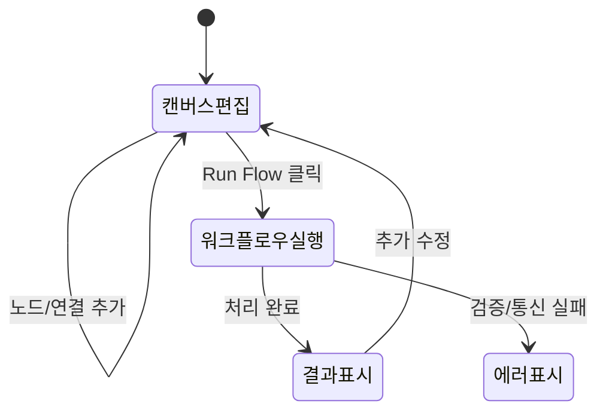

# 기능 정의서 — 업무자동화 비주얼화 (Pilot)

<aside>
📗

**이 문서는 업무자동화 비주얼화 도구 파일럿 프로젝트의 기능정의서입니다.**

</aside>

---

## 문서 정보

| 상태 | Draft · v1.0 |
| --- | --- |
| 작성자 | 김춘식 (기획/개발) |
| 관련 문서 | PRD · TDD · ADR |

## 1. 범위 & 용어

- **범위**: 프론트엔드 캔버스 편집기(React Flow)와 백엔드 그래프 실행 API(FastAPI+LangGraph).
- **용어**: 
  - **Node (노드)**: 워크플로우를 구성하는 개별 작업 단위.
  - **Edge (엣지)**: 노드 간의 실행 순서를 정의하는 연결선.
  - **Flow (플로우)**: 구성된 전체 노드와 엣지의 집합.

## 2. 기능(FR) vs 비기능(NFR)

| 구분 | 정의 | 예시 |
| --- | --- | --- |
| 기능(FR) | 시스템이 무엇을 하는가 | 사용자가 노드를 드래그하여 화면에 배치할 수 있다. |
| 비기능(NFR) | 얼마나 잘 하는가(품질·제약) | 캔버스 조작 시 지연이 100ms 이하로 유지된다. |

## 3. 기능 상세

### F-1 · 캔버스 UI 및 노드 조작   (P0)

| 기능 ID / 화면 ID | C-001 / SCR-CANVAS |
| --- | --- |
| 사용자 스토리 | 기획자로서, 캔버스에 노드를 추가하고 이동하고 싶다 |
| 입력 | 마우스 드래그 앤 드롭, 클릭 |
| 처리(주 흐름) | ①노드 패널에서 노드 선택 → ②캔버스에 배치 → ③위치 이동 및 선택 |
| 출력 | 캔버스 상의 시각적 노드 렌더링 |
| 예외 | 화면 밖으로 드래그 시 스크롤 또는 제한 처리 |
| 상태 | 대기 → 이동중 → 배치 완료 |
| 인수 기준 | Given 빈 캔버스에, When 'Start Trigger'를 끌어다 놓으면, Then 해당 노드가 캔버스에 표시된다 |

### F-2 · 노드 간 연결(Edge) 생성   (P0)

| 기능 ID / 화면 ID | C-002 / SCR-CANVAS |
| --- | --- |
| 입력 | 노드의 Handle(점) 클릭 및 드래그 |
| 처리(주 흐름) | ①소스 노드 Handle 클릭 → ②타겟 노드 Handle로 드래그 → ③Edge 생성 |
| 출력 | 두 노드를 잇는 시각적 선 생성 |
| 예외 | 타겟이 아닌 엉뚱한 곳에 드롭 시 연결 취소 / 이미 연결된 Handle 중복 연결 방지 |
| 인수 기준 | Given 두 개의 노드가 있을 때, When 핸들을 이어주면, Then 선(Edge)이 생성된다 |

### F-3 · 워크플로우 실행 API 연동   (P0)

| 기능 ID / 화면 ID | F-001 / SCR-CANVAS |
| --- | --- |
| 사용자 스토리 | 기획자로서, 구성한 플로우를 백엔드에 보내 실행 결과를 보고 싶다 |
| 입력 | 'Run Flow' 버튼 클릭 |
| 처리(주 흐름) | ①현재 캔버스의 노드/엣지를 JSON으로 변환 → ②`POST /api/execute` 호출 → ③로딩 상태 표시 → ④백엔드에서 LangGraph 처리 → ⑤결과 수신 |
| 출력 | 우측 'Execution Result' 패널에 결과 텍스트 표시 |
| 예외 | 네트워크 오류 시 "연결 실패" 토스트 띄움 / 순환 그래프일 시 400 에러 반환 |
| 상태 | 대기 → 실행중(로딩) → 결과 표시 | 실패 |
| 인수 기준 | Given 연결된 노드가 존재할 때, When Run Flow를 누르면, Then 잠시 후 실행 결과가 패널에 나타난다 |

## 4. 상태 전이 (핵심 흐름)

## 5. 화면 목록

- **SCR-CANVAS**: 중앙의 React Flow 캔버스 에어리어, 좌측 노드 팔레트, 상단 컨트롤 바.
- **SCR-RESULT**: 우측에 위치한 워크플로우 실행 결과(텍스트) 및 로그 표시 패널.

## 6. 비기능 요구사항 (요약)

| 항목 | 기준 |
| --- | --- |
| 성능 | 노드 개수 100개 이하에서 React Flow 렌더링 지연 최소화 |
| 보안 | Gemini API Key는 백엔드에만 보관하고 프론트엔드에 노출 금지 |

## 7. 미해결 사항

<aside>
❓

- 실행 이력을 DB(PostgreSQL)에 어떻게 구조화하여 저장할지 (JSONB vs 정규화) 논의 필요.

</aside>